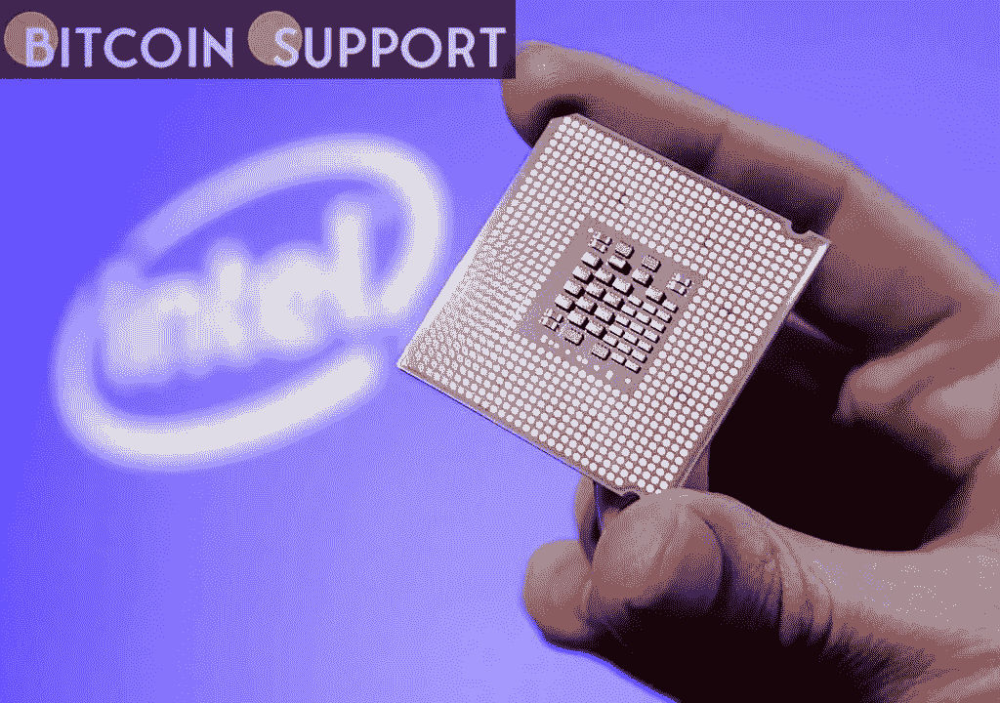
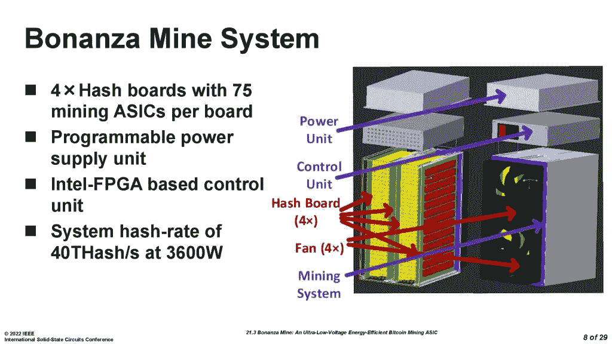
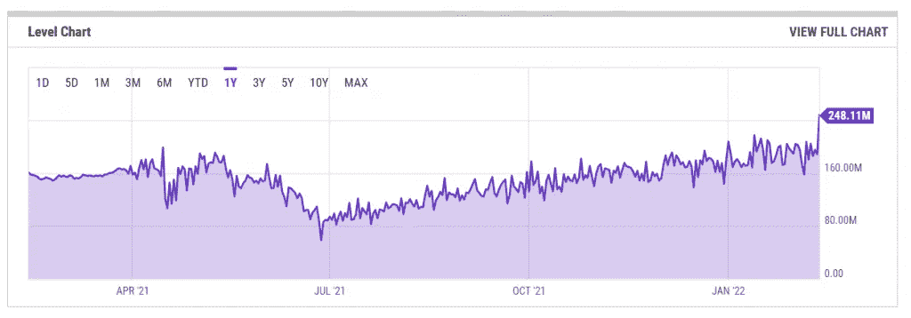

# 第二代英特尔富矿已经揭开面纱。为了高效挖掘比特币，使用矿用芯片

> 原文：<https://medium.com/coinmonks/the-2nd-generation-intel-bonanza-has-been-unveiled-for-efficient-bitcoin-mining-use-a-mine-chip-1ffeb3bda3e9?source=collection_archive---------54----------------------->

[https://bitcoinsupports.com/](https://bitcoinsupports.com/)

在一个平衡的环境中，英特尔的新芯片由一个高性能矿工驱动，可提供高达 40 TH/s.

全球最大的计算机芯片制造商英特尔公司透露了一种新采矿芯片的细节，这种芯片将与一个高性能 3600 瓦的矿工配对，目的是提高比特币(BTC)的采矿效率。

在 IEEE 国际固态电路大会(ISSCC) 2022 期间，一个致力于电子和芯片制造行业的会议，英特尔推出了他们的第二代 BTC 采矿钻机。

[https://bitcoinsupports.com/](https://bitcoinsupports.com/)

据该公司称，Bonanza Mine (BMZ2)是一款低电压、高能效的比特币采矿专用集成电路，每秒可提供 40 万亿次哈希。

英特尔于 2018 年 11 月申请了一项“高性能比特币挖掘”专利，该专利声称整体功耗降低了 15%。当时，英特尔高管表达了与比特大陆、MicroBT 和 Nvidia 等老牌公司竞争的信心:

**“英特尔多年来一直致力于 SHA 256 优化 ASIC 设计，从英特尔实验室的探索研究开始。”**

超过 300 个芯片，由一个 3,600W 的矿工供电，预计在 BMZ2 芯片的平衡环境中共同工作，提供高达 40 TH/s 的速度。

英特尔的下一代 BTC miner 将能够提供 40.4 TH/s 的均衡性能，而功耗仅为 2，293W，能耗仅为 56.97 焦耳/tera hash(J/TH)。Antminer S19j ASIC 比特币矿工消耗 3,100W，在室温下提供高达 90 TH/s 的速度，与比特大陆的硬件相比，效率为 34.5 J/TH。

此外，硬件将能够在高性能和节能模式下运行，以最大限度地提高采矿效率范围内的能源成本比。

英特尔尚未宣布第二代采矿设备的首次亮相日期，以及技术规格。

比特币网络的挖掘难度持续上升，表明网络对攻击的抵御能力越来越强。在 2 月 13 日的高峰时期，比特币的哈希速率为每秒 248.11 万亿次，比一天前的 188.40 万亿次增长了 31.69%。

[https://bitcoinsupports.com/](https://bitcoinsupports.com/)

随着杂碎率的上升，BTC 的采矿设备必须改进，以便在使用相同能量的情况下提供更高的性能。

**免责声明:以上为作者观点，不应视为投资建议。读者应该自己做研究。**

> 加入 Coinmonks [电报频道](https://t.me/coincodecap)和 [Youtube 频道](https://www.youtube.com/c/coinmonks/videos)了解加密交易和投资

# 另外，阅读

*   [德国最佳加密交易所](https://coincodecap.com/crypto-exchanges-in-germany) | [Arbitrum:第二层解决方案](https://coincodecap.com/arbitrum)
*   [币安交易机器人](/coinmonks/binance-trading-bots-d0d57bb62c4c) | [OKEx 评论](/coinmonks/okex-review-6b369304110f) | [Atani 评论](https://coincodecap.com/atani-review)
*   [最佳加密交易信号电报](/coinmonks/best-crypto-signals-telegram-5785cdbc4b2b) | [MoonXBT 评论](/coinmonks/moonxbt-review-6e4ab26d037)
*   [如何在 Bitbns 上购买柴犬(SHIB)币？](https://coincodecap.com/buy-shiba-bitbns) | [购买弗洛基](https://coincodecap.com/buy-floki-inu-token)
*   [CoinFLEX 评论](https://coincodecap.com/coinflex-review) | [AEX 交易所评论](https://coincodecap.com/aex-exchange-review) | [UPbit 评论](https://coincodecap.com/upbit-review)
*   [十大最佳加密货币博客](https://coincodecap.com/best-cryptocurrency-blogs) | [YouHodler 评论](https://coincodecap.com/youhodler-review)
*   [AscendEx 保证金交易](https://coincodecap.com/ascendex-margin-trading) | [Bitfinex 赌注](https://coincodecap.com/bitfinex-staking)
*   [最好的卡达诺钱包](https://coincodecap.com/best-cardano-wallets) | [冰棒副本交易](https://coincodecap.com/bingbon-copy-trading)
*   [印度最佳 P2P 加密交易所](https://coincodecap.com/p2p-crypto-exchanges-in-india) | [柴犬钱包](https://coincodecap.com/baby-shiba-inu-wallets)
*   [八大加密附属计划](https://coincodecap.com/crypto-affiliate-programs) | [eToro vs 比特币基地](https://coincodecap.com/etoro-vs-coinbase)