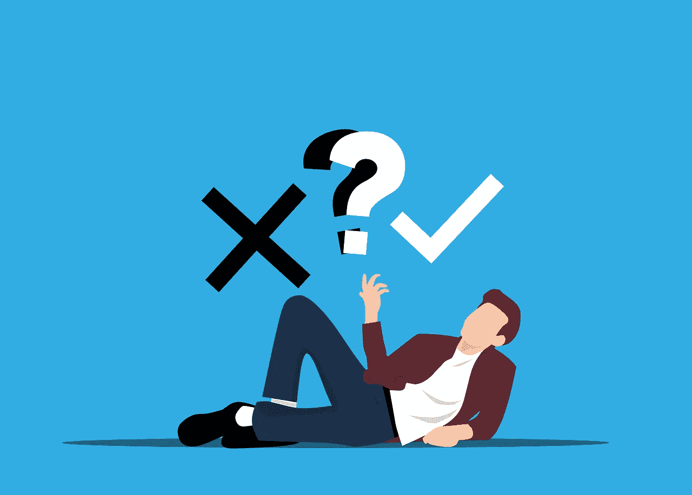

# 3 个最常见的区块链和加密货币神话

> 原文：<https://medium.com/coinmonks/the-3-most-common-blockchain-and-cryptocurrency-myths-efab455596ac?source=collection_archive---------72----------------------->

区块链技术还是一个比较新的概念。因此，对这项技术的误解比比皆是也就不足为奇了。以下是三个最常见的区块链和加密货币神话。

# 1.加密货币只对骗子有用

据说区块链只对罪犯有好处。但是这和犯罪有什么关系呢？

区块链是一种数字分类账，以可验证的、永久的方式记录各方之间的交易。区块链最受欢迎的用途是加密货币，它使用密码术来保护交易。

当然，犯罪分子被其分散的性质所吸引，这意味着没有中央权力机构监控他们的交易，但得出这是唯一的用例的结论是有缺陷的逻辑。这和断定罪犯用枪是一样的，所以只对坏人有用。警察不也应该有吗？这就是要点:区块链技术对好人同样有益，甚至更有益。

# 2.比特币允许完全匿名

关于加密货币的第二个最流行的神话是它们允许匿名交易。这不是真的。这个神话已经被许多消息来源揭穿。每种加密货币都有自己的隐私功能，但这些都不是万无一失的。这些数字货币揭示了比你想象的更多的信息。

例如，如果用户的 IP 地址被追踪到，他们很容易被识别出来。

这个神话源于作为第一种被开发出来的加密货币的比特币，并没有太多关于幕后操纵者的信息。

# 3.区块链的所有活动都是私人的

尽管一些企业建立了自己的私人区块链，仅供员工和业务合作伙伴使用，但支撑比特币等知名加密货币的大多数区块链都向公众开放。

事实是，区块链的活动并不是 100%私人的。它只是[的假名](https://www.dictionary.com/browse/pseudonymous)，这意味着任何拥有正确软件和知识的人都可以看到交易的公共账本。比如你可以在这里查看实时比特币交易[。](https://www.blockchain.com/explorer)

 [## 你准备好迎接加密经济了吗？加密派

### 每次你打开新闻，阅读报纸，或者浏览你的推特，你很可能会看到一些故事…

www.thecryptopie.com](https://www.thecryptopie.com/) 

> 加入 Coinmonks [电报频道](https://t.me/coincodecap)和 [Youtube 频道](https://www.youtube.com/c/coinmonks/videos)了解加密交易和投资

# 另外，阅读

*   [顶级付费加密货币和区块链课程](https://coincodecap.com/blockchain-courses)
*   [MXC 交易所评论](/coinmonks/mxc-exchange-review-3af0ec1cba8c) | [Pionex vs 币安](https://coincodecap.com/pionex-vs-binance) | [Pionex 套利机器人](https://coincodecap.com/pionex-arbitrage-bot)
*   [如何在印度购买比特币？](/coinmonks/buy-bitcoin-in-india-feb50ddfef94) | [WazirX 审查](/coinmonks/wazirx-review-5c811b074f5b)
*   [印度的加密交易所](/coinmonks/bitcoin-exchange-in-india-7f1fe79715c9) | [比特币储蓄账户](/coinmonks/bitcoin-savings-account-e65b13f92451)
*   [Cloudbet 赌场评论](https://coincodecap.com/cloudbet-casino-review) | [点火赌场评论](https://coincodecap.com/ignition-casino-review)
*   [币安收费](/coinmonks/binance-fees-8588ec17965) | [僵尸加密审查](/coinmonks/botcrypto-review-2021-build-your-own-trading-bot-coincodecap-6b8332d736c7) | [热点审查](/coinmonks/hotbit-review-cd5bec41dafb)