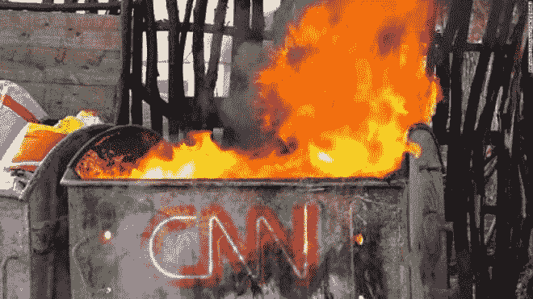
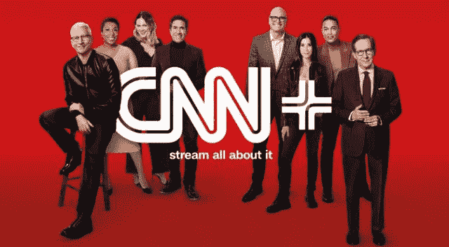

# 仅持续了 32 天的 3 亿美元产品。

> 原文：<https://medium.com/coinmonks/the-300m-product-that-lasted-only-32-days-53b177b80b6b?source=collection_archive---------24----------------------->

One of the fastest death of a newly launched product in history

CNN 在一个持续了 32 天的产品上花费了近 3 亿美元。

那个产品是 CNN+。

基于订阅的流媒体新闻服务 CNN 被大肆宣传。

它活着的每一天大约值 1000 万美元。

把它看作是有史以来由一个公司巨头发起的最昂贵的实验之一。

名人和大玩家被请来炒作这次发射，这应该是 CNN 的一次大爆炸。

但是聚会没有持续一个月。

华纳兄弟探索公司的新任首席执行官决定停止这项实验。

为什么？

这可能是一个政治举措，一个减少损失的选择，一个失败的实验，甚至是华纳兄弟和发现之间有预谋的整个合并的一部分。

谁知道呢。

让我们再挖一点，好吗？

CNN+有 15 万付费用户，每月付费 6 美元，所以每月大约 90 万美元。

Twitter 是免费使用的，我们可以立即从它那里获得我们需要的所有新闻和戏剧。

也许这就是为什么 CNN+有这样一个“粗糙”的开始？

我说“粗糙”,但老实说，15 万付费用户并不寒酸，我敢肯定，如果他们随着时间的推移改善它，这个数字会上升。

每月 90 万美元听起来可能很多，但对于一个花费 3 亿美元打造的产品来说，这根本不算什么。

头头们聚集在一个房间里，决定:“他们一致认为，CNN+正在吞噬太多的资源，其作为数字目的地的潜力无法证明其观众人数少和成本高是合理的。佩雷特先生从伦敦打来电话，说是时候停止运作了。

现在，数百名员工被解雇，CNN+的所有努力将被摧毁，大量资源将被搁置。

坦率地说，有了 3 亿美元，他们本可以花一点钱收购该领域的一家现有初创公司，接管整个工程团队，在创纪录的时间内推出产品，让杰森·卡拉卡尼斯(Jason Calacanis)推广产品，或者让埃隆(Elon)在推特上发布产品，但仍然有很多收入。

Could CNN+ have been saved?

想象如何花 3 亿美元购买一款产品，却在 32 天内将其扼杀，简直是荒谬。

从某种角度来看，这就是大公司的情况。

如果他们的一些员工花了大半辈子来打造他们坚信的尖端产品，这并不重要。

不管这个产品有多优秀，它需要一段时间才能起飞，这都没有关系。

产品是否是公司的未来并不重要。

一天结束时，如果产品的成本超过了它带来的收入，并且资产负债表上的数字没有意义，那么减少它的选择总是存在的。

这就是为什么企业往往很难“创新”。

他们必须在对股东的受托责任和开发一种前所未见的新产品的前景之间找到平衡，这种产品风险很大，也很危险。

回到股东一边的诱惑实在太大了。

这就是阻碍真正创新的原因。

创新不是无所畏惧的行动。

这是一种不顾后果的行为。

企业应该学会更加无畏。

-

你能用 3 亿美元在 CNN+上做得更好吗？

-

#创业#商业#创业#成长#成功#社交媒体#文化#创业#战略# CNN+# CNN #失败的创业#流媒体#公司#企业创新

> 加入 Coinmonks [电报频道](https://t.me/coincodecap)和 [Youtube 频道](https://www.youtube.com/c/coinmonks/videos)了解加密交易和投资

# 另外，阅读

*   [CoinDCX 点评](/coinmonks/coindcx-review-8444db3621a2) | [加密保证金交易交易所](https://coincodecap.com/crypto-margin-trading-exchanges)
*   [红狗赌场评论](https://coincodecap.com/red-dog-casino-review) | [Swyftx 评论](https://coincodecap.com/swyftx-review) | [CoinGate 评论](https://coincodecap.com/coingate-review)
*   [Bookmap 评论](https://coincodecap.com/bookmap-review-2021-best-trading-software) | [美国 5 大最佳加密交易所](https://coincodecap.com/crypto-exchange-usa)
*   [如何在 FTX 交易所交易期货](https://coincodecap.com/ftx-futures-trading) | [OKEx vs 币安](https://coincodecap.com/okex-vs-binance)
*   [CoinLoan 审查](https://coincodecap.com/coinloan-review) | [YouHodler 审查](/coinmonks/youhodler-4-easy-ways-to-make-money-98969b9689f2) | [BlockFi 审查](https://coincodecap.com/blockfi-review)
*   《XT.COM 评论》的|