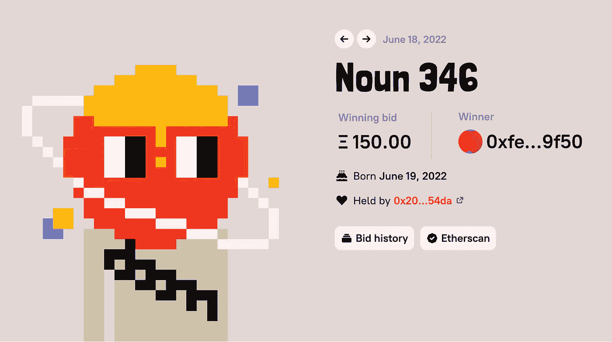
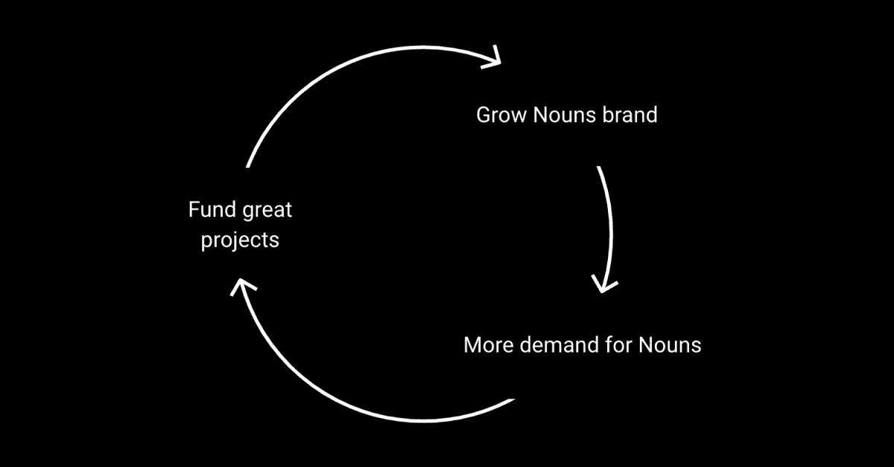
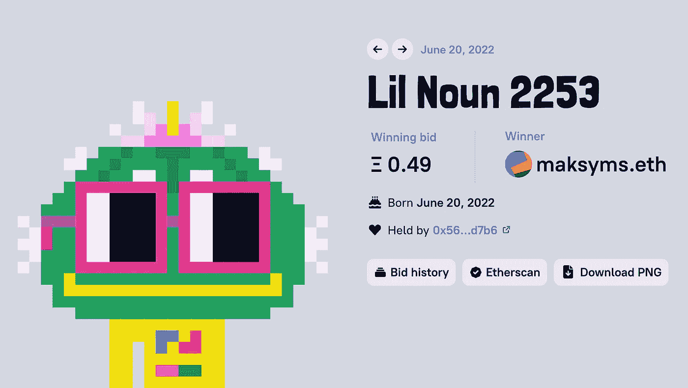

# 耗资 3400 万美元的密码实验非常成功

> 原文：<https://medium.com/coinmonks/the-34m-crypto-experiment-that-went-brilliantly-well-8bd956ceae57?source=collection_archive---------41----------------------->

Noun 346 sold for 150 eth on June 18th, 2022.

听说过名词吗？

这是 2021 年 8 月启动的 NFT 实验项目。

我不得不说，在我研究的所有非功能性测试中，这是最突出的。

让我们快速浏览一下一些最好的 NFT，好吗？

宇迦用无聊的猿猴的粘性震撼了所有人，然后空投了小狗和变种人。

他们在《彼岸》游戏、Otherdeeds 和 Kodas 中所做的，营销和讲故事的质量，真的很值得尊敬。

他们可能真的会在元宇宙打败梅塔。

然后是志那都红豆，填补了对动漫风格的 NFT 的需求，尽管最近 Zzzagabond 的混乱并不为社区所接受。

然后是 CryptoPunks，也就是 O.G

他们就像新大陆的克里斯多弗·哥伦布，NFT 世界的勇敢开拓者。

在像 NFTs 这样一个混乱、错综复杂的领域里，成为第一名是最重要的。

现在，甚至有一个戈布林镇。

那是什么？

别担心，它太有趣了，我已经写了一篇关于它的深度文章。

敬请关注。

回到名词。

他们试图建立一些与其他无聊的 NFT 完全不同的东西。

The growth hacking loop of Nouns.

每 24 小时就会铸造一个名词(想象一张像素化的脸，配有各种各样的配件，如眼镜、胡子、皇冠。等等)。

不多不少。

每个名词大约有 100 个 ETH。

需求、兴趣、炒作和社区都很强。

任何人都可以拥有一个名词，他们被称为“名词者”。

每个名词代表一票名词到。

刀被重击了。

卖名词所得全部归道。

它有庞大的计划，如销售商品，制作纪录片，拥有一支电子竞技队，甚至支持 LilNouns(像我这样的穷人更负担得起的名词！).

哦，你没有任何名词的知识产权或权利。

这意味着你仍然可以从知识产权中赚钱，但任何人都可以。

一种激进的知识产权方式，你可以允许其他人销售你的知识产权，从中获利，反过来建立你的品牌。

这看起来非常有效。

去年第一次听说的时候，我是持怀疑态度的。

看到了艺术品，想不出价值在哪里。

我看到出价升至 120 Eth，认为这是一个等待破灭的泡沫。

嗯，就像我们都认为最后一部《速度与激情》将是最后一部电影一样，同样，名词也证明了我们是错的。

每天持续销售 1 支 NFT，销量超过 100 支，令人印象深刻。

我会紧跟名词，进一步研究它们的策略。

There’s even a Lil Noun now..

NFTs 可能有它的笑话和迷因，但剥去幽默和游戏，你会看到它可以多么有效地讲述故事和建立品牌。

虽然大多数人会注意到是名词 NFT 催生了 DAO，并使该品牌得以发展壮大，使他们能够获得资金做更多的事情。

从技术上来说，我认为 NFTs 只是名词道进入拥挤市场的一种方式，搭乘炒作列车，并最终以极快的速度建立一个全球品牌和忠诚的社区。

哇对不对？

-

你听说过名词 NFT 吗？

-

# startups # business # startupx # growth # success # social media # culture # entrepreneur # strategy # eth #比特币#加密货币# bayc # NFT # getrich # airdrop # branding # master card # line # revolution # web 3

> 加入 Coinmonks [电报频道](https://t.me/coincodecap)和 [Youtube 频道](https://www.youtube.com/c/coinmonks/videos)了解加密交易和投资

# 另外，阅读

*   [BigONE 交易所点评](/coinmonks/bigone-exchange-review-64705d85a1d4) | [电网交易 Bot](https://coincodecap.com/grid-trading)
*   [氹欞侊贸易评论](https://coincodecap.com/anny-trade-review) | [CoinSpot 评论](https://coincodecap.com/coinspot-review)
*   [新加坡十大最佳加密交易所](https://coincodecap.com/crypto-exchange-in-singapore) | [购买 AXS](https://coincodecap.com/buy-axs-token)
*   [投资印度的最佳加密软件](https://coincodecap.com/best-crypto-to-invest-in-india-in-2021) | [WazirX P2P](https://coincodecap.com/wazirx-p2p)
*   [西班牙 5 大最佳文案交易平台](https://coincodecap.com/copy-trading-spain)
*   [Pionex 双重投资](https://coincodecap.com/pionex-dual-investment) | [AdvCash 审查](https://coincodecap.com/advcash-review) | [支持审查](https://coincodecap.com/uphold-review)
*   [面向开发者的 8 个最佳加密货币 API](https://coincodecap.com/best-cryptocurrency-apis)