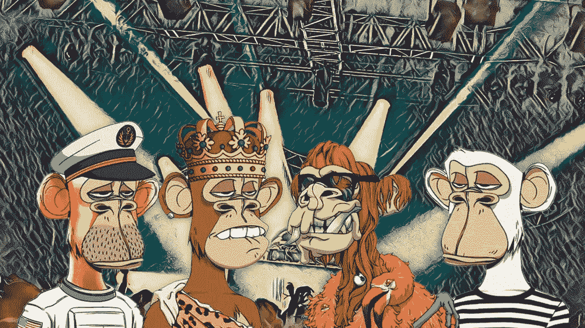
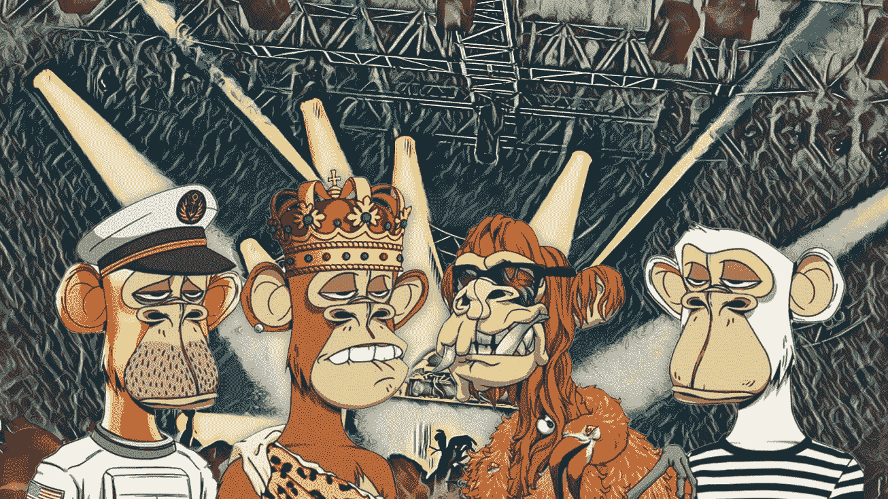

# 💰价值 36 万美元的 NFT 音乐经理

> 原文：<https://medium.com/coinmonks/the-360-000-nft-music-manager-397782324fd6?source=collection_archive---------54----------------------->

我们每周撰写一份时事通讯，内容涉及音乐及其背后的商业和技术。如果您想直接在您的收件箱中获得它， [*现在就订阅吧！*](https://incentify.substack.com)

大家星期五快乐！

Twitter 通常被认为是最接近全球意识的东西，其 3 亿用户分享一切，从猫咪图片、核心财经话题、党派政治评论&到偶尔的一两个迷因📲

可以有把握地认为，大多数互联网文化都起源于互联网的几个角落，Twitter 就在那里。

**加密货币和 NFT 货币就是这样一种亚文化，在过去两年里已经成为主流的一部分，**猴子交易的 jpeg 文件价值数百万美元，而世界正在从百年一遇的疫情中崛起，并走出衰退。

[https://twitter.com/pmarca/status/1504870207231172608?s=20&t = 95b 9 vex 8-jbyjhw 7 ys 5 tua](https://twitter.com/pmarca/status/1504870207231172608?s=20&t=95b9Vex8-jByJHw7YS5TUA)

虽然许多明显的**、**怪异现象被归因于 Twitter 等平台放大了世界各地的好与坏，但**一只猴子成为一个名为“ **KINGSHIP** ”的虚拟乐队**经理的 36 万美元 NFT 让我揉了两次眼睛，以确认我在读什么😳

到底是什么？

环球音乐集团最近宣布，这位被命名为经理**【not All】**的女性数字角色将担任他们的数字唱片公司——10:22PM 的虚拟 NFT 乐队 **KINGSHIP 的经理。**

如果上面的短语对你来说听起来像希腊语和拉丁语，让我试着简单地分解它👇🏻

You’re staring right at a $360,000 Bored Ape NFT, which is well a pretty expensive jpeg if nothing else.

[**10.22pm**](https://1022pm.io) 是环球音乐集团的子公司，成立的初衷是签约艺术家、社交媒体影响者和数字媒体创作者，专注于创作多媒体内容🎬

UMG 说，这个标签现在只是一个**、【Web3 标签】、**，虽然这并没有透露太多，但他们的第一个数字乐队“-”**KINGSHIP**”由广受欢迎的**无聊猿游艇俱乐部** NFT 系列中的人物组成，包括一只变异猿和三只无聊猿🐵

除非你一直生活在岩石下，这里有一个售价 100 万美元的 NFT 岩石！)，你可能会听说过 [**百无聊赖的猿游艇俱乐部**](https://boredapeyachtclub.com/#/) 。

【2021 年 2 月，四位来自迈阿密的朋友在区块链以太坊上建造了一个 NFT 收藏馆，他们有着不同的背景——犹太人、古巴人、土耳其人和巴基斯坦人🚀

它的母公司: [**【宇迦实验室】**](https://www.yugalabs.io) 本周早些时候宣布了一笔 4.5 亿美元的巨额种子资金，估值为 40 亿美元，Twitter 再次不禁对实际发生的事情感到敬畏🤯

[https://Twitter . com/JoePompliano/status/1506361986472361984？s = 20&t = 3 pfgoazwpq 78 p 26d 73 lsea](https://twitter.com/JoePompliano/status/1506361986472361984?s=20&t=3PFGOaZWpQ78P26d73lseA)

今年一月，当帕丽斯·希尔顿和吉米·法伦在《今夜秀》节目中拿出他们无聊的猿类照片时，这些照片迅速走红📸

如果你做到了这一步，看起来你在挖掘我们的内容！为什么不通过分享来帮助支持我们呢？

像瑟琳娜·威廉姆斯、沙奎尔·奥尼尔、波斯特·马龙、史努比·道格、马克·库班、内马尔、贾斯汀比伯、拉梅洛·鲍尔和斯蒂芬·库里这样的名人都花了几十万美元购买了一只“无聊猿”

这些“猩猩”中的四个，现在加上他们的经理**诺特全部**组成了“**王权**”乐队，这显然是受到了由音乐家**达蒙·奥尔本**和艺术家**杰米·休莱特创立的标志性虚拟乐队**街头霸王乐队**的启发。**

索尼前高管、10.22PM 的创始人席琳·约书亚(Celine Joshua)进一步解释了这个概念:

> “自从我们最初宣布以来，我们一直在忙于开发《王权》,我很高兴向大家介绍《诺托经理》,他是即将加入《王权》宇宙的众多新角色之一。
> 
> 作为团队的管理者，**诺特将帮助推动故事情节的发展，并允许我们与社区进行交流"**

# 我们对此的看法？

虽然《王权》的[网站还没有透露太多，但**一个虚拟角色管理着一个 Web 3 标签的虚拟乐队，属于世界上最大的音乐公司之一**，这正是那种表明整个音乐产业已经来到⬅️多远的标题](https://kingship.io)

BAYC 社区显然已经成为一种身份象征，当买家试图试验多种用例以在这些 NFT 中实际找到效用时，**成立一个这些无聊的猿类乐队是一种出路**，即使是在所有体现 Web 3 空间的怪异之处。

**王权实际上会产生什么样的音乐？我不知道🤷‍♂️**

但很明显，环球音乐正全力以赴融入“元宇宙”👇🏻

> “我们希望让王权世界尽可能地娱乐化和沉浸式，同时为持有者创造价值。
> 
> “随着 KINGSHIP 官方 Discord 的推出，社区将有一个家，成员可以在这里相互交流，并获得关于 KINGSHIP 旅程的所有最新更新，包括如何访问 allowlist。
> 
> 敬请期待，精彩纷呈。"

NFT 在音乐行业发现了多个有趣的案例，艺术家们完全跳过传统的流媒体路线，直接从他们的粉丝那里赚钱💰

我们正在以类似的方式构建一些东西，如果你是一名艺术家/创作者，或者仅仅是一名音乐发烧友，请在[**insta gram**](https://www.instagram.com/clubincentify/)**或**[**Twitter**](https://twitter.com/clubincentify)**上做 **DM 我们，看看幕后正在酝酿什么👀****

如果你喜欢这篇来自 [Incentify](https://incentify.substack.com) *的时事通讯，为什么不与你喜欢的人分享呢？请在 Instagram 和 Twitter 上关注我们，了解更多关于音乐和文化的内容。*

*原载于 2022 年 3 月 25 日 https://incentify.substack.com***。**

> *加入 Coinmonks [电报频道](https://t.me/coincodecap)和 [Youtube 频道](https://www.youtube.com/c/coinmonks/videos)了解加密交易和投资*

# *另外，阅读*

*   *[如何在 FTX 交易所交易期货](https://coincodecap.com/ftx-futures-trading) | [OKEx vs 币安](https://coincodecap.com/okex-vs-binance)*
*   *[CoinLoan 评论](https://coincodecap.com/coinloan-review) | [YouHodler 评论](/coinmonks/youhodler-4-easy-ways-to-make-money-98969b9689f2) | [BlockFi 评论](https://coincodecap.com/blockfi-review)*
*   *[XT.COM 评论](https://coincodecap.com/profittradingapp-for-binance)币安评论 |*
*   *[SmithBot 评论](https://coincodecap.com/smithbot-review) | [4 款最佳免费开源交易机器人](https://coincodecap.com/free-open-source-trading-bots)*
*   *[比特币基地僵尸程序](/coinmonks/coinbase-bots-ac6359e897f3) | [AscendEX 审查](/coinmonks/ascendex-review-53e829cf75fa) | [OKEx 交易僵尸程序](/coinmonks/okex-trading-bots-234920f61e60)*
*   *[如何在印度购买比特币？](/coinmonks/buy-bitcoin-in-india-feb50ddfef94) | [瓦济克斯审查](/coinmonks/wazirx-review-5c811b074f5b)*