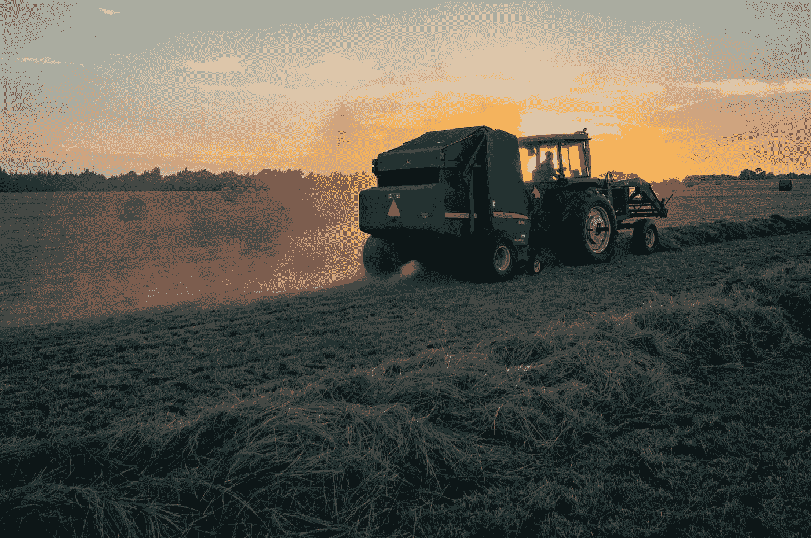

# 比特币的四个季节

> 原文：<https://medium.com/coinmonks/the-4-bitcoin-seasons-fa72000b8f95?source=collection_archive---------35----------------------->

冬秋春夏这几个季节也可以适用于比特币，这个循环已经重复了好几年了。这是减半、熊市、牛市和积累阶段的相互作用。打个比喻，整个循环可以比作一个农民的帮助，每个农民播种，收获和等待。

Photo by [Jed Owen](https://unsplash.com/@jediahowen?utm_source=medium&utm_medium=referral) on [Unsplash](https://unsplash.com?utm_source=medium&utm_medium=referral)

# 春天

这是开始，是开花的时候。在这个季节，就像一个好农民一样，你应该播下你的第一粒种子，这样它们才能成长。你寻找一个营养丰富的土壤，你事先已经浇了很多水。在加密领域，这意味着花时间去寻找你了解并认为有潜力的好项目，这样你就可以把它们保留到秋天，然后再卖掉它们获利。

Photo by [Gregory Hayes](https://unsplash.com/@gregoryallen?utm_source=medium&utm_medium=referral) on [Unsplash](https://unsplash.com?utm_source=medium&utm_medium=referral)

# 夏天

在夏天，所有其他农民，就像你一样，心情愉快，看着他们的植物生长和繁荣。在这个时候，多头真的开始行动了，牛市开始了，每个人都希望他的植物是最高产量的，这样他就可以以最高的价格出售它们。这是一个玩火游戏，如果你等很长时间才收获，你会获得最大的利润，但是如果你等的时间稍长，你的收益会很快损失。出于这个原因，它是有意义的采取第一利润，不要太贪婪。

Photo by [Jed Owen](https://unsplash.com/@jediahowen?utm_source=medium&utm_medium=referral) on [Unsplash](https://unsplash.com?utm_source=medium&utm_medium=referral)

# 秋天

我们正在接近一个新的 ATH，你们的同辈人的贪婪是从字面上感觉到的，你们必须清楚这些迹象是不好的，你们应该赶上你们的收获。你不需要一次完成所有的工作，而是一点一点地做，每个领域做一点，在你的第一次旅行中大约做 20%。然后你等几天/几周，直到你卖出第二批 20%的货，然后继续这样做。关键是在 ATH 之前卖出两到三次，之后卖出一到两次，这样你就有了一个好的卖价，并且可以积累很多稳定的收入。

Photo by [Ian Schneider](https://unsplash.com/@goian?utm_source=medium&utm_medium=referral) on [Unsplash](https://unsplash.com?utm_source=medium&utm_medium=referral)

# 冬天

也许你以前听说过，加密的冬天。它引发了许多投资者的恐惧和害怕，因为它非常寒冷和黑暗，有时你会认为它没有尽头。
所有加密货币都在暴跌，在这个季节，50%的修正并不罕见。幸运的是，因为你已经在秋天收获了你的收获，并以稳定币的形式带进了你的安全仓，这种情况不会影响到你。你会看到有多少所谓的“好加密货币”倒下了，“谷壳”从“小麦”中分离出来。
在这个阶段，你应该努力增加你的稳定积分，并尽可能找到给你百分比的好的 DeFi 项目，这样你就可以积累更多的种子。价格不重要，重要的是冬天过后你比以前拥有更多的硬币。如果你做到了这一点，你就可以开始平静地进入春天，播种你的植物。

> 加入 Coinmonks [电报频道](https://t.me/coincodecap)和 [Youtube 频道](https://www.youtube.com/c/coinmonks/videos)了解加密交易和投资

# 另外，阅读

*   [如何获得自己的。XYZ 领域？](https://coincodecap.com/xyz-domain)
*   [最佳加密交换平台](https://coincodecap.com/best-crypto-swap-platforms) | [最佳加密交易所](https://coincodecap.com/crypto-exchange)
*   [购买比特币印度](/coinmonks/buy-bitcoin-in-india-feb50ddfef94) | [Pionex 评论](/coinmonks/pionex-review-exchange-with-crypto-trading-bot-1e459d0191ea) | [加密交易机器人](/coinmonks/crypto-trading-bot-c2ffce8acb2a)
*   [n ave 零点回顾](/coinmonks/ngrave-zero-review-c465cf8307fc) | [Phemex 回顾](/coinmonks/phemex-review-4cfba0b49e28) | [PrimeXBT 回顾](/coinmonks/primexbt-review-88e0815be858)
*   最佳[区块链分析](https://bitquery.io/blog/best-blockchain-analysis-tools-and-software)工具| [赚比特币](/coinmonks/earn-bitcoin-6e8bd3c592d9)
*   [Cloudbet 赌场评论](https://coincodecap.com/cloudbet-casino-review) | [点火赌场评论](https://coincodecap.com/ignition-casino-review)
*   [加密套利](/coinmonks/crypto-arbitrage-guide-how-to-make-money-as-a-beginner-62bfe5c868f6)指南| [如何做空比特币](/coinmonks/how-to-short-bitcoin-568a2d0b4ae5)