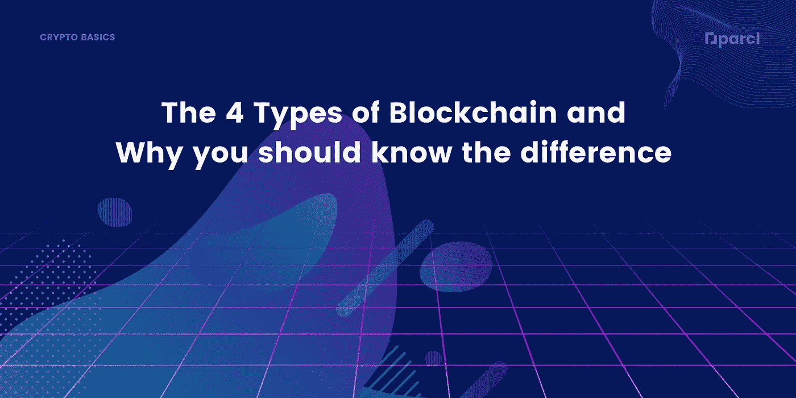
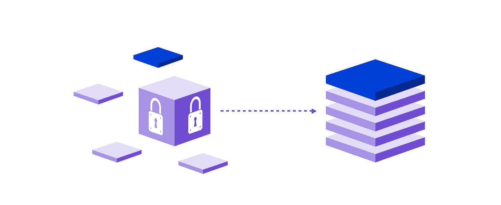
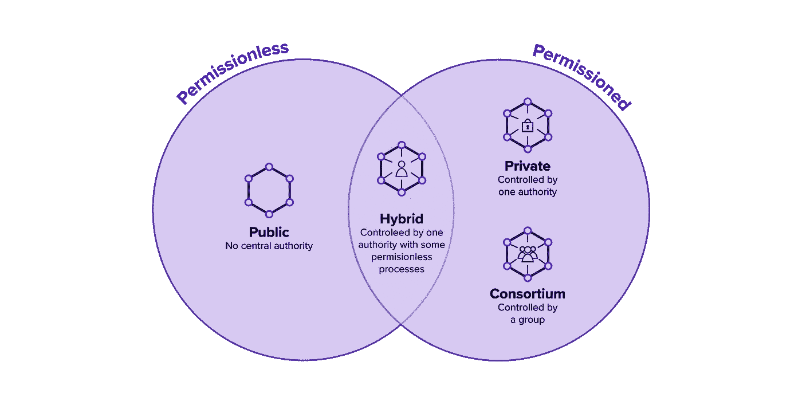

# 区块链的 4 种类型以及为什么你应该知道它们的区别

> 原文：<https://medium.com/coinmonks/the-4-types-of-blockchain-and-why-you-should-know-the-difference-3d18adf6df98?source=collection_archive---------23----------------------->

# 介绍

有四种主要类型的区块链；公共、私有、混合和联盟。这些区块链都有自己的优点和缺点，以及理想的用途。无论你是计划在 Web3 工作，投资项目，还是仅仅是这个领域的爱好者，理解这四者之间的区别是很重要的。所以，让我们直入主题吧。

# 区块链的四种主要类型

# 1)公共区块链

Web3 行业中使用最广泛的是公共区块链。比特币在公共区块链内运行，正是这种加密货币为分布式账本技术进入主流铺平了道路。公共区块链通过提供更高的透明度和更好的安全性来解决常见的集中化问题。

*The 4 Types of Blockchain and Why you should know the difference*

DLT 不会把信息存储在一个地方；通过将它分布在对等网络中，这种分散的系统提供了有效的安全性。公共分类账使用分散的方法来验证数据的真实性；这是使用共识算法来达成一致的。工作证明(PoW)和利益证明(PoS)是两种最常见的共识算法。
‍
一个公共的区块链被认为是一个非限制性和无许可的账本，任何人都可以通过使用区块链平台成为授权节点来使用它。通过使用公共区块链节点，您可以访问当前和过去的交易，挖掘加密货币，验证交易，并提出修改建议。
‍
尽管众所周知，公共区块链比中央集权的要慢，但情况并非总是如此。速度往往取决于特定网络使用的共识算法。

**优势**

‍Due 区块链向任何人开放，没有任何一个实体能够完全控制访问存储在账本上的信息的权限或能力。公共区块链完全透明且相对安全。

**缺点**

相对于‍Due 的规模，公共区块链处理事务的速度非常慢，并且可伸缩性较差。然而，情况并非总是如此，因为这也取决于共识机制。在安全性方面，如果黑客通过控制节点获得了网络 51%的控制权，他们就可以改变网络；这不是一个容易实现的任务，但仍然是可能的。

**用例**

‍Public 区块链主要是众所周知的更好的替代品，以持有公共记录，如政府支出，核实财产所有权，甚至可以用于宣誓书公证。理想情况下，政府或慈善机构等希望确保利益相关方透明的机构可以使用公共区块链。

# ‍2)列兵区块链

‍A 私立区块链更加严格，不对公众开放。这些区块链由单一实体控制。一个私有的区块链就像一个公共的一样运作，具有点对点的连接，并且是去中心化的；唯一的问题是，它在特定组织内的规模较小。想象一个类似内部网但更先进的私有区块链。

*Private Blockchain*

**优势**

‍The 组织控制权限、安全性、授权和可访问性。这也适用于由实体决定的节点权限。这种更具限制性的区块链的好处是，它防止第三方访问某些信息，这在某些用例中很方便。由于规模较小，私人区块链在处理交易方面可能比其公共同行快得多。

‍ **缺点**

理论上，‍private·区块链并不被认为是真正的区块链。区块链的要点主要建立在必须完全去中心化的理念上。
‍
由于私有区块链的控制更加集中，可以说它们并不值得信任，因为决定信息有效性的节点是由单一实体控制的。‍
节点数量的减少也是一个问题，因为这意味着黑客更容易控制共识机制。另一个担心是，由于源代码对公众是封闭的，它不能被独立验证。

**用例**

私有区块链的速度对于某些企业来说可能是一个巨大的优势和理想的选择，这些企业需要信息是加密安全的，但也是私有的，不对公众开放，例如人口普查记录和医疗记录，并利用区块链技术的优势，而不会向公众和竞争对手泄露其商业秘密。其他用例包括供应链管理和内部投票。

# 3)混合区块链

混合区块链结合了私人和公共区块链的特点。组织将被允许建立一个私有的、基于许可的系统和一个公共的无许可系统。

‍

*Hybrid Blockchain*

对于私有区块链，数据不对公众开放，但对于混合模式，组织可以决定哪些数据可供公众访问，并控制哪些人可以访问这些数据。
‍
在混合区块链上，交易通常是私有的，但如果需要，可以通过允许外部智能合约访问来验证交易，该合约可以验证信息。
‍
混合区块链使得组织无法改变的私有但可验证的交易成为可能。
‍
用户可以在混合区块链上完全匿名操作，直到交易时，他们的身份才暴露给另一方。

**优点**

混合区块链的最大优势是它在一个封闭的系统中运行，这意味着黑客可以通过对网络 51%的攻击来控制网络。但是，尽管它在一个封闭的生态系统中工作，信息仍然可以被第三方共享和验证。使用混合区块链的交易通常比公共区块链更便宜、更快，并且具有更好的可伸缩性。

**缺点**

‍Although 不像私人区块链那样封闭，数据仍然可以对第三方屏蔽；它不是完全透明的，但对于某些用例来说可能是理想的。

‍ **用例**

‍hybrid·区块链可能会在房地产等许多领域发挥作用，因为他们将有地方存储数据，同时只向公众显示某些信息，如房源。区块链还可以用于简化酒店和零售行业的流程。
‍
任何处理敏感信息但仍希望通过核查提供透明度的部门，都可以从这种区块链中受益。医疗记录也是混合区块链的另一种用途。

‍4)区块链财团

我们名单上的第四种也是最后一种区块链是区块链联合体，也称为联合区块链。类似于混合区块链，但不同之处在于该组织的成员在一个分散的网络上工作。总之，这是一个私有的区块链，但是授予特定的组而不是单个实体访问权限，这意味着个人控制整个网络的风险更小。
‍
在区块链联合体中，共识程序由预设节点控制。它有一个验证器节点，用于发起、接收和验证事务。成员节点可以接收或发起事务。

**优点**

与公共网络相比，‍A 在安全性、可扩展性和效率方面有更多选择。类似于私有和混合选项，但它为更多的人群提供了更多的控制。

‍ **缺点**

‍A 财团区块链不如一个公开的区块链透明。如果一个成员节点被破坏，它仍然可能受到危害；区块链自己的规定会损害网络的功能。

‍ **用例**

‍Banking 和付款是这种区块链的两种用途。不同的银行可以联合起来，组成一个财团，决定哪些节点将验证交易。研究机构可以创建一个类似的模型，想要跟踪食品的机构也可以。它非常适合供应链，尤其是食品和医药应用。

# **‍Closing**

‍While 这是四种主要类型的区块链，还有共识算法要考虑。

最终，区块链技术变得越来越受欢迎，并迅速获得企业的支持。每一种类型的区块链都有潜在的应用，可以提高信任度和透明度，并创建更好的交易记录。

# 美国‍Follow

‍

🌐加入我们的等候名单:【https://parcl.co 

🐤推特:【https://twitter.com/Parcl 

🏡不和:[https://discord.gg/zWxp2JupNA](https://discord.gg/zWxp2JupNA)

*共享内容和发布的图表仅用于信息和教育目的。Parcl 不提供，也不应将此信息理解或解释为财务建议或投资建议。所提供的信息不能替代投资专家的建议。Parcl 不承担任何财务损失或损害的责任。更多信息请参见* [*使用条款*](https://www.parcl.co/legal/terms-of-use) *。*