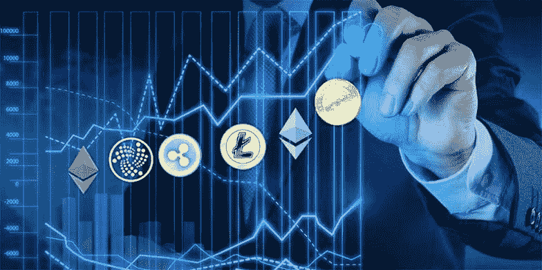
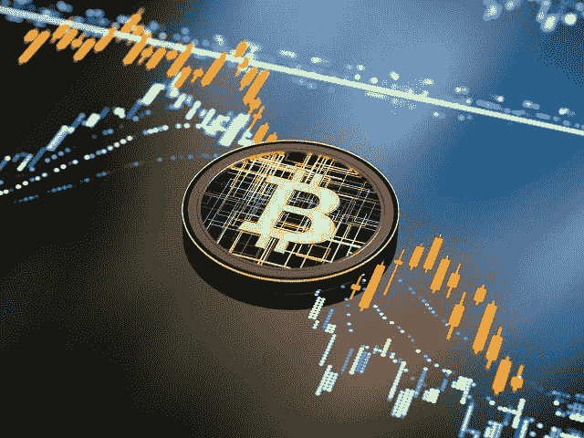

# 投资加密货币时要避免的 4 个最大错误

> 原文：<https://medium.com/coinmonks/the-4-worst-mistakes-to-avoid-when-investing-in-cryptocurrency-fc70eb6fd3cc?source=collection_archive---------35----------------------->

当谈到投资加密货币时，大多数新手不知道正确的投资方式，当谈到了解避免投资加密货币错误的重要方法时，这可能是一件非常重要的事情

加密货币不是一个快速致富的方案，也不是那些将其视为快速致富方案的人；把秘密投资变成赌博。他们总是想参与到大师们提到的任何硬币中，赚 3-10 倍

由于 Fomo，他们可能会损失很多钱，因为他们很少或根本不知道如何避免 FOMO 和其他重要的加密投资

没有这么多麻烦，我将简要介绍投资加密货币时要避免的五(5)个最严重的错误。

# 高买低卖

大多数人都有意无意地犯了这个错误，这种策略总是会让他们在投资加密货币时损失很多钱

他们是怎么高买低卖的？

这个人会在市场变绿时买入，当硬币或代币上涨时买入(害怕错过)，当市场下跌时(害怕、不确定和怀疑)，他们会在低于进场点 10%到 30%时卖出。

很多新手都会遇到这种情况，为了避免这种错误，可以使用成本平均法(DCA), DCA 就是在价格低于你的进场点或买入点时，一点一点地买入资产。

例如

*“你在加密投资中预算 2500 美元，而不是一次性用 2500 美元购买一枚硬币，你现在首先用 1000 美元购买，当硬币价格下跌时，你用另外 1000 美元购买，当它再次下跌时，你用 500 美元购买，使你在不同的购买价格下的总购买额为 2500 美元”。*

# 因为便宜而购买

买一枚便宜的硬币，是的。大多数投资加密货币的新手和加密爱好者都属于这一类。

他们只是寻找便宜的硬币/代币来投资，而不做一些研究来看看硬币是否值得投资。这通常会导致新手投资于一个泵和倾销硬币(shitcoins ),当 dev 移除流动性时，他们不能卖回有价值的硬币或法定货币；受害者可能会说，加密是一个骗局。

要避免这个错误，就要知道投资加密货币时要注意的事情，了解什么是市值、单价、供给和需求，这将使他们的损失最小化

# 寻找 100 倍的宝石

说到寻找宝石令牌，新手往往会把炒作币当成宝石。这是因为；他们不知道选择宝石令牌时要看的重要的东西。大多数新手甚至不会想到做他们的研究；他们经常依靠古鲁告诉他们买这个，买那个，这是一枚宝石硬币

另一方面，他们也把便宜的硬币视为宝石硬币，硬币被认为非常便宜的事实并不能将其归类为宝石令牌，但这可能是找到宝石令牌的一个因素。

为了避免这种错误，新手要学习宝石硬币分类的各种事情，寻找宝石令牌的利弊和涉及的风险。这将有助于减少他们在寻找宝石硬币时的损失。

# 作为新手使用杠杆

加密货币投资不适合弱者，它需要学习、耐心、标准资本和一致性的心态，以开始做正确的事情，对加密货币进行良好的投资

大多数新手不想学习，他们没有耐心，他们经常想用很少的资本从加密货币中赚到大量的钱，很多新手都熟悉从现货跳到杠杆交易。

与此同时，当你不了解加密货币的波动市场时，用借来的钱进行交易是非常糟糕的，这就是新手正在做的事情。

为了避免这一点，只有贯彻始终如一的学习和执行的习惯，寻找一个有效的策略，并练习到你的盈利率高于亏损率的水平。

# 最终想法

有了这些，我认为密码爱好者现在可以最大限度地减少他们的损失，并停止犯这些错误，以避免接触的故事🤝

加入电报频道了解更多更新

 [## 加密门户社区

### 欢迎来到加密门户社区。我们在这里下车👇-加密新闻和更新⛅-CRYPTO 宝石和信号🚥-已验证&…

t.me](https://t.me/+6ek5FpdVW89jNjE0) 

> 加入 Coinmonks [电报频道](https://t.me/coincodecap)和 [Youtube 频道](https://www.youtube.com/c/coinmonks/videos)了解加密交易和投资

# 另外，阅读

*   [3 商业评论](/coinmonks/3commas-review-an-excellent-crypto-trading-bot-2020-1313a58bec92) | [Pionex 评论](https://coincodecap.com/pionex-review-exchange-with-crypto-trading-bot) | [Coinrule 评论](/coinmonks/coinrule-review-2021-a-beginner-friendly-crypto-trading-bot-daf0504848ba)
*   [莱杰 vs n rave](/coinmonks/ledger-vs-ngrave-zero-7e40f0c1d694)|[莱杰 nano s vs x](/coinmonks/ledger-nano-s-vs-x-battery-hardware-price-storage-59a6663fe3b0) | [币安评论](/coinmonks/binance-review-ee10d3bf3b6e)
*   [Bybit 交易所评论](/coinmonks/bybit-exchange-review-dbd570019b71) | [Bityard 评论](https://coincodecap.com/bityard-reivew) | [Jet-Bot 评论](https://coincodecap.com/jet-bot-review)
*   [3 commas vs crypto hopper](/coinmonks/3commas-vs-pionex-vs-cryptohopper-best-crypto-bot-6a98d2baa203)|[赚取加密利息](/coinmonks/earn-crypto-interest-b10b810fdda3)
*   最好的比特币[硬件钱包](/coinmonks/hardware-wallets-dfa1211730c6) | [BitBox02 回顾](/coinmonks/bitbox02-review-your-swiss-bitcoin-hardware-wallet-c36c88fff29)
*   [block fi vs Celsius](/coinmonks/blockfi-vs-celsius-vs-hodlnaut-8a1cc8c26630)|[Hodlnaut 审核](/coinmonks/hodlnaut-review-best-way-to-hodl-is-to-earn-interest-on-your-bitcoin-6658a8c19edf) | [KuCoin 审核](https://coincodecap.com/kucoin-review)