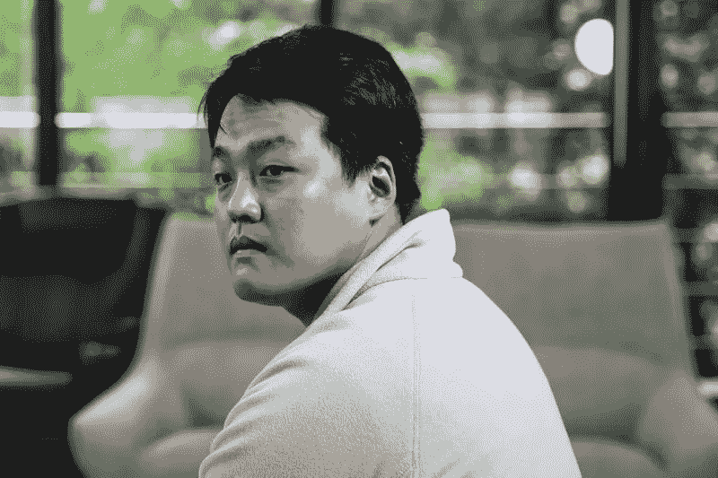

# 价值 400 亿美元的勇敢向前冲:月神的陨落

> 原文：<https://medium.com/coinmonks/the-40b-wipeout-the-fall-of-terra-luna-told-in-a-sequence-of-tweets-72724cd09bff?source=collection_archive---------7----------------------->

[Source: Woohae Cho, Bloomberg]

Luna 的创始人是谁？Do Kwon 是斯坦福大学的辍学生，也是韩国的计算机科学家。他发现露娜是一种新的稳定硬币。大多数稳定货币的工作方式是存入美元，然后用 1 对 1 的方式兑换加密货币，而 Luna 的工作方式有所不同。

> 加入 Coinmonks [电报频道](https://t.me/coincodecap)和 [Youtube 频道](https://www.youtube.com/c/coinmonks/videos)了解加密交易和投资

$LUNA 在算法上与$UST 挂钩，这样更好，因为这意味着他们不必存储任何现实生活中的货币。

权道因其在推特上的直言不讳而出名(或声名狼藉)，即使在坠机后，他在推特上仍有超过 100 万名粉丝。

好吧，让我们从头开始。2021 年 11 月，业余金融分析师弗雷迪·雷诺德(Freddie Raynolds)计算出，如果个人或组织可以访问$1B，他们理论上可以让 Terra Luna 加密货币崩溃。他们有可能从崩盘中获得巨额收益。

权道回击道，并迅速在推特上否认了这一预测。

与此同时，权道继续让自己在推特上不受欢迎，称他的批评者和怀疑者是“穷人”。

一名交易员受够了他的傲慢行为，以 100 万美元的赌注向道权挑战，赌 Luna 的价格在明年会下跌。假名交易者 gigant renewal 抢先一步，提供了 1000 万美元的赌注。道权接受了。

与此同时，许多业余密码交易员开始越来越看好卢娜和 UST。他们认为这是一个理想的解决方案，因为它依靠新的算法将美元与它的姊妹货币 UST 挂钩。

有证据显示，权道是之前失败的加密货币的创始人，在那里他和他的共同创始人“莫蒂”都被化名为“里克”。

权的狂热追随者保护他免受批评。他继续经营卢娜。

弗雷迪·雷诺德预言的袭击发生了。由于高交易量，卢纳不再与 UST 挂钩，导致其价格暴跌。

交易者开始恐慌性抛售，价格进一步下跌。

阴谋论出现，指责 Citadel，贝莱德和文克莱沃斯双胞胎的双子座是崩溃的罪魁祸首。这三家公司都否认参与其中。

一些投资者认为他们正在“买入下跌”，继续买入美元，预计其价格将回到崩盘前的水平。唉，如果价格不再上涨，那就不是下跌了。

$LUNA 继续暴跌。

卢娜基金会警卫决定出售其储备的比特币，希望它可以保释卢娜。不成功。

Luna 的价格继续一路下跌至 0.01 美元。

在卢布暴跌 98%，市值蒸发逾 400 亿美元后，世界各地的交易员都在哀悼他们的损失。

正义得到了伸张。最初做空$LUNA 的两个交易者现在想要回他们的钱。

Luna 的不稳定状态意味着它已经从币安的一个主要加密平台上除名。

最后，道权回应道。他为自己的错误道歉。他不必为自己的行为承担任何法律后果。

他吸取教训了吗？

没有。我猜他没有吸取教训。

就在事故发生几天后，道权开始将 Terra 2.0 作为下一步推广。他面临着大量的批评，并呼吁对他采取法律行动。

他至今仍是自由的。

本文到此为止！感谢你的阅读，我希望它能给你带来一些娱乐。

如果你喜欢这篇文章，让我知道，我会做更多关于其他一些戏剧性的崩溃。Fast next 的内爆？

如果你喜欢这篇文章，请给我们一个👏！