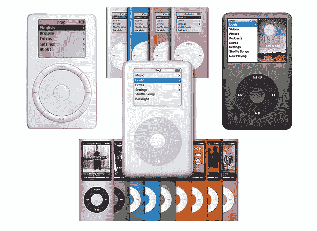

# 帮助苹果售出 22 亿部 iPhones 的 4.5 亿部 iPods。

> 原文：<https://medium.com/coinmonks/the-450-million-ipods-that-helped-apple-sell-2-2-billion-iphones-fdd299aeed14?source=collection_archive---------14----------------------->

Apple sold 450 million units of iPod.

“扯掉 iPod，你走路让智能手机也能跑”

这是 TechCrunch 的头条，当时他们宣布，银河系中最富有的公司之一苹果公司将终止 iPod。

这意味着苹果将不再销售 iPod，在维修和保修方面为其提供支持。

至于现有的 iPods，它们会售完即止。

我发誓直到今天我才意识到苹果还在卖 iPod！

这是一个时代的终结。

我不知道当史蒂夫·乔布斯发布 iPod 时，你是否在场。

但就好像地球摇晃得足以偏离它的轴心。

这就像是乔布斯离开了天堂，带着一个可以存储 1000 首歌曲、电池寿命为 10 小时的小设备。

请记住，当在黑莓和索尼随身听之间进行选择时，这种光盘现在被咖啡店老板重新用作反射板，以防止新加坡小贩中心的鸽子。

iPod 彻底改变了游戏。

The iconic ads Apple did for the iPod.

其他人都在想如何把 CD 做得更小，更便携，更易移动。

苹果正在重新发明什么是可能的，想着把硬盘塞进你的手掌里。

当其他人都在建造更快的汽车时，他们却在建造星际飞船，思考星际旅行。

那是在 2001 年。

Steve Jobs unveiling the iPod was a generational game-changing moment in modern tech history.

每一个对技术、创业、创新感兴趣的年轻人，如果想提高他们的表达和沟通技巧，都应该观看 2001 年的原始演示。

[https://youtu.be/Mc_FiHTITHE](https://youtu.be/Mc_FiHTITHE)

20 多年后的今天，经过 17 代 iPod 的发展，世界已经跟上了时代的步伐，现在是 iPod 退休、享受荣耀的时候了。

iPod 改变了整整一代人。

令人难忘的经典滚轮设计让每个人都感到困惑和震惊。

金属质感、超光滑的外观在市场上绝无仅有。

iPod Mini 和 Nano 让音乐变得便携、有趣、简单和酷。

iPod Touch 诞生了 iPhone，iPhone 又一次改变了一代人。

iPod Shuffle 是一款非常古怪可爱的设备。

我甚至不使用它，但我得到了它的形式因素和冷静。

iPod 有如此多的历史和美丽，苹果也非常关注他们的产品。

世界上所有最好的公司都是由产品驱动的。

苹果也不例外。

他们对产品设计要求严格。

他们坚持不懈地追求产品各方面的完美。

“没有 iPod，就没有 iPhone 和 iPad。上周，iPod 和 iPhone 的共同创造者[托尼·法德尔](https://techcrunch.com/2022/05/05/tony-fadell-cleans-out-his-garage/)

The iPod went through so many changes, each one better than the last one.

话说回来，知道什么时候结束一个产品线也是一门艺术。

苹果的每件产品都赚了数亿美元，iPhone 在 2021 年赚了近 2000 亿美元。

知道什么时候“退休”或结束一个产品也很重要，就像知道什么时候不要终止一个产品一样。

苹果可能意识到，尽管升级和改进了 iPod，但现代 iPhone 的强大功能实在是太强大了。

最新款的 iPhone 无所不能，价格比他们的 MacBooks 还贵！

我很想听听苹果为什么决定终止 iPod 以及为什么是现在的想法。

iPod 将作为一款打开无人知晓之门的关键产品载入史册。

iPod 万岁。

-

你拥有过 iPod 吗？

-

# startups # business # startupx # growth # success # social media # culture # entrepreneur # strategy # apple products # ipod nano # iphone # Tim cook # apple # Twitter # Steve jobs # jobs # genius

> 加入 Coinmonks [电报频道](https://t.me/coincodecap)和 [Youtube 频道](https://www.youtube.com/c/coinmonks/videos)了解加密交易和投资

# 另外，阅读

*   [Bitget 评论](https://coincodecap.com/bitget-review) | [双子星 vs BlockFi](https://coincodecap.com/gemini-vs-blockfi) cmd| [OKEx 期货交易](https://coincodecap.com/okex-futures-trading)
*   [AscendEx Staking](https://coincodecap.com/ascendex-staking)|[Bot Ocean Review](https://coincodecap.com/bot-ocean-review)|[最佳比特币钱包](https://coincodecap.com/bitcoin-wallets-india)
*   [霍比评论](https://coincodecap.com/huobi-review) | [OKEx 保证金交易](https://coincodecap.com/okex-margin-trading) | [期货交易](https://coincodecap.com/futures-trading)
*   [网格交易机器人](https://coincodecap.com/grid-trading) | [Cryptohopper 审查](/coinmonks/cryptohopper-review-a388ff5bae88) | [Bexplus 审查](https://coincodecap.com/bexplus-review)
*   [7 个最佳零费用加密交易平台](https://coincodecap.com/zero-fee-crypto-exchanges)
*   [氹欞侊贸易评论](https://coincodecap.com/anny-trade-review) | [霍比保证金交易](/coinmonks/huobi-margin-trading-b3b06cdc1519)