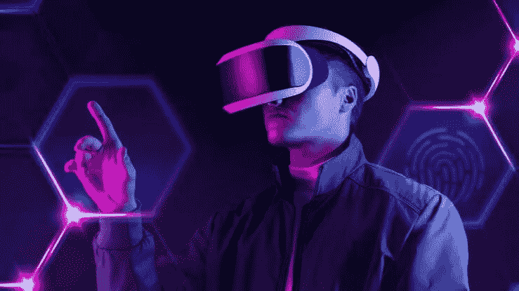
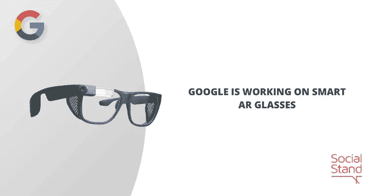
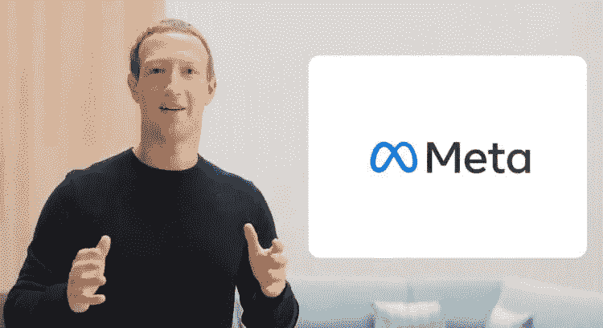
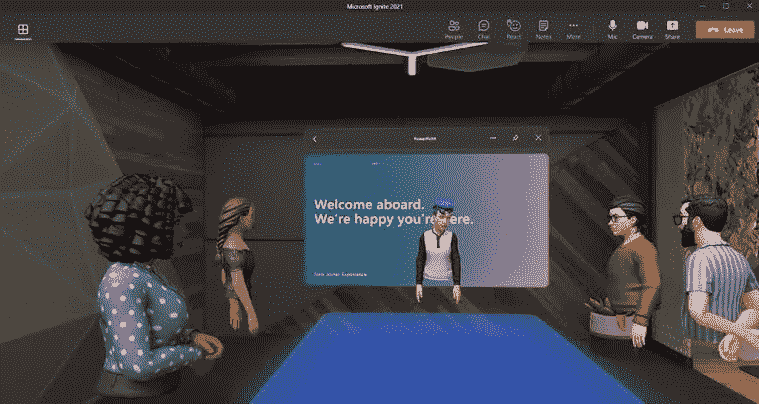
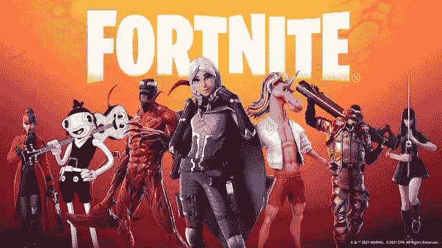
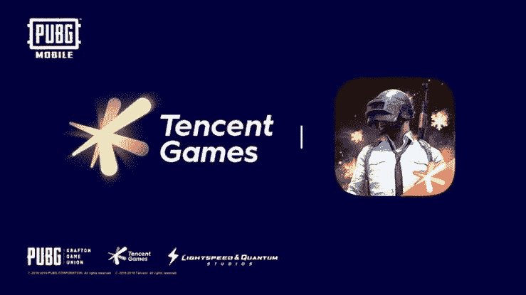

# 五大全球公司在元宇宙崛起

> 原文：<https://medium.com/coinmonks/the-5-global-companies-building-the-metaverse-6968cbf5d02d?source=collection_archive---------19----------------------->

元宇宙的要素之一是它不能由一个单一的实体来建造。

它包括生活、工作和娱乐的许多方面。

因为小团队和大型国际公司使用同一个舞台，任何人都可以为元宇宙的建设做出贡献。

在这篇文章中，我们将看看科技行业中帮助建立元宇宙的一些最大的人物。

## 我们到底是如何建造元宇宙的？

我将解释如何建立元宇宙，以便更好地理解每个公司在做什么。

类似于互联网的发展，元宇宙的建立。

我们需要改进用于连接的技术以及我们制作的内容。

你可以设计一个“玩赚互动游戏”,一个虚拟产品市场，或者一种使平台能够互相交流的方法。

每个人都有大量的机会。

## 为什么建设元宇宙对公司很重要？

我在本文中列出的公司已经有了市场领先的平台。

腾讯的微信，Meta 的脸书和 Instagram，Epic Games 的堡垒之夜只是几个例子。

这些平台似乎有可能以某种身份与元宇宙接触；公司开发与元宇宙相关的产品是合乎逻辑的。

元宇宙密码项目的发明和财务成功也非常令人鼓舞。

Roblox、分散式土地和 Axie Infinity 是激励大型国际公司和新一代创造者的几个项目。

目前，初创公司和科技公司正在竞相创造最新趋势。

## 1.谷歌

谷歌首席执行官桑德尔·皮帅在接受彭博采访时将元宇宙描述为“用增强现实以身临其境的方式开发计算机”。

凭借谷歌眼镜设备，他们已经有了很多增强现实的经验。

全息视频会议应用项目 Starline 是 2021 年 11 月重组其 VR 和 AR 部门时建立的新谷歌实验室部门的一部分。

目前，谷歌更感兴趣的是通过可以融合虚拟和现实世界的增强化身来连接我们。

基础似乎已经存在，尽管我们还没有看到谷歌令人信服的元宇宙提议。

## 2.脸书(梅塔)

考虑到元宇宙的广泛发展，脸书无疑是呼声最高的。

随着脸书、Instagram 和 Oculus VR 都归入该品牌，该公司甚至将名称改为 Meta，以表明它对此事的严肃态度。

脸书控制了元宇宙的大量基本要素，因为我们已经可以观察到他们的一些小规模的发展，如；

*   虚拟现实信息对于创建用户之间的互动连接至关重要。
*   Project Cambria 是一款可与 Oculus Quest 虚拟现实环境互操作的 VR 头戴设备。
*   Horizon Marketplace 是买家、卖家和创作者交易数字产品的地方。

首席执行官马克·扎克伯格已经提到了元宇宙中不可替代令牌(NFT)、加密货币和区块链的相关性。

鉴于其 Libra 项目正在进行中，我们也可能会看到这种情况适用于 Meta 的未来。

## 3.微软

微软的 Mesh for Teams 软件将于 2022 年上市，是该公司在元宇宙的主要产品。

这是新元宇宙的兴奋以及在疫情期间变得更加流行的在家工作趋势的直接结果。

为了提供持久的虚拟办公室体验，该软件将可以在传统设备和 VR 头戴设备上使用。

创建一个虚拟化身，作为你的数字身份，是团队体验的关键。

任何元宇宙的一个重要组成部分是使用虚拟角色探索虚拟地方和位置的能力。

## 4.史诗游戏

Epic Games 创建了堡垒之夜，这是一个先进的元宇宙平台，已经发展成为一个相当大的社交网络和虚拟环境，现在有超过 3.5 亿人参与这个曾经只是一个游戏的游戏。

名人，品牌，颁奖典礼和音乐会的联盟都可以在它的虚拟活动中找到。

考察元宇宙，Epic 有两个主要动机。

首先，它旨在将堡垒之夜发展成为一个能够吸引和容纳超过 6000 万月活用户的系统。

此外，Epic 旨在“确保 3D、AR、VR 内容的可访问性，并改善创作者生态系统，这对开放和互联的元宇宙至关重要。”

这将使每个人都可以制作专业的 3D 内容，并增强元宇宙体验。

## 5.腾讯

除了拥有中国社交网络和即时通讯服务微信和腾讯 QQ 之外，它们还是全球最大的视频游戏生产商之一。

元宇宙的演变取决于这两个方面。

例如，腾讯 QQ 已经将游戏、电子商务、音乐、电影和语音聊天功能全部纳入一个在线平台。

微信提供了一个可以连接到其社交媒体网络的移动支付应用程序。

腾讯高管在财报电话会议上提到了游戏基础设施在元宇宙增长中的价值。

腾讯已经有大量的项目和应用在使用。

他们打算引领元宇宙的游戏化，并利用他们的专业经验。

## 结论

建设元宇宙的竞赛已经开始。

然而，与以前的技术相比，元宇宙为没有冲突的创新提供了充足的空间。

谷歌和 Meta(脸书)等巨头在加密货币和元宇宙方面取得了成功，他们已经开始将加密货币纳入自己的战略。

然而，这也是预算大、加密团队小的公司可能会直接竞争的地方。

无论谁在元宇宙竞赛中领先，创新和发展肯定会随着时间的推移而改善。

*你可以在* [*推特*](http://twitter.com/@bukzofwakanda) *上关注我并给这个帖子 50 个掌声来表达你的感激👏如果你喜欢的话。*

> 加入 Coinmonks [电报频道](https://t.me/coincodecap)和 [Youtube 频道](https://www.youtube.com/c/coinmonks/videos)了解加密交易和投资

# 另外，阅读

*   [OKEx vs KuCoin](https://coincodecap.com/okex-kucoin) | [摄氏替代品](https://coincodecap.com/celsius-alternatives) | [如何购买 VeChain](https://coincodecap.com/buy-vechain)
*   [ProfitFarmers 点评](https://coincodecap.com/profitfarmers-review) | [如何使用 Cornix 交易机器人](https://coincodecap.com/cornix-trading-bot)
*   [如何匿名购买比特币](https://coincodecap.com/buy-bitcoin-anonymously) | [比特币现金钱包](https://coincodecap.com/bitcoin-cash-wallets)
*   [瓦济里克斯 NFT 评论](https://coincodecap.com/wazirx-nft-review)|[Bitsgap vs Pionex](https://coincodecap.com/bitsgap-vs-pionex)|[坦吉姆评论](https://coincodecap.com/tangem-wallet-review)
*   [如何使用 Solidity 在以太坊上创建 DApp？](https://coincodecap.com/create-a-dapp-on-ethereum-using-solidity)
*   [加密交易机器人](/coinmonks/crypto-trading-bot-c2ffce8acb2a) | [OKEx vs 币安](https://coincodecap.com/okex-vs-binance)