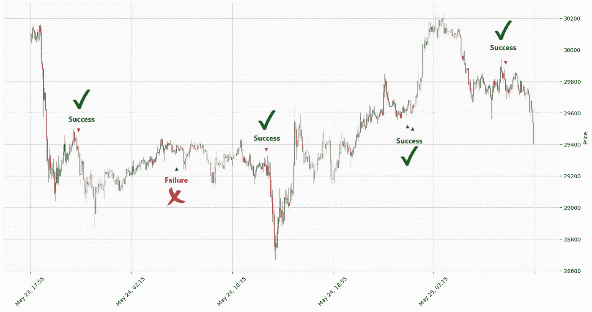

# 每个交易者都应该知道的一个交易策略

> 原文：<https://medium.com/coinmonks/the-5-minute-trading-strategy-5a83507a630e?source=collection_archive---------6----------------------->


photo from [efficy](https://www.efficy.com/)

朋友们好，今天我想在这篇文章
中解释一个完美的策略，让我们一起用 Python 编写代码，然后测试回来。

开始前您必须知道的一些指标:

S马:简单移动平均线是一个技术指标，可以帮助确定资产价格是否会继续，或者是否会逆转牛市或熊市趋势。

M **ACD:** 移动平均线收敛发散(MACD)是一种趋势跟踪动量指标，显示一种证券价格的两条移动平均线之间的关系。

# **设置:**

> 时间范围: **5 分钟**
> 
> 股票类型:**加密货币**
> 
> 回溯测试平台: **Python**


# 让我们编码:

首先，我们需要创建一个 Conda 虚拟环境机器:

> 如果你需要了解更多关于康达和安装康达的信息，请在开始前阅读 [**本页**](https://docs.conda.io/en/latest/) 。

```
$ conda create -name=strategy python=310
$ conda activate strategy 
```

创建 conda 机器后，我们必须安装 sum 包:

```
(strategy)$ pip install python-binance pandas-ta jupyterlab notebook mplfinance numpy pandas 
```

我的脚本中需要这个包:

> [python-币安](https://python-binance.readthedocs.io/en/latest/) : **读取硬币历史数据**
> 
> [熊猫-ta](https://github.com/twopirllc/pandas-ta) : **创造条件**
> 
> jupyterlab 和笔记本 : **创建测试模拟并运行 python。**

然后通过以下命令运行 jupyter 笔记本:

```
(strategy)$ jupyer notebook
```

# 步骤:

*   首先，我们必须导入所有需要的库:
*   然后创建一个函数，从币安获取期间日期的硬币数据:
*   然后创建一个函数来检查条件数据并获取信号。
*   并精细地创建调用所有函数的主函数。

# **条件:**


photo from [guardianmortgageonline](https://www.guardianmortgageonline.com/)

## 长药水:

*   硬币价格必须穿过均线(19)
*   烛台类型为绿色(**关闭>打开**)
*   MACD 直方图的颜色不应是**暗红色**
*   烛台尺寸不是很大
*   MACD 2 线比 0 线高
*   **在**至少有 4 根棒线**在 MACD 线趋势反转后穿过。**

## **空头头寸:**

*   **硬币价格必须穿过均线(19)**
*   **烛台类型为红色(**开>关**)**
*   **MACD 直方图的颜色不应是**深绿色****
*   **烛台尺寸不是很大**
*   **MACD 2 线**低于 0****
*   **在**处，自从 MACD 线趋势反转以来，至少有 4 根棒线**穿过。**

# **导入所有必需的库:**

# **创建一个从币安读取硬币数据的函数:**

# **创建一个函数来检查条件:**

# **为测试创建绘图函数:**

# **运行脚本并绘制数据:**

# **结论:**

****

**Export Data (BTC-USDT from 23 May 2022 — 25 May 2022)**

**如你所见，该指标在最近一段市场周期的胜率是**好**，平均每 5 笔交易中有一笔**亏**。
但重要的一点是，这个比例是可变的。就是有时候多，有时候少。**

**需要注意的是，当你收到指标的输入信号，所有的条件都具备了，你就应该在那之后管理你的交易，也就是当你看到回归烛光或者市场成交量的时候，**退出交易**。这就是为什么不能说你为退出确定了一定的获胜风险。**

# **重要提示:**

**ll 指示器有一个百分比误差，您只能用它们来帮助确认信号。**