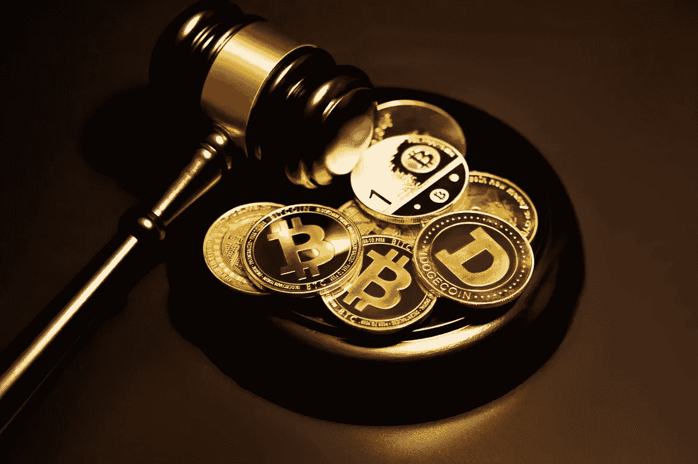

# Dao 挑战传统企业需要解决的 5 件事

> 原文：<https://medium.com/coinmonks/the-5-questions-that-daos-need-answered-to-challenge-corporations-7f9751ff33f3?source=collection_archive---------8----------------------->

## 概述了为促进 Dao 的发展而需要解决的尚未解决的关键法律和监管问题

[Image credit](https://unsplash.com/photos/ow-rGjlqJkM)

分散自治组织，也称为 Dao，是在密码领域开创的新兴组织结构。Dao 作为一个组织实体的快速发展，有可能挑战当今世界经济中普遍存在的主导性等级企业结构。然而，Dao 目前在其活动方面缺乏足够的法律和监管确定性，这影响了其发展和与公司竞争的能力。

简而言之，Dao 是依靠一系列智能合约运行的组织，这些合约的代码规定了组织的管理和决策。这使得一些人认为“道”是“一个拥有共享银行账户的互联网社区”。

尽管 Dao 在 T2 有着良好的开端，但他们已经声名鹊起，从提供 T4 种子资金到秘密项目，甚至试图购买美国宪法。

虽然 Dao 主要在加密领域运作，但它们并不仅仅存在于数字世界。随着 Dao 的规模和范围不断扩大，它们将越来越多地与非加密世界互动，从签订合同到采购服务(如开发人员搭建平台)、购买实物资产(如土地)和借入法定货币，它们无所不为。

然而，关于 Dao 是什么，更重要的是它们能做什么和不能做什么，法律和监管的确定性有限。这种不确定性会对 Dao 及其贡献者的发展产生令人寒心的影响。例如，如果不清楚 Dao 实际上能否合法拥有财产，他们就不太可能购买实物资产。如果不清楚 Dao 是否可以合法地执行他们所签订的合同，他们首先就不太可能签订合同。

拥有法律和监管的确定性对于 Dao 的成长和扩展至关重要，这使得这种模式最终能够挑战大型传统企业的等级制度。

本文将研究 Dao 需要解决的以下五个关键问题，并通过实例说明为什么它们是相关的以及首选的前进道路:

1.  谁合法拥有道的资产/金库？
2.  道的债务最终由谁承担？
3.  刀客是否具有订立合同的法律行为能力？
4.  阿刀可以起诉和被起诉吗？
5.  DAO 的贡献者是雇佣关系吗？

# 道的资产/金库合法归谁所有？

虽然 DAO 本身拥有他们的金库/资产似乎是直观的，但从法律角度来看，这个问题实际上并不完全清楚。

让我们举一个假设的 ArtDAO 的例子。艺术道的职权范围是投资所有不同类型的艺术，从非艺术作品到实物艺术。有一天，艺术道决定购买蒙娜丽莎。道在拍卖会上购买了蒙娜丽莎，道的创始人同意保管蒙娜丽莎。创始人是一个邪恶的演员，他决定将蒙娜丽莎卖给另一方，然后将所得收入中饱私囊。

现在，如果道是一个公司，法律将承认该公司是蒙娜丽莎的合法所有者。因此，创始人的行为是一起明显的盗窃/盗用案件。

然而，一个道的法律地位并不明确，特别是道是否能够实际合法拥有资产(就像一个人能够拥有资产一样)。因此，有可能创始人是蒙娜丽莎的实际合法所有人，因此没有犯罪，对刀没有追索权。

虽然存在这种不确定性，但这可能会导致 Dao 不参与现实世界中的资产购买，因为他们担心自己的资产可能会被任何法律途径收回。

**提议的解决方案:**各司法管辖区承认道为其国库中资产的合法所有人，并承认道为能够凭自身权利拥有资产的机构。

# **道的债务最终由谁来承担？**

公司结构的一个关键特征和创新是有限责任的概念。有限责任意味着股东的责任限于其投资的价值(例如，如果他们购买价值 1000 美元的股票，他们的损失限于 1000 美元)。其他结构则不是这样，比如合伙企业，它们的责任是无限的。无限责任意味着在实体破产/资不抵债的情况下，成员将对实体的未偿债务负责。

对于 DAO 而言，成员是无限责任还是有限责任是一个重要问题。举个例子，一个人向一个 DAO 的治理令牌投资了 5000 美元，并成为了一个活跃的贡献者。道进行一系列投资，包括借入大量资金。投资进展不佳，在这个过程中，道实际上破产了(负债超过其持有的资产)。在这种情况下，作为道中的一员，我的位置会是什么呢？我要为道的超额债务负责吗？我会因此失去比最初投资的 5000 美元更多的钱吗？

显然，如果一个 DAO 被视为对其成员承担无限责任，那么考虑到这种额外的风险，投资于 DAO 并为其做出贡献的人会明显减少。

**提议的解决方案:**Dao 应与公司一样承担有限责任。

# **阿刀是否具有签订合同的法律行为能力？**

法律行为能力是 Dao 的一个重要方面，因为它影响到它们在贸易和商业中的运作方式。虽然个人和公司有能力订立合同，但不清楚一个道是否能够订立合同。举下面这个例子。

PropertyDAO 是最初为投资数字财产而设立的 DAO(例如在[分散地](https://decentraland.org/))。道社区随后投票决定购买纽约的一栋高层公寓大楼。

DAO 参与谈判并同意购买该物业。然而，当涉及到签订合同时，道可能不被认为实际上有能力签订合同。从法律的角度来看,“道”就像一条狗试图签订合同一样。没有签订合同的法律能力，就意味着合同本身没有法律效力。

如果这个问题得不到解决，这可能意味着 DAO 中的个人需要自己签订合同(给 DAO 和个人都带来风险)，或者为 DAO 成立一个公司来签订合同(这可能会降低成员对 DAO 决策的控制)。

**提议的解决方案:**Dao 应具有签订合同的公认法律行为能力。

# **阿刀可以起诉和被起诉吗？**

法律行为能力的另一个重要方面是起诉和被起诉的能力。这对 DAO 来说非常重要，因为如果不能起诉，他们就无法执行合同。

以 DAO 为例，它希望在自己的网站上建立一个新产品平台。他们外包给一群开发人员来建设网站，并预付 100 万美元。几个月后，开发人员没有在网站上做任何工作，似乎带着钱消失了。道社区投票起诉开发商。

现在，如果法律不承认 DAO 有能力提起诉讼，法院将在一审中简单地驳回案件(在 DAO 甚至有机会争辩自己的立场之前)。这使得 Dao 处于危险的境地，因为他们会被阻止签订合同，从而限制了他们的发展和规模。

**提出:**Dao 应当具有起诉和被诉的能力。

# **DAO 的贡献者是否存在雇佣关系？**

另一个关键问题是贡献者和 DAO 本身之间的关系。目前，道组织经常用代币奖励贡献者(通常基于投票),以认可和奖励他们在协助道组织方面的工作。这可以被认为是贡献者事实上的工资。

这就产生了一个问题，如果捐助者领取薪金，他们实际上是道的雇员吗？如果是这样的话，这将意味着作为雇主的任务执行人负有义务(例如年假和病假权利)。这反过来又会增加运营一个任务执行实体的复杂性，因为任务执行实体需要遵守缴款人所在的每个管辖区的雇用义务。

**拟议解决方案:**除非明确签订正式雇佣合同，否则不应将一个任务执行实体的捐助方视为该任务执行实体的雇员。

> 加入 Coinmonks [电报频道](https://t.me/coincodecap)和 [Youtube 频道](https://www.youtube.com/c/coinmonks/videos)了解加密交易和投资

## 另外，阅读

*   [最好的卡达诺钱包](https://coincodecap.com/best-cardano-wallets) | [Bingbon 副本交易](https://coincodecap.com/bingbon-copy-trading)
*   [印度最佳 P2P 加密交易所](https://coincodecap.com/p2p-crypto-exchanges-in-india) | [柴犬钱包](https://coincodecap.com/baby-shiba-inu-wallets)
*   [8 大加密附属计划](https://coincodecap.com/crypto-affiliate-programs) | [eToro vs 比特币基地](https://coincodecap.com/etoro-vs-coinbase)
*   [最佳以太坊钱包](https://coincodecap.com/best-ethereum-wallets) | [电报上的加密货币机器人](https://coincodecap.com/telegram-crypto-bots)
*   [交易杠杆代币的最佳交易所](https://coincodecap.com/leveraged-token-exchanges)
*   [AscendEx Staking](https://coincodecap.com/ascendex-staking)|[Bot Ocean Review](https://coincodecap.com/bot-ocean-review)|[最佳比特币钱包](https://coincodecap.com/bitcoin-wallets-india)
*   [Bitget 回顾](https://coincodecap.com/bitget-review) | [双子 vs 区块链](https://coincodecap.com/gemini-vs-blockfi) | [OKEx 期货交易](https://coincodecap.com/okex-futures-trading)
*   [美国最佳加密交易机器人](https://coincodecap.com/crypto-trading-bots-in-the-us) | [经常性回顾](https://coincodecap.com/changelly-review)
*   [在印度利用加密套利赚取被动收入](https://coincodecap.com/crypto-arbitrage-in-india)
*   [霍比审核](https://coincodecap.com/huobi-review) | [OKEx 保证金交易](https://coincodecap.com/okex-margin-trading) | [期货交易](https://coincodecap.com/futures-trading)
*   [麻雀交换评论](https://coincodecap.com/sparrow-exchange-review) | [纳什交换评论](https://coincodecap.com/nash-exchange-review)
*   最好的[加密税务软件](/coinmonks/best-crypto-tax-tool-for-my-money-72d4b430816b) | [硬币追踪评论](/coinmonks/cointracking-review-a-reliable-cryptocurrency-tax-software-5114e3eb5737)