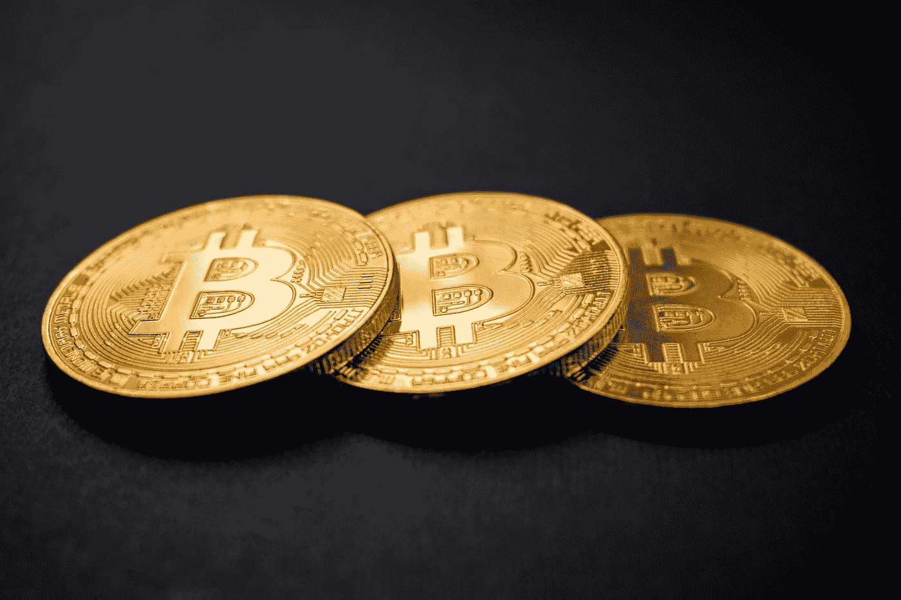
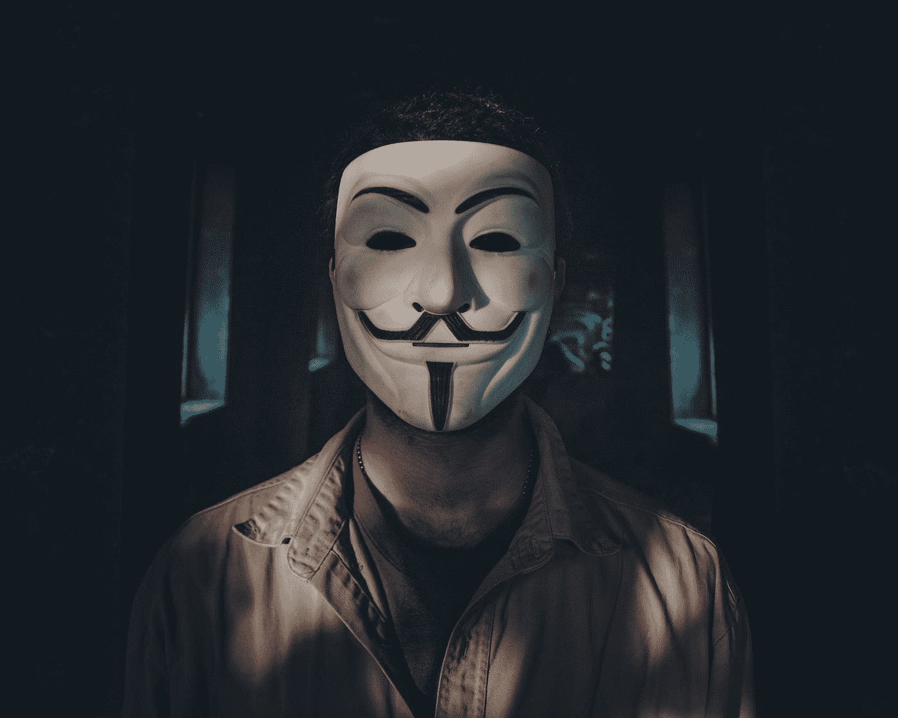
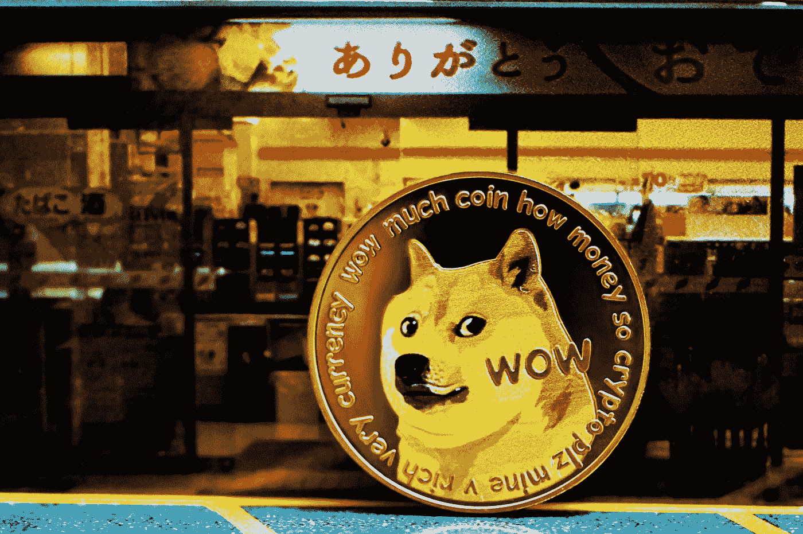
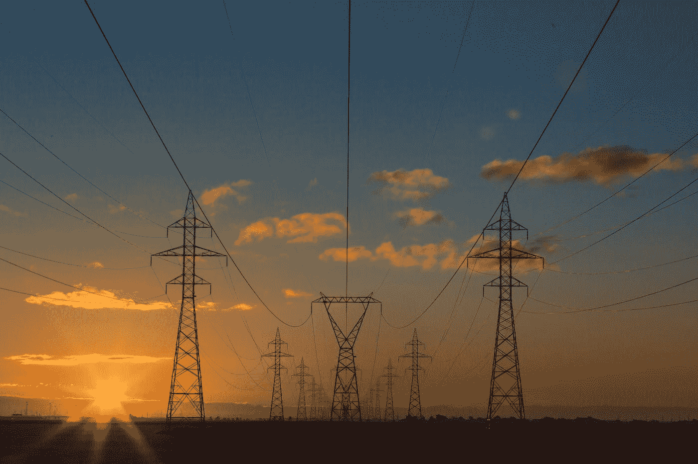

# 6 个最常见的比特币误解

> 原文：<https://medium.com/coinmonks/the-6-most-common-bitcoin-misconceptions-94266ce78646?source=collection_archive---------11----------------------->

无论是在主流媒体，如日报、各种杂志或电视报道中，还是在相关论坛和(加密)网站上……几乎总是在试图解释比特币时，使用传达虚假形象的陈述，这是不正确的，因此经常导致加密领域新人的误解。

因此，在下面的帖子中，我想澄清六个最常见的比特币误解，并以一种更准确的方式向你解释一些事情。

Photo by [Dmitry Demidko](https://unsplash.com/@wildbook?utm_source=medium&utm_medium=referral) on [Unsplash](https://unsplash.com?utm_source=medium&utm_medium=referral)

# 1.“比特币是一种匿名货币。”

记得吗？当你第一次听说比特币时，这种“神奇的互联网货币”允许犯罪分子以完全匿名的方式在互联网上进行非法交易？无论是毒品、武器还是儿童色情制品，比特币都可以用来在暗网上购买任何东西，而且不可能被抓住。

即使在今天，许多所谓的“无币者”(没有投资比特币或其他加密货币的人)或“预币者”(尚未投资加密货币的人)仍然持有这种比特币观点。在现代故事片中，仍然有，或者更确切地说，总是有这样的场景，坏人想要比特币而不是现金作为赎金。

然而，事实是，比特币是匿名支付手段的假设是错误的。严格来说，比特币只是假名，但在“了解你的客户(KYC)”的时代，这在很大程度上也是无效的。任何假名，即任何公开的比特币地址，只要没有人能够指定它属于谁，都只是匿名的。然而，大多数比特币制造者在受监管的交易所购买他们的 BTC，这些交易所通过所谓的 KYC 程序确切地知道他们向谁以及何时出售了一些东西。由于透明度是比特币区块链的一个关键特征，并且从中本聪到哈尔芬尼的第一笔比特币交易的所有交易都是公开可见的，因此当局或专业公司(如 Chainalysis)很容易发现哪笔交易是由谁进行的。尽管已经有很好的方法通过所谓的 Coinjoins 和其他进一步的发展来帮助比特币恢复更多的隐私，但我们距离人们经常宣称的 100%匿名还有很长的路要走。

Photo by [Mohammad Hoseini Rad](https://unsplash.com/@mhrlife?utm_source=medium&utm_medium=referral) on [Unsplash](https://unsplash.com?utm_source=medium&utm_medium=referral)

# 2.“你可以把你的比特币储存在钱包里”。

“硬币不在钱包里，而是在区块链里”。几乎我们所有人都可能听过或读过这句话。虽然这个句子本身也不完全正确，但在第 6 点中会有更多的解释。然而，事实是陈述的第一部分，即硬币不在钱包里。钱包只保存允许用户管理相关比特币的密钥。比特币幼儿园的第一步是掌握公钥和私钥(或主种子/助记短语- >那些 12/24 单词)的含义以及如何使用它们。每个曾经理解钥匙和种子如何工作的人，将来会把他的种子锁在保险箱里，而不是他的 Trezor 或账本里。
“不是你的钥匙，不是你的比特币”成了场景中的常用语。

Photo by [Shubham Dhage](https://unsplash.com/@theshubhamdhage?utm_source=medium&utm_medium=referral) on [Unsplash](https://unsplash.com?utm_source=medium&utm_medium=referral)

# 3.“一整枚比特币太贵了，所以我宁愿买一枚便宜的屎币”。

如果每次我听到一个加密新手说“一个比特币对我来说太贵了，我宁愿买 Shitcoin XY，我会花更多的钱”时，我都会有一个 Satoshi，那么我现在可能已经有差不多一整个比特币了。

……这让我们直接进入了我试图向你阐明的一点:
比特币不是一个不可分割的单元，而是可以被分割成总共 1 亿个部分。这些单元中最小的被称为 Satoshi，在我写这篇文章的时候，它的价格只有几分之一美分。
因此，如果有人不想购买比特币，因为它似乎太贵了……只需向他们提供以下建议:截至 2020 年 1 月，只需 1 美元，你就可以获得 11，000 多一点的 Satoshi->如果这不是一笔好交易，对吗？

再者，由于供求原则，价格总是与这两个因素挂钩。对于理应便宜的硬币，通常情况下供应量相应较大，而“比特币曾经价值很低，现在价值 10，000 美元，所以另一枚现在只值几美分的硬币也可以价值 10，000 美元”的计算在实践中不会奏效。如果一枚硬币的供应量比最终的大约 2100 万 BTC(或者更准确地说:2099999997690000)大 1000 倍或者甚至 10000 倍，这种情况就很难发生，除非所述硬币变得如此成功，以至于它将覆盖我们星球的几乎全部繁荣。

因此，如果一个无知的熟人再次向你寻求投资建议，建议他买几个 Satoshi…毕竟，他们仍然真的很便宜😉。

Photo by [Kanchanara](https://unsplash.com/@kanchanara?utm_source=medium&utm_medium=referral) on [Unsplash](https://unsplash.com?utm_source=medium&utm_medium=referral)

# 4.“为了挖掘比特币，特殊的计算机必须解决复杂的计算任务。”

[*比特币挖矿*](/@maltejaeger/what-is-bitcoin-mining-7f2f9cdbf305) 通过必须解决高度复杂的计算任务的特殊计算机来工作，这是你在主流媒体上反复读到或听到的，也是从那些并不真正理解工作证明过程的人那里听到的。

事实上，要解决的任务一点也不复杂。所谓的散列函数的一个特征是，输出(散列)的计算非常简单，但是反过来，从输出中推断输入是非常困难的。
粗略地说，比特币挖掘的工作方式是，必须找到满足特定条件的哈希(例如，哈希开头的数字 0 必须至少有 5 倍- >通过零的数量调整难度函数)。第一个找到有效哈希的人现在可以将它写入新的块，将该块附加到区块链的末尾，并向自己支付所谓的“块奖励”(目前为 6.25 BTC)。
这个散列的输入总是前一个块的散列，以及一个一次性数字(nonce =使用过一次的数字)。因为前一个块的散列是一个固定值，所以挖掘器改变这个所谓的 nonce 来调整输出，以便它吐出一个有效的散列值。

所以基本上他们除了简单的“数数”什么也不做。并且他们这样做，直到结果是有效的散列值。即使找到一个合适的数字极其困难，也不存在复杂的问题！

此外，我想提一下，甚至没有特殊的硬件，所谓的 [*ASIC-Miner*](/@maltejaeger/what-are-asic-miner-983c73f8cb25) ，是必要的。从理论上讲，你也可以用笔和纸手工进行哈希运算，就像这位先生在这里演示的那样:

然而，ASICs 的散列速度比你快得多，所以比竞争对手更快找到有效散列值的概率接近于 0。

这里有一个简短的比较:虽然视频中的这位先生需要 15 分钟多一点的时间来计算一个哈希，但现代 ASIC 矿工可以计算大约 70 TH/s，即每秒 70 万亿次哈希。整个比特币网络的哈希速率(截至 2020 年 2 月)约为 120，000，000 TH/s (=每秒 120 万亿次哈希=每秒 120 万亿次哈希)。

# 5.“比特币没有未来，因为它浪费了太多能量”。

正如我们刚刚在第 4 点中了解到的，许多计算正在进行，为此电是必不可少的(除非你只是使用纸和笔:-)。

与此同时，大量的能源流入比特币开采，比特币“浪费”电力、对环境有害、因此没有未来的消息屡见不鲜。不可能准确确定消耗量有多高，但估计表明在 50 太瓦时以上，与小国的耗电量相当。

事实上，高功耗并不一定意味着对环境的危害。在比特币中，绝大多数矿工都是由可再生能源供电的，这一点已经被以下事实所证明:采矿业总是追逐最便宜的电价，而电力在“自然发生”的地方尤其便宜。例如，在中国，能源来自水力发电，在冰岛，能源来自地热能。

CoinShares 最近的一项调查比特币开采的研究表明，例如，超过 50%的全球比特币交易来自中国四川省，那里超过 90%的电力来自可再生能源。其他顶级矿区的情况也类似，这使得作者得出结论，近 73%的采矿来自可再生能源。

该研究的作者提出的另一个重要观点是，采矿甚至很有可能产生积极的环境影响，因为它为“绿色电力生产商”提供了一个将剩余电力货币化的机会(偏远地区生产的电力有时很难或以很高的损失进行分配)，以进一步扩大其产能，从而促进能源周转。

最后但并非最不重要的一点，我想提一下，“浪费”这个词是任何东西，但在这种情况下是恰当的。流入比特币开采的能量只是为了保护网络，从而保护一个去中心化、不受审查的自由货币系统的安全。用于采矿的每千瓦时电力都使得有人在比特币上作弊并追溯改变区块链的可能性降低了一点点，在我看来，这些能源花在这上面比花在除夕烟花、香烟生产或类似的无意义“浪费”上要好得多

Photo by [Matthew Henry](https://unsplash.com/@matthewhenry?utm_source=medium&utm_medium=referral) on [Unsplash](https://unsplash.com?utm_source=medium&utm_medium=referral)

# 6.“确实有‘硬币’”

如第二点所述，“硬币不在钱包里，而在区块链里”这句话其实并不正确。它向无知的比特币新手暗示，实际上存在硬币，即以某种方式或在某个地方存储的硬币。

然而，事实是，比特币并不是一个基于账户的系统，而是建立在所谓的 UTXOs(未支出的交易输出)之上。由于区块链的透明性，这些 UTXOs 可以被准确地看到，并且基本上是所有未花费的并且因此可花费的交易的总和，这些交易可以在相关联的私钥的帮助下被转移。它们是所有先前输出的结果。

一个钱包为你把你的 UTXOs 加起来，并从中形成一个数字账户余额，如果它正好包含 100，000，000 个最小网络单位(Satoshi)，就称为“一个比特币”。

因此，当有人谈论“发送比特币”时，他们实际上只是将某些 UTXOs 的管理权转让给了其他人。

因为 UTXO 是不可分的，也就是说，你不能从一个 UTXO 中“提取”一个 BTC，也就是说，2 个 BTC 大小的，你可以把这个过程想象成类似于用现金支付。如果你只有 2 美元的硬币，但只想花一个€乌罗，你把 2 美元转走，得到 1 美元的零钱。它与 UTXOs 的工作方式相同。如果有人通过 2 BTC 控制一个 UTXO，他想发送 1BTC，整个输出被发送出去，你得到一个通过 1 BTC 的新 UTXO。

**可以储存并送到某个地方的硬币是不存在的。**

你不想错过任何东西和保持最新，那么关注我，看看我关于比特币和区块链的另一篇帖子。

 [## 什么是 ASIC-Miner？

### 有哪些不同类型的矿工？哪些是最好的？

medium.com](/@maltejaeger/what-are-asic-miner-983c73f8cb25) 

> 加入 Coinmonks [电报频道](https://t.me/coincodecap)和 [Youtube 频道](https://www.youtube.com/c/coinmonks/videos)了解加密交易和投资

# 另外，阅读

*   [折叠 App 回顾](https://coincodecap.com/fold-app-review) | [本地比特币回顾](/coinmonks/localbitcoins-review-6cc001c6ed56) | [Bybit vs 币安](https://coincodecap.com/bybit-binance-moonxbt)
*   [加密保证金交易交易所](/coinmonks/crypto-margin-trading-exchanges-428b1f7ad108) | [赚取比特币](/coinmonks/earn-bitcoin-6e8bd3c592d9) | [Mudrex 投资](https://coincodecap.com/mudrex-invest-review-the-best-way-to-invest-in-crypto)
*   [WazirX vs coin dcx vs bit bns](/coinmonks/wazirx-vs-coindcx-vs-bitbns-149f4f19a2f1)|[block fi vs coin loan vs Nexo](/coinmonks/blockfi-vs-coinloan-vs-nexo-cb624635230d)
*   [比斯勒评论](https://coincodecap.com/bitsler-review)|[WazirX vs coin switch vs coin dcx](https://coincodecap.com/wazirx-vs-coinswitch-vs-coindcx)
*   [7 大副本交易平台](https://coincodecap.com/copy-trading-platforms) | [BuyCoins 点评](https://coincodecap.com/buycoins-review)
*   [XT.COM 评论](https://coincodecap.com/profittradingapp-for-binance) | [币安评论](https://coincodecap.com/xt-com-review)