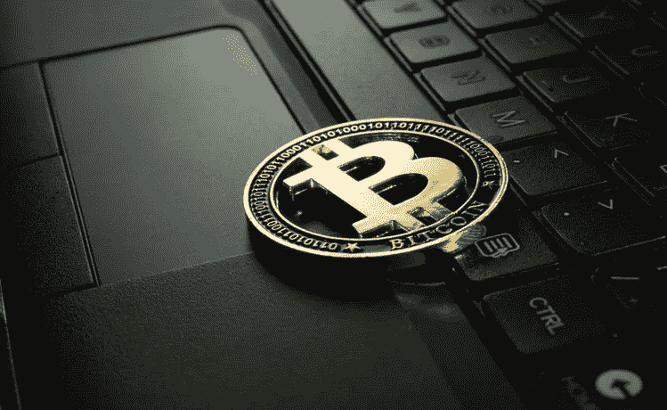

# 比特币 60 秒讲解

> 原文：<https://medium.com/coinmonks/the-60-second-download-bitcoin-f4cce35f731?source=collection_archive---------49----------------------->

在 2008 年大金融危机之后，一名或一群化名为中本聪的程序员提出了他们对在线交易的愿景，不受银行或金融机构的干预。目的是让每个人都成为自己的银行。因此，比特币的诞生创造了一个允许点对点金融交易而不需要第三方的系统。在早期，比特币用户互相发送数千个比特币作为商品或服务的付款是很常见的。事实上，在 2010 年 5 月 22 日，一名比特币用户支付了惊人的 10，000 BTC 购买了两个披萨，这在今天被认为是现实世界产品的第一笔比特币交易。交易额相当于今天的 4 亿美元！

 [## 你准备好迎接加密经济了吗？加密派

### 每次你打开新闻，阅读报纸，或者浏览你的推特，你很可能会看到一些故事…

www.thecryptopie.com](https://www.thecryptopie.com/) 

> 加入 Coinmonks [电报频道](https://t.me/coincodecap)和 [Youtube 频道](https://www.youtube.com/c/coinmonks/videos)了解加密交易和投资

# 另外，阅读

*   [加密套利](/coinmonks/crypto-arbitrage-guide-how-to-make-money-as-a-beginner-62bfe5c868f6)指南| [如何做空比特币](/coinmonks/how-to-short-bitcoin-568a2d0b4ae5)
*   [比特币基地 vs 瓦济克斯](https://coincodecap.com/coinbase-vs-wazirx) | [比特鲁点评](https://coincodecap.com/bitrue-review) | [波洛涅克斯 vs 比特鲁](https://coincodecap.com/poloniex-vs-bittrex)
*   [德国最佳加密交易所](https://coincodecap.com/crypto-exchanges-in-germany) | [Arbitrum:第二层解决方案](https://coincodecap.com/arbitrum)
*   [币安交易机器人](/coinmonks/binance-trading-bots-d0d57bb62c4c) | [OKEx 评论](/coinmonks/okex-review-6b369304110f) | [阿塔尼评论](https://coincodecap.com/atani-review)
*   [最佳加密交易信号电报](/coinmonks/best-crypto-signals-telegram-5785cdbc4b2b) | [MoonXBT 评论](/coinmonks/moonxbt-review-6e4ab26d037)
*   [如何用比特币购买柴犬(SHIB)币？](https://coincodecap.com/buy-shiba-bitbns) | [购买弗洛基](https://coincodecap.com/buy-floki-inu-token)
*   [CoinFLEX 点评](https://coincodecap.com/coinflex-review) | [AEX 交易所点评](https://coincodecap.com/aex-exchange-review) | [UPbit 点评](https://coincodecap.com/upbit-review)
*   [10 大最佳密码博客](https://coincodecap.com/best-cryptocurrency-blogs) | [您的在线评论](https://coincodecap.com/youhodler-review)
*   [上行保证金交易](https://coincodecap.com/ascendex-margin-trading) | [Bitfinex Staking](https://coincodecap.com/bitfinex-staking)