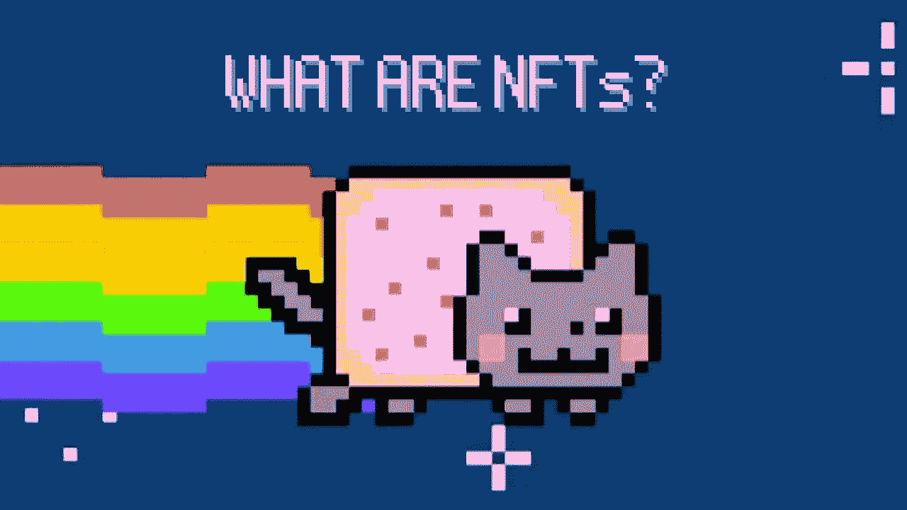

# 60 秒内解释不可替换令牌(NFT)

> 原文：<https://medium.com/coinmonks/the-60-second-download-nfts-82002547a572?source=collection_archive---------47----------------------->

不可替代的代币，或 NFT 是数字资产，可以创建、购买和出售，用于现实世界的货币。他们名字中“不可替代”的部分意味着他们实际上是 1 对 1。它们是独一无二的，拥有经过认证的所有权，是不可替代的。另一方面，可替代资产可以与同类资产互换。这里有一个例子来进一步说明这一点。假设我借给你 1 美元，请你明天还我。我不指望得到和我昨天给你的一美元一模一样的钞票。因为现金是可替代的，你可以给我任何旧的 1 美元，我会很高兴。NFT 就不是这样了！这使得他们成为在元宇宙做生意的一个非常有吸引力的选择。它们是独特的数字资产，具有商定的价值，其所有权是经过认证的。完美的未来数字世界，在那里现金交易是不可能的！

 [## 你准备好迎接加密经济了吗？加密派

### 每次你打开新闻，阅读报纸，或者浏览你的推特，你很可能会看到一些故事…

www.thecryptopie.com](https://www.thecryptopie.com/) 

> *加入 Coinmonks* [*电报频道*](https://t.me/coincodecap) *和* [*Youtube 频道*](https://www.youtube.com/c/coinmonks/videos) *了解加密交易和投资*

# 另外，阅读

*   [如何匿名购买比特币](https://coincodecap.com/buy-bitcoin-anonymously) | [比特币现金钱包](https://coincodecap.com/bitcoin-cash-wallets)
*   [币安 vs FTX](https://coincodecap.com/binance-vs-ftx) | [最佳(索尔)索拉纳钱包](https://coincodecap.com/solana-wallets)
*   [比诺莫评论](https://coincodecap.com/binomo-review) | [斯多葛派 vs 3Commas vs TradeSanta](https://coincodecap.com/stoic-vs-3commas-vs-tradesanta)
*   [Capital.com 评论](https://coincodecap.com/capital-com-review) | [香港的加密借贷平台](https://coincodecap.com/crypto-lending-hong-kong)
*   [如何在 Uniswap 上交换加密？](https://coincodecap.com/swap-crypto-on-uniswap) | [A-Ads 评论](https://coincodecap.com/a-ads-review)
*   [WazirX vs coin dcx vs Bitbns](/coinmonks/wazirx-vs-coindcx-vs-bitbns-149f4f19a2f1)|[BlockFi vs coin loan vs Nexo](/coinmonks/blockfi-vs-coinloan-vs-nexo-cb624635230d)
*   [本地比特币回顾](/coinmonks/localbitcoins-review-6cc001c6ed56) | [密码货币储蓄账户](https://coincodecap.com/cryptocurrency-savings-accounts)
*   [什么是融资融券](https://coincodecap.com/margin-trading) | [美元成本平均](https://coincodecap.com/dca)
*   [坚持卡审核](https://coincodecap.com/uphold-card-review) | [信任钱包 vs 元掩码](https://coincodecap.com/trust-wallet-vs-metamask)
*   [Exness Review](https://coincodecap.com/exness-review)|[moon xbt Vs Bitget Vs bing bon](https://coincodecap.com/bingbon-vs-bitget-vs-moonxbt)