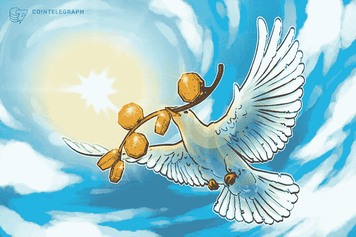

# 交易者的 7 + 1 真实美德。最佳加密货币互换策略

> 原文：<https://medium.com/coinmonks/the-7-1-true-virtues-of-a-trader-the-best-cryptocurrency-swap-strategy-51256899339b?source=collection_archive---------52----------------------->

## 就像生活中的所有事情一样，不是衣服造就了人，而是行为造就了人。有意识地自由行动，达到完美。问问你自己:你交易的目的是什么？你的目标是什么？您在找什么？

Photo by [Jukan Tateisi](https://unsplash.com/@tateisimikito?utm_source=medium&utm_medium=referral) on [Unsplash](https://unsplash.com?utm_source=medium&utm_medium=referral)

谷歌“交易策略”。你会在 0.87 秒内找到大约 21 亿个结果。阅读一千、一百或十个这样的链接，你肯定会得到一些几乎不切实际的想法。但是如果你真的想知道现有的最好的交易策略，你必须深呼吸，反思，并做一些严肃的自我检查。

就像生活中的所有事情一样*人不是靠衣服，而是靠行为。不断重复良好的日常生活成为一种美德；有害习惯的重复产生恶习。美德是人的一种习惯性倾向，是通过反复有意识地、自由地行动以达到完美或善而获得的。*

你拿什么做交易？你的目标是什么？你在找什么？如果答案是赚钱(很多钱！)，还清债务，给自己买辆兰博基尼，你就完蛋了。就算你赢了几百万，你也完蛋了！

**美德必须是习惯性的，而不是零星的、孤立的行为。在行动、思考、反应和感受方面，它就像是你的第二天性。拥有思想和性格的美德是行动和表现的关键。**

对你来说，我代表柏拉图、亚里斯多德、希波的奥古斯丁、托马斯·阿奎那和维基百科，你拥有投资时必须拥有的 7+1 关键美德，并致力于每天看到红色和绿色的蜡烛、网格和数字。

1节制:克制。自制、节制、谨慎和适度的实践。

[Terra off to new record high as LUNA price outperforms market with 30% rebound in 3 days](https://cointelegraph.com/news/terra-off-to-new-record-high-as-luna-price-outperforms-market-with-30-rebound-in-3-days) — MAR 09, 2022

2刚毅:勇气。忍耐、力量、耐力以及面对恐惧、不确定性和恐吓的能力。

What is Terra Luna? Why did it Crash 99.9%? — MAY 17, 2022

3 **谨慎**:在适当的时间，在给定的情况下，辨别采取适当行动的能力。

[Is Bitcoin a Ponzi Scheme?](https://blog.cex.io/education/is-bitcoin-a-ponzi-scheme-14934)

3正义:公平。自私和无私之间中庸之道；在拥有更多和拥有更少之间。

[Inequality in global societies: why does it matter?](https://sites.manchester.ac.uk/global-social-challenges/2019/06/07/inequality-in-global-societies-why-does-it-matter/)

4 信念是理解事物的光。

[Bull vs. bear crypto market: What’s the difference and how to handle both](https://cointelegraph.com/trading-for-beginners/bull-vs-bear-crypto-market-what-is-the-difference-and-how-to-handle-both)

5 一个人应该如何应对生活中的邪恶、问题和困难？有些人陷入沮丧，认为无事可做，一切都是无用的。还有人说，希望是幼稚和理想主义。有人说希望是自私的。

[Is the bull market coming to an end?](https://international-adviser.com/is-the-bull-market-coming-to-an-end/) — NOV 27, 2018

6 **慈善**:为上帝爱上帝，爱你的兄弟。

[Cryptocurrency can actually make a difference by helping people](https://cointelegraph.com/news/cryptocurrency-can-actually-make-a-difference-by-helping-people) — SEP 05, 2021

7 **谦逊**:朴实无华，孝顺良心，快乐安全感，谦逊无畏，肯定被爱。我们是腐殖土(我们行走的土地),所以请体谅我们，善待我们。它包括呆在自己的范围之内，不去尝试超越自己的东西。

“My tattoo will be a constant reminder that venture investing requires humility.” (Mike Novogratz)

美德是种子，必须用我们的努力、祈祷和牺牲来浇灌。

> 加入 Coinmonks [电报频道](https://t.me/coincodecap)和 [Youtube 频道](https://www.youtube.com/c/coinmonks/videos)了解加密交易和投资

# 另外，阅读

*   [分散交易所](https://coincodecap.com/what-are-decentralized-exchanges) | [比特 FIP](https://coincodecap.com/bitbns-fip) | [Pionex 评论](https://coincodecap.com/pionex-review-exchange-with-crypto-trading-bot)
*   [用信用卡购买密码的 10 个最佳地点](https://coincodecap.com/buy-crypto-with-credit-card)
*   [最好的卡达诺钱包](https://coincodecap.com/best-cardano-wallets) | [Bingbon 副本交易](https://coincodecap.com/bingbon-copy-trading)
*   [印度最佳 P2P 加密交易所](https://coincodecap.com/p2p-crypto-exchanges-in-india) | [柴犬钱包](https://coincodecap.com/baby-shiba-inu-wallets)
*   [8 大加密附属计划](https://coincodecap.com/crypto-affiliate-programs) | [eToro vs 比特币基地](https://coincodecap.com/etoro-vs-coinbase)
*   [最佳以太坊钱包](https://coincodecap.com/best-ethereum-wallets) | [电报上的加密货币机器人](https://coincodecap.com/telegram-crypto-bots)