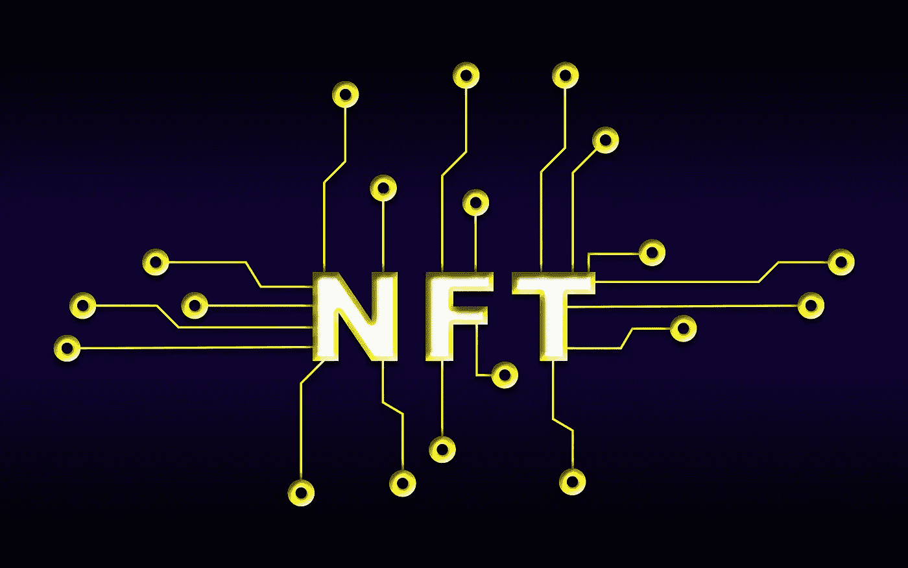
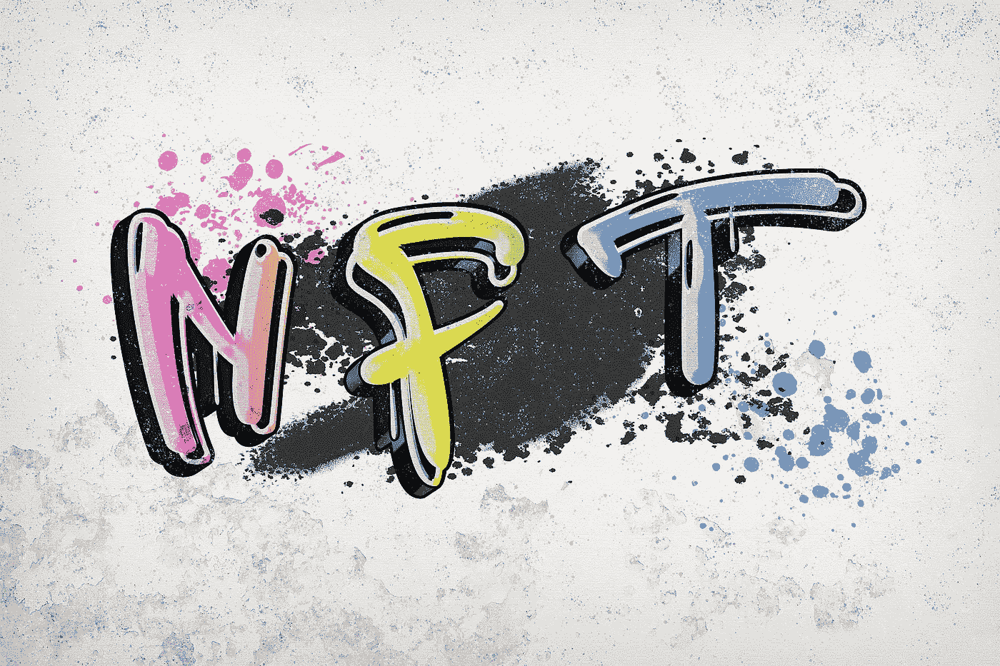

# 非功能性测试的基础知识及其工作原理

> 原文：<https://medium.com/coinmonks/the-abcs-of-nfts-and-how-they-work-45e3756eee33?source=collection_archive---------62----------------------->

Image by Pete Linforth on Pixabay

两周前，我在尼日利亚奥孙州伊费岛奥巴费米·阿沃洛沃大学解放厅举办的“Web3、NFTs 和元宇宙”网络研讨会上向一群好奇和好奇的人发表了演讲。

这是一种乐趣，解释什么似乎是空虚的概念，有一种对意义的强烈需求。我从这次网上研讨会中摘录了一些内容与大家分享，并解释了什么是 NFT。我尽可能保持简单。

**背景**

2014 年 5 月 3 日，数字艺术家凯文·麦考伊在名为区块链的硬币上创造了第一个已知的 NFT“量子”，这个词汇进入了全球科技页面。

毫无疑问，这些元素已经引起了世界的关注，成为一些人的主要投资元素和另一些人与专属社区联系的手段。

**什么是 NFT？**

打破集体有助于建立理解。

-令牌本质上是一种安全存储在区块链上的数字资产。代币通常被认为是加密货币，如比特币或以太代币。

-当某样东西不可替代时，或多或少意味着它是独一无二的，不能用别的东西替代。

Opensea.io 将不可替代令牌(NFT)定义为*‘唯一的、由区块链管理所有权的数字项目。例子包括收藏品、游戏物品、数字艺术品、活动门票、域名，甚至实物资产的所有权记录。*

**NFTs 的特点**

1.  数字上不同——没有两个 NFT 是相同的。
2.  坚不可摧——永久存在于区块链/分散网络中的永久数字资产。
3.  与资产相关且不可分割——不可复制或分割。
4.  数字财产通过独特的数字散列将所有权赋予一个人。

内容创作者通常利用 NFTs 来推广和销售他们的作品。这符合他们的目的，并为他们提供了进入全球市场的机会。销售发生在 NFT 市场，如 Opensea，Solsea 等。

**非功能性测试用例**

1.  数字内容
2.  游戏项目
3.  投资
4.  贷款抵押品
5.  连接和联网

可以是 NFT 的项目列表包括图像文件(如数字绘画和 gif)、3D 艺术文件、视频、音频剪辑、交易卡、模因、推文、虚拟房地产、时尚、活动门票(如会议、音乐会或节日)。

**到目前为止 NFTs 背后的统计数据**

1.  最有价值的 NFT 价值超过 9180 万美元。
2.  NFT 使用率最高的前五个国家都在亚洲。
3.  男性成为 NFT 收藏家的可能性是女性的三倍。
4.  2021 年，NFT 市场上花费了近 410 亿美元的密码。
5.  从 2021 年 Q2 到 2021 年第三季度，NFT 交易量增长了 704%。
6.  超过 70%的美国人不知道 NFT 是什么。
7.  一个 NFT 迷因卖了 400 万美元。
8.  美国 23%的千禧一代收集非功能性食物。
9.  2021 年，NFT 艺术品的销量单月就超过了 150 万件。

这可能会引起你的兴趣，让你深入了解非功能性测试的可能性。观看此视频，了解 DappRadar 的内容负责人兼主编 Robert Hoogendoorn 和 Robin Kristensen Gonzalez，讨论 NFTs 的影响以及 Youtube 上的其他相关话题:

> 加入 Coinmonks [电报频道](https://t.me/coincodecap)和 [Youtube 频道](https://www.youtube.com/c/coinmonks/videos)了解加密交易和投资

# 另外，阅读

*   [Bitget 回顾](https://coincodecap.com/bitget-review)|[Gemini vs block fi](https://coincodecap.com/gemini-vs-blockfi)cmd |[OKEx 期货交易](https://coincodecap.com/okex-futures-trading)
*   [AscendEx Staking](https://coincodecap.com/ascendex-staking)|[Bot Ocean Review](https://coincodecap.com/bot-ocean-review)|[最佳比特币钱包](https://coincodecap.com/bitcoin-wallets-india)
*   [霍比评论](https://coincodecap.com/huobi-review) | [OKEx 保证金交易](https://coincodecap.com/okex-margin-trading) | [期货交易](https://coincodecap.com/futures-trading)
*   [网格交易机器人](https://coincodecap.com/grid-trading) | [Cryptohopper 审查](/coinmonks/cryptohopper-review-a388ff5bae88) | [Bexplus 审查](https://coincodecap.com/bexplus-review)
*   [7 个最佳零费用加密交换平台](https://coincodecap.com/zero-fee-crypto-exchanges)