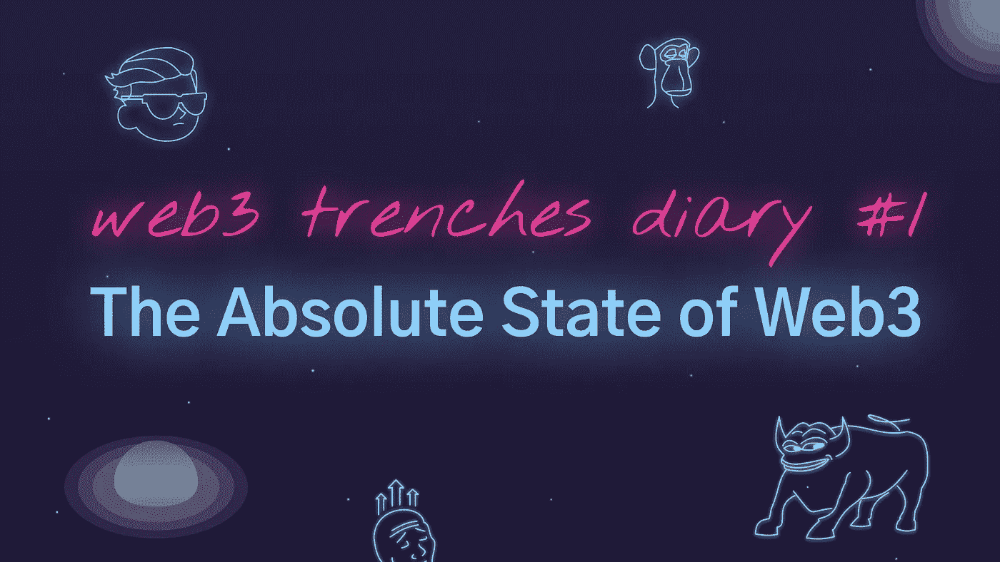

# web3 的绝对状态

> 原文：<https://medium.com/coinmonks/the-absolute-state-of-web3-c3f780e172b5?source=collection_archive---------63----------------------->

尽管令人眼花缭乱的资本涌入，天文数字的估值，每天都有几十个新项目产生。然而，web3 在很大程度上未能实现其理想。所有@莫邪的批评都是正确的。婴儿现实甚至更糟。我们在这里看到的是反对分权和审查的戏剧。由建立挑剔的、破坏隐私的 web2 的同一批人建立和资助。哦，但接下来会变得更糟。尽管人们一直在谈论无许可和开放。只有人脉广泛的风投才能进入种子轮。一旦零售商买进，你认为他们会怎么做？

明智的抵制审查。从现在开始。每个人都通过集中式 web2 服务器访问智能合同。他们可以，也经常审查和屏蔽用户。OpenSea 已经屏蔽了 NFT 和用户。真正开放的海洋是 web2 服务，它正好可以处理 NFTs。既然这样，就不要让我从 NFTs 开始。NFT 确实让郁金香看起来像是一种可靠的投资。我们用 MS Paint jpgs 交换了超过 500 万美元。我确信它们都将长期保持其价值，并且实际上是有用的。手放在你的心上，你真的能说得通吗？

当然，尽管如此，DeFi 是健全的，对不对。让我们看看我们有几百个 L1 和 L2。他们每个人都有几十个 AMM，农场和一些贷款协议，衍生品和桥梁等等。他们都有几亿 TLV。具有极其复杂的表征组学和相互依赖性。就其复杂性而言，只有导致 2008 年经济衰退的投机性金融产品才能与之匹敌。你真的认为一旦收益枯竭，真正的熊市来临，这些协议会发生什么？

哦，马上，但你还没有听到最糟糕的！就连我们用来访问 web3 的钱包也变得异常集中。Metamask 不小心误关了委内瑞拉。一个错误的集中配置文件，就是全部。当然，他们是故意关掉俄罗斯的。这是绝大多数的钱包，而不仅仅是 Metamask。现在，有人可以说:“你完全搞错了，笨蛋。你可以很容易地切换到不同的 RPC，也字体端是托管在 IPFS”。有百分之多少的实际用户知道 RPC 是什么或者如何访问 IPFS？

这场狗屎表演以 2 万亿美元的市值进行。如果我们不能在资金充足的情况下建造它，让它实现自己的理想。熊市我们要做什么？当为了生存而被迫妥协时。或者当保护者的锤子真的重重砸在密码上时。你能说出三个体现加密理念的 web3 项目吗？实际上是分散的，默认情况下是抵制审查的。归用户所有。没有以低得多的估值从风投那里筹集早期融资，这些风投不可避免地会抛售股票或进行零售。这是有意义的，不会不可避免地导致在某个时候图表下跌。给用户完全的自我监护权。考虑到区块链的实际情况，尽可能尊重用户隐私。奖励点，如果他们是开源与麻省理工学院的 GPL 许可证。不是修辞，发微博到@web3d3v 或者在这里留言评论。

同时在现实世界中。西氏正逐渐放弃其基本价值观。共产主义者，想再次成为共产主义者，挑战已建立的世界秩序。卡车司机们，请记住，这些是工人阶级家庭。他们很可能几乎没有存款，靠一张张薪水支票生活。仅仅因为抗议就不经正当程序冻结银行账户。当人们通过沃克硅谷平台向他们捐款时，该平台非常乐意不给他们钱。因为它不喜欢他们的政治。所有这一切都伴随着半个国家雷鸣般的掌声。如果换了另一只脚，另一半可能会鼓掌。法治和法律面前人人平等现在似乎已经过时了。除了言论自由和隐私权。一条不明智的推文可能会终结几十年的杰出职业生涯。当然，不仅仅是卡车司机，银行账户也被关闭了。当然是为了保护我们自己。邪恶的人对建筑物做邪恶的事情。让我们让三家通讯社监视我们所有的通信。邪恶的人攻击和平的国家，我们放弃了自由交易的权利。历史的弧线似乎已经转向压迫性的反乌托邦。如果你不同意，你只是暂时没有注意。

你知道吗？给我该死的地毯，泵' n '转储，风投和骗子，Defi 和 NFT。给我网络 3 的狂野西部。令人惊讶的是，在链条上完全没有许可的交易资产是可能的。Bitmex 创始人花了几年时间躲避联邦调查局。因为犯罪或者经营衍生品交易所。一个根本不用菲亚特。# ArchieDidNothingWrong。现在我们有几十个连锁衍生品平台。着陆和选择等等。我很肯定，在下一个周期到来之前，NFTs 将会有重要的用例。蓝筹股将会升值。这也不仅仅是金融投机，这种东西帮助了真正有困难的人。

我听说网络公司也是类似的狂热。疯狂的估值，没有意义的产品。二十多年后。Pets.com 是数百万美元的生意。我是移动革命的一部分。记得屁应用程序和哟应用程序和我是丰富的应用程序和估价和狂热。我知道。当然，手机已经接管了大部分的消费计算。我认为对任何关心 Normyverse 现状的人来说，对 web3 的需求是显而易见的。用户不是产品的服务，不会因为所有者或政客的一时兴起而禁止用户的服务。是的，web3 没有达到它的理想。但是他们是多么伟大的理想啊。唯一推动更多自由并取得一些成功的力量是 web3 / crypto。我们不能搞砸了。我们不会让它发生的。加入我们的旅程，尝试体现加密的理想，不可避免地达不到，很可能完全失败。至少这样做很认真，虽然胆子很大。

```
[https://www.sonsofcrypto.com](https://www.sonsofcrypto.com)
```



> 加入 Coinmonks [电报频道](https://t.me/coincodecap)和 [Youtube 频道](https://www.youtube.com/c/coinmonks/videos)了解加密交易和投资

# 另外，阅读

*   [CoinDCX 点评](/coinmonks/coindcx-review-8444db3621a2) | [加密保证金交易交易所](https://coincodecap.com/crypto-margin-trading-exchanges)
*   [红狗赌场评论](https://coincodecap.com/red-dog-casino-review) | [Swyftx 评论](https://coincodecap.com/swyftx-review) | [CoinGate 评论](https://coincodecap.com/coingate-review)
*   [Bookmap 评论](https://coincodecap.com/bookmap-review-2021-best-trading-software) | [美国 5 大最佳加密交易所](https://coincodecap.com/crypto-exchange-usa)
*   [如何在 FTX 交易所交易期货](https://coincodecap.com/ftx-futures-trading) | [OKEx vs 币安](https://coincodecap.com/okex-vs-binance)
*   [CoinLoan 审查](https://coincodecap.com/coinloan-review) | [YouHodler 审查](/coinmonks/youhodler-4-easy-ways-to-make-money-98969b9689f2) | [BlockFi 审查](https://coincodecap.com/blockfi-review)
*   XT.COM 评论 | [币安评论](https://coincodecap.com/xt-com-review)