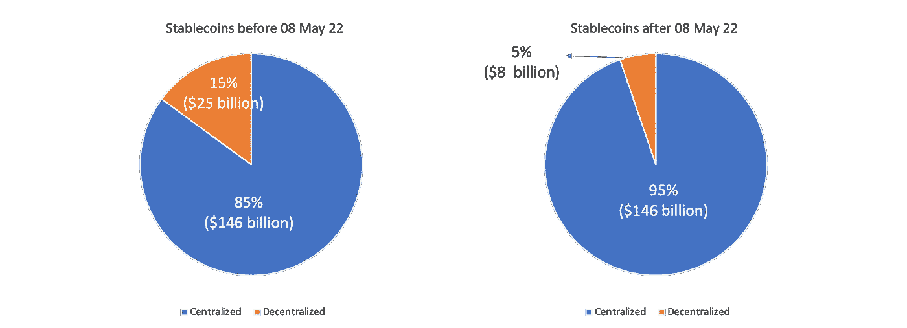

# UST 崩溃的余波

> 原文：<https://medium.com/coinmonks/the-aftermath-of-ust-collapse-fc72f2bfd254?source=collection_archive---------18----------------------->

这是令人麻木的三天。除了在卢纳/UST 损失了大量资本，我还震惊地读到了人们将毕生积蓄投入锚定(借贷协议)的故事。更糟糕的是，对 crypto/区块链几乎没有经验的人投资了 Anchor。

人们推断，20%的看似无风险的固定回报(请记住，稳定的货币)比储蓄账户的 0%要好得多。每个人都相信这个逻辑，包括 twitter 的影响者、密码专家等等(包括我自己)。不幸的是，一些人没有很好地管理他们的风险&把他们所有的积蓄都投入到协议中。

以下是对未来 6 个月的一些预测。

## **1。Defi 变得脆弱**

在 2007 年 5 月之前，15%的稳定资产是真正分散的(戴+ UST)。截至 5 月 12 日，stablecoins 持有价值的 5%被分散了。Stablecoin 生态系统更加集中化，这意味着每个 Defi 应用程序都比以往更加脆弱。

Stablecoin space is way too centralized now (95%)

戴是目前流通供应量 64 亿美元的分散式稳定卷烟的唯一一位火炬手。由于 DAI 的资本效率极低，因此很难扩展 DAI 以满足多个链中所有 Defi 应用程序的需求。

虽然每个 Dapp 协议都将自己标榜为“分散的”和“非托管人”，但事实上，该协议中 95 %的 stablecoin 抵押品可以由一个集中的实体(即大型对冲基金或政府/半政府机构，他们可以攻击或冻结这些 stable coin 的资产)控制，这使得整个 Defi 生态系统非常脆弱。

当基础抵押品被冻结或变为零时，Aave 或曲线或 dY/dX 会发生什么？整个生态系统可能会在自身重量下崩溃——这种想法本身就让它变得更加可怕。这就是为什么我们如此迫切地需要算法稳定币实验的成功。

> 作为投资者，我们必须更加重视稳定的货币冻结或崩溃的系统性风险——如果不看其在 USDC 或 USDT 的风险敞口，就无法评估贷款、流动性池和 APY 的 Defi 协议。

## 2.会有更多的秃鹰会刺向马厩

昨天，在几个小时里，我们目睹了对最大的稳定中心——USDT 的袭击。在一个短暂的时期内，USDT 完全与美元脱钩，直到它回到正常水平。事实上，即使在这一事件发生 24 小时后，USDT 仍然停留在 0.997，并没有完全保持其联系汇率。

De-peg of USDT (Source: CoinMarket Cap)

当我看到这个的时候，我以为 UST 的袭击者在追踪他们的下一个目标，USDT。由于集中和分散交易所的流动性水平较低，攻击稳定货币的策略似乎很简单。

假设你想攻击 USDT。您需要按照这个顺序大致执行以下步骤:

1.  从曲线池中抽走 USDT 的流动性
2.  在场外市场购买大量 USDT
3.  在所有集中交易市场大量出售从 1)和 2)中获得的 USDT
4.  等到市场陷入恐慌，Twitter 上的讨论占据上风
5.  坐下来享受踩踏事件

对于一个有着摧毁 Defi 生态系统的特定议程的大型机构参与者来说，这看起来更有可能。虽然我没有算过，但我不认为你需要超过 40-50 亿美元来发起一次攻击(根据 twitter 传言，这是攻击者用来摧毁 UST·特拉的金额)。

> 瓦解 Defi 最简单的攻击方式是攻击稳定的硬币。在目前的发展阶段，稳定的硬币攻击需要有针对性地攻击关键的流动性来源，以引发大规模恐慌和银行挤兑。

## 3.以太坊必须解决它的气体问题…而且要快…

尽管混乱不堪，但 UST 的破坏更多地局限于 Terra 生态系统(也许还有雪崩，程度较轻)——这要归功于锚协议的统治，它捕获了 170 亿美元的 TVL(根据 Defi Lama 的说法，占整个 Terra TVL 的 57%)。

另一方面，USDT 横跨所有链&拥有高达 800 亿美元的流通供应——对 USDT 的任何攻击都会摧毁整个 Defi/crypto 空间。

USDT issued across different chains (Source:Tether.to)

但愿不会，对 USDT 的攻击会促使人们恐慌地退出 Defi 协议。索拉纳很可能会下跌(根据其跟踪记录)，以太坊将遭受沉重的天然气费，杀死每个人的经济。根据过去的数据，AVAX 也将看到汽油费飙升，但会幸存下来。我不太了解其他连锁店，但可以有把握地猜测，没有人能处理这样的交易量。

随着人们看到 USDT 进一步与美元脱钩，开始时会像一条小溪，结束时会像一场海啸。这样的事件对整个 L1 生态系统的可信度来说可能是毁灭性的。以太坊和所有 Alt L1s 需要显著改善他们的网络来面对这样的不测。动作要快..

## 3.CBDC 的到来比我们想象的要快

珍妮特·耶伦(Janet Yellen)在 ust 与欧元脱钩之际谈论监管稳定的欧元，这是巧合吗？她做出反应的速度显然令人惊讶——已经有足够多的阴谋论表明大型对冲基金策划了 UST 袭击事件。

耶伦承诺在今年年底前对稳定货币进行监管——我相信击败稳定货币的最终武器将是央行数字货币(CBDC 的)。

CBDC 拥有其他稳定货币所没有的竞争优势——他们有政府的支持，政府可以运用其“证据”来实施联系汇率。他们可以简单地通过修改智能合同中的一行代码来生产无限量的 CBDC——不需要证明，不需要审计，不需要储备。

抑制稳定噪音的几种方法是:

1.  禁止在算法上反映美元的稳定硬币(不让更好的 Terra 版本出现)
2.  将在 CBDCs 中持有的部分或全部准备金。铸造稳定硬币的公司不接受其他抵押品(这在 Tether (USDT)和 Circle (USDC)上很容易执行)
3.  禁止所有稳定的股票进入交易所，除了持有 CBD 的股票。由于交易所是集中的，他们别无选择，只能遵循政府的规定。

在我看来，政府的第一场战斗将是击败和征服稳定的殖民地——他们知道，通过征服稳定的殖民地，他们将征服贫困。

> 如果 CBD 主导 stablecoin 市场，Defi 的“去中心化”部分实际上已经死亡&将仅仅作为一个“营销噱头”而结束。

我认为，各国政府将发动的最终战争将是比特币本身。因为他们知道他们不能马上攻击比特币，所以他们现在会去寻找更低的悬挂果实(stablecoin)。

为了 Defi，我希望像 Kwon 这样的企业家在未来取得成功。我们需要大胆的实验，我们需要勇敢的人去相信和执行这些实验。

> 加入 Coinmonks [电报频道](https://t.me/coincodecap)和 [Youtube 频道](https://www.youtube.com/c/coinmonks/videos)了解加密交易和投资

# 另外，阅读

*   [AscendEx 保证金交易](https://coincodecap.com/ascendex-margin-trading) | [Bitfinex 赌注](https://coincodecap.com/bitfinex-staking) | [bitFlyer 评论](https://coincodecap.com/bitflyer-review)
*   [Bitget 回顾](https://coincodecap.com/bitget-review)|[Gemini vs block fi](https://coincodecap.com/gemini-vs-blockfi)cmd |[OKEx 期货交易](https://coincodecap.com/okex-futures-trading)
*   [AscendEx Staking](https://coincodecap.com/ascendex-staking)|[Bot Ocean Review](https://coincodecap.com/bot-ocean-review)|[最佳比特币钱包](https://coincodecap.com/bitcoin-wallets-india)
*   [霍比评论](https://coincodecap.com/huobi-review) | [OKEx 保证金交易](https://coincodecap.com/okex-margin-trading) | [期货交易](https://coincodecap.com/futures-trading)
*   [电网交易机器人](https://coincodecap.com/grid-trading) | [Cryptohopper 审核](/coinmonks/cryptohopper-review-a388ff5bae88) | [Bexplus 审核](https://coincodecap.com/bexplus-review)
*   [7 个最佳零费用加密交易平台](https://coincodecap.com/zero-fee-crypto-exchanges)