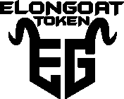
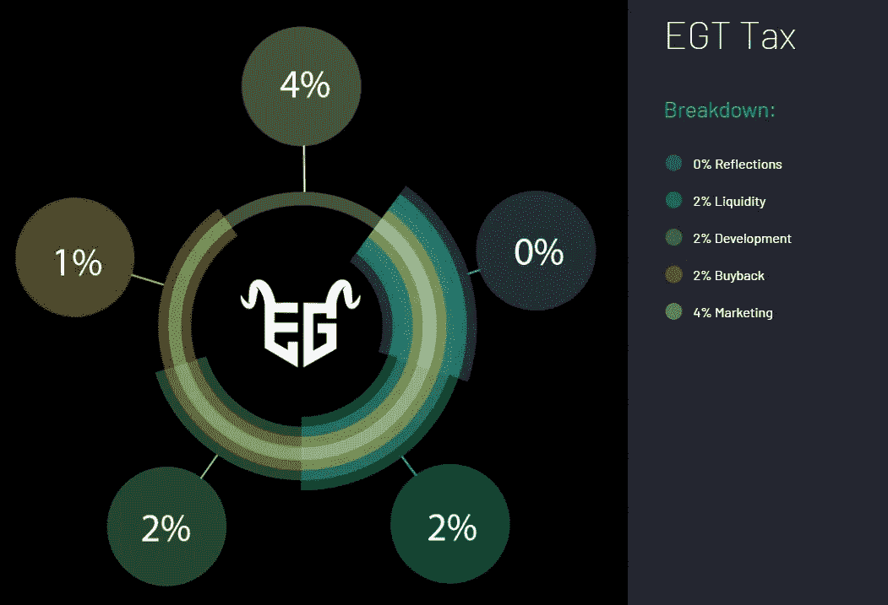
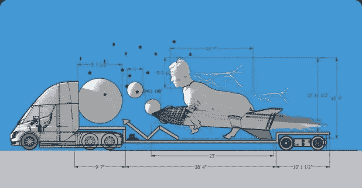
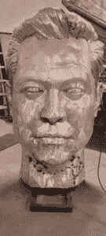
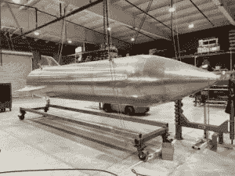

# 现在要购买的备用硬币！(BNB/瑞士联邦理工学院)

> 原文：<https://medium.com/coinmonks/the-alt-coin-to-buy-now-bnb-eth-71c829f307af?source=collection_archive---------32----------------------->

如今有这么多用途各异的备用硬币。很难决定持有什么，出售什么，以及完全避免什么。

今天我将讨论其中的一个，我真的相信它有巨大的潜力在某一天爆发。这纯粹是基于我自己的研究。这不是财务建议，永远做你自己的研究。

# 埃隆山羊代币— $EGT

埃隆山羊令牌是一个令人难以置信的独特项目。他们的目标——不好意思——是为独一无二的埃隆·马斯克(Elon Musk)建造一座巨大的现实纪念碑。纪念碑建成后，他们将在全国各地巡回展出，并参加各种活动，然后将其交付给 SpaceX 总部。该项目的主要目标是让埃隆·马斯克获得这座纪念碑，然后让他成为支持者，并在 Twitter 上发出他们一直梦想的“埃隆呐喊”。

对大多数人来说，这似乎是一个愚蠢的想法，然而，这不是一个笑话。他们实际上正在建造这个。他们不仅在建造它，而且在整个设计和建造过程中，他们也有一些真正的人才支持他们。 [Danny Wang](https://www.dannywang.com/) ，一家总部位于加州的设计公司，根据团队提供的想法设计了这座纪念碑。[凯文·斯通](http://www.metalanimation.com/)，一位来自不列颠哥伦比亚省的极具天赋的金属雕塑家，承担了建造这座纪念碑的任务。埃隆·马斯克本人已经是凯文·斯通作品的粉丝了。过去，他曾把自己在 Twitter 上的个人资料照片换成凯文的一个雕塑。这也是他们一开始就决定用凯文斯通的主要原因之一。

该团队一直在努力工作，在参加多个活动和会议的同时，带来了明星代言和高质量的宣传视频，以帮助推动他们的项目。他们不仅做了所有这些，而且还与一家制作公司签订了合同，开始为一部即将上映的纪录片拍摄他们的日常业务。

这个团队的结构是一流的。他们都很有经验，他们在加密领域有很大的背景，他们背后有资金支持来实现这个梦想。他们经常召开 AMA 会议、语音聊天和投资者会议，让每个人都了解最新情况。老实说，我已经有一段时间没有看到一个团队如此努力地工作，以确保他们的项目保持强劲，这非常令人耳目一新。

$EGT 的买卖税率也相当低，这从来不是一件坏事。这仅仅是 10%,而且大部分的资金都直接投入到项目中，而不是进入开发商的口袋。

Available at [https://e](https://twitter.com/elongoattoken)longoat.io

这个项目在启动前有巨大的宣传。他们进行了一次大规模的私人销售，以获得初始资金和营销。他们上市时的市值只有 90 万美元，但几分钟内就飙升至 3500 万美元以上。对于那些设法在发布前进入的人来说，几乎是 40 倍。没错，如果你在第二次投放 1000 美元，你可以在几秒钟内赚到 40，000 美元。在撰写本文时，目前的市值约为 350 万美元。这明显低于历史最高水平，但自最近的市场崩盘以来一直相当稳定。以我的专业观点，如果你正在寻找一个切入点，现在可能是一个很好的时机，也是你能得到的最低价格之一。

这是一个很有潜力的项目。车队已经证明了他们是认真的，他们必须努力推动这一切越过终点线。这会是下一件大事吗？我期待着跟进的进展和价格。查看他们的[网站](https://elongoat.io/)和[推特](https://twitter.com/elongoattoken)页面，也可以跟进。

Images were taken directly from [https://e](https://twitter.com/elongoattoken)longoat.io

感谢您花时间阅读本文。以上观点为本人观点，不有偿。这是原创内容，只有图片来源于埃隆山羊令牌网站。

作者:迪伦·斯科特

> 加入 Coinmonks [电报频道](https://t.me/coincodecap)和 [Youtube 频道](https://www.youtube.com/c/coinmonks/videos)了解加密交易和投资

# 另外，阅读

*   [币安期货交易](https://coincodecap.com/binance-futures-trading)|[3 commas vs Mudrex vs eToro](https://coincodecap.com/mudrex-3commas-etoro)
*   [如何购买 Monero](https://coincodecap.com/buy-monero) | [IDEX 评论](https://coincodecap.com/idex-review) | [BitKan 交易机器人](https://coincodecap.com/bitkan-trading-bot)
*   [尤霍德勒 vs 考尼洛 vs 霍德诺特](/coinmonks/youhodler-vs-coinloan-vs-hodlnaut-b1050acde55a) | [Cryptohopper vs 哈斯博特](https://coincodecap.com/cryptohopper-vs-haasbot)
*   [顶级付费加密货币和区块链课程](https://coincodecap.com/blockchain-courses)
*   [MXC 交易所评论](/coinmonks/mxc-exchange-review-3af0ec1cba8c) | [Pionex vs 币安](https://coincodecap.com/pionex-vs-binance) | [Pionex 套利机器人](https://coincodecap.com/pionex-arbitrage-bot)
*   [如何在印度购买比特币？](/coinmonks/buy-bitcoin-in-india-feb50ddfef94) | [WazirX 评论](/coinmonks/wazirx-review-5c811b074f5b)