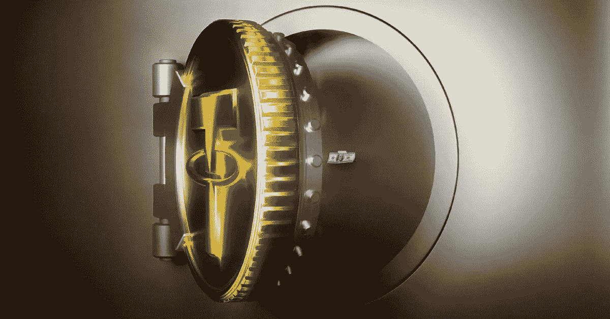

# 系绳的神奇历史(USDT)

> 原文：<https://medium.com/coinmonks/the-amazing-history-of-tether-usdt-77ad35a31b7b?source=collection_archive---------6----------------------->

## 了解最大和最古老的稳定货币美元的财务实力。

Image Credit: The Verge

# 为什么需要稳定的硬币，它们是如何工作的？

如果你打算将一部分资本转换成加密货币，首要选择可能是购买最大和最有名的硬币，像比特币或以太坊…