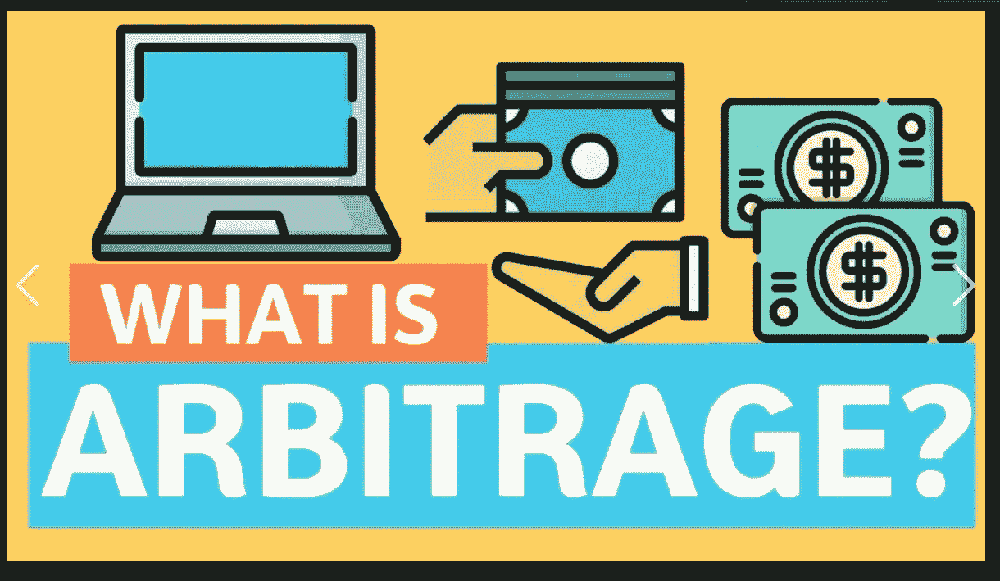
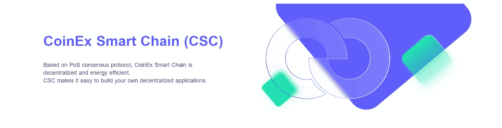

# 套利方式

> 原文：<https://medium.com/coinmonks/the-arbitrage-way-cfbf5a3ddbac?source=collection_archive---------23----------------------->

因此，由于高需求，我被要求更深入地了解套利交易及其实现方式。我最近的博客谈到了套利交易，在这里我将尽力用最简单的方式来表达。

*让我们记下主要特征。*

*   **套利**——交易者可以通过寻找多个不同交易所的**价格差异**来赚钱。
*   **交易机器人** — **交易** **机器人**是可以在几秒钟内完成**数千次复杂计算**的交易算法，使其能够做出交易决策。
*   **闪贷** — **闪贷**的工作原理是你借钱，在同一笔交易内还。你获得了一笔即时贷款，并在偿还贷款后立即执行了一笔“成功的交易”,剩下的差价归你所有，这就是你的利润。
*   CSC — **CSC** 为开发者提供了一个**高效、低成本的链上环境，他们可以在其中运行智能合同和 dapp**并存储数字资产
*   智能合同——智能合同是两个人之间以计算机代码形式达成的协议。
*   **CCE** —加密货币交易所是一个**分散的交易平台，在这里你可以交易“购买和出售加密货币”**一个很好的例子是 [CoinE](https://www.coinex.com/) x

# **套利交易**

套利交易是在不同市场或以衍生形式同时买卖证券、货币，以便利用同一资产的不同价格。**套利交易是利用价格差异在不同的分散的 CCE 之间交易特定的货币。让我们一步一步地分解。**

*   *通过套利交易提取的闪贷*
*   通过多个步骤逐步完成智能合约(作为开发人员，您可以创建自己的自定义智能合约来启动这些步骤)
*   调用交易 Bot 功能闪贷
*   从(aave 协议)获得 15 万美元的 USDT 贷款
*   在 uniswap 上用 500 万以太网换取 15 万美元(现在您有以太网了)
*   在 uniswap 上用 151，000 美元兑换 5 毫升乙醚(现在您有了 USDC)
*   从 aaveprotocol 提取 151，000 美元
*   禁用 USDC 作为 aaveprotocol 的抵押品
*   启用 USDC 作为 aaveprotocol 的抵押品
*   向 aaveprotocol 偿还 150，000 美元

注意:这是一个使用快速贷款执行套利交易的简单示例，它是在使用 ether 的 ave 贷款池中完成的，价格是估计值，而不是实际价格。

> 交易新手？试试[加密交易机器人](/coinmonks/crypto-trading-bot-c2ffce8acb2a)或者[复制交易](/coinmonks/top-10-crypto-copy-trading-platforms-for-beginners-d0c37c7d698c)

**代币**

*   USDT:系绳，USDT 是一个试图与美元挂钩的象征。理想情况下，这意味着 1 USDT 在交易所的交易价值正好是 1.00 美元。
*   USDC:美元硬币(USDC)是一种与美元挂钩的数字稳定硬币
*   以太:以太是建立在开源以太坊区块链之上的加密货币。
*   CET:作为 CoinEx 智能链的内置令牌进行流通，充当允许智能合约运行的气体。

基本上发生的是两个稳定的硬币之间的**价格差异，它们都与美元挂钩，但有时它们的挂钩浮动，导致轻微的差异，这带来了套利机会。这可以通过你在任何货币交易所选择的任何稳定货币来实现。各种各样的区块链提供快速贷款，你只需要**找到合适的生态系统，今天就加入 CSC，你可能会找到你的下一个机会。****

决定你的套利交易努力是否成功的关键指标是机器人支持的交易所的数量。理想情况下，你会希望尽可能多的交易所支持这个机器人。这将最终增加你从一个或多个交易平台之间的潜在价格差异中获利的机会。

# **交易机器人**

最基本的形式是，交易机器人是一个代表你在加密货币市场交易的软件。机器人是交易算法，可以在几秒钟内完成数千次复杂的计算，使他们能够做出交易决定。更像智能合约，用 solidity 编写的程序代码，编码到另一个智能合约中，只执行成功的交易。

为什么要交易机器人？

*   首先，它们是经验丰富的交易员的理想选择，这些交易员希望在比特币交易领域运用自己的个人策略，而不需要连续几个小时坐在自己的设备前。相反，机器人不仅可以自主反映交易者的观点，还可以在多个交易所全天候这样做。
*   其次，自动化机器人也是新手交易员的理想选择。我们的意思是，没有经验的投资者现在有机会从第三方公司获得一个机器人，有一整套自动化的预构建交易策略可供选择。

*交易机器人策略*

*   **市价和限价单**

显而易见的起点是执行古老的市场和限价单的能力。这是你指示你的机器人在比特币达到一定价格时买入或卖出比特币的地方。尽管绝大多数第三方加密货币交易所(如果不是全部的话)都提供市价和限价单，但重要的是要记住，当满足某些条件时，机器人可以为你做到这一点。

*   **空头 vs 多头**

比特币交易机器人不仅在市场上涨时有用。相反，他们也有能力在市场下跌时执行订单。如果机器人被正确编程，那么它应该能够区分牛市和熊市，这意味着当关键运动发生时，它可以执行明智的交易。

*   **跟踪止损**

追踪止损是比特币交易机器人可以实现的最强大的功能之一。对于那些不知道的人来说，当市场对你有利时，这是你保护你的收益的机会，但同时，保持一定比例的订单开放，以确保不会错过进一步的收益。

*   **套利**

由于我们已经讨论了自动化比特币机器人背景下的套利交易的来龙去脉，我们不会进一步展开。

*   **整刮**

由于比特币的波动性明显低于过去，加密货币经常会发现自己处于巩固期。盘整期实际上提供了许多获利的机会。事实上，通过利用比特币交易机器人，这些机会被进一步放大。通常情况下，你需要在你的设备前坐很长时间，才能从咨询期获得一点点收益。

# **闪贷**

区块链支持复杂的加密货币交易，闪贷就是一个很好的例子。**快速贷款使用智能合约，这是一种由区块链提供的工具，除非符合某些规则，否则不会让资金易手。在闪付贷款的情况下，规则是借款人必须在交易结束前偿还贷款，否则智能合同会逆转交易——所以就像贷款一开始就没有发生一样。**

快速贷款和套利交易是齐头并进的，因为它也是让它更好的原因，你可以选择不把自己的钱押在股份上，拿出一笔快速贷款，拿出快速贷款的代码基本上写在你调用执行交易的智能合同中，所有要遵循的步骤都将写在智能合同中，但只有当你的智能合同中的所有条件都检查，证明是正确的和成功的，交易才会成功。

快速贷款是安全和可靠的，因为它只是遵循一个条件，即只要你能在同一笔交易中偿还，就没有损失资金的风险。它们最初只是一个工具，只供那些精通技术、会使用命令行的人使用，命令行是开发人员向计算机发送文本命令的一种方法。但是现在更多的用户友好界面也正在出现。

*   无担保贷款:贷款人通常要求借款人提供抵押品，以确保如果借款人无法偿还贷款，贷款人仍然能够收回他们的钱。但在无担保贷款中，不需要抵押品。这种抵押品的缺乏并不意味着快速贷款放款人不会拿回自己的钱。它只是以不同的方式被送回。借款人需要立即还钱，而不是提供抵押品，这就引出了我们的下一点。
*   **瞬间**:通常，获得和履行贷款是一个漫长的过程。如果借款人获得贷款批准，他或她通常必须在几个月或几年的时间内稳定地偿还贷款。然而，快速贷款是即时的。贷款的智能合同必须在借出的同一交易中履行。这意味着借款人必须调用其他智能合约，在交易结束前(通常是几秒钟)用借出的资金进行即时交易。

快速贷款可以通过各种方式申请，如 DeFi 和潜在的交易机器人，前提是你已经彻底研究了你打算借款的协议和将借入的资金发送到的协议。有些人已经使用这些类型的贷款来赚钱非常快。

# CoinEx 智能链

CSC 是一个公共链，具有高性能和低费用的特点。CSC 构建高效去中心化的金融生态系统，CoinEx 智能链(CSC)兼容 EVM(以太坊虚拟机)。CSC 对开发者来说是一个高效的公有链环境，从高吞吐量到超低费用，轻松编写和执行您的智能合约，公有链帮助开发者快速开发和迁移 DApps。

[**CSC 为开发人员提供了一个高效、低成本的链上环境，他们可以在其中运行智能合同和 DApps，并存储数字资产**](https://www.coinex.org/?lang=en_US)

另外:

*   **出色的性能**

说到公链的性能，最常用的指标是 TPS，一个公链每秒可以处理的事务数。简单来说，TPS 就像吞吐量。TPS 越高，公共链的性能越好。CSC 的 TPS 高达 1，000。为了理解这意味着什么，我们可以将 CSC 的 TPS 与以太坊和 BSC 的 TPS 进行比较。

**TPS**

*   以太坊:15
*   CSC: 1，000

很明显，CSC 的 TPS 远高于以太坊和 BSC。这意味着公链一秒钟可以处理更多的交易，承载更多的 DApps。换句话说，CSC 可以同时运行更多的 DApps。

*   **高度分权**

去中心化也是评估公共链的一个主要指标。如果一个链没有足够的分散化，那么它就不能完全为你提供分散化生态系统的所有优势。分散化是套利和快速贷款的动力，它们无法在集中的生态系统中运作。另一方面，你需要一个分散的智能链来在 CSC 上运行你的智能合同，具有高度的分散性。

*   **重视生态建设:CSC 数百万美元支持计划**

CSC 非常重视生态系统建设。公链还为元宇宙生态设立了数百万美元的扶持计划和 500 万美元的专项资金支持。除了为其生态系统中的优秀项目提供资金支持，CSC 还为项目团队提供技术支持和营销资源。有了这个，你就可以因为开发这个不可阻挡的交易机器人而获得报酬和支持。

# **智能合约**

**智能合同**是一种计算机程序或交易协议，旨在根据合同或协议的条款自动执行、控制或记录法律上相关的事件和行为。

智能合同是两个人以计算机代码的形式达成的**协议。它们在区块链上运行，因此存储在公共数据库中，不能更改。智能合约中发生的交易由区块链处理，这意味着它们可以在没有第三方的情况下自动发送。知道如何编写成功的智能合约是成为一名优秀的区块链开发人员的关键点之一。**

使用一个能够让你编写自己的智能合约的生态系统也是非常必要的。 **CoinEx Smart Chain 提供了一个高效的链上环境，可根据需要编写和实施智能合同，并且由于 TPS 较高而具有出色的性能。**

# 分散加密货币交易所

**加密货币交易所**，是一种允许客户将加密货币或数字货币交易为其他资产的业务，如传统的法定货币或其他数字货币。

什么是**分散** **加密货币** **交易所**？DEx 或**分散式** **加密货币** **交易所**类似于集中式交易所，只是它没有你可以依赖的第三方。该交易所的所有资金仍存放在区块链上。

当你把你的智能合约插入尽可能多的指数时，你会有更多的套利机会。

显然，从我们提到的所有内容来看，对区块链发展有一个现有的了解是很重要的，以充分享受所有这些可能性，当时有一些现有的 DApps 已经内置了交易机器人，但当你完全控制时，你的梦想是没有限制的，今天就加入 CSC，探索区块链提供的无限可能。

> 加入 Coinmonks [电报频道](https://t.me/coincodecap)和 [Youtube 频道](https://www.youtube.com/c/coinmonks/videos)了解加密交易和投资

# 另外，阅读

*   [如何在 FTX 交易所交易期货](https://coincodecap.com/ftx-futures-trading)
*   [OKEx vs KuCoin](https://coincodecap.com/okex-kucoin) | [摄氏替代品](https://coincodecap.com/celsius-alternatives) | [如何购买 VeChain](https://coincodecap.com/buy-vechain)
*   [ProfitFarmers 回顾](https://coincodecap.com/profitfarmers-review) | [如何使用 Cornix Trading Bot](https://coincodecap.com/cornix-trading-bot)
*   [如何匿名购买比特币](https://coincodecap.com/buy-bitcoin-anonymously) | [比特币现金钱包](https://coincodecap.com/bitcoin-cash-wallets)
*   [瓦济里克斯 NFT 评论](https://coincodecap.com/wazirx-nft-review)|[Bitsgap vs Pionex](https://coincodecap.com/bitsgap-vs-pionex)|[丹吉尔评论](https://coincodecap.com/tangem-wallet-review)
*   [如何使用 Solidity 在以太坊上创建 DApp？](https://coincodecap.com/create-a-dapp-on-ethereum-using-solidity)