# 拱门。宇宙中的智能合约

> 原文：<https://medium.com/coinmonks/the-archway-smart-contracts-in-cosmos-864800574aa4?source=collection_archive---------16----------------------->

朋友们，你们好！今天，正如我所承诺的，我将告诉你我所能挖掘到的关于**【的一切——区块链行业的新创公司:带奖励系统的智能合同开发平台。是的，我过去常常在星期一发表文章，但是谁在乎呢。))**

*在这里你可以找到关于 Archway 的官方数据、我自己的想法以及我在网上找到的关于这个项目的一切。老实说，不像我预期的那么多，但足以有一些观点。祝你阅读愉快。*

*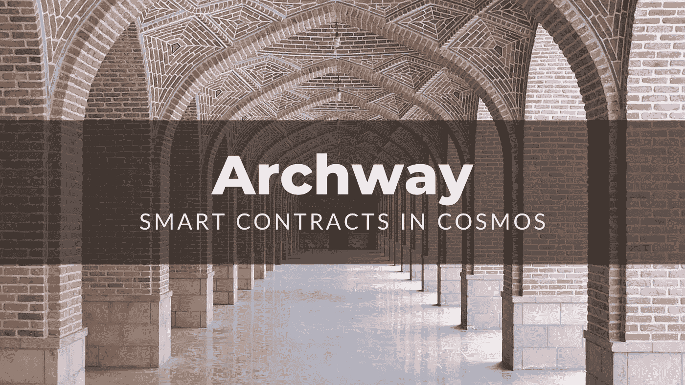*

*哦，那是一项艰巨的任务——写出更多有趣的细节，然后可以在官方资料中找到。但这是我喜欢做的事情。我叫瓦尔，来自乌克兰，你正在阅读我关于区块链、加密、创业和基本面的博客。即使你对这个话题一无所知，我也尽量让你容易理解。关注，评论，给一些反馈，请和有一个有用的时间阅读。*

*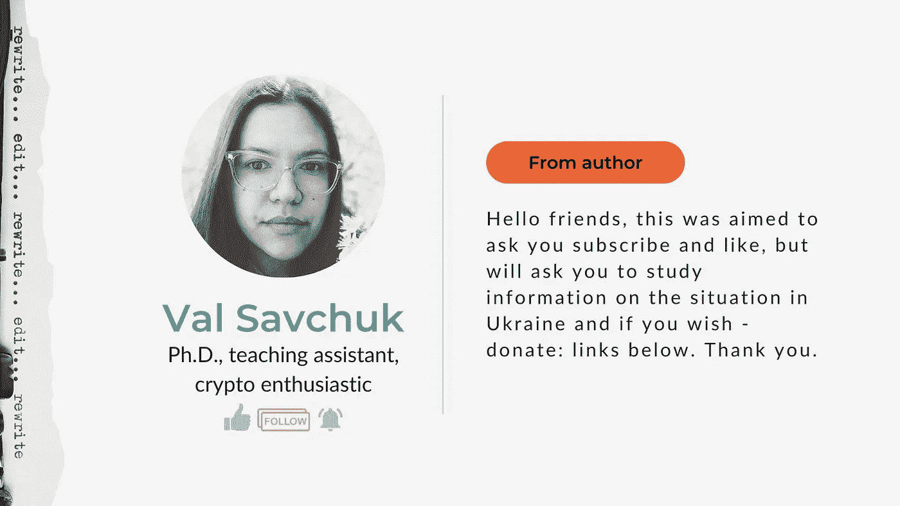*

*[Youtube](https://www.youtube.com/channel/UCqURQDAdxh24gfXM8BAe-eQ)[Twitter](https://twitter.com/Val_Savchuk)[LinkedIn](https://www.linkedin.com/in/valeriya-savchuk-yegorova-248154109/)[Medium](/@ValSavchuk)*

# *介绍*

*智能合约是新金融体系——分散金融(DeFi)中最重要的工具之一。*

*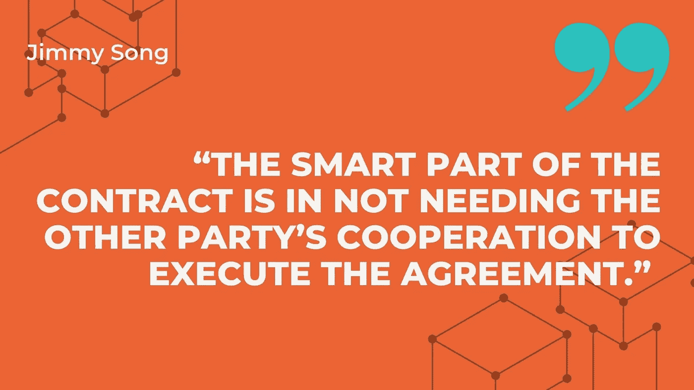*

*智能合同实际上是代码，但它是一份合同——一份协议。它是“聪明的”，因为它不能被欺骗，但不需要第三方。*

*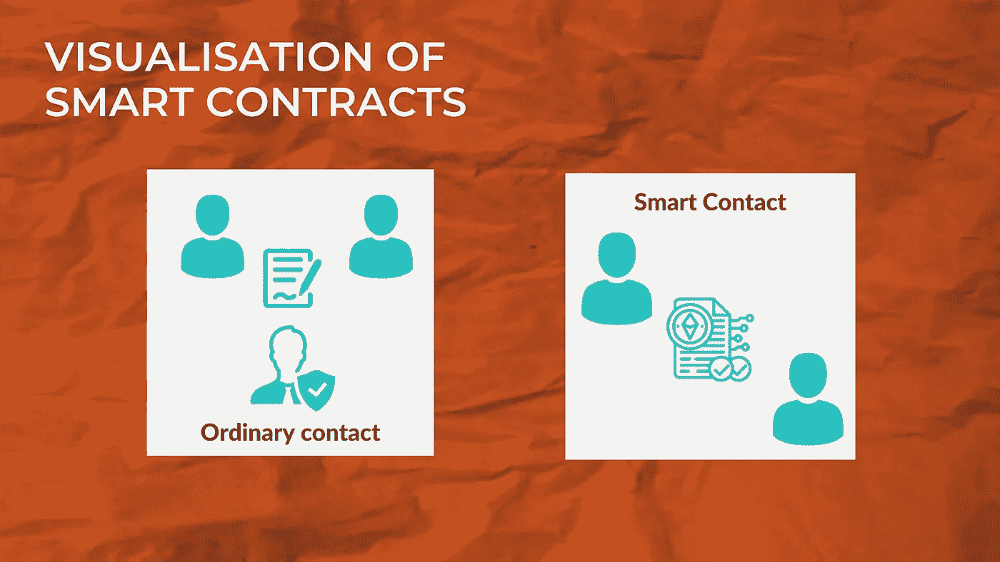*

*因此，既然它是一个代码，就必须有人在合适的平台上构建它。这里是有关[牌楼](https://www.archway.io/)的地方。*

# *主要项目目标*

*该项目的主要目标是奖励开发者，并允许构建下一代的 dApps 和智能合约。*

*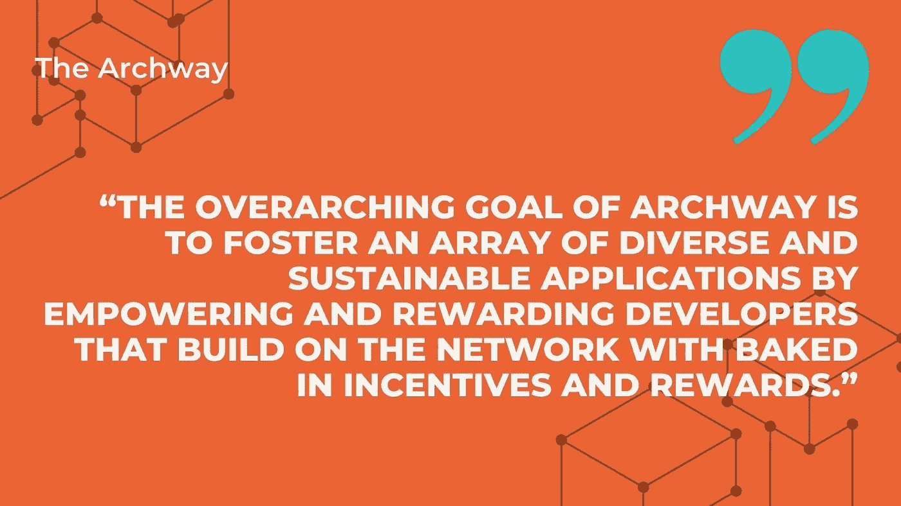*

*如果你不熟悉我的博客，我要提醒你，我之前已经提到过 Archway:[智能合约:利弊、问题、工具。拱门。|作者瓦尔·萨夫丘克| 2022 年 4 月|中型](/@ValSavchuk/smart-contracts-pros-and-cons-issues-tools-archway-3523d14f747e)。在这里，我强调智能合同开发者选择 Archway 的原因以及智能合同本身。*

*正如我在上面的文章中已经提到的，从我的角度来看，开发人员的支持将会给智能合同开发带来很多新人，他们很可能会长期支持 Archway。拱门的目标使它成为一个美味的作品。*

# *特性和功能*

*现在让我们仔细看看拱门的特点，这将使它成为市场上的一个重要发展。*

*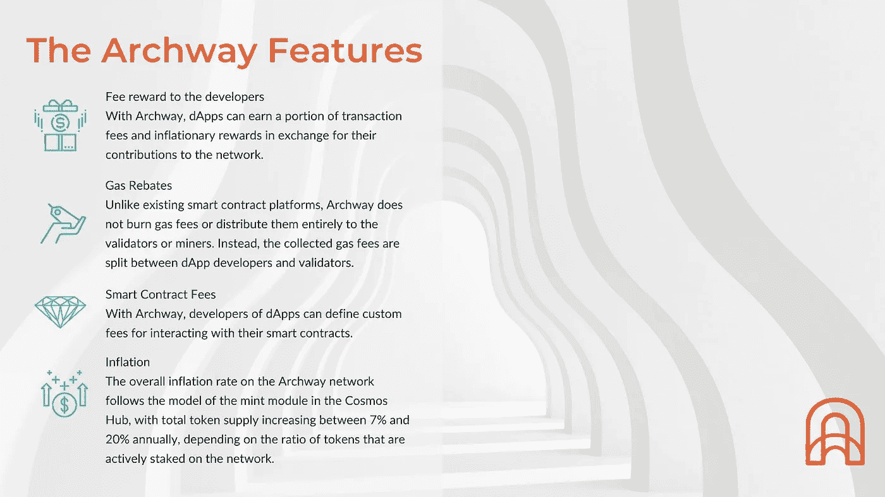*

*第一个关于开发者奖励。它们将来自交易费用和通货膨胀本身。dApp 越强大越受欢迎——开发者从中获得的好处就越多。这就引出了第二个:开发商和验货员之间的煤气费分配。*

*第三种，但同样重要，被称为“智能合约费”。Archway 将支持智能合同用户的自定义费用。开发人员将根据需要定义它们。*

*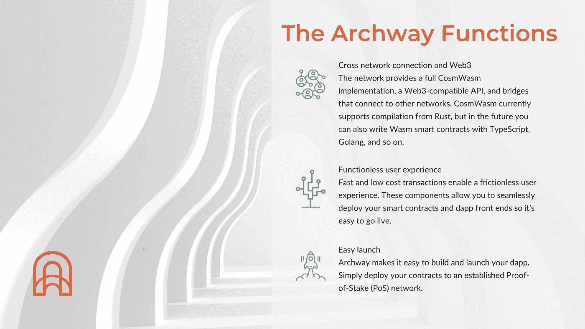*

*从上图可以看出，项目的功能集中在开发人员对智能合约开发和使用的舒适度上。似乎项目中的一切都是关于开发者的。*

# *宇宙*

*我可以在特征之间描述它，但决定告诉更多关于[宇宙](https://cosmos.network/)的事情。*

*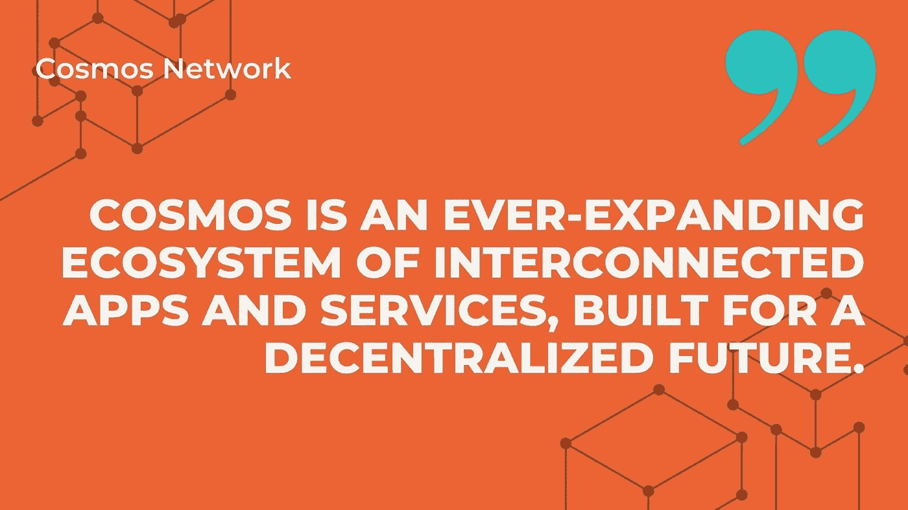*

*Cosmos Network 由 264 个以上的应用程序和服务以及 1390 亿美元以上的数字资产组成。[(来源)](https://cosmos.network/)*

*为什么是宇宙？拱门是生态系统的一部分。*

*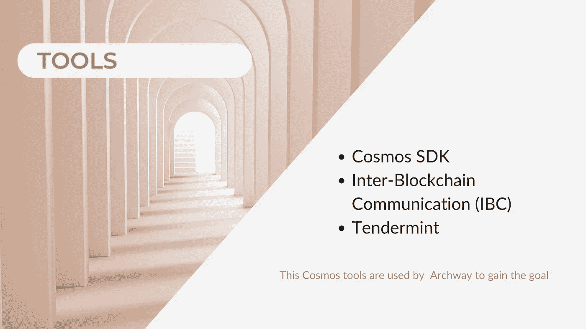*

*为了构建宇宙链，使用了[宇宙 SDK](https://v1.cosmos.network/sdk) 。据说这是区块链发展最受欢迎的框架(来源:官方网站)。*

*下一个工具是 IBC(区块链间通信)——它是链之间进行交易、交换令牌等的桥梁。*

*Tendermint 是一个工具，它确保应用程序在区块链上正确分发，并在其他节点上复制它([trons can CLASS-Node](https://tronscan-org.medium.com/tronscan-class-node-7b7f72a32a81)@ trons can-org)*

# *谁在后面*

*Archway 的主要贡献者是正在构建各种区块链工具的@Phi-Labs，现在 Archway 就是其中之一。*

*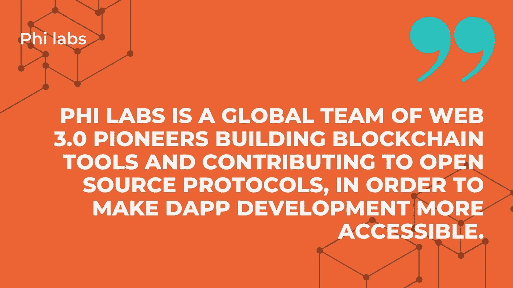*

*Phi 实验室的创始人是[格里芬·安德森](https://medium.com/u/57a2b14e69fb?source=post_page-----864800574aa4--------------------------------)。他也是我上面提到的 Tendermint 协议的幕后黑手。他是这个产品的负责人。此外，他专门研究宇宙，以太坊，DeFi，NFTs 技术。*

*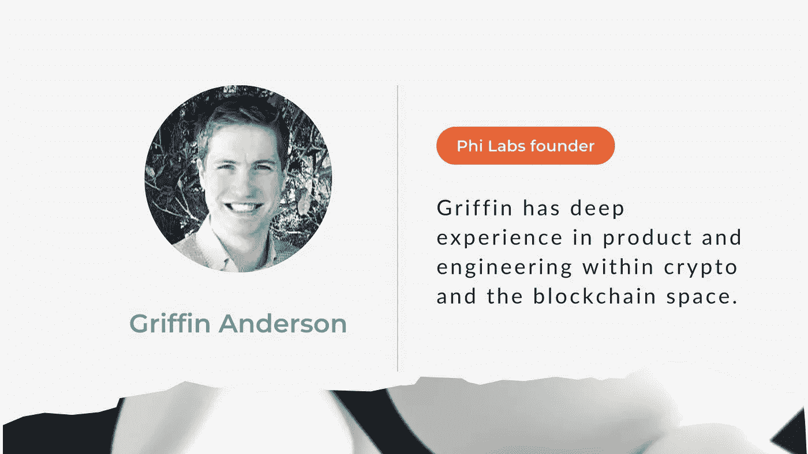*

*[Griffin Anderson — Chief Executive Officer — Phi Labs | LinkedIn](https://www.linkedin.com/in/griffin-anderson-20500724/)*

# *基金*

*2100 万美元——这是为 Archway 的发展筹集的资金。这笔钱是由 Phi labs 在由加密投资公司 CoinFund 和 Hashed 共同领导的种子资金轮中筹集的*

*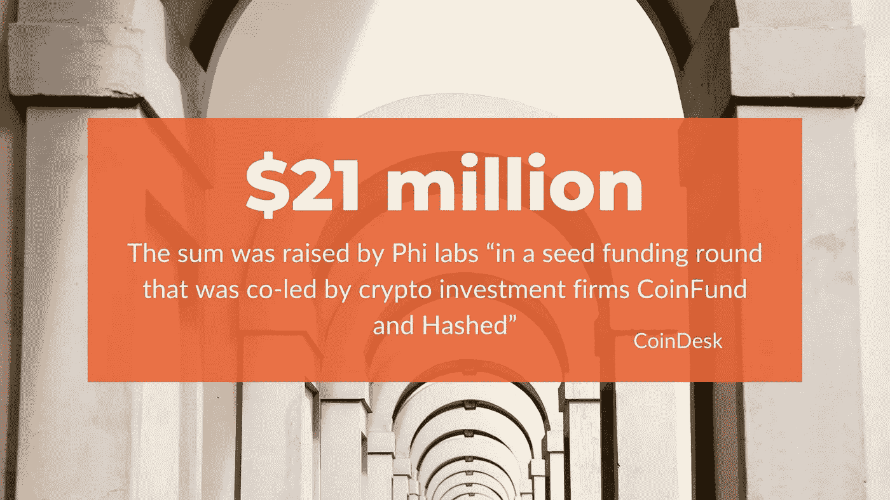*

# *结论*

*宇宙已经是一个强大的生态系统。正如我提到的，它已经有超过 250 个应用和服务。阿奇威就是其中之一。*

*深入研究这个项目后，我还没有改变主意。Archway 是关于新发展伦理的。它从一个非常聪明的方面照顾了开发者，他们的需求和它自己的利益！这是一个双赢的局面。*

*但是在现实中如何实施还有很多问题。我有合理的怀疑吗？不尽然:Phi Labs 是值得信赖的公司，就像现在看起来的那样；2100 万美元的资金；好主意。另一方面，区块链的商业是残酷的，不是每个人都兴奋，更不是每个人都兴奋——时间会证明的。现在，我更有可能对阿奇威的未来感觉良好。*

# *资源*

*   *[牌楼](https://www.archway.io/)*
*   *[牌坊|推特](https://twitter.com/archwayHQ?ref_src=twsrc%5Egoogle%7Ctwcamp%5Eserp%7Ctwgr%5Eauthor)*
*   *[宣纸|牌楼](https://www.archway.io/lightpaper.pdf)*
*   *[宇宙万物|推特](https://twitter.com/Cosmos_Tic)*
*   *[Phi Labs Global | LinkedIn](https://www.linkedin.com/company/phi-labs-global/about/)*
*   *[拱门上的 Dapp 奖励:新的可能性和使用案例|](https://blog.archway.io/dapp-rewards-on-archway-e8dcc888aed9) [迈克尔·库里南](https://medium.com/u/6ef849ce6eea?source=post_page-----864800574aa4--------------------------------)*
*   *[IBC 更新——区块链的互联网发展迅速](https://blog.cosmos.network/ibc-update-the-internet-of-blockchains-is-growing-fast-dae883228ebf?_branch_match_id=1030432737536598833&_branch_referrer=H4sIAAAAAAAAA8soKSkottLXz8nMy9bLTU3JLM3VS87P1S8P83B1j4pMdS1IAgBHARfMIwAAAA%3D%3D&gi=d2f2db7b0c22) | @christinacosmos | [宇宙网](https://medium.com/u/e8cb21d22b0b?source=post_page-----864800574aa4--------------------------------)*
*   *[Cosmos Protocol Archway 筹集 2100 万美元提供开发者奖励](https://www.coindesk.com/business/2022/03/24/cosmos-protocol-archway-raises-21m-to-provide-developer-rewards/) | [CoinDesk](https://medium.com/u/f2fa6f2d51a6?source=post_page-----864800574aa4--------------------------------)*
*   *[牌坊:第一眼](https://www.figment.io/resources/archway-first-look)|萨阿德阿西夫|虚构*
*   *[ARCHWAY ⛩:智能合约在 COSMOS 上的演变](https://youtu.be/T-DrmcgPM0M) | [DEFI TIMES — Cosmos，ATOM & IBC](https://www.youtube.com/channel/UC1OQVVbpl4tc5ri0bEYEzRQ) | Youtube*
*   *[格里芬·安德森——首席执行官——Phi 实验室| LinkedIn](https://www.linkedin.com/in/griffin-anderson-20500724/)*
*   *[Phi 实验室](https://www.philabs.xyz/)*

> *加入 Coinmonks [电报频道](https://t.me/coincodecap)和 [Youtube 频道](https://www.youtube.com/c/coinmonks/videos)了解加密交易和投资*

# *另外，阅读*

*   *[布洛克菲 vs 比特币基地](https://coincodecap.com/blockfi-vs-coinbase) | [比特坎评论](https://coincodecap.com/bitkan-review) | [币安评论](/coinmonks/binance-review-ee10d3bf3b6e)*
*   *[Coldcard 评论](https://coincodecap.com/coldcard-review) | [BOXtradEX 评论](https://coincodecap.com/boxtradex-review)|[uni swap 指南](https://coincodecap.com/uniswap)*
*   *[阿联酋 5 大最佳加密交易所](https://coincodecap.com/best-crypto-exchanges-in-uae) | [SimpleSwap 评论](https://coincodecap.com/simpleswap-review)*
*   *[最佳加密分析或链上数据](https://coincodecap.com/blockchain-analytics) | [Bexplus 评论](https://coincodecap.com/bexplus-review)*
*   *[NFT 十大市场造币集锦](https://coincodecap.com/nft-marketplaces)*