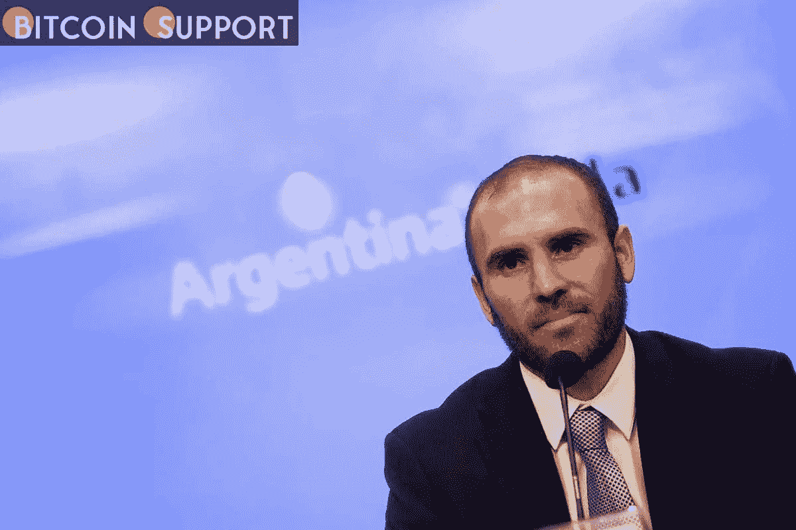

# 阿根廷财政部长希望对加密征收更多的税

> 原文：<https://medium.com/coinmonks/the-argentinian-finance-minister-wants-more-taxes-on-crypto-fe2c2561073a?source=collection_archive---------67----------------------->

[https://bitcoinsupports.com/](https://bitcoinsupports.com/)

阿根廷政府希望修改该国现有的加密货币税收法规，并提高合规性。据 mbito 报道，尽管阿根廷所谓的“impuesto al check”(字面意思是“支票税”，官方说法是对银行借贷的税收)的条款要求加密交易者为他们的收入纳税，但该国经济部长 Martn Guzmán 希望改变这一规定。据该报报道，他和政府正在研究对该国与加密资产相关的交易“征收额外税收”的方法。

古兹曼在印尼雅加达举行的 20 国集团财长和央行行长峰会上发表虚拟演讲时，就加密税发表了上述言论。据财政部长称，政府同意“迫切需要采用一种收集信息的结构，以确保完全遵守税收义务”虽然部长没有详细说明该框架的具体内容，但同一篇报道称加密货币行业的人士批评了拟议中的法规。据报道，非政府组织比特币阿根廷的联合创始人兼总裁鲁道夫·安德拉涅斯(Rodolfo Andragnes)表示，进一步的税收和执法措施“不是一个可行的选择”，因为“加密货币无疑是未来的一部分，应该接受而不是避免。”他断言政府“不要吓得人们不敢收养孩子”是明智的 Andragnes 说，政府“应该首先能够明确定义什么是加密货币”，然后再试图确定“什么税收或免税”适用于该行业。据报道，税务顾问塞萨尔·利特温(Cesar Litvin)说，民众已经达到了“对增税的容忍”极限，声称国内生产总值(GDP)支出已经失控，“没有任何税收制度能够承受这样的重量。”

***“是时候重新思考整个税收体系，让它更有效率，增加就业，并带来投资。增加税收会让我们走上阿根廷成为投资者不可行的选择的道路，”报道援引他的话说。利特温指出，由于阿根廷已经有了加密税，他不知道阿根廷政府“还想增加什么税收”与此同时，另一位行业领袖声称，根本问题是许多加密货币交易商未能申报他们在离岸平台或钱包中的持有量，从而逃避审查。他指出，额外的“监管”不会激励这些个人立即开始报告他们的资产。***

**访问我们的网站:-**[**【https://bitcoinsupports.com/】**](https://bitcoinsupports.com/)

**免责声明:以上为作者观点，不应视为投资建议。读者应该自己做研究。**

> 加入 Coinmonks [电报频道](https://t.me/coincodecap)和 [Youtube 频道](https://www.youtube.com/c/coinmonks/videos)了解加密交易和投资

# 另外，阅读

*   [如何开始通过加密贷款赚取被动收入](https://coincodecap.com/passive-income-crypto-lending)
*   [Coldcard 评论](https://coincodecap.com/coldcard-review) | [BOXtradEX 评论](https://coincodecap.com/boxtradex-review)|[uni swap 指南](https://coincodecap.com/uniswap)
*   [比特币基地 vs 瓦济克斯](https://coincodecap.com/coinbase-vs-wazirx) | [波洛涅克斯 vs 比特雷克斯](https://coincodecap.com/poloniex-vs-bittrex) | [购买流量令牌](https://coincodecap.com/buy-flow-token)
*   [阿联酋 5 大最佳加密交易所](https://coincodecap.com/best-crypto-exchanges-in-uae) | [SimpleSwap 评论](https://coincodecap.com/simpleswap-review)
*   [购买 Dogecoin 的 7 种最佳方式](https://coincodecap.com/ways-to-buy-dogecoin) | [ZebPay 评论](https://coincodecap.com/zebpay-review)
*   如何在 Bitbns 上购买柴犬(SHIB)币？
*   [最佳加密分析或链上数据](https://coincodecap.com/blockchain-analytics) | [Bexplus 评论](https://coincodecap.com/bexplus-review)
*   [NFT 十大市场造币集锦](https://coincodecap.com/nft-marketplaces)
*   [iTop VPN 审查](https://coincodecap.com/itop-vpn-review) | [曼陀罗交易所审查](https://coincodecap.com/mandala-exchange-review)