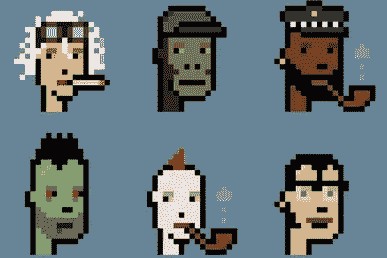

# 洗钱的艺术与 NFT

> 原文：<https://medium.com/coinmonks/the-art-nft-of-money-laundering-c8b61f930de6?source=collection_archive---------25----------------------->

你知道吗，电影《华尔街之狼》背后的电影制作公司之一实际上是一个洗钱活动的幌子公司，该洗钱活动由一个被称为“亚洲了不起的盖茨比”的人策划。当局声称， [Jho Low](https://fortune.com/2022/03/07/jho-low-fugitive-1mdb-financier-biography/) ，一位富有的商人和金融家，现在是世界头号通缉犯之一，在 2015 年从高盛批准的债券交易中窃取了 14.2 亿美元，用于马来西亚主权财富基金 1MDB fund。

Low 显然将被盗的 IMDB 资金中价值 45 亿美元的资金转移给了其他人，包括前马来西亚总理纳吉布·拉扎克(Najib Razak)的巨额资金 7.56 亿美元，以及拉扎克的继子里扎·阿齐兹(Riza Aziz)的 2.38 亿美元。家庭自助洗衣店开门营业了！显然，Aziz 用他的那部分收益资助了 Red Granite Capital，并最终资助了 Red Granite Pictures，后者资助了许多电影和电视节目，包括《T4》和《华尔街之狼》。令人不安的是，我喜欢那部电影。这一幕的讽刺意味很浓:

阿齐兹对他的资金来源提出了质疑，到今天为止，他仍然是一个自由人。然而，他的岳父就没那么幸运了，去年 7 月，他被马来西亚一家法院以刑事背信罪、洗钱罪和滥用职权罪定罪。[据报道](https://www.reuters.com/article/us-malaysia-politics-najib/at-start-of-1mdb-trial-prosecution-paints-a-tale-of-excess-and-abuse-idUSKCN1VI0D4)，拉扎克通过购买昂贵的房地产清洗他的资金，最重要的是，昂贵的艺术品的健康投资组合。这个家庭的收藏(他的妻子也被起诉)包括巴斯奎特、罗斯科，甚至梵高的名画！

尽管拉扎克被抓了，主要是因为他和他的家人生活太奢侈，而且他在普通场所滥用权力，但拉扎克至少尝试遵循了《洗钱者手册》中最可靠、最真实的策略——将需要清洗的钱投入艺术世界。这是书中最古老的策略，主要是因为它避免了当局的侦查。你知道吗，很多古董的销售都是私人的，从来没有被政府或艺术和古董行业登记或监管过。

> “艺术品是一种非常有吸引力的洗钱工具。它可以被隐藏或走私，交易通常是秘密的，价格可能是主观的和被操纵的——而且非常高。”—美国前检察官彼得·哈迪 [*到 IMF*](https://www.imf.org/external/pubs/ft/fandd/2019/09/the-art-of-money-laundering-and-washing-illicit-cash-mashberg.htm) *。*

潘多拉文件[暴露了传统艺术界在洗钱和金融欺诈方面的许多问题，其范围有时很难联系具体情况。丹佛大学主持了一个名为](https://news.artnet.com/art-world/pandora-papers-art-shell-companies-2067444) [RadioEd](https://www.du.edu/news/tune-radioed) 的播客，并在丹佛大学艺术收藏伦理中心主任伊丽莎白·坎贝尔(Elizabeth Campbell)的一次令人大开眼界的采访中，花了一集时间将潘多拉文件的研究置于背景之中。除了实际发生的犯罪之外，我们还必须考虑一些社会问题，例如道德管理、被盗艺术品的返还以及将这些被盗艺术品返还给合法所有者的影响。[点击此处](https://content.blubrry.com/radioed/S2E21_Pandora_Papers.mp3)查看完整采访。

## 自助洗衣店很快就要关门了！！

[美国财政部上个月发布了一项研究](https://home.treasury.gov/news/press-releases/jy0588),总结称，高价值艺术品市场拥有“固有的品质和特征”,使其容易受到一系列金融犯罪的影响，尤其是洗钱。根据这项研究，这些品质和特征包括，“交易的高美元价值，商品的可运输性，长期的隐私文化和中介机构(如空壳公司和艺术顾问)的使用，以及高价值艺术品作为投资类别的使用越来越多。”

财政部的新研究还解决了艺术界最新成员的巨大弱点，我不相信艺术界完全接受不可替代的令牌或 NFT 作为真正的艺术。

Cryptopunks — what started it all

也许是今天最诱人的(也是最恐怖的！)艺术品投资、非艺术基金也极易受到各种金融犯罪的影响，其中包括洗钱，但也包括欺诈、拉地毯、反向拉地毯、自我洗钱、内幕交易等等。与传统艺术相比，非传统艺术本质上也更容易转移，因为相关各方不需要将数字艺术从一个地方转移到另一个地方。他们也不必支付运费、运输保险或关税。这么高效！

由于文物销售和数字货币带来的洗钱便利，美国政府现在开始采取行动，正如上文提到的财政部研究和白宫上周发布的[行政命令](/coinmonks/did-bitcoin-just-hit-critical-mass-dfefa7161852)所证明的那样。EO 基本上是对去中心化世界的一个警告，即监管和最终的中心化即将到来。这对艺术界意味着什么？监管可能会以 2018 年 [*非法艺术品和文物贩运预防法案*](https://www.congress.gov/bill/115th-congress/house-bill/5886) 的形式出现，该法案最终在国会陷入僵局，但也提供了一个蓝图。

*如果*白宫从失败的*艺术和古物法案*中得到启示，“艺术品和古物交易商”将不得不建立严格且耗时的反洗钱(AML)计划，这将包括保留所有现金购买的(非数字和数字)记录，报告可疑活动，并向联邦监管机构报告所有超过 1 万美元的现金和加密交易。此外，还有一个了解你的客户(KYC)的组成部分，这将需要艺术经销商，拍卖行等。，调查客户的背景，检查过去的购买和销售，寻找任何表明他们的资金可能被污染的证据。

这听起来像是一家大型甚至中型银行的风险与合规官的头衔！将这些报告要求和规定(以及相关压力)强加给拍卖行和古董商公平吗？银行，现在甚至一些密码交易所都已经习惯了这种训练，但是艺术公司呢？古董商？艺术精品？我要郑重声明，这似乎有点过了，也许这就是该法案在国会停滞不前，甚至从未进入参议院的原因？话说回来，如果这些措施到位，拉扎克还能活这么长时间吗？洛还会是世界上在逃的人吗？

*   结束

> 加入 Coinmonks [电报频道](https://t.me/coincodecap)和 [Youtube 频道](https://www.youtube.com/c/coinmonks/videos)了解加密交易和投资

# 另外，阅读

*   [CBET 评论](https://coincodecap.com/cbet-casino-review) | [库科恩 vs 比特币基地](https://coincodecap.com/kucoin-vs-coinbase)
*   [折叠 App 审核](https://coincodecap.com/fold-app-review) | [Kucoin 交易机器人](/coinmonks/kucoin-trading-bot-automate-your-trades-8cf0ca2138e0) | [Probit 审核](https://coincodecap.com/probit-review)
*   [如何匿名购买比特币](https://coincodecap.com/buy-bitcoin-anonymously) | [比特币现金钱包](https://coincodecap.com/bitcoin-cash-wallets)
*   [币安 vs FTX](https://coincodecap.com/binance-vs-ftx) | [最佳(SOL)索拉纳钱包](https://coincodecap.com/solana-wallets)
*   [比诺莫评论](https://coincodecap.com/binomo-review) | [斯多葛派 vs 3Commas vs TradeSanta](https://coincodecap.com/stoic-vs-3commas-vs-tradesanta)
*   [Capital.com 评论](https://coincodecap.com/capital-com-review) | [香港的加密借贷平台](https://coincodecap.com/crypto-lending-hong-kong)