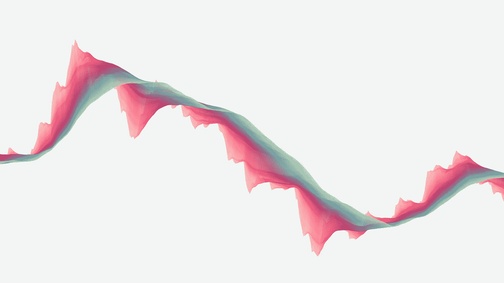
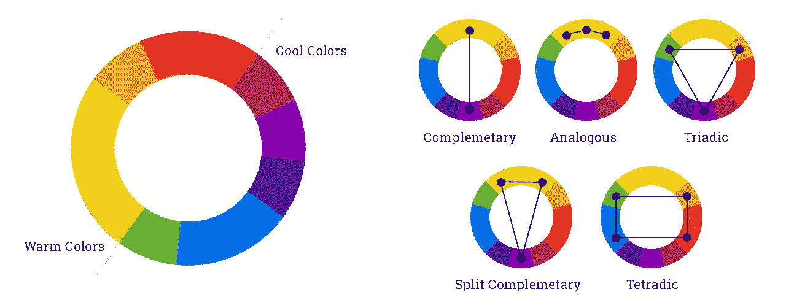
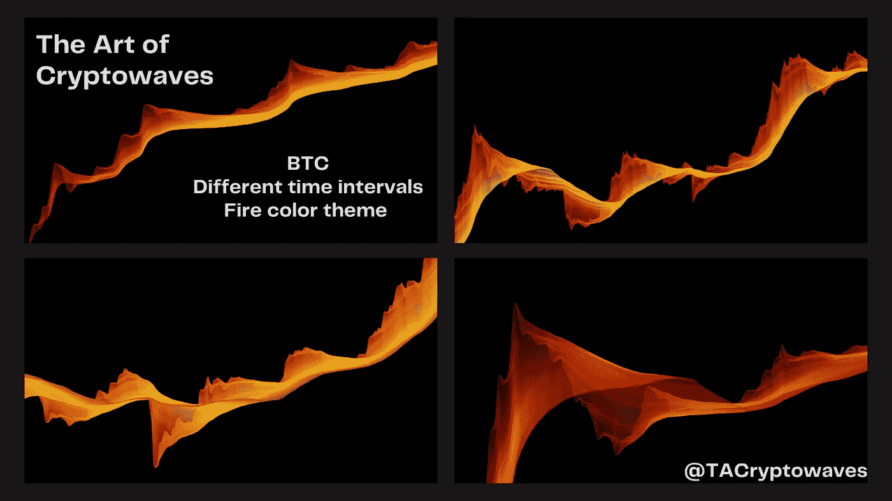

# 加密波的艺术:随机性与有序性

> 原文：<https://medium.com/coinmonks/the-art-of-cryptowaves-randomness-order-a79b73f2a590?source=collection_archive---------8----------------------->

## 混沌元素与秩序元素。技术分析和生成艺术。

在加密货币和加密波中，有**个混沌元素**和**个有序元素**。如果你看一个加密图表，乍一看，所有的**似乎都很嘈杂**，没有价格如何随时间演变的明确规则。然而，如果你更仔细更详细地观察，**有一些指导方针可以解释**和/或帮助预测价格。

**支撑位**和**阻力位**是交易者主要用来理解历史价格行为以及预测价格行为下一步走向或流动性可能在哪里的一些指标。例如，[金奎大密码交易](https://twitter.com/DaanCrypto)注意到以下情况

人们也可以把这种阻力位和支撑位、趋势线、楔形线等方法看作是一种自我实现的预言:如果每个人都对某个价格水平感兴趣，那么市场就会相应地朝着大多数人所期望的方向发展。

这个例子和隐波有什么关系？

> 密码波是用一些随机参数和一些准则设计的。

让我给你举几个例子:颜色和线条。

# 颜色；色彩；色调

颜色组合主要通过两种方式产生:随机性&造型和意义。

正如我们从色彩理论中知道的，我们欣赏某些颜色的组合，而不是其他的。哪些？查看以色调(h)、饱和度(s)和亮度(l)表示的颜色，可以通过取互补色(在色轮中处于相反位置的颜色)或三色(位于三角形边缘的颜色)或许多其他组合(如四色、分离互补色、类似颜色等)来获得漂亮的颜色组合。

Image from [https://www.webascender.com/blog/understanding-color-schemes-choosing-colors-for-your-website/](https://www.webascender.com/blog/understanding-color-schemes-choosing-colors-for-your-website/)

在我们的例子中，组合的第一种颜色是随机生成的，而接下来的颜色遵循颜色理论的指导方针。因此，具有 3 种颜色的密码波具有属于特定三色方案的元素，或者属于例如分离互补方案的元素。这与加密货币世界是一致的，在那里价格似乎是随机的，但支持和阻力正在为交易者提供指导。

除了随机性和建模，我还想给颜色组合赋予意义。正如另一个故事中的[所解释的，密码是生命，因为它们允许人们建立新公司、新项目、新应用，并发展金融工具和能力。代表四季、生命的四个元素、日出和日落的循环的调色板因此被用来代表密码的**进化性质，以及被提供的**生命**。每个调色板都有几种属于同一元素的颜色组合，例如，夏季主题的调色板可以从不同的夏季颜色组合中选取。**](/coinmonks/the-art-of-cryptowaves-colours-and-life-3f2354372ebb)

# 线

另一个随机性和有序性的例子是由密码波的**形状**给出的。每一波都有无限的简单均线组合。然而，加密波看起来像是混乱的组合，难以理解。

相反，我选择分配有限数量的移动平均线组合，这应该被解释为交易者的短期、中期或长期观点。较薄的波浪代表交易者、散户或新手的短期决策、行动和情绪。相反，较厚的波浪不会受到价格波动的太大影响，但重点是长期的演变。

# 以前的文章:

*   [隐波艺术:创世纪](/@288kartscientist/the-art-of-cryptowaves-genesis-310a2fa16ff2)
*   [加密波的艺术:BTC & ETH。2121 & 1018。情绪&分析](/@288kartscientist/the-art-of-cryptowaves-btc-eth-2121-1018-long-short-4d61e136b029)
*   [隐波艺术:色彩与生活](/coinmonks/the-art-of-cryptowaves-colours-and-life-3f2354372ebb)

如果你喜欢 Cryptowaves，请在**和 [**Twitter**](https://twitter.com/288kArt) 上给一个**喜欢**和**跟我来**。[隐波艺术**网站**在这里](https://theartofcryptowaves.com/)和[推特在这里](https://twitter.com/TACryptowaves)。**

****敬请期待。****

> **加入 Coinmonks [电报频道](https://t.me/coincodecap)和 [Youtube 频道](https://www.youtube.com/c/coinmonks/videos)了解加密交易和投资**

## **也阅读**

** [## 杠杆代币[多头代币]终极指南

### 杠杆化令牌是具有杠杆化风险敞口的 ERC20 令牌，不考虑保证金、要求、管理…

medium.com](/coinmonks/leveraged-token-3f5257808b22)  [## 最佳加密交易所| 2021 年十大加密货币交易所

### 编辑描述

blog.coincodecap.com](https://blog.coincodecap.com/crypto-exchange)  [## 2021 年最佳加密交换平台| CoinCodeCap

### 编辑描述

blog.coincodecap.com](https://blog.coincodecap.com/best-swap-platforms)  [## 10 大最佳在线赌场|赢得并赢取免费 BTC 2022 | CoinCodeCap

### 编辑描述

blog.coincodecap.com](https://blog.coincodecap.com/best-online-casinos)  [## 2021 年最佳加密借贷平台| 6 大比特币借贷平台

### 获得比特币和其他加密货币的最佳贷款利率

medium.com](/coinmonks/top-5-crypto-lending-platforms-in-2020-that-you-need-to-know-a1b675cec3fa)  [## 2021 年 6 大最佳硬件钱包|顶级加密硬件钱包[更新]

### 最好的加密货币硬件钱包是绝对必要的。我们将在 NGRAVE、Ledger Nano X 和…

medium.com](/coinmonks/the-best-cryptocurrency-hardware-wallets-of-2020-e28b1c124069)  [## 2021 年最佳免费加密交易机器人

### 2021 年币安、比特币基地、库币和其他密码交易所的最佳密码交易机器人。四进制，位间隙…

medium.com](/coinmonks/crypto-trading-bot-c2ffce8acb2a)  [## 最佳 4 个加密交易信号电报通道

### 这是乏味的找到正确的加密交易信号提供商。因此，在本文中，我们将讨论最好的…

medium.com](/coinmonks/best-crypto-signals-telegram-5785cdbc4b2b)**