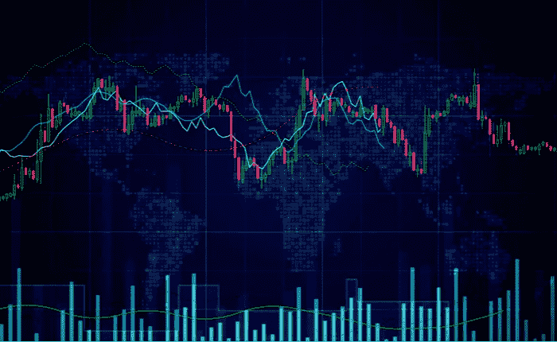
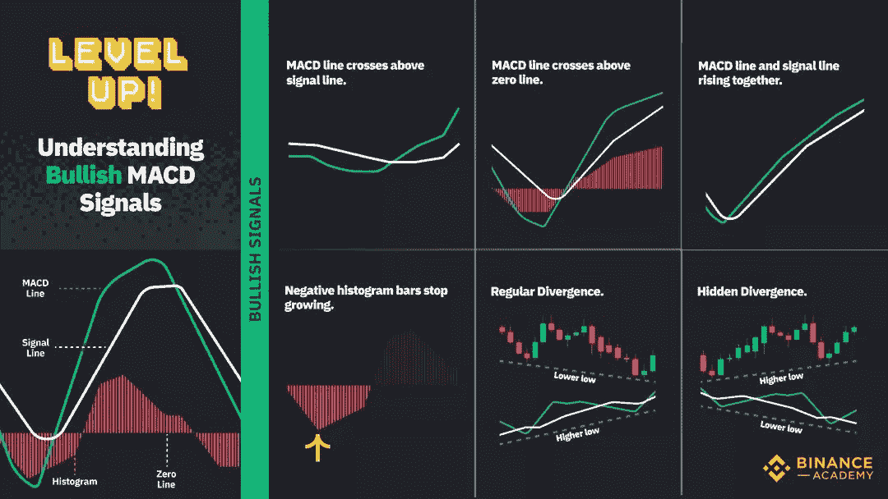
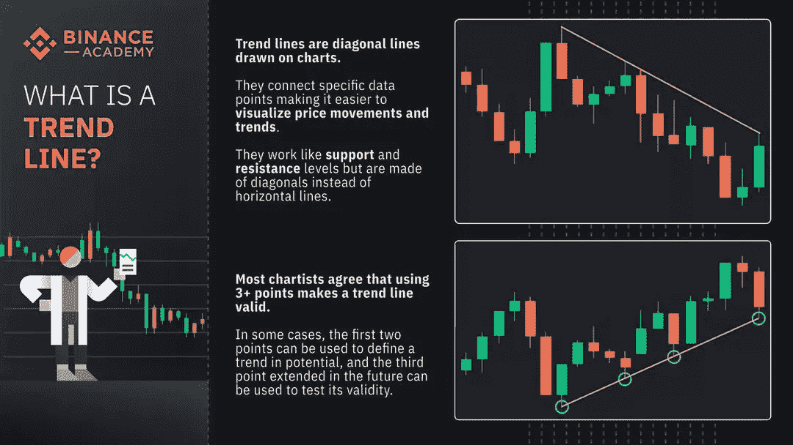
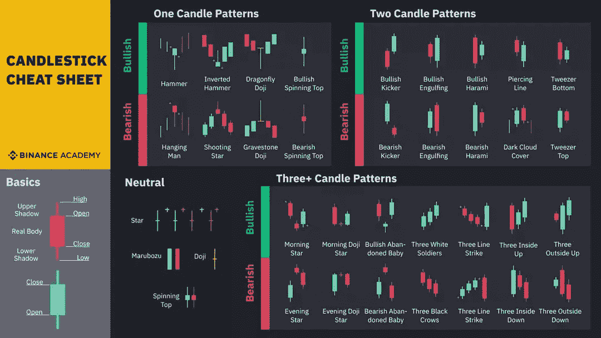

# 阅读交易图表的艺术:图表总结

> 原文：<https://medium.com/coinmonks/the-art-of-reading-trading-charts-a-graphical-summary-9b2671c01492?source=collection_archive---------35----------------------->

作为一名活跃的期货和保证金交易投资者，我发现图表的技术分析相当重要，尽管考虑到引发市场波动的大量情况，这不是预测市场走势的可靠方法。不久前，我在币安学院发现了以下有用的指标，并认为值得与社区分享。以下是阅读交易图表和理解看涨/看跌信号的不言自明的指南，对此我不以为然。希望你觉得有用！

和往常一样，这不是财务建议！在投资前做好自己的研究，不要存你输不起的钱。
*下面有什么问题尽管问我。*

*如果你喜欢这篇文章，* [*关注&订阅*](/@cybery) *！*

*如果你想看到更多这样的内容，你可以使用下面的一个或多个我的会员链接来支持我:*

*🎁*[*Cakedefi*](https://cakedefi.com/?ref=677920)*用 50 美元存款得到 50 美元*

*🎁*[*Nexo*](https://nexo.io/ref/hce5cfdt5o?src=web-link)*用 100 美元存款得到 25 美元*

*🎁*[*BlockFi*](https://blockfi.com/?ref=a16e37fd)*用 100 美元存款获得 10 美元*

*🎁***在 BTC 用 400 美元存款得到 50 美元**

**🎁**

***🎁* [*火币*](https://www.huobi.com/en-us/topic/double-invite/register/?invite_code=5t5jb)**

***针对马来西亚投资者***

***🎁* [*斯塔沙威*](https://www.stashaway.my/referrals/kenleel9jx) *获得 6 个月免费投资！***

***🎁Wahed 推荐代码' KENLIE1' RM10 奖金***

***🎁Capbay P2P 推荐代码' 8879c6' RM100 奖金***

**在上与我联系**

***💡* [*中等*](https://cybery.medium.com/)**

***💡*T2【read . cash】**

***💡* [*Youtube*](https://www.youtube.com/c/SmartInvestingChannel)**

***💡* [*电报*](https://t.me/kkkk289)**

***💡* [*推特*](https://twitter.com/cybertraderfx)**

> **加入 Coinmonks [电报频道](https://t.me/coincodecap)和 [Youtube 频道](https://www.youtube.com/c/coinmonks/videos)了解加密交易和投资**

# **另外，阅读**

*   **[OKEx vs KuCoin](https://coincodecap.com/okex-kucoin) | [摄氏替代品](https://coincodecap.com/celsius-alternatives) | [如何购买 VeChain](https://coincodecap.com/buy-vechain)**
*   **[币安期货交易](https://coincodecap.com/binance-futures-trading)|[3 commas vs Mudrex vs eToro](https://coincodecap.com/mudrex-3commas-etoro)**
*   **[如何购买 Monero](https://coincodecap.com/buy-monero) | [IDEX 评论](https://coincodecap.com/idex-review) | [BitKan 交易机器人](https://coincodecap.com/bitkan-trading-bot)**
*   **[CoinDCX 评论](/coinmonks/coindcx-review-8444db3621a2) | [加密保证金交易交易所](https://coincodecap.com/crypto-margin-trading-exchanges)**
*   **[红狗赌场评论](https://coincodecap.com/red-dog-casino-review) | [Swyftx 评论](https://coincodecap.com/swyftx-review) | [CoinGate 评论](https://coincodecap.com/coingate-review)**
*   **[Bookmap 评论](https://coincodecap.com/bookmap-review-2021-best-trading-software) | [美国 5 大最佳加密交易所](https://coincodecap.com/crypto-exchange-usa)**