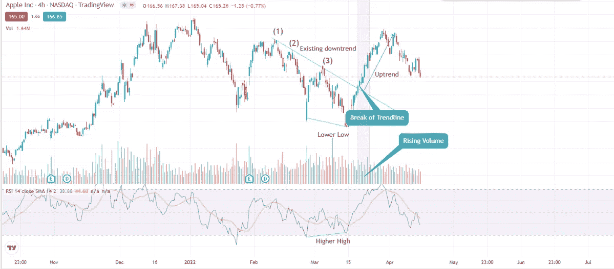
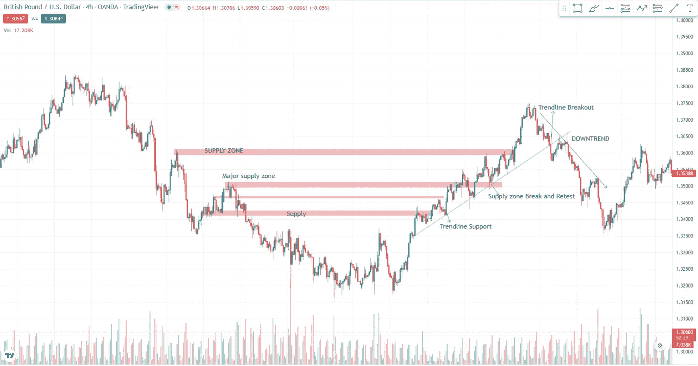
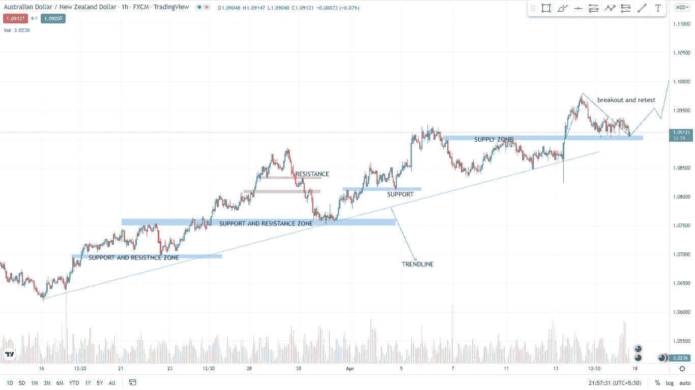

# 趋势跟踪的艺术(最赚钱的策略)第一部分

> 原文：<https://medium.com/coinmonks/the-art-of-trend-following-the-most-profitable-strategy-part-1-cf7758d7c567?source=collection_archive---------7----------------------->

嗯，你知道大型做市商是如何在一次交易中赚这么多钱的吗？在下跌趋势之前，他们如何完美地脱离市场结构，或者这是操纵？如果是这样，我该如何避免？这就是我将如何用我最大的知识来解释这个故事。让我们从基础开始，有三种主要的趋势上升趋势，横盘和下降趋势。我们的主要目标是通过跟踪止损进入上涨趋势或下跌趋势，并充分利用我们的投资。那么现在你如何找到最佳的入口和出口点呢？要找到进场点和出场点，看看当前的价格走势，你的股票、货币对、商品或任何可交易的资产是否仍处于下跌趋势、上涨趋势或横盘。

> 1)如何识别有进场点和出场点的上涨趋势？

世界各地的技术分析师在确定下一个市场结构时最常用的工具是趋势线、供需区、背离以及支撑和阻力区。我知道仅仅通过阅读一些随机的交易术语很难理解，以这张图片为例。

Image by The Writer

在第四次回调突破后，投资者的购买兴趣现在对股票更加积极，RSI 看涨背离使其更有信心购买。突破结构的进场点和跟踪止损寻找可能的弹性和阻力区，减少平仓这里是另一个获利的例子

在供应区获利，跟随上升趋势，直到出现一些看跌的图表模式或趋势线的突破。不要在单笔交易中冒太大的风险，并设置好止损。这里是最后一个例子

这是在趋势线重新测试区或供应和阻力区的上升趋势中可能的进入区，有适当的风险管理，如果我们得到对趋势跟踪策略第二部分的评论，第一部分的更多内容将很快公布

> 加入 Coinmonks [电报频道](https://t.me/coincodecap)和 [Youtube 频道](https://www.youtube.com/c/coinmonks/videos)了解加密交易和投资

# 另外，阅读

*   [折叠 App 审核](https://coincodecap.com/fold-app-review) | [Kucoin 交易机器人](/coinmonks/kucoin-trading-bot-automate-your-trades-8cf0ca2138e0) | [Probit 审核](https://coincodecap.com/probit-review)
*   [如何匿名购买比特币](https://coincodecap.com/buy-bitcoin-anonymously) | [比特币现金钱包](https://coincodecap.com/bitcoin-cash-wallets)
*   [币安 vs FTX](https://coincodecap.com/binance-vs-ftx) | [最佳(SOL)索拉纳钱包](https://coincodecap.com/solana-wallets)
*   [比诺莫评论](https://coincodecap.com/binomo-review) | [斯多葛派 vs 3Commas vs TradeSanta](https://coincodecap.com/stoic-vs-3commas-vs-tradesanta)
*   [Capital.com 评论](https://coincodecap.com/capital-com-review) | [香港的加密借贷平台](https://coincodecap.com/crypto-lending-hong-kong)