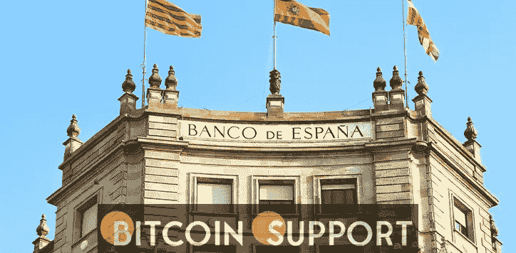

# 西班牙银行警告不要在西班牙使用不受监管的加密货币

> 原文：<https://medium.com/coinmonks/the-bank-of-spain-warns-against-the-use-of-unregulated-crypto-currencies-in-spain-e76ca8676a5a?source=collection_archive---------55----------------------->

**Visit our website:-** [**https://bitcoinsupports.com/**](https://bitcoinsupports.com/)

西班牙央行副行长玛格丽塔·德尔加多(Margarita Delgado)表达了她对加密货币的看法，以及它们如何在当今经济中增加风险。德尔加多在普华永道主办的题为“变化的气候”的活动中表示，加密货币的持续和扩展使用可能会对现在拥有加密货币的 12%的人口构成各种威胁。

**西班牙央行副行长审视加密货币风险**

西班牙央行副行长玛格丽塔·德尔加多(Margarita Delgado)就加密货币的使用及其对该国经济的潜在影响发表了自己的看法。这些说法是在普华永道主办的一场名为“变化的气候”的活动中发表的演讲中提出的，该活动专注于金融业不断变化的性质。副行长补充说，加密货币的广泛采用给系统带来了许多漏洞，包括利用这些资产的人普遍缺乏信息。其他危害之一是与分散融资相关的模糊性，这可能导致过度杠杆化和支付困难。Delgado 详细阐述了加密部分对其他市场的潜在影响:

***其高波动性会对其他市场产生传染效应，因为恐慌和过度反应可以转移到其他交易环境中。***

**其他警示声明和估计**

Delgado 还暗示了投资和存储加密货币资产对传统银行业的潜在影响，因为向客户提供这两种服务的混合行业的出现。她指出，这些资产将导致“遗产和声誉风险的显著增加。”西班牙银行已经强调了对正规银行向消费者提供基于加密货币的服务的担忧。西班牙央行行长在 2 月份的 II Finance Observatory 演讲中讨论了这一关联的影响，警告称加密货币资产的风险敞口将为银行系统带来新的风险。

最后，德尔加多认为 13%的西班牙居民拥有某种形式的加密货币，暗示这种类型的论述对于他们全面了解加密这门学科是必要的。她总结如下:

***有必要检查一下这些投资者是否完全意识到他们所面临的风险，或者只是被极高的升值预期所推动。***

**访问我们的网站:-**[**【https://bitcoinsupports.com/】**](https://bitcoinsupports.com/)

**免责声明:以上为作者观点，不应视为投资建议。读者应该自己做研究。**

> 加入 Coinmonks [电报频道](https://t.me/coincodecap)和 [Youtube 频道](https://www.youtube.com/c/coinmonks/videos)了解加密交易和投资

# 另外，阅读

*   [加密货币储蓄账户](/coinmonks/cryptocurrency-savings-accounts-be3bc0feffbf) | [YoBit 审核](/coinmonks/yobit-review-175464162c62)
*   [Botsfolio vs nap bots vs Mudrex](/coinmonks/botsfolio-vs-napbots-vs-mudrex-c81344970c02)|[gate . io 交流回顾](/coinmonks/gate-io-exchange-review-61bf87b7078f)
*   [CoinFLEX 评论](https://coincodecap.com/coinflex-review) | [AEX 交易所评论](https://coincodecap.com/aex-exchange-review) | [UPbit 评论](https://coincodecap.com/upbit-review)
*   [AscendEx 保证金交易](https://coincodecap.com/ascendex-margin-trading) | [Bitfinex 赌注](https://coincodecap.com/bitfinex-staking) | [bitFlyer 审核](https://coincodecap.com/bitflyer-review)
*   [Bitget 评论](https://coincodecap.com/bitget-review)|[Gemini vs block fi](https://coincodecap.com/gemini-vs-blockfi)cmd |[OKEx 期货交易](https://coincodecap.com/okex-futures-trading)