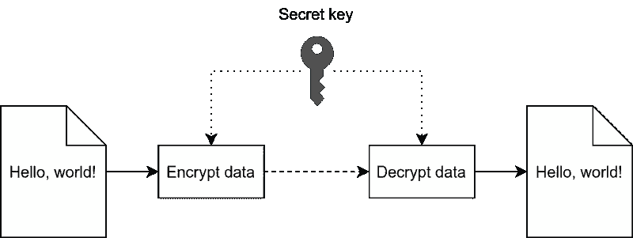
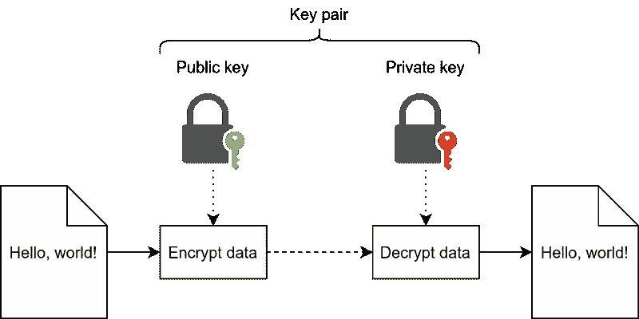
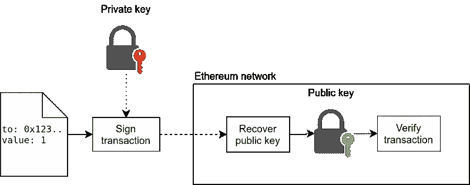

# 公钥加密的基础

> 原文：<https://medium.com/coinmonks/the-basics-of-public-key-cryptography-3f7a8732a072?source=collection_archive---------8----------------------->

要在以太网上发送事务，您需要一个签名的事务:一个由私钥签名的事务。无论您使用哪种类型的 wallet(例如，硬件 wallet、秘密恢复短语、密钥库文件)，都始终使用私钥对事务进行签名，该私钥来自您的硬件 wallet、秘密恢复短语或密钥库文件(除非您已经在使用普通私钥)。

除了私钥，你还需要一个公钥，因为以太坊使用的是非对称加密(也称为公钥加密 *-* )。这是一种加密技术，你有一对密钥:一个私钥和一个公钥。但是，当你想向某人发送资金时，你需要他们的*地址*，这不同于公钥(或私钥)。在本文中，我将解释私钥、公钥和地址之间的区别，以及它们是如何联系在一起的。

# 不同类型的加密技术

让我们从密码学的基础知识开始。本质上有三种不同的类型:

*   对称加密(或密钥加密)
*   非对称加密(或公钥加密)
*   加密哈希函数(我们不会在本文中详细讨论这种类型的加密，但是如果你感兴趣，我推荐你阅读[维基百科页面](https://en.wikipedia.org/wiki/Cryptographic_hash_function)。)

使用对称加密，您只有一个(秘密)密钥。您可以使用该密钥加密数据，然后使用同一密钥解密该数据。要与其他人共享数据，您和接收者都必须能够访问同一个密钥。对称加密的一个用例是保护您的敏感数据，例如，通过使用 BitLocker 对您的计算机驱动器进行[加密。重要的是要将这个密钥保密(顾名思义)，否则任何知道它的人都可以访问您的敏感数据。](https://support.mycrypto.com/staying-safe/encrypting-your-windows-pc-with-bitlocker)

Symmetric encryption: Encrypting and decrypting data using a single secret key.

与对称加密相比，非对称加密涉及一对密钥:一个私钥和一个公钥。数据使用公钥加密，只能用相应的私钥解密。换句话说，发送者只需要接收者的公钥，接收者就可以用他们的私钥解密数据。你只需要把私钥保密，把公钥分享给别人就可以了。

Asymmetric encryption: Encrypting and decrypting data with separate public and private keys.

例如，非对称加密可用于在双方之间共享敏感信息。事实上，您用来阅读本文的网站使用了非对称加密技术:HTTPS 是基于非对称加密技术的。在以太坊中，它更常用于签署数据，而不是加密数据。这使得有人可以在不暴露私钥本身的情况下验证您是否拥有私钥。

# 非对称加密和以太坊

正如上面简要解释的，非对称加密在以太坊中用于发送交易和签署消息。当您向网络发送事务时，您不希望在事务中包含您的私钥。因此，相反，该事务包括一些证明您可以访问私钥的证据。这是为了让网络在不暴露您的私钥的情况下验证您的余额(或特定消息)。

以太坊使用椭圆曲线加密(ECC):基于椭圆曲线的加密，特别是使用椭圆曲线数字签名算法(ECDSA)和 secp256k1 椭圆曲线。ECDSA 是一种专门用于签名和验证数据以及从签名中恢复公钥的算法。

当您想要发送一个事务时，首先对整个事务进行签名，产生一个签名`{r, s, v}`。该签名被添加到交易中，然后可以被广播到网络。交易不包括发送地址*。*相反，使用 ECDSA 从签名中恢复地址。

Asymmetric cryptography in Ethereum: A transaction is signed with a private key, and the public key is recovered from the signature (simplified).

这样，我们可以在以太坊上安全地发送交易(或签署消息)，而不会暴露我们的私钥。

# 如何创建密钥

私钥可以从其他来源(如秘密恢复短语或硬件钱包)获得，也可以使用强大的[密码安全伪随机数发生器(CSPRNG)](https://en.wikipedia.org/wiki/Cryptographically-secure_pseudorandom_number_generator) 随机生成。私钥本质上是一个随机的 32 字节(256 位)数。但是，它确实有一些要求:

*   私钥不能为 0。
*   私钥必须小于曲线的阶数(`n`)。这基本上是椭圆曲线上的最大点数。

要生成私钥，您可以简单地取一个随机的 32 字节数(由强 CSPRNG 生成)，并检查上面的要求。如果满足了这些要求，您现在就拥有了一个有效的私钥。

获取公钥涉及椭圆曲线数学，基于私钥。公钥不是随机生成的，而是通过将私钥与椭圆曲线上的基点(`G`)相乘来计算的。这在椭圆曲线上产生了一个新的点，这就是公钥。这种乘法是单向运算，所以不可能从公钥计算出私钥。

## 公钥和地址

一个常见的误解是，公钥与以太坊中的地址相同。然而，它们是两码事，并且地址是从公钥导出的。

未压缩公钥的长度为 65 字节(`0x04 || uncompressed public key`)，压缩公钥的长度为 33 字节(`0x02 or 0x03 || compressed public key`)。不同的是，未压缩的公钥包含椭圆曲线上该点的`y`值，压缩的公钥不包含。使用未压缩的公钥可以加快计算速度，但代价是增加存储空间。第一个字节是公钥头，它决定了密钥是压缩的还是未压缩的。对于压缩的公钥，第一个字节也决定了奇偶性，因为一个`x`坐标在椭圆曲线上有多个`y`值。

为了从公钥到地址，我们采用压缩的公钥，省略第一个头字节(以获得 32 字节长的公钥)，并使用 Keccak-256 对其进行散列。然后，取最后 20 个字节，就是地址。

给定以下私钥:

`0xeaf2c50dfd10524651e7e459c1286f0c2404eb0f34ffd2a1eb14373db49fceb6`

使用椭圆曲线点乘，我们得到以下(未压缩的)公钥:

`0x04b884d0c53b60fb8aafba20ca84870f20428082863f1d39a402c36c2de356cb0c6c0a582f54ee29911ca6f1823d34405623f4a7418db8ebb0203bc3acba08ba64`

然后我们用 Keccak-256 对此进行哈希运算，结果是:

`0xf0d03901469804f101fd1c62c6d5a3c98ec9073b54fa0969957bd582e8d874bf`

最后，我们取最后 20 个字节(40 个字符)，得到以下地址:

`0xc6D5a3c98EC9073B54FA0969957Bd582e8D874bf`

地址比公钥短，但仍然为在以太坊上发送交易提供足够的唯一性和安全性。

## 私钥与硬件钱包、秘密恢复短语和密钥库文件

当使用硬件钱包、秘密恢复短语或密钥库文件时，仍然使用私钥对事务进行签名。您不能直接使用类似秘密恢复短语的东西来签署交易。在这些情况下，私钥是从硬件钱包、秘密恢复短语或密钥库文件中派生出来的，而密钥库文件本身就包含一系列加密函数。

当使用类似于 [MyCrypto](https://mycrypto.com/) 或硬件钱包的东西时，这个推导步骤总是在幕后完成。在硬件钱包的情况下，派生发生在设备本身，因此私钥(或秘密恢复短语)永远不会离开设备。对于秘密恢复短语，派生由 MyCrypto 根据您选择的派生路径在本地完成。最后，您将总是得到一个由私钥和公钥组成的密钥对，以及相应的地址。

# 结论

要在以太坊上发送交易，您需要一个密钥对，由一个私钥和一个公钥组成。访问帐户的其他方法也可以用于在以太坊上发送交易，但在幕后，需要一个私钥(和公钥，地址)来签署交易。

使用非对称加密(公钥加密)，我们可以通过包含签名来安全地发送事务，而不会暴露私钥本身。通过使用椭圆曲线加密恢复公钥来验证交易，然后可以对公钥进行进一步哈希处理以获得实际的以太坊地址。

对称加密和非对称加密的主要区别在于，前者只有一个密钥:秘密密钥。虽然不(通常)用于以太坊，但它有很多其他的可能性，比如保护敏感数据或在使用相同密钥的人之间共享数据。

> 加入 Coinmonks [电报频道](https://t.me/coincodecap)和 [Youtube 频道](https://www.youtube.com/c/coinmonks/videos)了解加密交易和投资

*   [火币交易机器人](https://coincodecap.com/huobi-trading-bot) | [如何购买 ADA](https://coincodecap.com/buy-ada-cardano) | [Geco？一次审查](https://coincodecap.com/geco-one-review)
*   [币安 vs 比特邮票](https://coincodecap.com/binance-vs-bitstamp) | [比特熊猫 vs 比特币基地 vs Coinsbit](https://coincodecap.com/bitpanda-coinbase-coinsbit)
*   [如何购买 Ripple (XRP)](https://coincodecap.com/buy-ripple-india) | [非洲最好的加密交易所](https://coincodecap.com/crypto-exchange-africa)
*   [非洲最佳密码交易所](https://coincodecap.com/crypto-exchange-africa) | [胡交易所评论](https://coincodecap.com/hoo-exchange-review)
*   [eToro vs robin hood](https://coincodecap.com/etoro-robinhood)|[MoonXBT vs Bybit vs Bityard](https://coincodecap.com/bybit-bityard-moonxbt)
*   [风暴增益评论](https://coincodecap.com/stormgain-review) | [普罗比特评论](https://coincodecap.com/probit-review) | [北海巨妖评论](/coinmonks/kraken-review-6165fc1056ac)