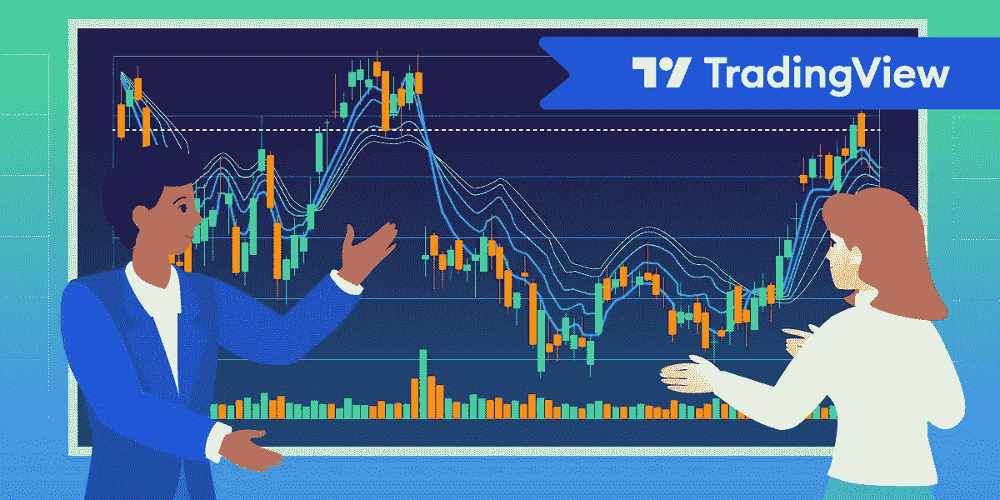
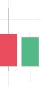
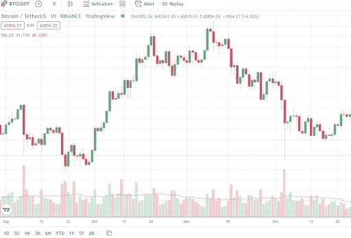
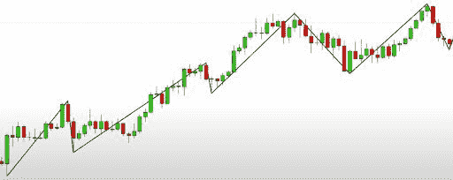
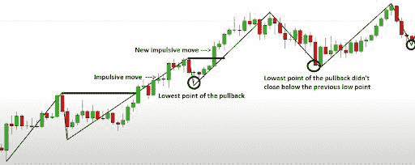
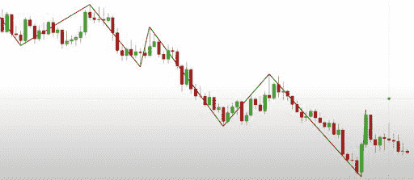
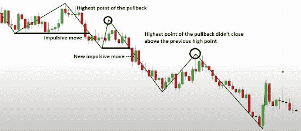
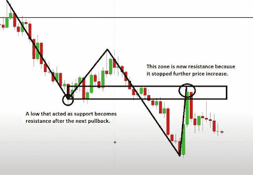
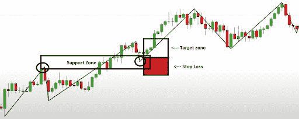

# 交易基础查看市场图表

> 原文：<https://medium.com/coinmonks/the-basics-of-tradingview-market-charts-7c4422ccf75d?source=collection_archive---------4----------------------->

TradingView 是新手和经验丰富的交易者最喜欢的技术分析平台之一——全球有 3000 万人使用。TradingView 提供图表工具和图形界面，允许您查看市场趋势和预测价格变动。该平台帮助你发现最佳投资机会。

TradingView 在股票和法定货币交易者中很受欢迎，但它也受到了数字资产所有者的欢迎。传统市场和加密货币市场有许多共同点，因此加密交易者利用 TradingView 来分析图表，并像其他交易者一样增加获利的机会。让我们看看该平台提供了哪些图表，以及如何使用它们来预测加密价格。

# 什么是烛台和烛台图？

蜡烛图是一种便于显示价格动态的图表。这里有两个典型的烛台:

他们每个人都有一个身体和一根灯芯。身体是人体的主要部分，灯芯是身体上下的细线。主体显示价格在给定时间段内的变化情况:例如，一个烛台可以显示 1 小时的变化。如果值增加，烛台是绿色的，如果它暴跌，身体是红色的。

烛台主体的下边缘和上边缘显示在设定期间资产的开盘价和收盘价。如果烛台为绿色(价格有所上涨)，则主体底部代表开盘价，顶部显示收盘价。对于红色烛台来说，情况正好相反(价格已经下降):顶部是开盘价，底部是收盘价。至于灯芯，它们在此期间显示最高和最低价格。

通过对烛台进行分组，TradingView 制作了一个烛台图表，如下所示:

# 如何用烛台识别潮流？

TradingView 提供的最酷的机会之一是预测 [**趋势市场**](https://www.youtube.com/watch?v=eynxyoKgpng) 。发现趋势是进行价格预测的可靠方法:预测牛市或熊市的开始很难，而找到特定硬币的上涨或下跌趋势则容易得多。交易者进一步利用这些数据来决定他们应该在哪里下单。

# 上升趋势

下图显示了一个处于上升趋势的市场。烛台形成一个典型的模式:有新的高点和更高的低点，然后是更高的高点和更高的低点。所有这些点以规则的间隔相互跟随。

显然，并不是所有的图表看起来都那么理想，有时发现市场趋势变得更加困难。这就是特殊指标发挥作用的地方。

向上市场的一个标志是反复的冲动行为——价格急剧上涨，当价格达到当地新高时结束。这一举动不可避免地伴随着回调——在价值再次开始飙升之前的短期价格下跌。

为了确保市场仍处于上升趋势，我们需要看回调的收盘价。如果当前回调结束时的价格高于上一次回调时的价格，我们得出结论:市场继续上涨。如果一个新的回调低于前一个，我们可能会看到趋势的逆转。这在图表上是这样的:

# 下降趋势

同样的规则也适用于向下趋势的检测。在这样的趋势中，我们会发现一系列的低点和高点:

用冲动性的移动和回调来确认市场方向的工作方式是一样的，但对于下跌趋势来说是相反的:大幅下跌在这里是冲动性的移动，随后的价格反弹是回调。

如果回调的收盘价低于前一个收盘价，我们推断下跌趋势将继续。相反，如果资产价格在新一轮回调后高于前一轮回调，则可能出现反转。这是一个显示下降趋势的 TradingView 图表:

# 什么是支持和阻力？

支撑位是一个价格区，在这里资产遇到一个障碍，不能再下降；阻力是价格难以超越的领域。例如，如果比特币开始崩溃并进入支撑区，价格下跌可能会停止。原因很简单:交易者知道在这个价格购买比特币会有利可图，因此在这里下了很多买单。如果价值达到支持区域，这些订单就会被触发，比特币需求上升，价格反弹。

阻力以同样的方式起作用。在这个区域，交易者下了很多卖单来获利，当 BTC 接近这个区域时，用户卖出，价格就会下跌。

如果你发现了支持和阻力，你就有更好的机会:

*   根据市场趋势确定进场点，
*   发现趋势逆转，重新调整你的交易策略，
*   以更智能的方式下订单。

# 确定入口点

还记得我们如何用冲动的波动和回调来确认上升趋势吗？让我们用支持和抵制来扩展这个知识。当市场在成长的时候，新高可能会先停在阻力区，然后因为买家太多而超越。阻力被突破后，再创新高。现在，一切都取决于回调:如果它没有跌破前一个高点，阻力就会变成支撑。

同样的分析适用于下跌趋势，反之亦然。随着向下运动的继续，达到了新的当前低点，这是它遇到高买家压力支持的地方。回调之后，价格再次下跌。如果它在用户持续抛售时突破支撑线，它就达到了新低。然后我们见证另一次回调，如果价格从过去的支撑位反弹，现在我们知道这是新的阻力，下跌趋势将继续。

一旦你发现了支撑位和阻力位，你就能更好地理解在哪里下单买卖:价格变得更容易预测。

比方说，我们处于一个不断增长的市场，你已经找到了支持和阻力。你知道价格不太可能跌破支撑位，所以你可以在那里下单买入。此外，在支撑线以下一点点设置止损单也是值得的，以防价格下跌。

正如我们已经知道的，如果在上升趋势中，回调结束时比前一个回调高，趋势可能会继续。如果是这样的话，这意味着阻力已经被打破，你到达了价格足够好的目标区域，所以你可以考虑止盈。

# 结果

TradingView 是一个平台，在这里你可以找到类似本文中数百种资产的图表。他们中的大多数人使用烛台，这是投资者和市场分析师认为描绘价格变动最方便的工具。在蜡烛图中，你可以发现上升趋势(更高的高点，更高的低点；任何回调收盘高于前一个)和下降趋势(更低的低点，更低的高点；回调收盘低于之前的回调)。

一旦你确定了趋势，找到当前的支撑和阻力来理解在哪里下单是值得的。在一个成长中的市场，买单应该放在支撑区，因为价格不太可能低于支撑区。相反，卖单应该放在阻力区上方——如果价格突破阻力区，这意味着价格已经上涨，你肯定可以获利。

> 加入 Coinmonks [电报频道](https://t.me/coincodecap)和 [Youtube 频道](https://www.youtube.com/c/coinmonks/videos)了解加密交易和投资

# 另外，阅读

*   [最佳期货交易信号](https://coincodecap.com/futures-trading-signals) | [流动性交易回顾](https://coincodecap.com/liquid-exchange-review)
*   【Huobi 的加密交易信号 | [Swapzone 审查](/coinmonks/swapzone-review-crypto-exchange-data-aggregator-e0ad78e55ed7)
*   最佳[密码交易机器人](https://coincodecap.com/best-crypto-trading-bots) | [购买索拉纳](https://coincodecap.com/buy-solana) | [矩阵导出审查](https://coincodecap.com/matrixport-review)
*   [Coldcard 评论](https://coincodecap.com/coldcard-review) | [BOXtradEX 评论](https://coincodecap.com/boxtradex-review)|[uni swap 指南](https://coincodecap.com/uniswap)
*   [比特币基地评论](/coinmonks/coinbase-review-6ef4e0f56064) | [德里比特评论](/coinmonks/deribit-review-options-fees-apis-and-testnet-2ca16c4bbdb2) | [FTX 评论](/coinmonks/ftx-crypto-exchange-review-53664ac1198f)
*   [Coinmetro 评论](https://coincodecap.com/coinmetro-review) | [VirgoCX 评论](https://coincodecap.com/virgocx-review)