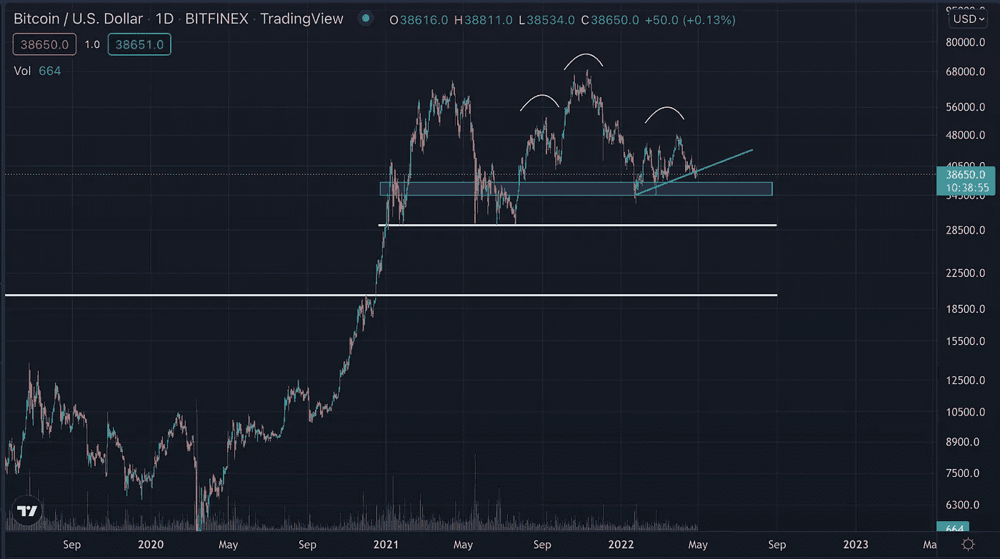
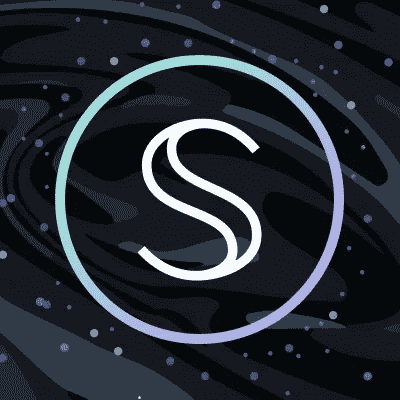
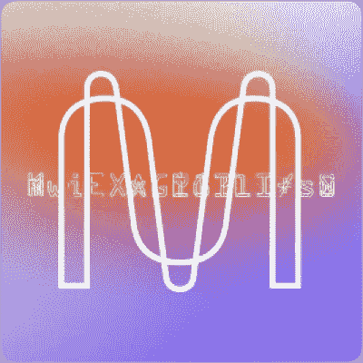
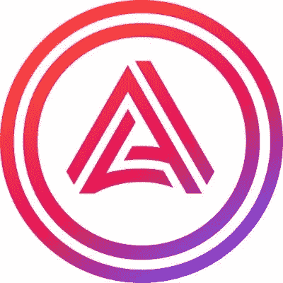

# 熊市是玩家做出改变人生决定的地方

> 原文：<https://medium.com/coinmonks/the-bear-market-is-where-players-make-life-changing-decisions-33c71ec74e09?source=collection_archive---------17----------------------->

熊市和熊市趋势带来了重大机遇。在这篇文章中，我们推测比特币和更广泛的加密货币市场未来可能的轨迹。声明:这不是财务建议，资本处于风险之中。

Simple, Stupid TA

*   宏观形势看起来很糟糕，科技股的表现就像备用硬币，创纪录地下跌了 90%。
*   股票市场可能会把 BTC 拉下来，尽管在替代硬币失去主要支撑位时，它目前出人意料地保持不变。
*   这种现象可能表明，几天或几周内可能会出现大幅波动，可能会下跌。
*   2021 年发生了“5 月卖出，然后离开”(SIMAGA)的现象，当 BTC 跌破 3 万美元时，市场经历了极度的恐惧。
*   SIMAGA 恰好在大约 3 万美元价格点之前形成了一个“头肩底”形态。
*   一个类似的 SIMAGA 可能正在上演，如上图中白色曲线所示。
*   绿色趋势线显示了 BTC 可能反弹并继续上升趋势的一线希望，尽管由于宏观形势——美联储缩减购债规模、乌克兰战争和监管——这种可能性很小。
*   许多市场参与者预计会向蓝色矩形表示的 35000 美元区域移动，并且无疑已经在该区域下了买入订单。
*   尽管如此，市场还是随心所欲，让大多数参与者措手不及。
*   跌破 35000 美元，市场将测试约 30000 美元的 2021 年夏季低点。
*   这一举动将是一个投降式的事件，尽管跌破这一点并测试 20k 美元左右的前期周期高点并非不可能。

**我雷达上的项目**

如果你在 Twitter 上关注我，你可能会看到各种项目的推文，这些项目可能会在长期内取得成功。这些是:

**秘密网络**

*   如果市场重新回到之前的 2021 年夏季低点，人们可以将这枚硬币放在 1 美元至 2 美元的区域。
*   总供应量为 1.902 亿，完全稀释的市值可以看到这个项目达到三位数。
*   涨到 1 美元或更低将是上帝的礼物，特别是如果这个项目取得成功，并且从长远来看它的象征达到了 100 美元。
*   如果你错过了，这里有一篇关于 L1·区块链项目文章的链接:[错过了 AVAX 上的 50x？这个项目给了你第二次机会。](https://cbresearch.substack.com/p/missed-a-50x-on-avax-you-have-a-second?s=w)
*   即使这个项目失去了支持，我也一直在慢慢地将成本平均化——这是很危险的事情，但幸运眷顾勇敢的人。

**Oasis 协议**

*   这个 L1 项目是另一个拥有一流团队和 a16z 等顶级风投公司支持的项目。
*   我还没有写一篇关于这个项目的文章，但是我已经发了一篇关于这个项目的微博。
*   这个周期的前期高点约为 0.59 美元，但我希望它能达到 2 美元的目标。
*   该项目还没有像大多数其他项目一样出现荒谬的百分比波动，当看涨情绪回归时，仍可能看到市值的倍数。
*   我认为我在这方面相对较早，不像 Secret Network，在某些时候是 0.25 美元。
*   如果它的价格回到 2021 年夏季低点，你知道我会怎么做。

**米娜协议**

*   Mina Protocol 是一个由主要风险投资公司支持的 L1 项目，它最近进一步筹集了 9200 万美元，这表明了其支持者的信任。
*   像《绿洲协议》和《秘密网络》一样，区块链的隐私叙事可能会对这个项目产生巨大的需求，因为它采用了零知识证明技术。
*   我还没有任何代币，如果市场回到之前的夏季低点，它可能会跌至 1 美元区域。
*   像 Oasis 协议一样，它还没有进行多次，油箱中可能还有大量气体。

**阿卡拉网络**

*   这个波尔卡多特 L1 项目是新的，旨在成为波尔卡多特生态系统的 DeFi 中心。
*   它有自己的稳定货币 aUSD，并计划将其整合到 DApps 和 DeFi 市场。
*   该项目得到了包括比特币基地风险投资公司在内的知名风险投资公司的支持，如果它在比特币基地和比特币基地上市，我不会感到惊讶。
*   这个项目是我非常关注的。

# **警告**

*   加密市场是不受监管的，每一个关于赚到改变生活的钱的故事，都有其他关于失去改变生活的钱的故事。
*   上述所有项目都是高度投机性的，可能无法实现其潜力。
*   实行细致的风险管理，避免 FOMO 和贪婪。
*   每当你把钱投入市场时，就把它记为丢失或在赌场里。
*   如果你给赌场拨款，确保这笔钱能让你晚上睡个好觉。

在 [Twitter](https://twitter.com/observer_kel) 和 [Medium](/@keltheobserver) 上关注我，并订阅我的**免费** [时事通讯](https://cbresearch.substack.com/)以获得更多关于 Web3、NFTs 和 crypto 的前瞻性想法和 alpha。

> 加入 Coinmonks [电报频道](https://t.me/coincodecap)和 [Youtube 频道](https://www.youtube.com/c/coinmonks/videos)了解加密交易和投资

# 另外，阅读

*   [折叠 App 审核](https://coincodecap.com/fold-app-review) | [Kucoin 交易机器人](/coinmonks/kucoin-trading-bot-automate-your-trades-8cf0ca2138e0) | [Probit 审核](https://coincodecap.com/probit-review)
*   [如何匿名购买比特币](https://coincodecap.com/buy-bitcoin-anonymously) | [比特币现金钱包](https://coincodecap.com/bitcoin-cash-wallets)
*   [币安 vs FTX](https://coincodecap.com/binance-vs-ftx) | [最佳(SOL)索拉纳钱包](https://coincodecap.com/solana-wallets)
*   [比诺莫评论](https://coincodecap.com/binomo-review) | [斯多葛派 vs 3Commas vs TradeSanta](https://coincodecap.com/stoic-vs-3commas-vs-tradesanta)
*   [Capital.com 评论](https://coincodecap.com/capital-com-review) | [香港的加密借贷平台](https://coincodecap.com/crypto-lending-hong-kong)