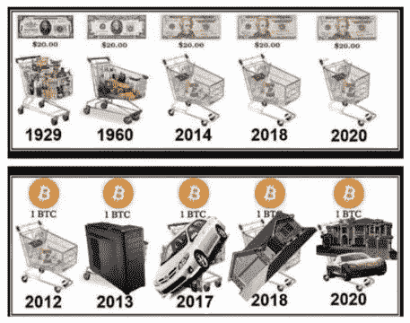

# 区块链的开端:比特币

> 原文：<https://medium.com/coinmonks/the-beginning-of-blockchain-bitcoin-b150ffd809aa?source=collection_archive---------46----------------------->

## 比特币为什么有价值——区块链基础知识 1

比特币最高定价为 69000 美元。2009 年，它的价值还不到一分钱。是什么推动了比特币的价格？

“加密这是一个泡沫；比特币将暴跌至 0 美元！”

“哦是吗？当然也有愚蠢的人用密码交易——就像股票一样。但是你认为沃伦·巴菲特疯了吗？你会说比尔·盖茨愚蠢吗？埃隆·马斯克呢？您是否知道脸书将品牌更名为 Meta，将品牌更名为 Square to Block？你听说过 MicroStrategy 的 Michael Saylor 吗？甚至摩根大通和花旗银行也投资了区块链产业！你比他们都聪明吗？”

“你是认真的吗？？事实是我从未调查过。我想我得做些研究。”

我每周至少有一次这样的对话。所以让我们从头开始。

没有任何东西做后盾的东西就值钱，这不是没意义吗？

另一方面，现金为什么值钱？美元过去 50 年完全没有黄金做后盾！再者，转念一想，黄金的后盾是什么…？

换句话说，什么是价值？

我们得历史备份，学个人类经济速成班【别担心，没什么可怕的，简单生活就好】。[注意:我们今天讨论的是加密作为一种货币——在接下来的信件中，我们将探讨一个充满优势和创新的世界。]

人要生活需要物资，人要享受生活。但是一个人不可能做所有的田间工作，养牛、教育、砍柴、切石、建筑、缝纫、洗衣、铺路等等..所以约翰有一个苹果园，他需要一头奶牛，因为奶牛会工作、产奶、产肉和皮革。他去找杰克，用苹果和奶牛交换，因为杰克想要苹果。一头奶牛多少苹果？这取决于约翰需要一头奶牛有多重要&杰克对苹果有多感兴趣。这就是原始经济:生命的价值基于供给和需求，以及时间和努力。

然而，由于这种方式不太实际，人们寻找方便的商品，即便携、可分割、有限、耐用、需要劳动才能获得的商品，这些商品被社会认为是他们有价值的物品和技能的象征。我们开始使用宝石、稀有材料、稀有金属等东西。因此，当杰克在约翰的农场工作 8 小时时，他得到的不是 8 箱土豆，而是 8 个硬币，其中一个用来买鸡蛋，第二个用来付给邮递员，等等..

但可以肯定的是:钱一定要去中心化。人类决定什么是有价值的。例如，在北极圈，由于蜡独特的价值和可分性，它会成为货币。一句话:钱应该代表真实的生活价值，并且在我们需要它的时候追踪它现在的主人。“价值储存”。

最终大多数国家建立了金属货币[腐败开始的地方；钱和国家有什么关系？].随着时间的推移，我们发明了纸币和支票，这样，我们就不会拖着昂贵的物品到处走，我们只是承诺你会按需得到它。

接下来发生的事情是，政府决定让美元与黄金脱钩，让英镑与白银脱钩。那叫“法令”=法令。政府正在制定一项法令，规定这种法定货币永远可以兑换商品和服务。现在，这可能是可行的，但是有几个问题:

1.不是每个政府或货币都是永恒的，你永远不知道谁会是下一个…

2.如果他们想印多少就印多少，这就像一场烫手山芋的游戏。尽快摆脱它，因为今天的一美元比明天的一美元更有价值！因为加钱并没有创造新的生命价值，只是从现有的雄鹿身上分走了一杯羹！他们不能规定每印一美元就应该长出更多的苹果！

3.通货膨胀还有另外一种增长方式。法律规定，银行被允许使用 90%的*支票账户用于他们的财务。假设你的账户里有 10，000 美元，9，000 美元是重复的。有人用他的信用卡取了钱。*

-嘿！银行靠我的钱发财？！我应该赚这个利息！

对，这个以后再讨论。但更大的问题是通货膨胀。他们在两个地方展示同样的钱。它的合法伪钞……每十年或二十年都会导致金融崩溃——别担心，我们会用我们的税收拯救银行！

4.此外，如果一个政府制裁另一个政府，而无辜的公民发现自己的辛勤劳动没有得到回报，那该怎么办？

所有这些都是可能的，因为我们的货币是集中的。有统治世界价值的高级中央集团。你能强迫公众重视某事吗？

这就是我们今天的处境。

因此，我们在寻找一种易于携带、不会繁殖、不会被歧视、全球接受的东西。

你和我想的一样吗？

USD vs. BTC Value

文明决定什么有价值，他们确定比特币有价值有永恒的原因。它没有重量，独立，限量 2100 万，可分，永恒。

不仅仅是因为这些特征。

目前的现金有一些缺陷&正在失去一些能力。

从长远来看，货币应该是一种价值储存手段，即使忽略通货膨胀和货币的不确定性，今天的可能性也有几个问题。

> *求安全。我应该把钱存放在哪里？*
> 
> *家里现金？可能被盗、毁坏、烧毁或丢失。*
> 
> *——当然是在银行！*
> 
> 你真的认为银行和信用卡公司没有黑客、欺诈和骗局吗？这每天都在发生。
> 
> *求一言堂。银行里的钱不是你的。他们锁定每一个轻微的怀疑或关注的账户。我的支票账户被锁了 10 天，因为有人存入了一张大额支票！由于我个人发出的一个错误的快速支付，我的在线帐户访问被终身封锁！这意味着我们的钱容易受到他人的人为错误和非理性的影响。*
> 
> 不是世界上的每个人都有特权使用当前的银行系统。如果他们没有最低要求呢？如果他们不符合限制和规定怎么办？你觉得你还好吗？直到你看到区块链——有待讨论——你才明白你被挡在了多少金融机会面前。
> 
> *o 隐私。你的财务和生活记录暴露在公司面前。如果他们的系统被黑，你的信用评分，财富，税务信息等。在黑客手里为所欲为。它发生了，但由于权力集中，媒体并不总是能够报道它[是的，媒体也是集中的……]。*

另一个困扰货币的问题是伪造。

每个政府都承认不同的货币，这使得旅行成为一件麻烦事，而且在国际上为商业或个人目的汇款需要支付高额费用。

交易。

> *转移资金要花很多时间和精力。当然，因为人类必须批准&记录每一笔交易，如果不是这样它将如何被确认？也因为钱不一定在你的账户里…就像之前讨论的那样。*
> 
> 他们需要付费。没有人免费工作！
> 
> *o 限制。不是所有的东西都适用于所有的东西，而且总有我们钟爱的限制安全措施。你的卡在一个新的州使用时从未被拒绝过吗？它们甚至没有坏的意思，只是没有被保护的方法*和*快速的*和*相互连接。*
> 
> *o 再次集中。即使你不在乎，不幸的人比你想象的要多，他们会有所作为。–*和*，你永远不知道下一个是谁。加拿大人、俄罗斯人和乌克兰人做梦都想被封锁吗？*

比特币解决一切。这就是为什么一个比特币现在大约是 45000 美元，它的价值是*【远远超过】这个数字。*

*它是如何解决这些问题的？*

> *交易新手？尝试[加密交易机器人](/coinmonks/crypto-trading-bot-c2ffce8acb2a)或[复制交易](/coinmonks/top-10-crypto-copy-trading-platforms-for-beginners-d0c37c7d698c)*