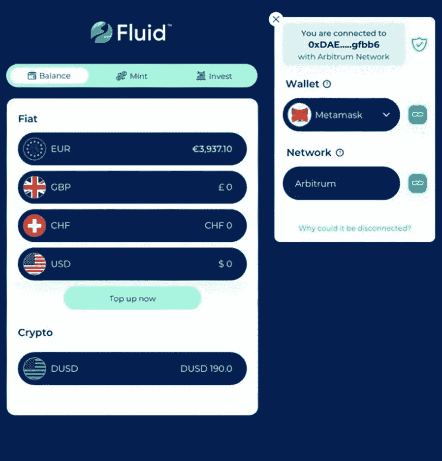

# 最好的银行选择

> 原文：<https://medium.com/coinmonks/the-best-bank-alternative-8bb6531e8e4e?source=collection_archive---------19----------------------->

## 银行并不擅长让你的钱更好地为你工作。银行替代品表现更好

Fluid: The Bank Alternative — by ValueFirst

但将传统金融(银行/金融机构)和分散金融(加密/数字资产)合并为一个实体的银行替代方案是最好的。

## **对几个银行备选方案列表的审查返回了类似**的结果

*   信用合作社
*   聪明的
*   新班克斯
*   网上银行
*   存款证明
*   等等。

本质上，其结果是传统银行的一种变体，而不是一种新方法。这些方案都没有融合或弥合传统金融和分散金融之间的鸿沟。流动性——银行的替代品有。

*在我们深入了解这种流动性之前，让我们先了解一下传统的&去中心化金融世界意味着什么。*

## 传统金融(银行/金融机构)世界

传统金融是从银行系统和/或资本市场获得的融资。用户必须通过银行和[金融机构](https://www.investopedia.com/terms/f/financialinstitution.asp)，才能获得诸如存款、贷款、投资和货币兑换等服务。银行和金融机构已经建立并受到良好监管。

## 分散金融(DeFi)世界。

[去中心化金融](https://www.forbes.com/advisor/investing/cryptocurrency/defi-decentralized-finance/)使用加密货币、数字资产和区块链技术来管理金融交易，例如日常银行业务、贷款、抵押贷款、复杂的合同关系和资产交易。DeFi 的目标是用点对点关系取代中央集权的金融机构。

## 银行替代品:新兴的金融现实

在现实中，纯 tradfi 的支持者对传统银行业务没有意见，而 DeFi 用户经常需要在法定货币和数字资产这两个金融世界之间移动。

由于银行目前不支持数字资产，我们将需要一种能够无缝支持用户在传统银行间来回转换的银行替代方案。Fluid app 将两个金融世界融合为一个应用。

## 为什么需要银行替代品

选择银行的一些原因包括

1.降低交易费用

2.储蓄利息

3.全球范围和可用性

4.近乎实时的全局事务执行。

5.全球访问-无论您身在何处，您需要的只是互联网

## 流动性如何:一个应用中的两个世界

Fluid 的革命性技术使用传统金融和分散金融基础设施，并将[菲亚特和加密货币整合到一个应用程序中。](https://fluid.ch/our-products/bridge-to-crypto/)

Fluid Finance 在 [one app](app.fluid.ch) 中首次集成了完整的银行账户+访问密码。我们通过创造一种稳定的货币做到了这一点——这种数字货币是完全支持的、透明的、24/7 不间断可验证的。digital dollar(DUSD)——链上的真钱。

你可以直接从你的银行账户中提取硬币。当你想提现时，只需在几秒钟内将[数字美元](https://fluid.ch/dusd/)兑换成普通美元回到你的账户。

## 流动资金——最佳银行选择

流动金融是为数字时代打造的一种革命性的银行新方法。我们已经将传统银行的所有优势与加密的所有优势集成在一个应用程序中[。](app.fluid.ch)

Fluid Account — [Fluid.ch](http://fluid.ch)

没有其他银行可以像 fluid 一样提供无缝跨越这两个金融世界的金融服务。此外，一个[流体账户](https://fluid.ch/our-products/)会给你

*   使您能够管理多种货币和加密货币。
*   你可以随时在这两个世界之间快速无缝地移动。

点击阅读更多关于流体[的信息。](https://fluid.ch/)

*我邀请您通过以下您认为方便的任何渠道加入* fluidfam *。*

[**推特**](https://twitter.com/fluid_fi)|[|**电报**|](https://t.me/fluid_fi)|[|**公告**|](https://t.me/fluid_fi_ann)[|**不和**|](https://discord.gg/xbu3qhrxps)|[|**GitLab**|](https://gitlab.com/fluidfinance/stablecoin2.0)[|**YouTube**|**网站:**](http://youtube.com/c/fluidfi)[**fluid . ch**|](https://fluid.ch/)|

## 警告:

*   *注意——这不是金融投资建议。*
*   *所有金融投资都涉及风险 DYOR(在进行任何金融投资之前，请自行研究)*
*   *这篇文章是我对主题*的想法和看法

> 加入 Coinmonks [电报频道](https://t.me/coincodecap)和 [Youtube 频道](https://www.youtube.com/c/coinmonks/videos)了解加密交易和投资

# 另外，阅读

*   [CBET 评论](https://coincodecap.com/cbet-casino-review) | [库科恩 vs 比特币基地](https://coincodecap.com/kucoin-vs-coinbase) | [拜比特 vs 比特币基地](https://coincodecap.com/bybit-vs-coinbase)
*   [折叠 App 回顾](https://coincodecap.com/fold-app-review) | [LocalBitcoins 回顾](/coinmonks/localbitcoins-review-6cc001c6ed56) | [Bybit vs 币安](https://coincodecap.com/bybit-binance-moonxbt)
*   [加密保证金交易交易所](/coinmonks/crypto-margin-trading-exchanges-428b1f7ad108) | [赚取比特币](/coinmonks/earn-bitcoin-6e8bd3c592d9) | [Mudrex 投资](https://coincodecap.com/mudrex-invest-review-the-best-way-to-invest-in-crypto)
*   [WazirX vs CoinDCX vs bit bns](/coinmonks/wazirx-vs-coindcx-vs-bitbns-149f4f19a2f1)|[block fi vs coin loan vs Nexo](/coinmonks/blockfi-vs-coinloan-vs-nexo-cb624635230d)
*   [比斯勒评论](https://coincodecap.com/bitsler-review)|[WazirX vs coin switch vs coin dcx](https://coincodecap.com/wazirx-vs-coinswitch-vs-coindcx)
*   [7 大副本交易平台](https://coincodecap.com/copy-trading-platforms) | [BuyCoins 点评](https://coincodecap.com/buycoins-review)
*   [XT.COM 评论](https://coincodecap.com/profittradingapp-for-binance)币安评论 |