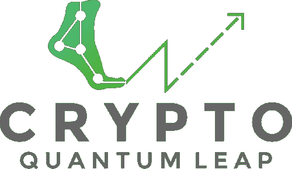
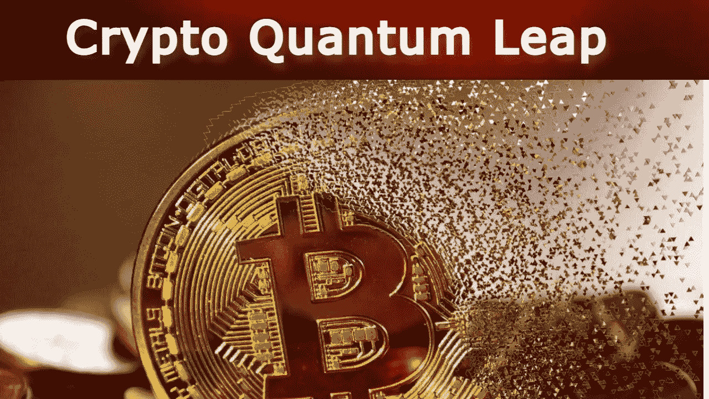
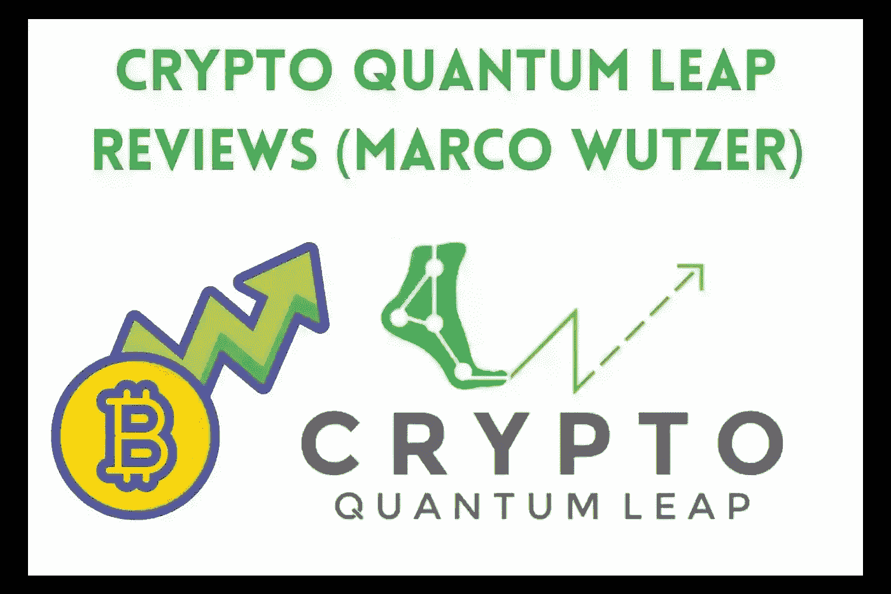

# 最佳加密量子飞跃课程评论(全部细节)

> 原文：<https://medium.com/coinmonks/the-best-crypto-quantum-leap-course-review-full-details-3abc3f319936?source=collection_archive---------6----------------------->

**Crypto Quantum Leap**

**加密货币**是一种 [***数字货币***](https://bit.ly/3xKlx7k) ，你可以用它来购买**商品和服务**。对于安全交易，加密货币依赖于一个极其复杂的在线账本。全球数百万人一直在投资这些不受监管的货币，以获取利润。在所有这些流行的加密货币中，**比特币**高居榜首。它是在 2009 年由一个神秘人**中本聪**发起的。

建议**用户**不要把所有的钱都放在**一种加密货币**上，尽量避免在加密货币**泡沫**的高峰期投资。据观察，**价格**在加密泡沫达到顶峰时突然下降。由于加密货币是一个**不稳定的市场**，所以用户必须**投资他们能够承受损失的金额**，因为没有任何政府对加密货币的控制，因为它是一种**分散的加密货币**。

**苹果公司的联合创始人史蒂夫·沃兹尼亚克**预测**比特币**是真金白银，它将在未来主宰所有**货币**如美元、欧元、印度卢比和澳大利亚元，并在未来几年成为**全球货币**。

## 什么是加密量子飞跃？

**Crypto Quantum Leap**

**Crypto Quantum Leap** 是一门在线课程，教授参与者所有他们需要知道的关于**比特币**和其他**加密货币**的知识。本课程由 **Marco Wutzer** 主讲，可以帮助任何人，从刚刚入门的人到已经对 [***领域***](https://bit.ly/3xKlx7k) 有所了解的人。为什么？在所有易变的事物中，总有一些新鲜的东西需要发掘。让我们更深入地看看所提供的信息。

## 关于加密量子飞跃你能找到什么？

**Crypto Quantum Leap**

令我们惊讶的是，**密码量子飞跃**会员区已经配备了**尽可能多的知识**。这是一个 [***的大好机会***](https://bit.ly/3xKlx7k) 让人们更多地了解一个**的各种话题**，包括:—

1.  要考虑两个主要的**加密交换**，并决定何时使用其中一个。
2.  唯一可以下单购买**比特币**的最佳交易所。
3.  关于在交易所开设账户的逐步说明**。**
4.  存放资金和执行**交易**的步骤。
5.  在**加密钱包**、它们的区别以及它们的用户友好性之间做出选择。
6.  备份加密钱包对于**安全保管**的意义。
7.  “货币的 4 个时代”以及这将如何成为最重大的金融变革。
8.  货币的三大功能以及为什么**区块链技术**是必不可少的。
9.  加密货币的来龙去脉，从它们的起源到目前的地位。

信不信由你，以上只是对密码相关主题感兴趣的成员可能期望的一个片段。

## 见见马尔科·伍策

**Marco Wutzer**

**Marco Wutzer** 是**第二次复兴投资**的联合创始人兼首席投资官。这位投资者直言不讳地表达了他想成为 crypto 早期使用者的愿望，并鼓励每个人都参与进来。实际上，他**利用他的职位**帮助 HNWI、UHNWI 和机构客户设计和实施**加密投资策略**。

另一方面，通过**的加密量子飞跃**，他打算为整个人口提供实现**经济独立**的机会——一条逐步促进**包容**的道路。根据他的 LinkedIn 页面显示，Marco 在**同时**有许多投资和加密货币相关的活动，这使得该课程成为一个新的补充。他雄心勃勃，拥有一个对这个领域有热情的人无疑会吸引更多的学生。

## 加密量子飞跃要花多少钱？

[**Get Crypto Quantum Leap Access**](https://bit.ly/3xKlx7k)

该在线课程的**一次性费用**为**297.00**美元，低于约 497.00 美元。个人可以去这个 [***网站***](https://bit.ly/3xKlx7k) 入门。如果您想取消您在 Crypto Quantum Leap 中的注册，您必须在购买日期的 14 天内取消注册。否则，将不接受退货。

更多与内容相关的话题，可通过[**【marco@wutzer.org】**](mailto:marco@wutzer.org)直接联系**马可·伍策**。当涉及购买和退款时，最简单的方法是**直接联系商店**，即 [**数码商店 24**](https://rebrand.ly/crypto-earning) 。

## 最后的话

从我们在撰写本文时所了解的情况来看， **Crypto Quantum Leap** 是一门**加密货币相关课程**，主要关注比特币的利润，尽管其价格高昂。马尔科承诺在前进的道路上，从基本面(比如如何开始投资)到基础技术(T31)，他将提供全方位的见解。个人也可能期望了解**加密货币**及其底层技术对社会及其功能的当前和未来影响。

[**Buy Crypto Quantum Leap**](https://bit.ly/3xKlx7k)

然而，重要的是要强调 **Crypto Quantum Leap** 似乎不是一个编辑每月提出建议的建议服务。本课程的**目标**是帮助你了解这个领域，同时获得一些**实际操作经验**和**投资**。不言而喻，投资加密货币和投资**其他资产**一样危险。因此，在开始之前，人们应该评估他们的财务状况。同时， [***访问这里***](https://bit.ly/3xKlx7k) 了解更多关于加密量子飞跃的信息。

> 加入 Coinmonks [电报频道](https://t.me/coincodecap)和 [Youtube 频道](https://www.youtube.com/c/coinmonks/videos)了解加密交易和投资

# 另外，阅读

*   [TraderWagon 回顾](https://coincodecap.com/traderwagon-review) | [北海巨妖 vs 双子星 vs BitYard](https://coincodecap.com/kraken-vs-gemini-vs-bityard)
*   [如何在 FTX 交易所交易期货](https://coincodecap.com/ftx-futures-trading) | [OKEx vs 币安](https://coincodecap.com/okex-vs-binance)
*   [OKEx vs KuCoin](https://coincodecap.com/okex-kucoin) | [摄氏替代品](https://coincodecap.com/celsius-alternatives) | [如何购买 VeChain](https://coincodecap.com/buy-vechain)
*   [ProfitFarmers 点评](https://coincodecap.com/profitfarmers-review) | [如何使用 Cornix Trading Bot](https://coincodecap.com/cornix-trading-bot)
*   [如何匿名购买比特币](https://coincodecap.com/buy-bitcoin-anonymously) | [比特币现金钱包](https://coincodecap.com/bitcoin-cash-wallets)