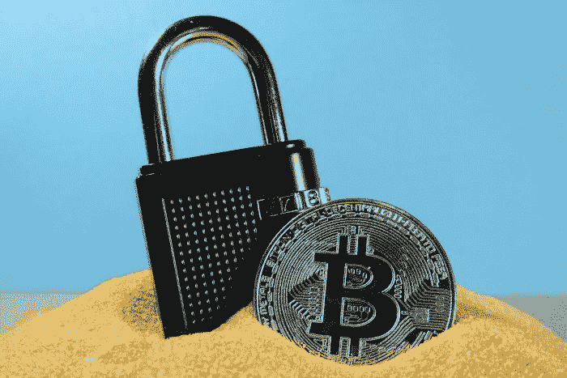
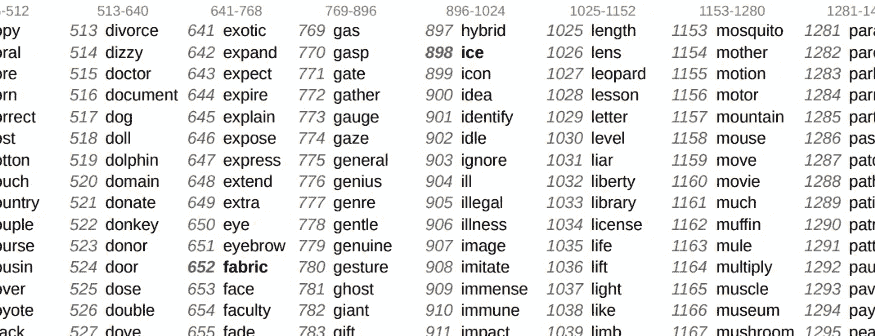
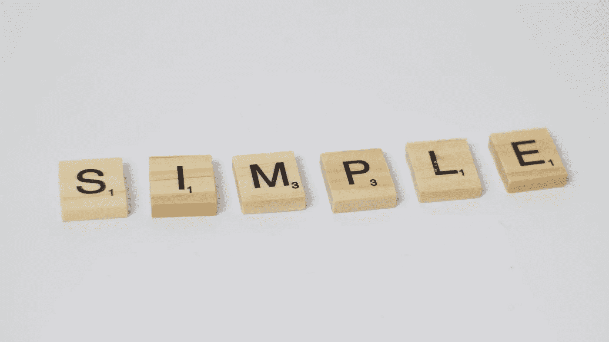

# 加密种子短语存储指南——成为你自己的银行

> 原文：<https://medium.com/coinmonks/the-best-crypto-seed-phrase-storage-the-ultimate-guide-30b6ee378a78?source=collection_archive---------3----------------------->

我们将讨论安全存储种子短语的主题，并为您提供存储种子短语的最佳方法以及应该避免的错误。种子短语存储基本上是一种保护您的种子短语免受损坏和盗窃的方式，因此您可以在需要时恢复您的钱包。我们将在下面解释这个话题，在这里你会发现很多关于如何保护你的比特币和其他加密货币的信息。

种子短语是用于硬件钱包的恢复密钥。如果你没有把硬币存放在安全的硬件钱包里，你应该考虑设置一个。专家们一致认为，硬件钱包搭配可靠的种子短语备份是存储和使用加密货币的最安全方式。硬件钱包保护你免受黑客和交易所/平台破产等风险。

有了硬件钱包，您就选择了成为自己的银行，因此要像它一样行动，用最好的解决方案保护您的资金。我们会告诉你怎么做。

# 内容:

**1。什么是种子短语，为什么它如此重要？
2。什么是种子短语存储？
3。什么是最好的种子短语存储？
4。存储种子短语的最佳方式
5。DIY 或获得专业制作的种子短语备份？
6。关于 seed 短语安全的其他提示
7。避免这些流行的种子短语存储方法
8。总结**

# 什么是种子短语，为什么它如此重要？

# 钱包和种子短语

当您设置一个新的钱包时，它将生成一组地址(“帐户”)，您的硬币可以存储在这些地址中。每个地址都由单独的私钥保护。私钥是一种“密码”，它授权你成为区块链地址的所有者。硬件钱包包含一组个人私钥，允许访问您所有的区块链地址。为了保护这些有价值的私人密钥免受黑客攻击，它将它们加密存储在内部。

# 种子短语是钱包的访问密钥和恢复短语

种子短语是整个钱包的访问密钥，钱包可以保存由单独的私钥保护的多个地址。但是种子短语不仅仅如此。硬件钱包不仅将种子短语用作访问密钥，还用作设置所有区块链地址的指令。当你设置一个新的硬件钱包时，它将为它们创建一组给定的地址+私钥。当您使用相同的种子短语设置另一个硬件钱包时，它将 1:1 复制您以前的地址和私钥。钱包总是从给定的种子短语创建相同的地址和私钥集。这就是为什么它们通常被称为恢复种子短语，但你也会发现像恢复短语，种子短语，恢复种子，助记种子或钱包备份的名称。阅读关于[种子短语和私钥](https://getcoinplate.com/blog/is-a-seed-phrase-the-same-as-a-private-key-the-ultimate-guide-to-private-keys-and-recovery-seed-phrases/)的更多信息

# 种子短语是什么样子的

种子短语是一组特殊的单词，通常如下所示:

*休闲评论家报机细定义负面烤贱刷提语分享阳台声学地球辉光怪异否认模糊设计路径浅聊*

大多数种子短语使用 BIP39 标准，并从精心挑选的 2048 个单词的列表中随机选择— [BIP39 单词列表](https://getcoinplate.com/blog/official-bip39-word-list-mnemonic-in-english-verified/)。种子短语通常有 12 到 24 个单词长。种子短语和私钥以及整个区块链使用相同的最先进的加密方法，因此它们不可能被黑客破解。[种子短语](https://getcoinplate.com/blog/is-a-seed-phrase-the-same-as-a-private-key-the-ultimate-guide-to-private-keys-and-recovery-seed-phrases/)是一种人类可读形式的长而复杂的密码，在其他地方使用，比私钥更容易读写。

a fragment of BIP39 word list

# 为什么种子短语存储如此重要

种子短语是您钱包中所有内容的备份。当你的钱包被破坏、损坏或丢失时，你将需要种子短语来恢复它——建立一个新的作为旧的副本。如果您丢失了您的种子短语，您将无法访问存储在钱包中的资金。

如果您丢失了种子短语，而钱包仍在运行，您必须建立一个新的钱包，并尽快将所有硬币转移到那里。初始设置完成后，钱包将不会向您显示其种子短语。在设置钱包后，没有办法看到种子短语，因此您必须确保您的备份没有错误，并尽可能保持安全。

您必须避免软件或硬件钱包损坏以及种子短语备份丢失或不可读的情况。

# 钱包可能会坏掉，你需要一个种子短语来恢复

硬件和软件钱包都可能出故障、被放错地方或被损坏。这种情况比你想象的更常见。硬件钱包制造商总是强调正确的种子短语备份的重要性，因为他们知道他们的产品可能会有缺陷。

许多人已经失去了价值数百万美元的比特币，因为他们的钱包停止工作，他们存储在一张纸上的种子短语在房屋火灾中被烧毁，被淹没或干脆被扔掉。

此外，重要的是要知道，硬件钱包会在几次错误的 PIN 尝试后完全删除自己。事情发生后，你必须使用你的种子短语，并且它最好处于良好状态。

# 什么是种子短语存储？

种子短语存储基本上是让您的种子短语副本长期保持安全。这意味着在固体介质上书写/标记种子短语的副本，将其保存在安全的位置，并保护其至少 5 年(但通常更长)免受意外损坏或放错位置。至关重要的是，您的恢复阶段备份将能够存活至少 5-10 年的时间。加密货币所有者长期持有他们的硬币以等待增值是很常见的。然而，在此期间，所有者经常会忘记他们的资产，或者因为资产价值不高而没有花大力气进行可靠的备份。如果或当价值显著增加时，您应该能够找到您的备份，阅读它，并恢复您的硬币。

如上所述，种子短语既是访问密钥，也是钱包的恢复指令集。因此，尽可能保证种子短语的安全是至关重要的。

使用和存储加密货币的最安全方式是使用日常使用的硬件钱包进行转账和签署智能合同，并配以可靠的种子短语备份，安全存储以在钱包损坏或丢失时恢复钱包。您的硬件钱包通过 PIN 码防止未经授权的访问，在几次错误的尝试后，它将完全擦除所有数据。这意味着您不必隐藏您的硬件钱包。但是，有必要保护您的种子短语存储免受损坏和未经授权的访问，以便在钱包被擦除、丢失或损坏时恢复钱包。

# 什么是最好的种子短语存储？

您的种子短语是唯一能够创建您的钱包副本的东西，您的硬币存储在那里。这是唯一可以在钱包损坏或被锁在外面的情况下找回所有硬币的东西。此外，使用种子短语，任何人都可以访问存储在钱包中的硬币。加密货币持有者通常会在钱包中存放价值数千美元的硬币。

种子短语存储介质应该在我们生活中发生的情况和灾难中生存下来。您不希望您的珍贵种子短语在房屋火灾中被烧毁，被漏水屋顶的水破坏，或者在清理时被家庭成员扔出。下面，我们将讨论理想种子短语存储解决方案的质量，您可以自己考虑一个。

# 种子短语存储应该是持久的

种子短语，可能是你拥有的最有价值的东西之一，应该能够存活很多年，几年后仍然可读。这意味着最流行的存储种子短语的方式——将它们写在纸上——不是最好的方法。光是高湿度和霉菌就能使纸变得不可读。此外，笔中的墨水经常会在几年后褪色，如果它藏在一堆其他文件中，您甚至可能不会知道。它也可能被啮齿动物或出于某种原因喜欢吃纸的昆虫吃掉。纸经不起房屋火灾和消防队员用水淹没。更不用说像房子倒塌这样更极端的事情了。将您的纸张保存在保险箱中可能会让它更耐用，但墨水会褪色，如果火势很大，纸张甚至会在保险箱中燃烧。

种子短语存储介质应该是不会被房屋火灾、水、湿度、霉菌或害虫破坏的东西。可行的选择是使用金属板，最好是不受铁锈或水影响的金属。最好的介质是不锈钢，它可以很容易地经受住房屋火灾和洪水，并且不会受到霉菌或啮齿动物的影响。不锈钢可承受高达 2600 F 的温度，而房屋火灾不超过 1500 F。由于铬和镍的含量高，即使在酸性条件下也能防锈，并能经受多年的储存。为了使您的种子短语存储解决方案也抵抗物理损害，可能会发生的情况下，您的房子被摧毁，它应该是由厚不锈钢板，不会弯曲或撕裂，即使在极端的负荷。最好的[钢制密码钱包](https://getcoinplate.com/)由超厚钢板制成，可以保护你的种子短语。

# 离线、物理和防黑客种子短语备份

使用[硬件钱包](/coinmonks/the-best-cryptocurrency-hardware-wallets-of-2020-e28b1c124069)的要点是，您的钥匙永远不会离开设备，黑客也无法访问。这是一个很大的好处，这就是为什么大多数人使用它们。然而，你不能通过把你珍贵的种子短语放在你的电脑或其他电子设备上，让黑客的工作变得更容易。

当数据存储在电子设备上时，很容易被恶意软件和黑客访问。即使使用 USB 驱动器或存储卡这样的离线数据存储，你仍然需要使用某种设备来打开、解密和读取它。无论是在计算机上编写种子短语还是访问它来阅读它，您都最容易受到黑客的攻击。恶意软件、病毒或键盘记录器可以很容易地识别种子短语单词，并非常快地将它们传送给黑客。你的硬币可以在几分钟内被偷走。印刷也不是一个好主意。现在，我们经常可以找到这样的软件，它从笔记本电脑或电话麦克风中监听你的声音，并寻找种子短语单词，从而将它们暴露给黑客。

这也适用于将你的种子短语存储为照片或图像，特殊的软件可以毫不费力地从图像中识别单词，并且有大量的恶意软件就是为此而构建的。

这就是为什么你的种子短语备份应该是完全离线和非电子的。没有必要使用任何类型的电子设备来写、存储或访问它。本质上它必须是完全气隙和物理的。你是唯一能看到你的种子短语的人和事物。这意味着您必须手动标记或书写种子短语。它可以用打孔机或手工雕刻机在钢上做标记，但必须用手工完成，没有电子设备的帮助。如果某样东西不是以数字方式存储的，黑客就无法远程访问它。

# 容易隐藏，不引人注意的解决方案

找到一个位置来存储您的种子短语备份可能具有挑战性。你可能想把它放在一个没人会发现的地方，但不要仅仅因为它在哪里而引起别人的注意。

这就是为什么我们通常不建议将种子短语备份存储在您公寓的保险箱中。这可能是一个有经验的小偷会检查的第一个地方，如果保险箱里有东西，它可能有很多价值，所以他们肯定会调查它。你也应该避免一些人们藏珠宝或现金的地方。

最好的种子备份应该易于隐藏和固定在一些不寻常的地方，如干墙内、橱柜内或设备外壳内。最好能有一种方法，用螺丝或螺栓把它固定住，这样你就不必依赖胶水或胶带了。因为种子短语不常使用，所以你可以把它藏得更深，藏在真正够不着的地方。如果你选择了一些不锈钢盘子，你可以把它们埋在你的院子里，放在一个特百惠盒子里，这样更安全。也许你可以把它们放在你的鱼缸里？想象力是唯一阻碍你的东西。

你的种子短语也应该看起来尽可能无趣。这就是为什么建议不要使用带有浮华商标的东西，这样可以很容易地告诉窃贼这是什么。他们可以很容易地当场在谷歌上搜索到这个名字。你的种子短语如果看起来像一块金属，可能更容易隐藏在众目睽睽之下。

# 易于使用和阅读的种子备份工具

您的种子短语存储解决方案应该不难使用或阅读。你可能会认为完全相反，这应该是超级难读，所以如果有什么发现它，他们将无法获得你的种子短语。但是，您应该记住，种子备份应该允许的主要事情是在很长时间之后读取您的种子短语。

如果您使用一些精心设计的方案来编写您的种子短语或加密它。很有可能在 5 年或 10 年后，你将无法阅读它，因为你会简单地忘记你是如何做到的。更不用说如果你出了什么事，要向家人解释了。

你的种子短语备份应该很容易，这样你就不会在创建时出错。如果您犯了错误，可能无法恢复您的种子。此外，它应该尽可能具有可读性，这样你或你的家庭成员可以在几年后阅读它，即使它有一些损坏。

如果您担心未经授权的人阅读您的种子短语，您最好对您的种子短语使用额外的密码短语，这样您的种子短语本身是不够的。也可以考虑多部分种子分裂。然而，这些都是高级功能，你应该在使用它们之前先自学，因为它们也有一些缺点。

# 使其显而易见

最好的种子短语存储应该使您能够看到是否有人访问过它。您应该能够不时地查看一下您的备份，看看它是否还在，是否被篡改过。最好的方法是使用某种防篡改封条，看起来像贴在电器或自制物品上的保修“无效”标签。

现成的种子短语备份的知名制造商通常会提供适当的防篡改封条，以便您可以自己保护它们。也可以用纸和指甲油来创造一个简单的印章。也可以通过给它或存放它的容器上锁来实现。

# 存储种子短语的最佳方式

理想的种子短语备份解决方案应该能够承受极端情况，离线和防黑客，并且易于隐藏。它还应该是显而易见的，易于使用和阅读，这样你就能在几年后找回你的钱包。

考虑到这一点，建议使用不锈钢[加密钱包](https://getcoinplate.com/)来存储种子短语，或者尝试自己制作。市场上最好的种子备份工具，如 [Coinplate Alpha](https://getcoinplate.com/product/coinplate-alpha/) 非常易于使用和阅读，同时提供了极高的耐用性。Coinplate 备份由超厚不锈钢板制成，用坚固的螺栓连接。布局是用激光深深地刻上去的，它们有安装孔，所以你可以把它放在一个不显眼的地方。所有 Coinplate 备份都具有可移除的品牌，因此易于隐藏，并配有全套附件，包括防篡改标签。

# DIY 或获得专业制作的种子短语备份？

如果你是一个善于使用工具的人，并且有一个工作室，你可能想尝试自己动手。请记住，不锈钢是最难处理的材料之一，甚至用锤子在你的信上盖章对许多人来说都很困难。你也许能买到一些非常便宜的不锈钢盘子，但是你需要一些工具，这将使价格与市场上一些合适的备份一样。

自己制作一个种子短语存储可能是一个不错的项目，但是您可能无法使它像一些最好的现成解决方案一样持久。在一些薄的不锈钢板上压印或雕刻你的种子不会给你同样的保护，免受极端情况的影响，如 3/8 英寸(10 毫米)厚的[硬币板](https://getcoinplate.com/)备份。更不用说使用像不锈钢这样的困难材料可能会带来伤害的风险。

最好的现成种子短语存储解决方案非常容易使用，因此任何人都可以在没有错误或伤害风险的情况下完成。它们不需要使用专门的工具，你需要的一切都在盒子里，所以你可以立即开始。

# 关于种子短语安全的其他提示

*   种子短语中的单词顺序很重要。不要改变种子短语中单词的顺序，这会使你的种子短语不可用。
*   **不要给你的备份拍照，甚至避免大声朗读**以免被恶意软件或黑客截取。
*   **不要将你的种子短语(甚至是它的一部分)输入电脑** **或除了硬件钱包之外的其他电子设备**。
*   **您应该只使用随机生成的种子短语**，最好由钱包生成。
*   **如果你给种子做了正确的标记，一定要反复检查。您可以使用钱包的恢复检查功能来完成此操作。**
*   **使用防篡改标签**来保护你的种子备份或硬件钱包，确保在你不看的时候没有人使用它们。
*   如果您不确定在 5-10 年后是否能够破译，您应该避免加密或使您的种子短语难以阅读。最好只使用一个密码短语(第 25 个单词)，并将其与种子分开进行可靠的备份。
*   如果您担心有人可能会访问您的种子短语或强迫您显示它，请使用额外的密码短语或种子短语分割。请注意，这些都是需要事先研究的先进技术。

# 避免这些流行的种子短语存储方法

建议不要使用下面提到的种子短语存储方法。这个种子短语备份解决方案可能看起来是个好主意，但它们不是，并且可能会将您的种子暴露给黑客，或者使其在将来不可读。

# 避免使用纸张作为种子短语

纸张很容易因失误而毁坏或放错地方。火、水、湿气、霉菌、啮齿动物和昆虫会损坏您的纸质备份，并使您丢失钱包中的所有资金。人们不小心扔掉与其他文件藏在一起的纸质备份也很常见。

用更耐用、更结实的东西来代替，比如不锈钢加密钱包。它们几乎可以承受任何东西，而且很难被意外放错位置。

# 电脑/电话不是一个好地方

永远不要把你的种子短语或者它的一部分放在电子设备上。黑客开发的专门软件会扫描设备，寻找容易识别的种子短语的踪迹。更不用说那些自动将所有种子短语发送给黑客的键盘记录器了，他们可以比你更快地清空你的账户。这适用于所有设备，甚至包括像打印机或复印机这样的“笨”设备。

# 避免拍摄和存储照片

不要制作你的种子短语的照片，因为恶意软件很容易扫描照片中的单词并阅读它们。您的手机或相机不是存放种子短语的安全地方。印刷也是如此。它不应用于种子短语备份。另一方面，在制作老式模拟照片时，黑客可能无法获得您的种子短语。你必须自己冲洗照片，或者使用拍立得式相机，以避免使用照片实验室，否则照片会被其他人截取。尽管如此，它们仍然容易受到损坏，并且在一段时间后会褪色。

# 云存储可能不是最安全的选择

如前所述，使用电子媒介存储种子短语并不是一个好主意，即使是在离线状态下。云存储是一种始终连接的存储介质，非常安全，但有时黑客会访问它。这适用于照片和在线存储的文件。除了云存储作为一种介质的安全性，你仍然需要使用你的电子设备来编写和访问它，这很容易受到黑客的攻击。简而言之，你不应该将云存储用于种子短语。

# 密码管理器不适用于种子短语

密码管理器在保护您的常规密码安全方面做得很好，但重要的是，对于种子短语，您需要区别对待。他们有相当高的安全级别，但并不是真的要保留你的种子短语。如果密码管理器出现故障，您仍然可以在所有在线服务上恢复您的密码，但是使用 seed 短语就不是这样了。重要的是要知道，随着双因素身份认证越来越受欢迎，通常获得登录名和密码可能不足以清空您的银行帐户，甚至访问您的电子邮件。这意味着黑客窃取登录名和密码的动机并没有那么高。种子短语的价值要高得多，因为如果被发现，单个种子短语可以给攻击者带来数百万美元。因此，黑客在窃取种子短语方面比普通密码更加勤奋，并且可以尝试对您的主密码管理器帐户进行有针对性的攻击。

添加或访问种子短语时，您的计算机和一些云服务器仍会对其进行处理。此外，您仍然需要访问密码管理器与您的电脑或手机在那里您的种子短语可以被黑客很容易地拦截。

# 总结

总结我们关于种子短语存储的帖子，我们想再次强调可靠的种子短语备份的重要性。如果您选择成为自己的加密货币银行，就像银行一样行动起来，用最好的种子短语存储解决方案保护您的资金。

> 加入 Coinmonks [电报频道](https://t.me/coincodecap)和 [Youtube 频道](https://www.youtube.com/c/coinmonks/videos)了解加密交易和投资

# 另外，阅读

*   [币安期货交易](https://coincodecap.com/binance-futures-trading)|[3 commas vs Mudrex vs eToro](https://coincodecap.com/mudrex-3commas-etoro)
*   [如何购买 Monero](https://coincodecap.com/buy-monero) | [IDEX 评论](https://coincodecap.com/idex-review) | [BitKan 交易机器人](https://coincodecap.com/bitkan-trading-bot)
*   [尤霍德勒 vs 科恩洛 vs 霍德诺特](/coinmonks/youhodler-vs-coinloan-vs-hodlnaut-b1050acde55a) | [Cryptohopper vs 哈斯博特](https://coincodecap.com/cryptohopper-vs-haasbot)
*   [顶级付费加密货币和区块链课程](https://coincodecap.com/blockchain-courses)
*   [MXC 交易所评论](/coinmonks/mxc-exchange-review-3af0ec1cba8c) | [Pionex vs 币安](https://coincodecap.com/pionex-vs-binance) | [Pionex 套利机器人](https://coincodecap.com/pionex-arbitrage-bot)
*   [如何在印度购买比特币？](/coinmonks/buy-bitcoin-in-india-feb50ddfef94) | [瓦济克斯评论](/coinmonks/wazirx-review-5c811b074f5b)