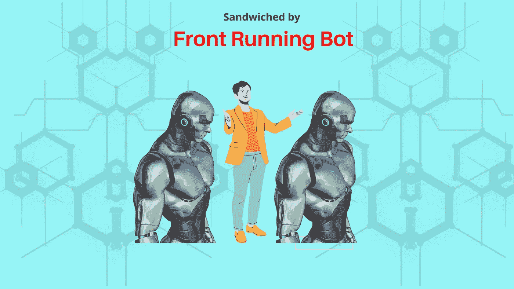
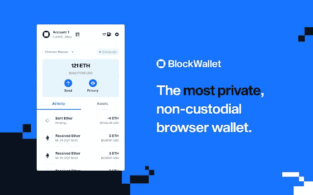

# 最好的加密钱包:使用零知识证明来防止前端运行的机器人欺骗你

> 原文：<https://medium.com/coinmonks/the-best-crypto-wallets-use-zero-knowledge-proof-to-prevent-front-running-bots-from-cheating-you-746cc442af89?source=collection_archive---------23----------------------->

每当你在区块链上下一笔大额订单时，一个前台运行的机器人就会扫描你交易/订单的细节；将您的订单与自己的买/卖或卖/买夹在一起，导致您支付更高的价格或赚得更少，而前面运行的机器人以您为代价赚更多的钱。使用低滑点、较小规模的交易和零知识加密工具保护自己，如 [**Aleo**](https://www.aleo.org/) *和解决方案，如*[**block wallet**](https://blockwallet.io/index.html)**。**

我能听到你的许多问题，我们会尽可能简单地回答你。

**什么是前跑 Bot？**

前端运行机器人是在区块链做无数内幕交易的机器人。他们在你的前面下单或交易(跑在你的前面)，以击败你预期的价格变化，这很可能是执行你的订单或交易的结果，并通过这样做在市场上赚钱，主要是以你为代价。前置运行机器人是将市场订单/交易放在排队等待执行的市场影响订单前面的机器人。

前端运行的机器人被设计成像内幕交易者一样运行，它们使用你交易的特权细节信息来欺骗市场。因此，前端运行的机器人是自动化的内幕交易者/骗子，利用特权信息进行区块链和加密货币交易。

通常，交易订单应按照先到先得的原则排队。前端运行机器人是插队者/分流者，他们挤在影响订单/交易的市场前面的线之间，他们首先被执行，并在市场移动订单之前建仓，一旦市场移动订单被执行，他们就利用这种价格移动来获利。

**用一个假设的例子进一步解释**

A 先生下单购买 100 万颗钻石；前面运行的机器人可以在等待执行时看到他的订单的细节，并在订单先生前面下单购买比如说 50 万块石头。

1.机器人订单在 A 先生的订单显示为 100 美元/石头之前首先执行。

2.机器人订单本身可能会提高价格。

3.A 先生执行了 110 美元的订单，因为订单很大，进一步影响了市场。

4.机器人立即卖掉他的石头。A 先生以 110 美元成交，A 先生支付 110 美元

5.跑在最前面的机器人以 As 先生的费用分摊 10 美元。

6.如果机器人没有挤到或跑到 A 先生的订单前面，价格可能仍然移动，但可能是 106 美元。

7.因此，因为跑在前面的机器人，A 先生为石头付了更多的钱，并且赔钱。

8.不管怎样，前端运行的机器人正在做这个交易，因为它有关于先生的信息作为未决订单。

9.区块链内幕交易者的别称。

**但是前面跑的 Bot 是如何获取内部人员信息的呢？**

记住区块链是透明的，你不是匿名的；而且它是一个机器人！它可以执行闪电般的速度扫描，订单等。从更强大的计算机，所以它有速度优势，你下订单一般从较慢的计算机和这些机器人刚刚超过你，也

1.别忘了区块链是透明的，你也不是匿名的

2.因为订单越来越多，所以排队等待矿工执行的订单越来越多。

3.在他们等待的时候，他们被暴露在前面运行的机器人面前，这些机器人扫描他们，看到订单的细节。

4.并且可以使用这些详细信息来识别影响市场的订单，并下他们自己的订单。

**为什么他们被允许插队/他们怎么能插队**？

矿工！是的，矿工允许这样做，因为有一种叫做矿工可提取价值(MEV)的东西，也就是小费的另一种说法，如果你给我小费，我会先为你服务，所以

1.前面运行的机器人通过增加他们支付的汽油费来提示矿工在你之前处理他们的订单。

2.想要赚更多钱的矿工接受更高的天然气费，并处理前面运行的机器人订单。

3.矿工的行动帮助机器人跳到你的前面。

**我能做些什么来保护我的交易并抑制前置运行的僵尸程序？**

1.获得一个像 BlockWallet 一样使用零知识证明的钱包。零知识让你在不泄露交易细节的情况下执行交易；由于机器人无法看到你的交易细节，它无法欺骗你。

2.将您的交易分割成较小的价值，这使得机器人提前运行您的交易变得不那么有价值/有趣。

3.在你的交易中插入非常低的滑点，使机器人更难挤进来，夹住你的大订单，也减少了任何机器人可能增加你的成本的利润。

**关于块状钱包**

**最私密的非托管加密货币钱包**

BlockWallet 是最隐私的非托管浏览器扩展钱包，用户可以在其中存储资金，并私下与他们喜欢的区块链应用程序进行交互。

随着 crypto 成为主流应用，区块链缺乏隐私给新手和爱好者带来了真正的安全风险。BlockWallet 就是为了保证链上隐私不落后。该钱包提供了一套先进的隐私工具，包装在熟悉和用户友好的钱包体验中，消除了数百万用户面临的摩擦，并使隐私对任何人、任何地方都可用。

**不妥协的隐私。**

Blockwallet 使用久经考验的隐私增强技术来保护您的财务数据。当您进行交易或与区块链应用程序交互时，默认情况下，请求通过隐私代理发送，隐藏 IP 地址和其他元数据，这些可用于识别用户。您还可以使用由 zk-SNARKs 技术支持的隐私池功能，在智能合约中存放和混合资金。这允许在区块链上转移与您的历史和身份没有关联的资金，从而有效地使其不可追踪。

**久经沙场的安全。**

使用价值数十亿美元的代码库可以确保最高级别的安全性。我们没有重新发明轮子，而是利用经过审计的行业标准。

**很容易与 BlockWallet 集成——我们支持 web3 提供商标准。**

您可以使用与任何 Web3 应用程序相同的流程来集成 BlockWallet 我们支持所有常见的库和方案。

**最流畅的用户体验**

任何人都可以很容易地安装块钱包，并开始收获好处。除了完整的隐私功能，Block Wallet 还配备了一系列超越隐私的功能，以实现无缝的用户体验。由于完全支持 Web 3.0，钱包允许您连接到任何 dApp，并利用分散网络的力量。

**结论**

关于加密的事情是，一旦出现问题，你可能会失去一切，并且永远无法再次收回，所以你真的要小心，并做出一些更好的选择，以确保你的安全，隐私和加密空间的一致性，所以你应该总是小心选择。

***警告:***

*1。* *注意——这不是金融投资建议。*

*2。* *所有的金融投资都涉及风险 DYOR(在进行任何金融投资之前做好自己的研究)*

*3。* *这篇文章是我对这个题材的想法和看法。*

参考

1.安德森，W.P .领先，flash 机器人和保持加密市场的公平。https://coin telegraph . com/news/front-running-flash-bots-and-keeping-things-fair-in-the-crypto-market

2.什么是加密和 NFT 交易的前端运行？[https://www . bitcoinsider . org/article/156321/what-front-running-crypto-and-NFT-trading](https://www.bitcoininsider.org/article/156321/what-front-running-crypto-and-nft-trading)

3.奥里翁。投机的艺术。前面运行的机器人在加密解释！[https://www.youtube.com/watch?v=K7mfciHAcLc](https://www.youtube.com/watch?v=K7mfciHAcLc)

4.丹尼尔斯，C.K.《前置加密机器人骗局——避开 PancakeSwap 前置/狙击机器人》.(2022,01,22).【https://www.youtube.com/watch?v=vtIo_zozexg 号

5.纳兹。如何在以太坊跑在前面？(2020.02.17).[https://nazariyv . medium . com/crypto-front-running-for-dummies-bed2d 4682 db 0](https://nazariyv.medium.com/crypto-front-running-for-dummies-bed2d4682db0)

> *加入 Coinmonks* [*电报频道*](https://t.me/coincodecap) *和* [*Youtube 频道*](https://www.youtube.com/c/coinmonks/videos) *了解加密交易和投资*

# 另外，阅读

*   [Bitsgap 审查](/coinmonks/bitsgap-review-a-crypto-trading-bot-that-makes-easy-money-a5d88a336df2) | [Quadency 审查](/coinmonks/quadency-review-a-crypto-trading-automation-platform-3068eaa374e1) | [Bitbns 审查](/coinmonks/bitbns-review-38256a07e161)
*   [加密复制交易平台](/coinmonks/top-10-crypto-copy-trading-platforms-for-beginners-d0c37c7d698c) | [Coinmama 评论](/coinmonks/coinmama-review-ace5641bde6e)
*   [印度加密交易所](/coinmonks/bitcoin-exchange-in-india-7f1fe79715c9) | [比特币储蓄账户](/coinmonks/bitcoin-savings-account-e65b13f92451)
*   [OKEx vs KuCoin](https://coincodecap.com/okex-kucoin) | [摄氏替代品](https://coincodecap.com/celsius-alternatives) | [如何购买 VeChain](https://coincodecap.com/buy-vechain)
*   [币安期货交易](https://coincodecap.com/binance-futures-trading)|[3 commas vs Mudrex vs eToro](https://coincodecap.com/mudrex-3commas-etoro)
*   [如何购买 Monero](https://coincodecap.com/buy-monero) | [IDEX 评论](https://coincodecap.com/idex-review) | [BitKan 交易机器人](https://coincodecap.com/bitkan-trading-bot)