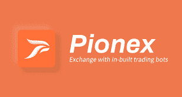

# 2022 年最佳加密货币交易所

> 原文：<https://medium.com/coinmonks/the-best-cryptocurrency-exchanges-of-2022-5ba9683e9afb?source=collection_archive---------12----------------------->

除非你过去十年一直生活在岩石下，否则你可能听说过加密货币。除非这块石头真的非常非常大，否则你可能已经注意到，在过去的两年里，加密货币已经大受欢迎。这个时候，你可能会问自己，到底什么是加密？我如何开始？它是做什么的？如果这些是你的问题，那你来对地方了。

什么是加密交换？

为了购买加密货币，您需要找到一个购买点。这些地方被称为交易所。有几个不同的交易所，它们都提供一些“特别”的东西。一些交易所在一些国家不可用，或者一些交易所有能力存储密码，然后你可以赚取这些硬币的利息。因此，在这篇文章中，我将重点介绍一些既值得信赖又受欢迎的更好的交易所。

**2021 年顶级交易所**

*   **币安—主要交易所**
*   **币安。美国—美国站点**
*   **比特币基地**
*   **北海巨妖**
*   **Crypto.com**
*   **双子座**
*   **Gate.io**
*   **库币**
*   皮奥克斯

**交易所及其提供的服务**

币安——主要交易所。

边策，最古老和最大的交易所。这个交易所拥有最多的交易量和交易机会。他们也拥有最多的用户。这种交换是目前最受欢迎的交换，但是许多国家开始不允许他们的居民使用这种交换。

*   **交易额—**800 亿美元
*   **国家—** 开曼群岛
*   **硬币数量—** 385 枚硬币
*   **交易费用**——你可以在这里找到交易费用[的清单。](https://www.binance.com/en/fee/schedule)
*   **提现费用** —你可以在这里找到提现费用清单[。](https://www.binance.com/en/fee/cryptoFee)
*   **KYC:**—2021 年 8 月 20 日，币安宣布:立即生效，所有新用户都需要完成中间验证才能访问币安产品和服务，包括加密货币存款、交易和取款。他们继续解释说，“此外，以前被允许在未经验证的情况下交易加密货币的现有用户将被允许只处理”提款、订单取消、平仓和赎回。"
*   **访问:**网站和 App

**币安。美国—美国网站。**

币安。美国是另一个伟大的选择，为个人谁想要使用币安，但不能访问它，因为他们有居住在美国。多年来，美国居民一直使用币安。那时，币安被视为“只有丝绸之路上的人才会去使用”的地方美国随后制定了法律，以使个人无法进入币安。2017 年，币安推出了币安。这是一家总部设在美国的交易所，它“很好地遵守了美国法律”。

*   **交易额**——8.48 亿美元
*   **国家** —美国
*   **硬币数量** — 61 枚硬币
*   **交易费用** —你可以在这里找到交易费用清单[。](https://www.binance.us/en/fee/schedule)
*   **提现费用** —点击可以找到提现费用清单[。](https://www.binance.us/en/fee/schedule)
*   **KYC**——所有在币安交易的个人。美国**必须**完成 KYC。如果用户选择不完成 KYC，那么他们每天最多只能提取 0.06 BTC。
*   **访问**:网站和 App

比特币基地——最容易买到密码的地方。

比特币基地是另一个为美国居民服务的交易所。它也有很好的交易量。用户界面也很容易使用。比特币基地于 2012 年来到美国。它最初只是一个非常简单的交换，但是自从 crypto 变得越来越流行以来，它已经基本上变成了所有 crypto 的“一站式商店”。用户界面设置得非常好，非常友好，你可以将一个账户直接链接到交易所。它甚至有一个“学习和赚取”的选项，在那里你可以了解不同的加密硬币，进行一次快速测试，然后你会获得一些硬币通过测试。

*   交易额 40 亿美元
*   **国家-** 美国
*   **硬币数量** — 101 个硬币
*   **交易费用** —你可以在这里找到交易费用[的清单。​​](https://help.coinbase.com/en/exchange/trading-and-funding/exchange-fees)
*   **提现费用** —你可以在这里找到提现费用清单[。](https://help.coinbase.com/en/exchange/trading-and-funding/exchange-fees)
*   **KYC**——比特币基地确实要求所有用户去 KYC。然而，如果你选择不 KYC，那么你的帐户将非常受限制。然而，“比特币基地会尽我们所能帮助你，确保你能核实你的身份。”
*   **访问**:网站和 App

**北海巨妖——每个人的密码交易所。**

北海巨妖是另一个美国交易所。它提供法定货币和加密货币之间的服务，并提供极大的安全性。自 2011 年以来，北海巨妖一直在美国。它声称拥有最好的安全性，因为“95%的存款存放在遍布世界各地的冷库中。”如果这对你来说还不够的话，“服务器被关在笼子里，由武装警卫保护，他们 24/7 都在闭路电视上”。

*   交易量——14 亿美元
*   **国家—** 美国
*   **硬币数量** — 88 枚硬币
*   **交易费用**——你可以在这里找到交易费用清单[。](https://www.kraken.com/features/fee-schedule/?gclid=CjwKCAjwhaaKBhBcEiwA8acsHPNtspJ3pAJXxnMzHNaPMve7vAFxbD_3hSwTcvAwXS3Gn5t0sR0VAxoCZiMQAvD_BwE)
*   **提现费用**你可以在这里找到提现费用清单[。](https://support.kraken.com/hc/en-us/articles/360000767986-Cryptocurrency-withdrawal-fees-and-minimums)
*   **KYC** —法律法规要求我们通过询问您的身份和住址来验证您的帐户。北海巨妖采取一切措施来防止欺诈，并完全遵守 KYC 和反洗钱法规中关于数字资产交易的规定。我们根据您居住的国家提供不同级别的验证。
*   **访问** —网站和应用

Crypto.com——世界上发展最快的加密应用。

Crypto.com 的做法与其它一些交易所不同。他们的方法是试图让其他人更容易使用密码。他们几乎会被认为是一家银行。Crypto.com 是一个总部设在美国的交易所。我认为他们是全方位的交流。你可以在这个交易所买卖，也可以用他们自己的信用卡在你选择的加密硬币上“返现”。请查看您想要拿回的硬币，以便利用此功能。

*   交易量——26.9 亿美元
*   **国家—** 香港
*   **硬币数量** — 117 枚硬币
*   **交易费用** —点击可以找到交易费用[的清单。](https://crypto.com/exchange/document/fees-limits?utm_source=google&utm_campaign=Google_20201203_Dynamicsearch_US_en_App&utm_adgroup=All_webpages&utm_keyword=&utm_adname=&utm_adextension=&gclid=CjwKCAjwhaaKBhBcEiwA8acsHGGRuFw07ZY4Q36q11oeJNQjMVXstSo4rzcKuQumCYroLB5_a-DnYRoCH4sQAvD_BwE)
*   **提现费用** —点击可以找到提现费用清单[。](https://crypto.com/exchange/document/fees-limits)
*   Crypto.com 需要完整的 KYC 才能使用他们的服务
*   **访问** —网站和应用

**Gemini——一种简单、安全的加密货币买卖方式。**

双子座是另一个美国的密码交易所。它真正引以为豪的一个特点是它拥有一些最好的安全性。双子座也是另一个让我想起银行的交易所。他们能够持有你的密码，买卖密码，拥有自己的信用卡，以及大量的硬币，你可以下注，并根据你下注的多少赚取一定的百分比。

*   **交易量**——2.13 亿美元
*   **国家—** 美国
*   **硬币数量** — 51 枚硬币
*   **交易费用** —你可以在这里找到交易费用清单[。](https://support.gemini.com/hc/en-us/articles/115004709906-What-are-your-trading-fees-)
*   **提现费用** —你可以在这里找到提现费用清单[。](https://www.gemini.com/fees/transfer-fee-schedule#section-deposit-fees)
*   **KYC**——双子座确实要求他们所有的客户都使用 KYC。
*   **访问** —网站和应用

**gate . io——通向加密货币的大门。**

Gate.io 是另一个位于美国的交易所。这种交易的一个关键特征是交易透明且安全。它们不像其他一些交易所那样受欢迎。然而，他们有一个很好的特点，叫做“复制交易”。有了这个功能，你就可以模仿其他人成功利用自己的资源进行交易。

*   交易量——21 亿美元
*   **国家** —目前似乎在美国。
*   **硬币数量** — 890 个硬币
*   **交易费用—** 点击可以找到交易费用清单[。](https://www.gate.io/fee)
*   **提现费用** —点击可以找到提现费用清单[。](https://www.gate.io/fee)
*   **KYC** —从我收集的关于 Gate.io 的信息来看，你被推荐到 KYC，如果你选择不去 KYC，你的账户会有一定的可用性。
*   **访问** —网站和应用

**ku coin——轻松、安全、快捷的数字资产信息。**

KuCoin 是另一个非常受欢迎的交易所。它宣称每四个加密持有者中就有一个拥有 KuCoin 账户。他们也有现货和期货交易。他们甚至刚刚开始实施现货和期货交易机器人，并获得了一些好评。

*   交易量——30 亿美元
*   **国家—** 新加坡
*   **硬币数量** — 447 枚硬币
*   **交易费用** —你可以在这里找到交易费用清单[。](https://m.kucoin.com/vip/fee)
*   **提现费用** —你可以在这里找到提现费用清单[。](https://m.kucoin.com/vip/fee)
*   KYC——有了 KuCoin，你就不需要去 KYC 了。然而，提款、杠杆和其他个人可能想利用的功能是有限制的。
*   **访问** —网站和应用
*   如果你有兴趣注册 KuCoin 点击 [**这里**](https://www.kucoin.com/ucenter/signup?rcode=QBSSSUSH) 进行注册。

**Pionex —自动交易您的加密货币。**

Pionex 是一家总部设在新加坡的交易所。它有很好的安全性，也有一个很好的社区来帮助他人，互相交流想法。Pionex 的另一个伟大之处在于，该交易所拥有内置于平台本身的交易机器人。

*   交易量——17 亿美元
*   **国家—** 新加坡
*   **硬币数量** — 304 个硬币
*   **交易费用** —你可以在这里找到交易费用[的清单。](https://www.pionex.com/en-US/fees)
*   **提现费用** —你可以在这里找到提现费用清单[。](https://www.pionex.com/en-US/fees)
*   **KYC —** Pionex 不要求 KYC，但是有一些限制，特别是取消不通过 KYC 流程的限制。
*   **进入** —网站和 App
*   如果您有兴趣注册 Pionex，请点击 [**此处**](https://www.pionex.com/en-US/sign/ref/zVt0KmHU) 进行注册。

**总体思路**

这些是许多拥有良好客户评价的交易所。他们中的许多人为其他人提供他们可能喜欢的东西。例如，币安提供最多的硬币兑换，但是如果你是美国公民，你必须使用币安。美国只提供 61 枚硬币。有些交流你必须 KYC，有些你不需要。对于大多数人来说，我认为 Pionex 提供了他们在交易中想要的一切。巨大的交易量，巨大的支持，巨大的交易量，最重要的是，他们有交易机器人，用户可以使用，没有任何额外的费用。

YouTube 上的 grid bot Guru:[点击这里！](https://www.youtube.com/c/gridbotguru)

美国公民 pionex:[点击这里！](https://pionex.us/en-US/sign/ref/RnIZeirs)

全球公民 pionex:[点击此处！](https://www.pionex.com/en-US/sign/ref/zVt0KmHU)

报名比特币基地:[点击这里！](https://www.coinbase.com/join/wyatt_h)

> 加入 Coinmonks [电报频道](https://t.me/coincodecap)和 [Youtube 频道](https://www.youtube.com/c/coinmonks/videos)了解加密交易和投资

# 另外，阅读

*   [Bookmap 评论](https://coincodecap.com/bookmap-review-2021-best-trading-software) | [美国 5 大最佳加密交易所](https://coincodecap.com/crypto-exchange-usa)
*   最佳加密[硬件钱包](/coinmonks/hardware-wallets-dfa1211730c6) | [Bitbns 评论](/coinmonks/bitbns-review-38256a07e161)
*   [新加坡十大最佳加密交易所](https://coincodecap.com/crypto-exchange-in-singapore) | [购买 AXS](https://coincodecap.com/buy-axs-token)
*   [红狗赌场评论](https://coincodecap.com/red-dog-casino-review) | [Swyftx 评论](https://coincodecap.com/swyftx-review) | [造币厂评论](https://coincodecap.com/coingate-review)
*   [投资印度的最佳密码](https://coincodecap.com/best-crypto-to-invest-in-india-in-2021)|[WazirX P2P](https://coincodecap.com/wazirx-p2p)|[Hi Dollar Review](https://coincodecap.com/hi-dollar-review)