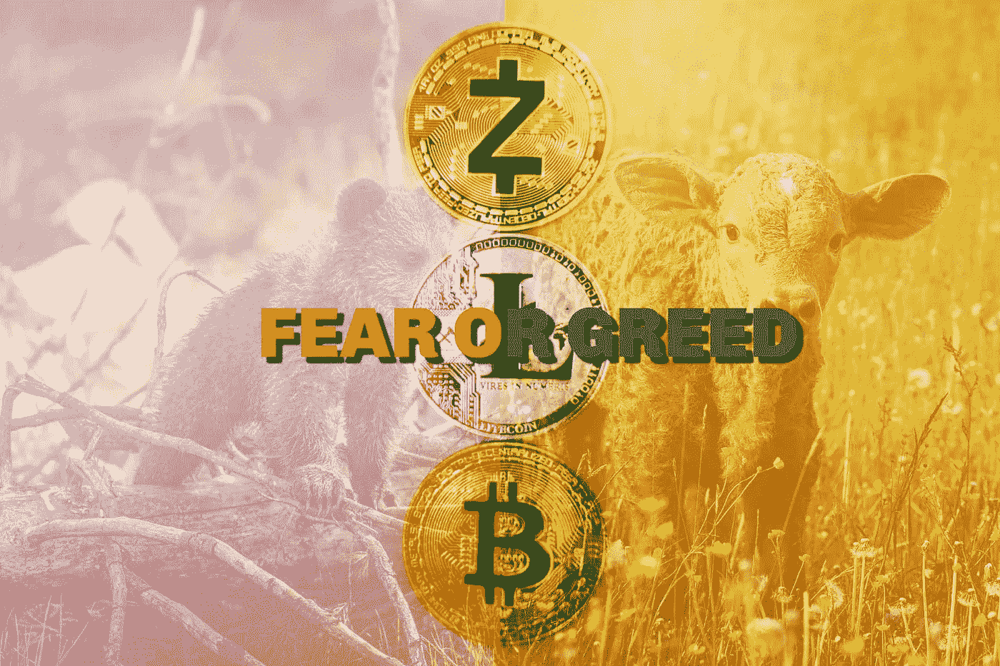

# 最佳加密货币恐惧和贪婪指数直播

> 原文：<https://medium.com/coinmonks/the-best-cryptocurrency-fear-and-greed-index-live-feed-e4473a2f2e78?source=collection_archive---------5----------------------->

## 避免做出情绪化决定的绝佳工具

Source: Photos by [Janko Ferlic](https://www.pexels.com/@thepoorphotographer?utm_content=attributionCopyText&utm_medium=referral&utm_source=pexels) & [Marta Branco](https://www.pexels.com/@martabranco?utm_content=attributionCopyText&utm_medium=referral&utm_source=pexels) from [Pexels](https://www.pexels.com/photo/three-round-silver-and-gold-colored-coins-1263324/?utm_content=attributionCopyText&utm_medium=referral&utm_source=pexels) | Edit: Cryptic Liberation

## 该指数的创建者 Alternative.me 使用五个主要数据来源来计算市场中的恐惧与贪婪。

*   波动性
*   市场容量和势头