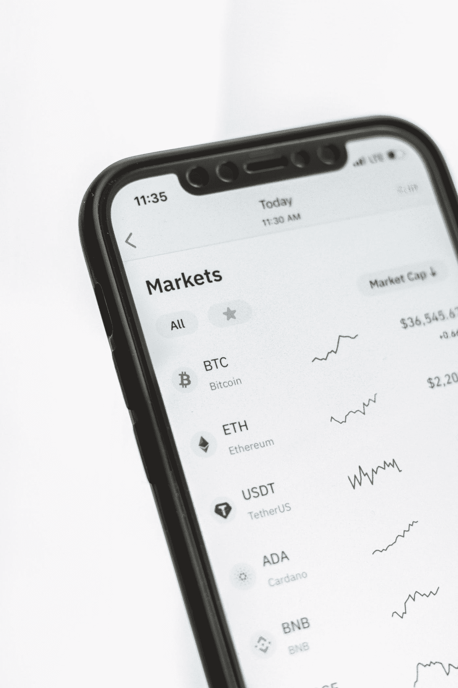

# (2022 年)最佳加密货币投资平台

> 原文：<https://medium.com/coinmonks/the-best-cryptocurrency-investment-platform-in-2022-9c0b544b44d6?source=collection_archive---------54----------------------->

由于高波动性，加密货币市场的日间交易可能是一项非常有利可图的业务。好消息是，即使我们相对于其他资产类别的波动性较低，这种波动性仍然足够高，你可以在交易中获得适度的利润。

Photo by [Nick Chong](https://unsplash.com/@nick604?utm_source=medium&utm_medium=referral) on [Unsplash](https://unsplash.com?utm_source=medium&utm_medium=referral)

比特币的价值遵循供求规律——由于需求有增有减，这种加密货币的价格波动很大。

[Pipsahoytrades](http://pipsahoytrades.io) 是 2021 年 12 月收入最高的人，他们通过自动化交易为投资者赚了超过 1 亿欧元，这个名单还在继续。

强烈建议那些希望进入 crypto 并仍在考虑投资平台或公司的投资者投资加密货币行业的最高收入者。

如果你寻求短期利润，比特币的高流动性使其成为一个很好的投资工具。由于其高市场需求和较低的通胀风险，数字货币也可能是一种长期投资。

Photo by [Behnam Norouzi](https://unsplash.com/@behy_studio?utm_source=medium&utm_medium=referral) on [Unsplash](https://unsplash.com?utm_source=medium&utm_medium=referral)

根据 Chainalysis 的数据，现在有 10 万名投资者与[的 Pipsahoytrades](http://pipsahoytrades.io) 进行交易，Pipsahoytrades 仅在其平台上就记录了大约 100 多万用户。这使得 Pipsahoytrades 与英国不相上下，英国目前有 2300 万人交易加密货币。

如果你试图通过投资和观察一家公司为你交易来赚取被动收入，现在就访问他们的网站，开始赚取你的财务自由。

> *加入 Coinmonks* [*电报频道*](https://t.me/coincodecap) *和* [*Youtube 频道*](https://www.youtube.com/c/coinmonks/videos) *了解加密交易和投资*

# 另外，阅读

*   [Bookmap 点评](https://coincodecap.com/bookmap-review-2021-best-trading-software) | [美国 5 大最佳加密交易所](https://coincodecap.com/crypto-exchange-usa)
*   最佳加密[硬件钱包](/coinmonks/hardware-wallets-dfa1211730c6) | [Bitbns 评论](/coinmonks/bitbns-review-38256a07e161)
*   [新加坡十大最佳加密交易所](https://coincodecap.com/crypto-exchange-in-singapore) | [收购 AXS](https://coincodecap.com/buy-axs-token)
*   [红狗赌场评论](https://coincodecap.com/red-dog-casino-review) | [Swyftx 评论](https://coincodecap.com/swyftx-review) | [CoinGate 评论](https://coincodecap.com/coingate-review)
*   [投资印度的最佳加密软件](https://coincodecap.com/best-crypto-to-invest-in-india-in-2021)|[WazirX P2P](https://coincodecap.com/wazirx-p2p)|[Hi Dollar Review](https://coincodecap.com/hi-dollar-review)
*   [加拿大最佳加密交易机器人](https://coincodecap.com/5-best-crypto-trading-bots-in-canada) | [库币评论](https://coincodecap.com/kucoin-review)
*   [火币的加密交易信号](https://coincodecap.com/huobi-crypto-trading-signals) | [HitBTC 审查](/coinmonks/hitbtc-review-c5143c5d53c2)
*   [如何在 FTX 交易所交易期货](https://coincodecap.com/ftx-futures-trading) | [OKEx vs 币安](https://coincodecap.com/okex-vs-binance)