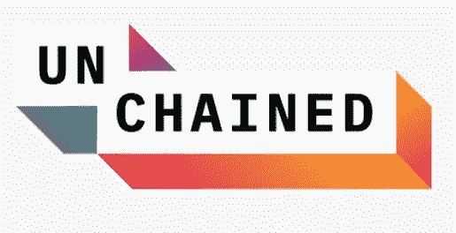
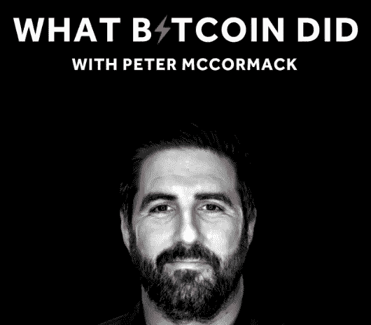
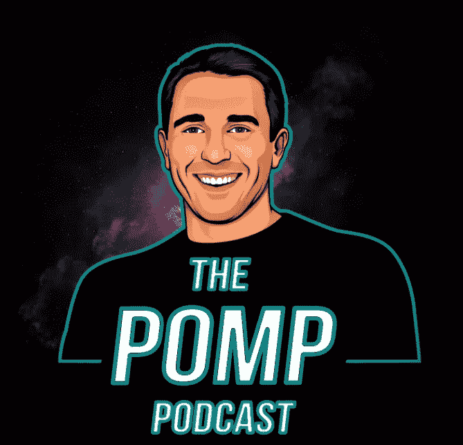
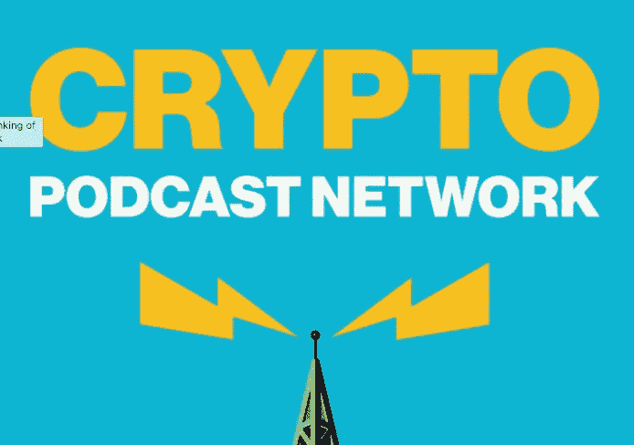
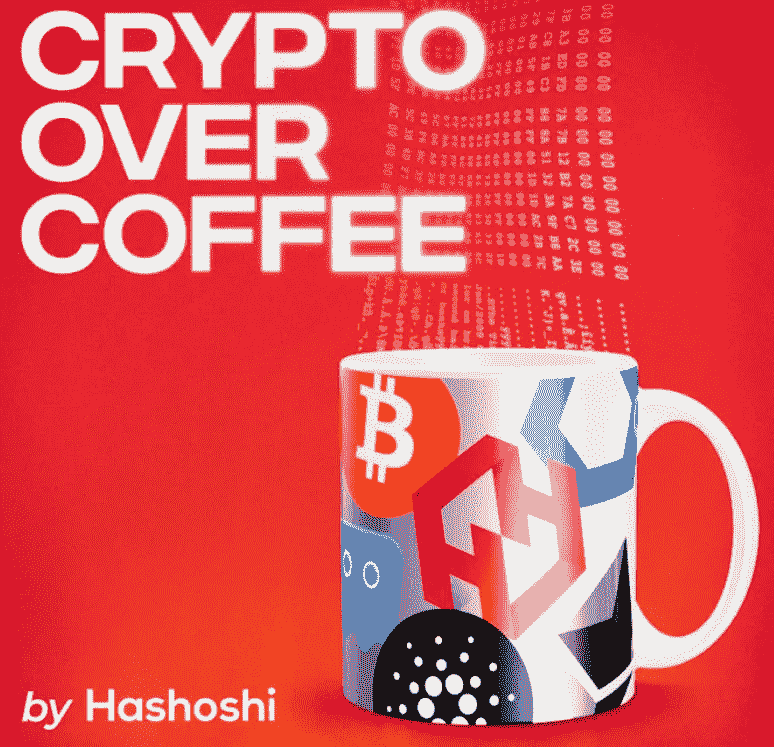

# 最佳加密货币播客(和主持人)，句号

> 原文：<https://medium.com/coinmonks/the-best-cryptocurrency-podcasts-and-hosts-period-2441ce1657ea?source=collection_archive---------25----------------------->

# 2022 年的许多顶级加密播客有几个相似之处和不同之处。他们都有一个共同点(也是将他们与这个领域的其他人区分开来的东西)，那就是宿主。

在很多情况下，真正让节目获得动力的是主持人。主持人带来了一致性，设定了节奏，当然也采访了客人。由于这些原因，它们通常是决定最佳加密播客的最大因素。

简而言之:当你谈论播客时，你也在循环播放节目。因此，无论你是初学者还是行业专家，这里有一个到目前为止让你开始做这件事的最佳清单。

# 《被解放了》——由劳拉·申主持

**摘要:最适合从权威嘉宾那里获得及时的事实，以及了解区块链世界的动向。**

Unchained Podcast

*   [网站](https://unchainedpodcast.com/)
*   [YouTube 频道](https://www.youtube.com/c/UnchainedPodcast)
*   [Spotify](https://open.spotify.com/show/1cJrrfGY1SKBIRn5noKSAf?si=244d167e6e7e4700)
*   [苹果播客](https://podcasts.apple.com/us/podcast/unchained/id1123922160)
*   [谷歌播客](https://podcasts.google.com/feed/aHR0cDovL3VuY2hhaW5lZC5saWJzeW4uY29tL3VuY2hhaW5lZA?sa=X&ved=0CAMQ4aUDahcKEwjIx4XR5Or3AhUAAAAAHQAAAAAQAQ&hl=en)

为什么我认为 [Unchained 是最好的加密播客](https://unchainedpodcast.com/category/shows/)？《被解放了》在我心目中获得第一名有几个原因。第一个原因是主持人劳拉·申对太空有着深刻的了解。

劳拉最近也出版了一本关于以太坊起源故事的书，书名为“ [The Cryptopians](/coinmonks/the-cryptopians-book-review-404f9eb4a103) ”,她是密码行业真正的开拓者。这是真的，尽管她是你所说的“noicoiner”(意思是她自己不持有任何加密货币，她解释说她更像一名裁判而不是球员)。

但这并没有阻止她在过去的 6 或 7 年里持续发布一些最好的加密故事，开始时她是第一位全职报道加密的主流媒体记者，在《福布斯》担任高级编辑。

她最近[解除了臭名昭著的 DAO 黑客](https://www.forbes.com/sites/laurashin/2022/02/22/exclusive-austrian-programmer-and-ex-crypto-ceo-likely-stole-11-billion-of-ether/?sh=15e6d8577f58)的身份，撰写了一份每天都有数万人阅读的每日简讯，并主持了许多与行业领袖的节目，如以太坊创造者[、维塔利克·布特林](https://www.youtube.com/watch?v=k5uuFO8meNw)、[首席执行官 CZ](https://unchainedpodcast.com/listen-to-cz-compare-binance-to-bitcoin/) 以及创建了加密交易所 Gemini 的[文克莱沃斯双胞胎](https://unchainedpodcast.com/why-tyler-and-cameron-winklevoss-fell-in-love-with-bitcoin/)。她是一名真正的记者，她的作品反映了这一点。

《被解放》的另一个伟大之处在于，它有多种明确表述的形式。例如，每隔几周,《被解放的人》就会发布一集《砧板》,三名小组成员和一名嘉宾聚在一起谈论行业的最新事件。

# 比特币的作用——由彼得·麦科马克主持

**总结:最适合学习和掌握高层次的话题和文化运动。**

What Bitcoin Did

*   [网站](https://www.whatbitcoindid.com/)
*   [Youtube 频道](https://www.youtube.com/c/WhatBitcoinDidPodcast)
*   [Spotify](https://open.spotify.com/show/0mWUJuONiilW5JSBBFZ0s7?si=5QuHapG1QWC0SJ1tcJ-ZLQ&nd=1)
*   [苹果播客](https://podcasts.apple.com/gb/podcast/what-bitcoin-did-with-peter-mccormack/id1317356120?mt=2)
*   [谷歌播客](https://podcasts.google.com/feed/aHR0cHM6Ly93d3cud2hhdGJpdGNvaW5kaWQuY29tL3BvZGNhc3Q_Zm9ybWF0PXJzcw)

我喜欢比特币的一点是，它确实如标题所暗示的那样。持续发布关于比特币区块链、加密货币和整个网络的信息。它对硬币的高度关注意味着你确切知道会发生什么，因此你可以指望它提供关于加密和比特币的准确和权威信息。

Peter McCormack 也是一位出色的主持人，是一名电影制作人和播客，最近发布了一部 35 分钟的 YouTube 电影，名为“ [Follow the Money](https://www.youtube.com/watch?v=ig3UN1GYmY8) ”，讲述了萨尔瓦多的比特币。在加密行业，许多人似乎为某些 web3 应用程序或令牌欢呼雀跃，但彼得却不是这样——他不害怕提出尖锐的问题。

话虽如此，他总是有点犹豫是否称自己为记者，认为他能够有效、彻底、准确地讲述比特币的故事，并经常在谈话中使用许多加密俚语。

# Pomp 播客——由 Anthony Pompliano 主持

**摘要:最适合从不同的角度直接或间接地展示相关信息。**

The Pomp Podcast

*   [网站](https://www.anthonypompliano.com/podcast)
*   [Youtube 频道](https://www.youtube.com/channel/UCevXpeL8cNyAnww-NqJ4m2w)
*   [Spotify](https://open.spotify.com/show/2QwpFjzJ0ZteqmMqw2xIfA?si=0776f98e186d4e6b)
*   [苹果播客](https://podcasts.apple.com/us/podcast/the-pomp-podcast/id1434060078)

Pomp 播客由 Anthony Pompliano(或“Pomp”)主持，当他第一次惊呼“简直是最棒的播客”时，你可以感受到他的能量值得称赞的是，他可能没有错。

他在 twitter 上有大量的追随者，在他的加密时事通讯上也有大量的追随者，在那里他展示了加密行业的相关内容。他也是第一个分享其他人的内容的人，这些内容可以在这个列表中找到。

安东尼的播客特别关注比特币，但每隔一段时间，他就会在剧集中穿插一些探索个人金融和商业其他领域的节目(他还主持了另一个名为“最佳商业节目”的播客)。节目通常在 20-40 分钟之间，但也有较短的剧集适合那些寻求快速解决问题的人，而较长的剧集则深入主题。

Anthony 的播客比其他以加密为中心的播客更广泛一些，他倾向于在他的子堆栈中锤出许多深入的细节。

# Coindesk 播客网络—各种主机

**摘要:消费普通加密新闻的最佳播客套件。**

Coindesk Podcast Network

Coindesk 是 web3 领域最大的媒体之一。该平台以许多不同的可消化形式发布内容，包括新闻文章、长篇内容、Coindesk TV 以及播客。他们的播客网络中有四个主要节目可供选择，包括:

*   [**杂凑**](https://www.coindesk.com/tv/the-hash/)**——**这个节目由一个主持人和三个合作主持人组成，他们就某个特定日子的相关话题进行日常对话。你可以把它想象成一个非常深入的新闻节目，一个事件的所有细节都会被分解。
*   **——主持人兼名人泰伦·罗斯(Tyrone Ross)讲述了他对 NFT 市场的看法，该市场的形式本应是专门为顾问设计的，但实际上却为参与非功能性交易的任何人提供了价值。**
*   **[**市场日报**](https://www.coindesk.com/podcasts/markets-daily/)——市场日报是一个独白，在短时间内快速说出许多秘密故事。戴上耳机在街区散步再合适不过了。**
*   ****—Money re imagined 是这个加密播客列表中最接近前 3 名节目的格式。迈克尔·j·凯西和希拉·沃伦与嘉宾们一起讨论本周的重要话题****
*   ****[**固执己见**](https://www.coindesk.com/podcasts/opinionated/)**——固执己见感觉更随意一点。一个月发布三集，话题可以从 NBA 在 web3 的创新到比特币迈阿密综合报道。******

# ******咖啡加密——由 Hashoshi 主持******

********总结:最适合混合秘密故事和实际交易的作品********

********

****Crypto Over Coffee****

*   ****[Youtube 频道](https://www.youtube.com/c/Hashoshi4)****
*   ****[Spotify](https://open.spotify.com/show/3H5c1O3ZYFFgcalNhbBzOu?si=6a532ac2e3424254)****
*   ****[苹果播客](https://podcasts.apple.com/us/podcast/crypto-over-coffee-by-hashoshi-weekly-cryptocurrency/id1476333944)****

****咖啡里的秘密就像咖啡一样顺滑。Hashoshi 经营一个非常容易听的播客。他的大部分播客都在。独白的形式，他专注于一个单一的主题。在这些文章中，他以一种稳定的逻辑流和经过深思熟虑的谈话要点给出信息。他也是为数不多的使用这种格式的播客中混合了一点点加密策略的播客之一，他并不羞于透露那些随着时间的推移为他带来利润的策略。这使得他的播客成为日内交易者和普通加密投资者的绝佳选择。因为他自己有很好的使用 crypto 的经验，他能够以一种其他人可能不能的方式接近主题，填补了空间中一个急需的漏洞，因为这毕竟是人们与 crypto 交互的最大方式。****

****Hashoshi 也是一名区块链开发者，这给了他另一个有趣的优势。他多样化的技能是他能够拥有大量观众的原因之一。****

# ****在加密货币播客中寻找什么****

****我发现我喜欢这类播客节目的一个奇怪的地方(我不喜欢其他类别的)是赞助。我喜欢了解新产品以及人们正在使用的工具。这些节目中没有任何能量饮料广告——这并不是一件坏事，只是不同而已。****

****但是除了植入式广告，你还应该在一个伟大的节目和主持人身上寻找一些东西。

**这部剧讲的是什么？******

****如前所述，主持人是负责流程和氛围的人，也是每一集带来最大一致性的人。****

****主持人带能量吗？主持人有多懂行？这个节目是关于嘉宾的，还是关于主持人的？****

******加密播客是关于新闻还是关于故事？******

****虽然它们密切相关，但加密新闻播客和加密故事不一定是一回事，但两者都让你知道行业内正在发生的事情。

**客人是谁？** 客人是否精通自己的手艺？参加这个节目的嘉宾是什么类型的，有哪些大牌明星？有时候，和一个不熟悉 web3 世界的客人分手可以让事情变得复杂一些，但是你希望大多数客人都是行业专家。****

******有哪些格式？******

****一些播客有类似圆桌会议的形式，其中有多个小组成员或演讲者加入对话，并在整个节目中扮演不同的角色。为节目提供更多变化的播客让你看到人们在不同的环境下是如何互动的。****

******播客涵盖了哪一类加密行业？******

****不同类型侦听器的加密调用的不同用例。对于那些日内交易的人，与那些建立社区或分散应用程序(dApps)的人，普通金融的人，或那些更关注非金融交易(或只是有兴趣)的人来说，受众有很大的不同。****

****一些加密播客特别关注比特币这样的特定网络。****

****这个节目的主题是最新的吗？****

****加密空间移动很快，要掌握最新事件需要做很多工作，特别是要完成与人们搜索的内容相关的播客所需的所有写作、日程安排和后勤工作。****

****你不可能让播客变得完美。总会有主持人忘记问一些问题，或者希望他们在那一刻跟进一个话题的情况，但这里有一些节目和主持人在密码行业做得最好。****

****这些是我在评选最佳加密播客时考虑的因素。如果你认为我遗漏了一个节目(或主持人),请随意发表评论！****

> ****加入 Coinmonks [电报频道](https://t.me/coincodecap)和 [Youtube 频道](https://www.youtube.com/c/coinmonks/videos)了解加密交易和投资****

# ****另外，阅读****

*   ****[Bookmap 评论](https://coincodecap.com/bookmap-review-2021-best-trading-software) | [美国 5 大最佳加密交易所](https://coincodecap.com/crypto-exchange-usa)****
*   ****最佳加密[硬件钱包](/coinmonks/hardware-wallets-dfa1211730c6) | [Bitbns 评论](/coinmonks/bitbns-review-38256a07e161)****
*   ****[新加坡十大最佳加密交易所](https://coincodecap.com/crypto-exchange-in-singapore) | [购买 AXS](https://coincodecap.com/buy-axs-token)****
*   ****[红狗赌场评论](https://coincodecap.com/red-dog-casino-review) | [Swyftx 评论](https://coincodecap.com/swyftx-review) | [CoinGate 评论](https://coincodecap.com/coingate-review)****
*   ****[投资印度的最佳密码](https://coincodecap.com/best-crypto-to-invest-in-india-in-2021)|[WazirX P2P](https://coincodecap.com/wazirx-p2p)|[Hi Dollar Review](https://coincodecap.com/hi-dollar-review)****