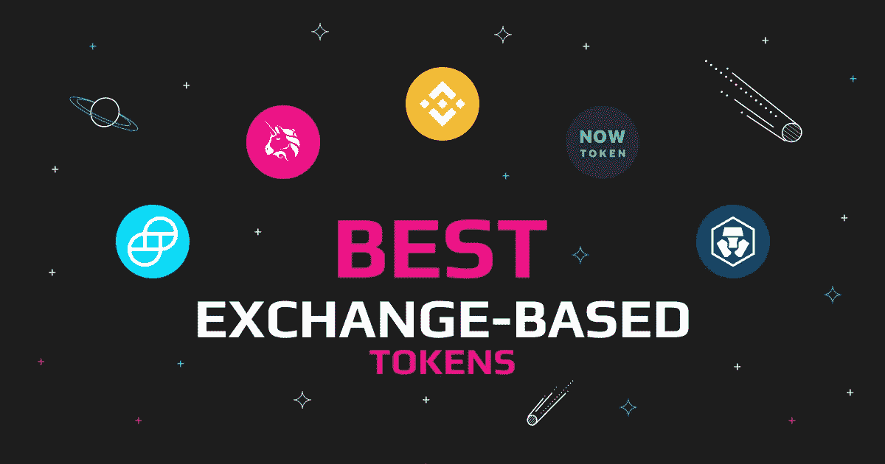
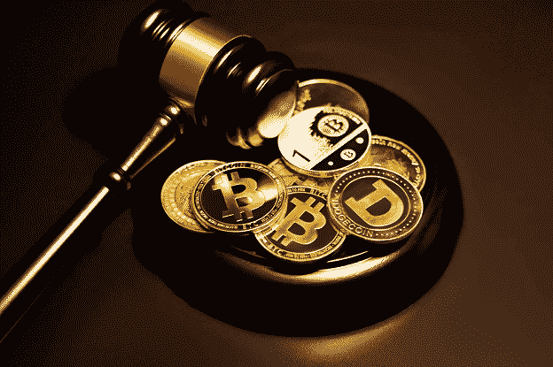

# 基于交易的最佳代币:盈利之道

> 原文：<https://medium.com/coinmonks/the-best-exchange-based-tokens-way-to-profit-db54525e16f4?source=collection_archive---------11----------------------->

The Best Exchange-Based Tokens: Way To Profit

最好的加密交换令牌由交易所提供，对持有者有惊人的激励。这些交易所为用户提供了一个三合一的机会，通过交易赚取投资回报和利润，同时支付较低的交易费用。

当十多年前[比特币](https://swapzone.io/currencies/bitcoin)被创造出来的时候，大多数涌现出来的[加密交易所](https://swapzone.io/reviews)仅仅作为一个促进买卖硬币的平台运作。然而，快进到今天，几个密码交易所不仅提供了一个交易密码的平台，而且还提供了他们的交换令牌，具有不同的独家特权。

交易所通常提供本地代币，主要是为了增加他们的用户基础，并促进与其他硬币和代币的交易的便利性。本文探讨了什么是基于交换的，以及它们的设计目的是什么。之后，我们将向您介绍不同的全球加密交换令牌。让我们开始吧！

# 什么是基于交换的令牌？

基于交换的令牌是由加密交换创建的数字资产。这些代币不同于常规加密货币，因为它们是特定交易所特有的，并且当它们由声誉良好的交易所构建时，保持一定程度的可信度。

基于交易所的令牌代表了加密领域的一种创新形式，它为用户提供了激励，也为交易所提供了基本的筹资策略。这导致了用户和密码交易平台的双赢局面。

# 基于交换的令牌的使用

基于交换的代币有可能根据人们交易的多少而增值。他们不同于稳定的硬币和其他代币，并提供更多的效用。

[加密交换](https://swapzone.io/learn/what-is-crypto-exchange)通常有一个发起交换令牌的主要目的。有四种基本用途，加密交换将其视为启动本机令牌的主要目标，它们包括以下内容。

# 流动性增加

流动性是一个用于量化交易活动数量的术语，交易活动允许加密资产在不改变市场价格的情况下转换为现金。

当交易所的流动性较低时，在平台上进行买卖变得很困难，因为没有足够的“买家和卖家”来接收或提供所需的加密货币或法定货币。因此，交易所的目标是在其平台上提供足够的流动性，以促进更顺畅、更快速的交易过程。

为了实现他们的目标，他们用来增加交易活动并最终提高流动性的策略之一是通过生成基于交换的令牌。这些代币通常很容易转换成交易费用较低的其他硬币，因此成为交易者的首选。

# 费用折扣

当你在一个[交易所](https://swapzone.io/learn/instant-exchange)交易时，无论是分散的(DEX)还是集中的(CEX)交易所，你都需要支付一笔边际费用来执行订单。当用户使用基于交易所的令牌执行购买或出售订单时，加密交易所为用户提供交易费用优惠。

如果交易所有区块链，他们还会对使用网络服务的取款提供折扣，比如币安的 Smart Chain。这些费用优惠是吸引用户使用代币进行更多交易的主要原因，因此，对代币的需求增加，导致代币价值提高。

# 多方信任

交换代币的另一个特点是可信度。当加密交换推出交换令牌时，它们必须满足某些监管要求。他们还提供保险和安全措施来保护用户的投资。因此，他们可以在用户和政府监管者之间建立信任。

具有多方信任的基于交换的代币的一个很好的例子是[双子美元](https://swapzone.io/currencies/gemini-dollar)，这种代币为用户提供与美元挂钩的代币稳定性。除了获得纽约财政部的许可，它还受到美国监管机构的支持。

# 管理

不同的[加密交易所](https://www.forbes.com/advisor/investing/cryptocurrency/best-crypto-exchanges/)出于多种目的提供交易代币，有时主要目的不仅仅是增加他们的客户群或向用户提供激励。

一些交易所发布交换令牌主要是为了充当社区的治理工具。社区驱动的交换，如分散式交换，通常使用这个特性。

它们用于授权用户对交易所的未来发展进行决策。任何拥有一些交换令牌的用户都被给予投票权，以支持社区中选择的任何提案。这些用户还可以享受专属的津贴和特权。

# 基于令牌的最佳交换

我们已经从加密市场上的几个交换令牌中选择了前四个[交换令牌](https://www.gemini.com/cryptopedia/cryptocurrency-exchange-tokens-bnb-token)。每个交换令牌都有一个独特的功能，这使它们比其他传统令牌更具优势。让我们逐一探索！

# 克罗诺斯(CRO)

[克罗诺斯(CRO)](https://swapzone.io/currencies/cronos) ，原名 crypto.com 币，是克罗诺斯链的原生币。这家 CRO 公司旨在推动区块链在全球经济中的广泛应用。

因此，他们有一些折扣来鼓励用户使用他们的交换令牌进行交易。例如，交易者在使用借记卡执行购买订单时享受 8%的返现。

该交易所支持 250 多种货币，并为持有 Cronos 硬币的用户提供 0.4%及更低的交易折扣费。其他代币建立在 Cronos 链上，为持有人提供流动性池，让他们持有代币并从中获利。

令牌价格目前为 0.19 美元，40 亿美元的市场价格占据了加密市场的 0.38%。

# 币安硬币(BNB)

最大和最受欢迎的密码交易所是币安，其本土硬币，[币安硬币(BNB)](https://swapzone.io/currencies/binance-coin) ，在密码市场的[最佳交易所硬币](https://www.coingecko.com/en/categories/exchange-based-tokens)排名中名列前茅。

币安为与 BNB 交易的用户提供低廉的交易和取款费用。他们收取低至 0.02%的交易费用，高至 13%的币安硬币(BNB)年利率。

该交易所目前支持 350 多种加密货币，为多个国家的用户提供多样化的交易和收入选择；然而，它在美国是不可用的。

今天，BNB 的身价为 318 美元，市值高达 520 亿美元。它在硬币市场上排名第五，同时占据整个加密市场的 4%。

# 双子座美元(GUSD)

作为第一个完全受监管的稳定硬币，[双子美元(GUSD)](https://swapzone.io/currencies/gemini-dollar) 为用户提供了一种安全的方式来对冲市场波动。该交换令牌由纽约金融服务部门许可，并且托管在 Gemini 上，这是一个集中式交换。

双子座美元与美元具有相同的价值，尽管市场表现不佳，但预计将维持一美元不变。与数百个其他交易所提供的其他代币不同，GUSD 目前在美国及其他地区的 41 个交易所上市。

目前，Gemini Dollar 保持 1 美元的挂钩价格，市值超过 2 . 5 亿美元，市场主导地位逐渐增强。

# UNI WAP(UNI)

[UNI WAP(UNI)](https://swapzone.io/currencies/uniswap)是最大的分散式 exchange UNI WAP 的治理令牌。它使用激励措施来鼓励交易所的交易活动，从而为交易活动的顺利进行提供流动性。

交易所收取 0.01-1%的交易费，用于将一枚硬币或代币兑换成另一枚。此外，用户可以通过在流动性池中下注 Uniswap 和另一个令牌来赚取利润。

UNI WAP(UNI)目前为 5.5 美元，总市值超过 1.25 亿美元，是最大的分散式交换令牌。

# 现在 Token

[NOW Token](https://swapzone.io/currencies/now-token) 是由即时兑换服务 ChangeNOW 开发的原生加密货币。这是在 NOW 产品系统中使用的一项资产——主要作为支付资产列表费用的手段，也为其用户提供了业务推广和服务折扣的机会。NOW 代表了一种方便的服务调整，使使用 ChangeNOW 产品变得更容易、更有利可图。

ChangeNOW Token 于 2018 年发行，于 2012 年 5 月以 0.07129 美元的价格交易，并在 ERC-20 和 BEP-2 协议中均被接受。它还提供了一个赌注计划，承诺高达 25%的年利润投资回报率。

# 如何购买兑换令牌

硬币推出后，您可以直接从[交易所](https://time.com/nextadvisor/investing/cryptocurrency/best-cryptocurrency-exchanges/)购买加密兑换硬币。然而，大多数交易所通常会举办首次公开募股(IEO)，投资者可以在价格上涨之前以低价购买代币。

其他加密交易所以空投的形式推出其基于交易所的令牌，这是一种用于推广令牌的营销策略。空投是由加密创造者开发的活动，他们将一些代币投入特定的钱包地址，以促进对新加密货币的认识。

赢得空投的用户会获得一些存放在他们钱包中的兑换令牌，之后他们可以像其他常规加密货币一样在交易所进行交易。一般来说，除了参加交易所的 IEO 或空投活动，你可以像购买其他硬币一样直接从交易所购买兑换代币。

# 在 Swapzone 上兑换代币

不过，获得大多数基于交换的令牌的最简单方法是将 Swapzone 上的加密资产直接交换到您需要的令牌。作为一个即时加密交换，它不需要任何注册，没有任何限制，所以你可以进行交易快速和安全的任何地方任何时间。

通过 Swapzone 将任何加密交换为基于交换的令牌是非常容易的，并且通过比较 15 个以上的交换提供商，确保您支付最小的交易费用。按照以下简单步骤购买代币:

1.  访问 [Swapzone 主页](https://swapzone.io/)
2.  输入您要交换的加密总量。
3.  选择最佳互换报价。
4.  点击交换按钮。
5.  输入您的钱包地址以接收加密到您的钱包。
6.  将您的存款发送到生成的地址。
7.  等待你的交换完成。
8.  最后，收到您的密码！

# 代币兑换的未来

交换令牌已经成为加密交换的流行特征，并且即将到来的交换预计将在未来几年推出本地令牌。

基于交换的代币的激励和属性将基于用户的需求和交换的监管而改进和发展。这些代币的治理特征还将帮助社区做出决策以改善交易所的运营。

本地代币交易所的一个共同特点是它们向代币持有者提供投资选择。大多数为持有交换代币的用户提供有吸引力的 APR 值。这一投资回报率预计将随着时间的推移而增加，以提高交易所的可用性和流动性。

总之，如果你正在寻找得到交易所支持的代币，这些代币在费用上有很大的折扣，并且有其他的特权。那么，我们建议你在进行研究后，考虑投资本文中强调的交换代币。

> 加入 Coinmonks [电报频道](https://t.me/coincodecap)和 [Youtube 频道](https://www.youtube.com/c/coinmonks/videos)了解加密交易和投资

# 另外，阅读

*   [我的密码交易经历](/coinmonks/my-experience-with-crypto-copy-trading-d6feb2ce3ac5) | [AAX 交易所评论](/coinmonks/aax-exchange-review-2021-67c5ea09330c)
*   [Bybit 融资融券交易](/coinmonks/bybit-margin-trading-e5071676244e) | [币安融资融券交易](/coinmonks/binance-margin-trading-c9eb5e9d2116) | [Overbit 审核](/coinmonks/overbit-review-9446ed4f2188)
*   [有哪些交易信号？](https://coincodecap.com/trading-signal) | [比特斯坦普 vs 比特币基地](https://coincodecap.com/bitstamp-coinbase)
*   [10 本关于加密的最佳书籍](https://coincodecap.com/best-crypto-books) | [英国 5 个最佳加密机器人](https://coincodecap.com/uk-trading-bots)
*   [Koinly 回顾](https://coincodecap.com/koinly-review) | [Binaryx 回顾](https://coincodecap.com/binaryx-review) | [Hodlnaut vs CakeDefi](https://coincodecap.com/hodlnaut-vs-cakedefi-vs-celsius)
*   [40 个最佳电报频道](https://coincodecap.com/best-telegram-channels) | [1xBit 回顾](https://coincodecap.com/1xbit-review) | [Keevo 钱包回顾](https://coincodecap.com/keevo-wallet-review)
*   [如何在印度购买以太坊？](https://coincodecap.com/buy-ethereum-in-india) | [如何在币安购买比特币](https://coincodecap.com/buy-bitcoin-binance)