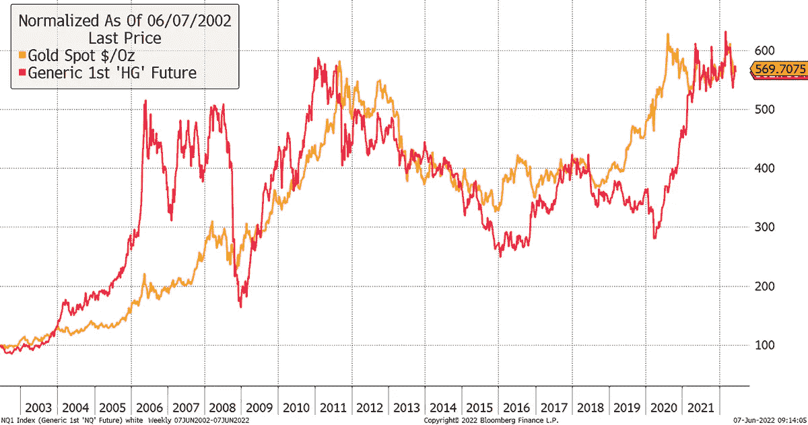
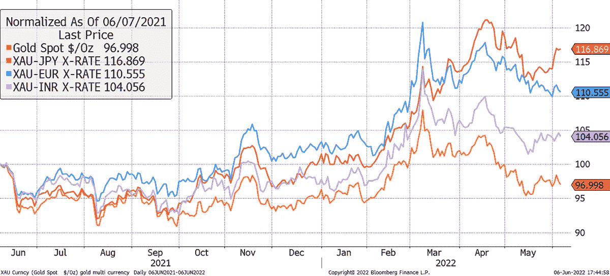

# 最好的通货膨胀对冲

> 原文：<https://medium.com/coinmonks/the-best-inflation-hedge-of-all-38456171dd84?source=collection_archive---------18----------------------->

阿特拉斯脉金报告；第 72 期

根据定义，流动性通胀对冲必须在一定程度上独立于金融体系，并且不太可能成功通过 ESG 筛选。你可以指向与通胀挂钩的债券，但如果情况严重恶化，它们将首先违约。

# 突出

*   **宏:**铜博士和金教授
*   **估值:**金价背后隐藏着什么
*   **比特币:**是时候订婚了
*   **BOLD1:** 优质的流动性替代资产

许多投资者不相信有一个清晰的框架来理解黄金。我知道这一点，因为他们认为，在最近的通胀爆发期间，政府未能保护他们。

我认为，黄金在 2020 年仅凭资产负债表扩张(印钞)的迹象就奖励投资者，从而预见了这一幕的到来。黄金走得太远了，就在卡泊博士从沉睡中醒来时冷却了。

我会说，如果库珀博士拥有经济学博士学位，并且是商业周期方面的专家，那么戈尔德就是一位获得了诺贝尔货币贬值奖的教授。

当你从 30，000 英尺的高空观察金和铜时，它们似乎是相关的。这不应该让你感到惊讶，因为它们都是商品。

# COPPER 博士和诺贝尔奖获得者 GOLD 教授

Source: Bloomberg

然而，黄金和铜之间的差异很能说明问题，因为它反映了有风险和无风险的市场状况。2008 年，以美元计算，黄金和铜都下跌了，但黄金的跌幅要小得多，因此在图表上相对于铜有所上升。在 2009 年的复苏中，情况发生了逆转。

> 交易新手？尝试[加密交易机器人](/coinmonks/crypto-trading-bot-c2ffce8acb2a)或[复制交易](/coinmonks/top-10-crypto-copy-trading-platforms-for-beginners-d0c37c7d698c)

我们在 2019/20 年看到了同样的行为，黄金赢得了风险规避，而铜赢得了风险承担。随着这一比率达到 4，支持黄金的直线上升，这清楚地提醒人们，避险情绪已经出现，并可能持续一两年。

# 黄金重回铜价线

Source: Bloomberg

像 2006 年那样，金价相对于铜价下跌是有可能的，但我认为不会。更有可能的是，黄金开始对避险通胀做出积极反应，而铜则为一两年后的下一个风险期做准备。

我这么说很有信心，因为理解黄金交易的原因，是理解黄金未来走向的关键。

在这个练习中，我按照推动金价的四个主要因素对金价进行了分解，至少是以美元计算。

黄金是有史以来最理性的资产。有三个重要的价格驱动因素，第四个是疯狂的人群:

*   过去的通货膨胀
*   现值
*   未来预期通货膨胀

人群过度投资牛市和熊市，就像他们投资其他资产类别一样。我称之为黄金溢价或折价。如果你有一个评估黄金或任何其他资产的框架，那么人群对你有利，因为你可以应用价值投资方法。

下表列出了金价变动背后的驱动因素，以及金价是如何变动的。实际利率从 2002 年 5 月的 3.1%下降到今天的 0.4%，使得黄金价格上涨了 70%。紧随其后的是实际(实现的)通货膨胀，这一时期的总通货膨胀率为 60%。这意味着 2002 年的 1 美元可以买到今天 63 美分的商品。我们称之为低通胀时代，所以等着瞧接下来会发生什么吧。

大多数人同意黄金补偿了过去的通货膨胀或贬值，一些人理解实际利率(利率减去通货膨胀)的重要性。

人们忽略的一点是未来的通胀预期(盈亏平衡)。这些数据告诉我们，在给定所有可用信息的情况下，债券市场对未来通胀的假设是什么，这些信息来源于 TIPS 价格。

# 二十年来，盈亏平衡点一直在窄幅波动

Source: Bloomberg

以当前 2.7%的盈亏平衡点为例，现在看看左边的轴。这显示了未来预期通货膨胀对黄金价格的影响。20 年内每年 2.7%(根据 TIPS 的预期)使今天的黄金价格上涨了 70%，而预期的通货膨胀率为零。

从 2020 年 3 月的低点(Covid)开始，通胀预期的上升一直是金价的主要驱动力，而债券收益率的上升则是一个拖累。我把它分解了。

实际通胀率也有所回升——自 2020 年 4 月以来高达 11.8%。黄金也能保护你免受这种伤害，但这一点经常被遗忘。当实际通货膨胀率很高时，对黄金价格来说可能是一个相当大的顺风。

然而，大多数分析师指出，实际利率是金价的主要驱动力，原因很简单，因为存在明显的负相关关系。有时候，这样做是正确的，尤其是在实际利率发生变动的时候，比如在上述时期。

# 金价与实际利率成反比，但这只是四个驱动因素之一

Source: Bloomberg

有些时候，实际利率上升导致黄金下跌，但没有出现通胀暴跌，比如 2013 年的缩减恐慌。

今年，实际利率有所上升，而通胀预期收效甚微。这就是“通货膨胀是短暂的”论点。然而，尽管实际利率出现了这种痛苦的变动，但黄金还是被保存了下来，因为它在今年年初被低估了。首先，公允价值的降低被低价抵消了。

戈德教授再次预见到了这一切，如今，溢价不到 5%，可以忽略不计。更好的是，除了通货紧缩之外，黄金的杀手是利率上升，而利率上升的大部分已经反映在价格中，至少目前是这样。

从 0.8%的债券收益率升至 3.1%是最痛苦的时刻。央行知道实际利率的大幅上升会导致资产价格崩溃，而不仅仅是黄金，因此在对抗通胀方面，它们可能会表现不佳。

假设央行有一个计划，大概是让债券收益率上升到足以抑制通胀的水平。对他们来说不幸的是，通胀预期(蓝色)没有下降；他们正在崛起。他们知道 1%的实际收益率和 3%的债券收益率导致了 2018 年末的价格暴跌，所以他们必须在进一步加息时考虑到这一点。

# 接近利率的危险区域

Source: Bloomberg

正如我一直说的，条条大路通黄金(和比特币)。

然后，当然，我们应该考虑美元，它一直很强劲。我们不要忘记，那些不遵守规则的人将会看到他们的货币大幅贬值。过去一年，以美元计价的黄金可能下跌了 4%，但以卢比计价的黄金上涨了 4%，以欧元计价的黄金上涨了 10%，以日元计价的黄金上涨了 17%。

# 主要货币正面临压力

Source: Bloomberg

我可以确信的一个预测是，货币将继续承受压力。当利率和通胀为零时，就不需要货币波动，因为利率和通胀是一样的。当他们开始有分歧时，事情就变得有趣了。

这很好地引出了比特币。澄清一点，我不把它看做货币，就像我不把黄金看做货币一样。它们是另类资产，两者的行为都像商品。

# 比特币

2013 年 11 月，我在这些页面上首次描述了比特币。我兴奋不已，九年后，我相信 ByteTree 拥有世界上任何公司理解比特币的最佳框架。

它并不完美，我们还有很多要学习的，但我从未如此自信地说比特币是真实的。对于主流投资者来说，它将变得越来越重要，并将在未来几年继续增长。

在合规和链上数据公司 Chainalysis 的这份[报告](https://go.chainalysis.com/rs/503-FAP-074/images/Geography-of-Cryptocurrency-2021.pdf)中，他们对比特币采用率排名前 20 的国家进行了排名。唯一出现的发达国家是美国。

# 2021 年全球加密采用指数前 20 名

Source: [Chainalysis](https://go.chainalysis.com/rs/503-FAP-074/images/Geography-of-Cryptocurrency-2021.pdf)

对于那些仍然想知道比特币的用例是什么以及为什么它不是庞氏骗局的人来说，也许只需要看看这个大趋势就够了。对于世界上越来越多的人来说，比特币是一种日益增长的替代资产。

# 比特币是新金砖吗？

在我看来，比特币不同于黄金，并不与之竞争。除了明显的物理差异，黄金坚持理性的宏观经济框架，而比特币的价值来自于其网络和增长。

ByteTree 几年前破解了这个。处理自 2009 年以来的 739，500，255 笔交易来衡量比特币经济并不容易，但我们做到了。

当每个区块进来时，我们按类型分解交易，以找到我们认为经济的交易。然后，我们扣除变化，以估计在区块链流动的价值。听起来很容易，但光是电脑就花了我们 20，000 英镑，甚至不知道我们会发现什么。

仔细想想，比特币有一个作用，那就是转移价值。多年来信心的增加见证了这个价值转移网络的繁荣。在 2014 年和 2018 年的熊市中，这个网络急剧收缩。在 2022 年这个熊年，它活得好好的。

# 比特币和 ByteTree 公允价值

Source: ByteTree

2022 年的比特币与过去几年的区别在于，链上转移价值约为 430 亿美元/周(12 周平均值)。当我的联合创始人马克·格里菲斯在 2014 年 7 月 31 日首次破解这个数据集时(当时我正在度假，对着我的笔记本电脑垂涎三尺，这让我的家人感到沮丧)，这个数字是每周 3 亿美元。比特币网络大幅增长，这是真实的。

最好的一点是，在 2022 年，尽管价格暴跌，但网络(红线)仍保持稳定。这表明，生活在上述国家的数百万人实际上在使用比特币，而不仅仅是在投机。这就是巨大的变化。

去年，我们确实见证了比特币网络的暂时崩溃，当时中国加了一层监管(还是禁止比特币？)，尤其是围绕采矿。值得注意的是，恢复速度很快，这是网络稳健性的基础。

看溢价/折价，去年比特币有泡沫，但已经过去了。ByteTee 的比特币公允价值为 40713 美元，交易价格为 23%。

# 比特币泡沫已经过去

Source: ByteTree

# 比特币+黄金= BOLD

比特币和黄金的共同点是都是硬资产。在风险规避期间，黄金往往会出现溢价，而在风险增加期间，比特币会出现溢价。这与 Gold 教授和 Copper 博士没有什么不同，只是比特币仍处于增长模式。很简单，它有潜力做得更好。

在风险加权的基础上，Vinter ByteTree BOLD Index(彭博或路孚特的 BOLD1)将这些非凡的资产汇集在一起。这意味着每个月，该指数在风险均等的基础上进行分配。

在一个容易激动的交易日，你可能会看到比特币上涨 5%，黄金上涨 1%(通常是反方向)。大约 80%是黄金，20%是比特币，波动的危险很快就会消失。

人们以为 BOLD 今年遇到了麻烦，但事实并非如此。BOLD1 以美元计下跌了 4.1%，这意味着它以大多数货币计都上涨了。尽管比特币下跌了 36%。再平衡在获取超额回报方面发挥了重要作用。通过每月卖出较高的资产，买入较低的资产，我估计每年的回报率约为 6%至 7%，但这确实取决于资产的走势。

# BOLD1 在 2022 年表现出色

Source: Bloomberg

然而，在繁荣时期，BOLD1 也做得很好。2020 年 3 月的回调是温和的，在 2020 年 8 月的峰值后，它与黄金拉开了距离。BOLD1 习惯于向赢家看齐。我已经删除了比特币，因为它破坏了图表(是的，它涨了很多——确实如此)。

# 勇敢的领导公牛和熊

Source: Bloomberg

风险呢？在过去的三次调整中，BOLD1 的波动性一直低于股市。2018 年第四季度，美联储最后一次加息，震动了股市。然后是 2020 年 3 月的 Covid 崩溃，今年再次发生。

# BOLD1 在暴风雨中保持冷静

Source: Bloomberg

在所有这些情况下，BOLD1 的波动性都远低于股票。事实上，BOLD1 的波动性历来是在股市牛市而非熊市期间出现的。那是黄金抛售的时候，比特币已经飞走了。

比特币和黄金都是硬资产，在通胀时期具有吸引力。这更像是一种结果，而不是设计的预期部分，但 BOLD1 是我见过的最像通胀对冲的东西。

投资者抱怨黄金在 2021 年失败了，比特币在 2022 年失败了。我要指出的是，当价格便宜时，几乎所有东西都是通胀对冲工具，而当价格高时，什么都不是。

比特币和黄金组合的美妙之处在于，很难想象它们会同时经历泡沫。

# 大胆对冲通货膨胀

Source: Bloomberg

BOLD 引人注目，因为它将旧世界的价值储存与新世界的价值储存融为一体。黄金每天交易 1450 亿美元(世界黄金协会)，而比特币[每天交易 400 亿美元](https://bytetree.com/research/2022/05/liquidity-and-risk-perception-vs-reality-for-gold-and-bitcoin/)(连锁、CME 期货和加密交易所)。

比特币和黄金是世界上最具流动性的两种替代资产。他们不在竞争中，扮演着不同的角色，具有全球性的跨界和文化号召力，走到一起成为全天候的通胀对冲。

请[自己看一看](https://bytetreeam.com/bold/)，也可以随意下载 BOLD1 指数进行自己的分析。

# 摘要

同时存在泡沫是今年债券和股票的一个主要问题。它们应该是不同的，但不是在央行像刚刚那样印钱的时候。

20 世纪 70 年代对 60/40 股票/债券投资组合来说是残酷的，因为更高的通胀意味着更低的估值。那些从事黄金和商品的人幸存了下来；那些没有受伤的人。

根据定义，流动性通胀对冲必须在一定程度上独立于金融体系，并且不太可能成功通过 ESG 筛选。你可以指向与通胀挂钩的债券，但如果情况严重恶化，它们将首先违约。

如上所述，黄金的未来价值与通胀挂钩债券的框架相同。我认为，如果事情变得非常糟糕，它们将很快成为政治和道德的克星。

相比之下，比特币和黄金不能违约，因为它们不是任何人的负债。这就是流动性替代资产的魅力所在。

感谢您阅读*寰脉—* [见我之前的更新](https://bytetree.com/research/tags/atlaspulse/)。

如果你希望收到 Atlas Pulse，那么请订阅 [ByteTree 邮件列表](https://bytetree.com/mailing)。

本文由 ByteTree 的联合创始人兼首席投资官查理·莫里斯撰写。这篇文章是从我们的网站交叉发布的，最初发表于 2022 年 6 月 8 日。

访问 [**ByteTree 终端**](https://terminal.bytetree.com/) 获取实时跟踪的**比特币**链上数据。我们还跟踪**以太坊**、**黄金**和**白银**的资金流。

[**订阅**](https://bytetree.com/mailing) 我们的邮件列表，免费每周更新。

> 加入 Coinmonks [电报频道](https://t.me/coincodecap)和 [Youtube 频道](https://www.youtube.com/c/coinmonks/videos)了解加密交易和投资

# 另外，阅读

*   [AscendEx 保证金交易](https://coincodecap.com/ascendex-margin-trading) | [Bitfinex 赌注](https://coincodecap.com/bitfinex-staking) | [bitFlyer 审核](https://coincodecap.com/bitflyer-review)
*   [麻雀交换评论](https://coincodecap.com/sparrow-exchange-review) | [纳什交换评论](https://coincodecap.com/nash-exchange-review)
*   [维护卡审核](https://coincodecap.com/uphold-card-review) | [信任钱包 vs MetaMask](https://coincodecap.com/trust-wallet-vs-metamask)
*   [TraderWagon 回顾](https://coincodecap.com/traderwagon-review) | [北海巨妖 vs 双子星 vs BitYard](https://coincodecap.com/kraken-vs-gemini-vs-bityard)
*   [Exness 点评](https://coincodecap.com/exness-review)|[moon xbt Vs bit get Vs Bingbon](https://coincodecap.com/bingbon-vs-bitget-vs-moonxbt)
*   [如何开始通过加密贷款赚取被动收入](https://coincodecap.com/passive-income-crypto-lending)