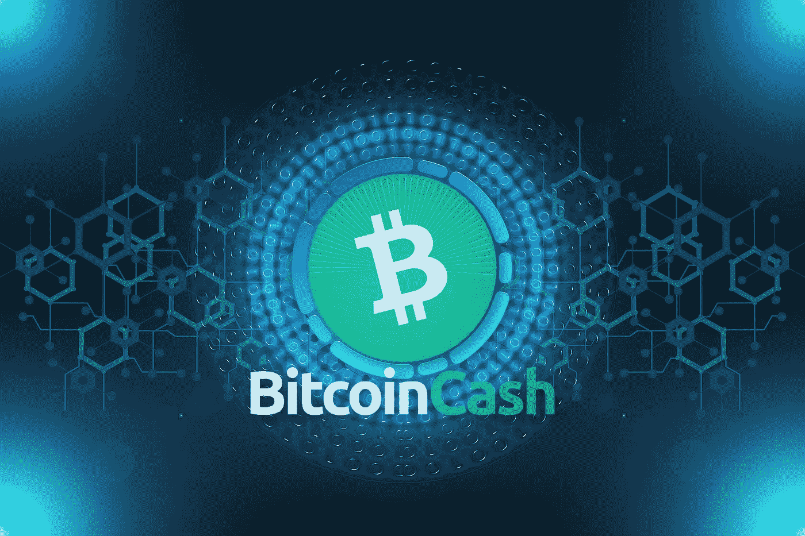

# “大街区”一方在所有事情上都是对的

> 原文：<https://medium.com/coinmonks/the-big-block-side-was-right-about-everything-4fb66a91df5e?source=collection_archive---------14----------------------->

*Image by “* [*geralt*](https://pixabay.com/users/geralt-9301/) *“ on* [*Pixabay*](https://pixabay.com/illustrations/network-internet-web-cyber-3484139/) *(modified)*

BTC 方面最终开始意识到网络(主链和侧链)无法实现全球采用。

似乎最终，BTC 最大化主义者发现他们不能永远支持小块。

在这个容易被少数有影响力的人操纵的群体中，短视是显著的，他们支持任何被支配的决定…