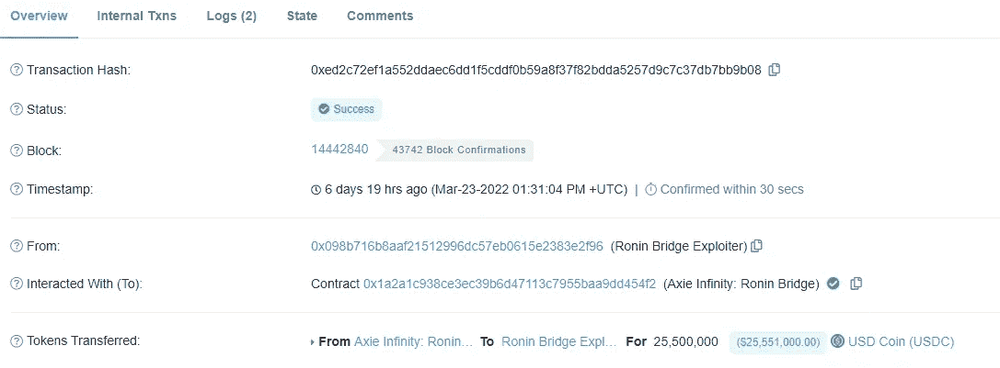

# Crypto 历史上最大的黑客攻击:它是如何发生的！

> 原文：<https://medium.com/coinmonks/the-biggest-hack-in-the-history-of-crypto-how-it-happened-d15d3469a5a7?source=collection_archive---------10----------------------->

Ronin 是著名的 P2E 游戏运营的以太坊网络的侧链；无限轴。这是一个由 9 个验证器保护的网络。和大多数项目一样，如果至少 55%的验证者一起授权一个交易，它将是成功的。在这种情况下，只需要 9 个验证器中的 5 个就可以入侵 Ronin 网桥/网络。

黑客不只是随机访问验证器。黑客们通过一些复杂的操作，进入了控制罗宁桥上资金的 4 个节点的系统。然后，他们设法找到了一个漏洞，揭示了另一个节点。这个额外的节点刚好够达成 50%的共识，于是他们偷走了所有的桥醚和 USDC。罗宁大桥被开发了 25.5 米 USDC 和 173，600 以太。这使得它成为整个密码史上最高的黑客。

这次黑客攻击发生在 2022 年 3 月 23 日，但直到 6 天后的 29 日才被发现。在两次交易中，所有的钱都被从桥上取走了。

这种攻击可以追溯到 2021 年 11 月，当时由于巨大的用户负载，Sky Mavis 请求 Axie DAO 帮助分发免费交易，并被允许这样做。然而，这在 2021 年 12 月停止了，但是允许列表没有被撤销。这是黑客实施盗窃所需的微小窗口。一旦他们获得了对 Sky Mavis 系统的访问权，他们就能够通过滥用 2021 年 11 月启动的 gas-free RPC 从 Axie DAO 验证器获得签名。

这种 Ronin bridge hack 与普通且猖獗的 bridge hack 非常不同，在普通和猖獗的 bridge hack 中，智能合同 bug 为黑客提供了访问权限。这种 ronin 黑客的方式更加复杂，因为它是在多密钥安全设置中对私钥的攻击。它是通过密钥管理和链外基础设施中的漏洞发生的，因为这不是智能合同的根本原因，所以实际上没有公开的错误跟踪。

自从这次黑客攻击发生在 7 天前，黑客已经把一些偷来的乙醚送到了 Crypto.com 和 FTX。

如果这只是心理战或兑现计划，没有人知道，但罗宁现在正与 SBF 和政府机构收回资金。

现在很明显，随着时间的推移，这些黑客变得越来越老练，也越来越具有破坏性。我认为，只要 multisig 桥接规模和流动性通过链传播，这种趋势将会继续。我们需要更好的桥梁，因为我们目前拥有的是黑客的巨大蜜罐。Ronin 桥是一个基于验证器的桥，它有一个致命的假设，即大多数密钥都不会被破解。我们看到那是怎么回事了吗？？？

*   在任何网络中，没有一个实体应该运行大量的节点。在浪人黑客攻击中，5 个被入侵的节点基本上是一个！(天空梅维斯)
*   像 Axie Infinity 这样的项目应该学会投资于多客户机实现和客户机多样性
*   保持链/桥平衡的稳定警报。如果余额低于某个阈值，警报应该响起！！！
*   根据交易规模引入提款延迟。这将迫使“潜在”黑客将取款交易分解成少量交易，但会触发警报系统。
*   建立一个等待时间与取款金额成正比的系统。

结论:

正如我们所知，这是对去中心化和加密隐私的一次巨大考验。像这样的攻击会引起政府的注意，相信我，这不是我们需要的注意。这是负公关。这是想要保护全球超过 5 万亿美元资产的行业吗？。有些人可能会说，这是链上交易的成本，代码是关键，但这是否意味着盗窃现在是合法的，任何人都可以在某一天醒来，决定他/她应该攻击一个项目，因为代码就是法律？想象一下，如果你是这种攻击的受害者。我们都知道在 20 亿美元的钢铁金融崩溃后，马克·库班发生了什么。正如松村美子所说，我们不应该让我们对博弈论和自由放任经济的原始想法蒙蔽我们的思想。我们应该考虑同意的首要性。对于打击这种盗窃的方法，我会把你们这些家伙和超级大脑们的想法联系起来，比如[哈素福](https://twitter.com/hasufl/status/1506572435998625792?t=LYGsD7hYaWq2K4Aer1aHzw&s=03)、[艾敏·冈·瑟勒](https://twitter.com/el33th4xor/status/1508844798270185473?t=gCqM7uHrjkwEzFeXEkZheQ&s=03)、[隐龙](https://twitter.com/CryptoDragonite/status/1361464834743619595?t=5B9qnvj_HyhjYGDi6Sm2vg&s=03)。

这次黑掉之后可能性不大。要么是黑客变得粗心并被抓住，被盗的资金只是被列入黑名单，并从本质上从供应中烧掉，直到黑客被抓住(有点乐观的场景，不是吗？)或者 Ronin 被迫回购损失的资金，以补偿客户，就像索拉纳虫洞黑客入侵期间发生的那样。如果有人想进一步挖掘，这里有[链接](https://etherscan.io/address/0x098b716b8aaf21512996dc57eb0615e2383e2f96)指向存放被盗资金的地址。

> 加入 Coinmonks [电报频道](https://t.me/coincodecap)和 [Youtube 频道](https://www.youtube.com/c/coinmonks/videos)了解加密交易和投资

# 另外，阅读

*   [密码本交易平台](/coinmonks/top-10-crypto-copy-trading-platforms-for-beginners-d0c37c7d698c) | [Coinmama 审核](/coinmonks/coinmama-review-ace5641bde6e)
*   [印度加密交易所](/coinmonks/bitcoin-exchange-in-india-7f1fe79715c9) | [比特币储蓄账户](/coinmonks/bitcoin-savings-account-e65b13f92451)
*   [OKEx vs KuCoin](https://coincodecap.com/okex-kucoin) | [摄氏替代品](https://coincodecap.com/celsius-alternatives) | [如何购买 VeChain](https://coincodecap.com/buy-vechain)
*   [币安期货交易](https://coincodecap.com/binance-futures-trading)|[3 comas vs Mudrex vs eToro](https://coincodecap.com/mudrex-3commas-etoro)
*   [如何购买 Monero](https://coincodecap.com/buy-monero) | [IDEX 评论](https://coincodecap.com/idex-review) | [BitKan 交易机器人](https://coincodecap.com/bitkan-trading-bot)
*   [CoinDCX 评论](/coinmonks/coindcx-review-8444db3621a2) | [加密保证金交易交易所](https://coincodecap.com/crypto-margin-trading-exchanges)