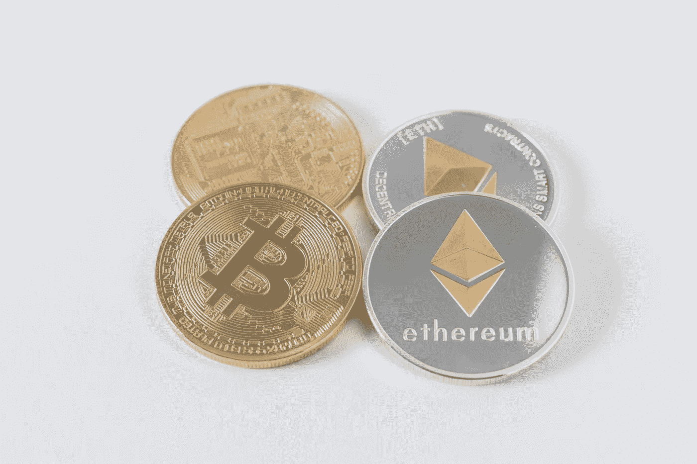

# 加密货币的最大问题，以及如何解决它

> 原文：<https://medium.com/coinmonks/the-biggest-problem-with-cryptocurrency-and-how-you-can-fix-it-b93fba46dc67?source=collection_archive---------39----------------------->

大多数人认为加密货币非常复杂。

我以前也这么想。

那是在 2020 年冠状病毒封锁期间。

儿时的朋友打电话给我，让我买一个他一直关注的信物。我一头雾水，“你确定你找对人了？”我问。

他认为我在交易加密货币，他说。听说过，但还没搞清楚怎么用。

然后他向我介绍了一个大约有一千名交易者的社区(既有经验丰富的，也有像我一样的新手)。我学到了一些我需要知道的必要的东西。

我在盈利，但我仍然不太了解市场是如何运作的。我知道我对加密货币还有很多不了解的地方。我只知道在有信号共享时如何进出交易。

但是从我第一次报名交易开始，我学到了很多。我会在这里把我所学到的一切与你分享。

最近几个月，密码市场一直呈下降趋势，并导致新手更加恐慌。

毕竟，我们都同意加密货币并不适合所有人。

但一些个人和组织出于反感，已经向加密货币宣战。

一个反加密的朋友说他讨厌加密货币，我开始有兴趣知道他的理由。于是我们开始了促成这篇文章的讨论。

我在这篇文章中展示了他讨厌加密货币的原因以及您可以如何处理这些问题。

# **1。加密货币缺乏监管:**

他强调，缺乏对加密货币的监管是他讨厌加密货币的原因之一。

交易者进行交易的市场(交易所)的存在是为了在没有规则指导的情况下将买方和卖方聚集在一起，从而为市场操纵创造了空间。

即使一些交易所尽最大努力帮助交易者减少加密市场的操纵，你也需要学习如何保护自己免受操纵。

## 你如何处理这个？

*   不要只根据订单簿来检查资产的价格变动，而不与 Coingecko 和 Coinmarketcap 等其他来源进行比较。
*   根据历史价格趋势做出决定。有时，鲸鱼清洗交易在许多交易所，以夸大资产的数量。
*   使用平均成本策略来降低你对操纵价格波动的脆弱性。
*   短线交易者更有可能受到市场操纵的影响，因为在市场修正之前，结果会很快出现。

# 2.政府不支持加密货币:

他讨厌加密货币，因为它们不像传统货币那样受到政府和银行的支持，传统货币的价值是根据国家经济来衡量的。

自比特币引入以来，大多数国家都持怀疑态度，并对加密交易实施了多项禁令。我认为这是在保护传统货币。

但是，那些重视隐私的人认为这是让他们的钱和交易不受政府和银行控制的一种手段。

## 你如何处理这个？

*   大多数交易者通过在交易过程中小心描述以防止向银行和政府披露交易目的来避免受到处罚。

# 3.加密交易不是匿名的:

他提到了黑客和犯罪分子通过交易锁定目标的案例。

加密交易被记录在区块链上，因为它们建议完全透明和安全。

虽然黑客和罪犯很容易跟踪他们目标的交易，从而监督一些关于加密的负面情绪。

## 你如何处理这个？

*   只从官方平台下载钱包应用。
*   如果你不确定一个特定的加密项目是如何工作的，我建议你在做决定之前做更多的研究。只投资你理解的东西。
*   不要被社交媒体上的广告和营销所说服。诈骗者可能会使用未经授权的名人图像来给他们的项目一种合法性的感觉或承诺赠品。
*   总是对社交媒体上广告的秘密投资机会持怀疑态度。

# 4.你可能会失去你的资产:

他说，当人们把钱包的私人钥匙放错地方时，他们就无法获得自己的资产，因为没有恢复的选择。

对我来说，这不算什么。它只会带来一些人不想承担的责任。

## 你如何处理这个？

*   在纸上写下你钱包的私人钥匙，放在只有你能拿到的地方。
*   或者使用硬件钱包。
*   注册 exchange 时使用双因素授权(2FA)来保护您的帐户。
*   我建议在注册 exchange 帐户时使用没有人知道的个人电子邮件地址。

# 结论:

我在这篇文章中提出的所有原因都是因为人们讨厌创新的复杂性，就像世界讨厌伽利略的日心说一样。

*就像过去的任何其他创新一样，加密货币在早期阶段可能会遇到一些困难。但是如本文所示，有克服这些问题的措施。*

*如果你想在加密领域取得成功，你需要花时间去理解加密货币，以及它们如何建立你的观点。*

有一件事是肯定的:加密货币将会存在，并且在未来会继续流行。

请在评论中告诉我你的想法。给这篇文章鼓掌👏如果你喜欢的话。

> 加入 coin monks[Telegram group](https://t.me/joinchat/Trz8jaxd6xEsBI4p)学习加密交易和投资