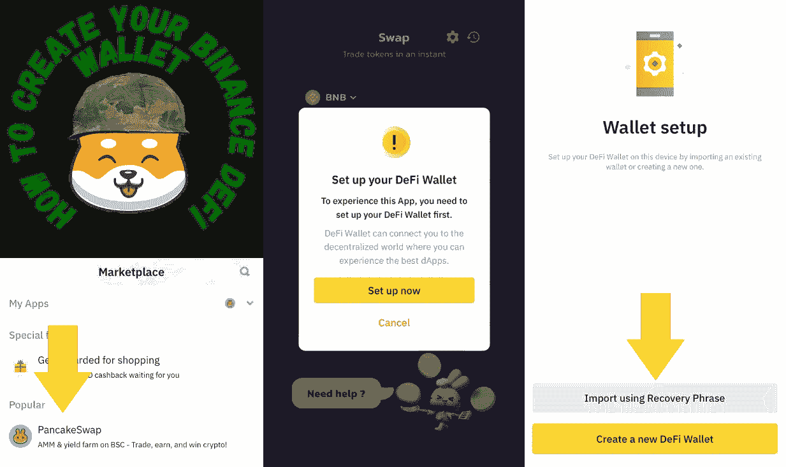
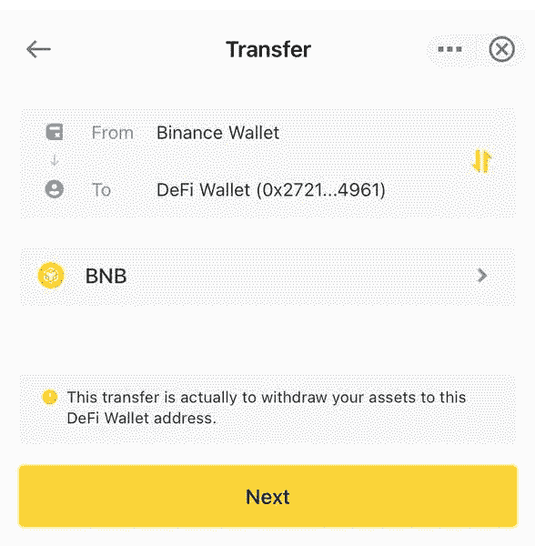

# 币安 DeFi 钱包——像$SHIBARMY 这样的密码现在可以在币安手机应用程序中交易

> 原文：<https://medium.com/coinmonks/the-binance-defi-wallet-cryptos-like-shibarmy-can-now-be-traded-within-the-binance-mobile-app-e49b681fd829?source=collection_archive---------7----------------------->

## 标题是没有点击诱饵，币安推出了一个新功能，你可能还没有听说过，它会让你大吃一惊。币安 Defi 钱包是每个人进入分散金融的门户。

# 什么是币安迪菲钱包？

币安 DeFi 钱包是一个非托管、分散的 Web3 钱包，包含在币安应用程序中。

要找到 PancakeSwap 和币安 Defi 钱包，您只需向下滑动👆 **⬇️** 从币安应用程序的顶部进入市场，你会看到 PancakeSwap 在顶部。

目前，这种钱包仅限于与币安·CEX 即期钱包之间的转账，并且消除了从 CEX 金融中心取款时复制、粘贴和检查钱包地址的需要。这使得更容易进入 Defi 市场。

# 如何创建和使用币安 Defi 钱包

1.  在你的手机上登录你的币安账户，然后简单地向下滑动
    👆 **⬇️** 在使用币安应用程序打开市场时出现在屏幕上
2.  在列表中选择 Pancakeswap，然后按“连接钱包”
3.  通过输入种子短语创建一个新钱包或重要的现有钱包-确保正确存储您的种子短语如果您创建了一个新钱包，如果您不知道如何保护它的安全，请查看我们的文章[关于使用区块链时保持安全的文章](https://shibarmybsc.medium.com/shibarmy-psa-blockchain-security-how-to-stay-safe-91f9ea00f8d7)
4.  您需要在您的币安现货钱包 BNB 直接转移到您的 DeFi 钱包。没有比这更简单的方式将资金引入币安智能链

5.了解如何购买币安和 PancakeSwap 与此视频 DeFi 硬币

# 这对 DeFi 的未来意味着什么？

虽然大多数 DeFi 用户应该已经听说过或使用过 PancakeSwap，但想象一下使用币安官方应用进行加密货币交易的潜力。

无需再使用多个应用程序、钱包和其他软件。对 Web3 和 crypto 缺乏经验是一个普遍的问题。增加流动性、押注、交易、参与分散式 ifo 等术语只是冰山一角。

随着这一发展，它变得比以往任何时候都更容易和更方便。币安上的 PancakeSwap 迷你程序提供了将每个人带入加密所需的解决方案。

#SHIBARMY 功能:
💥- 8% #Shib 奖励
💥- 1%用于流动性
💥- 1%用于营销。

📌令牌信息:
🔸股票代码:$SHIBARMY
🔸合同地址:0x 940230 b 6 b 7 ef 1979 a28f 32196 a8e 3439 c 645 ba 49
💥将滑动设置为 11%-15%

网址:[https://shibarmybsc.com/](https://shibarmybsc.com/)

国际电报:[https://t.me/ShibarmyToken](https://t.me/ShibarmyToken)

中国电报:[https://t.me/Shibarmy_CHN](https://t.me/Shibarmy_CHN)

德国电报:【https://t.me/Shibarmy_DE】T2

土耳其电报:【https://t.me/shibarmy_TR 

荷兰电报:[https://t.me/Shibarmy_NL](https://t.me/Shibarmy_NL)

https://www.reddit.com/r/ShibArmyBscToken/

推特:[https://twitter.com/shibarmybsc](https://twitter.com/shibarmybsc)

YouTube:[https://www.youtube.com/channel/UCaLMFOIqF5VHo4zVrIO_ydQ](https://www.youtube.com/channel/UCaLMFOIqF5VHo4zVrIO_ydQ)

BSCSCAN:[https://BSCSCAN . com/token/0x 940230 b 6 b 7 ef 1979 a28f 32196 a8e 3439 c 645 ba 49](https://bscscan.com/token/0x940230b6b7ef1979a28f32196a8e3439c645ba49)

> 加入 Coinmonks [电报频道](https://t.me/coincodecap)和 [Youtube 频道](https://www.youtube.com/c/coinmonks/videos)了解加密交易和投资

# 另外，阅读

*   [我的密码交易经验](/coinmonks/my-experience-with-crypto-copy-trading-d6feb2ce3ac5) | [比特币基地评论](/coinmonks/coinbase-review-6ef4e0f56064)
*   [CoinFLEX 评论](https://coincodecap.com/coinflex-review) | [AEX 交易所评论](https://coincodecap.com/aex-exchange-review) | [UPbit 评论](https://coincodecap.com/upbit-review)
*   [AscendEx 保证金交易](https://coincodecap.com/ascendex-margin-trading) | [Bitfinex 赌注](https://coincodecap.com/bitfinex-staking) | [bitFlyer 审核](https://coincodecap.com/bitflyer-review)
*   [麻雀交换评论](https://coincodecap.com/sparrow-exchange-review) | [纳什交换评论](https://coincodecap.com/nash-exchange-review)
*   [维护卡审核](https://coincodecap.com/uphold-card-review) | [信任钱包 vs MetaMask](https://coincodecap.com/trust-wallet-vs-metamask)
*   [Exness 点评](https://coincodecap.com/exness-review)|[moon xbt Vs bit get Vs Bingbon](https://coincodecap.com/bingbon-vs-bitget-vs-moonxbt)