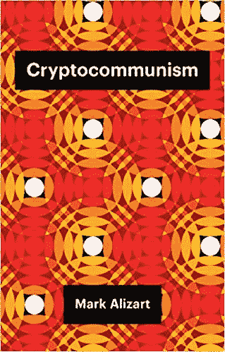
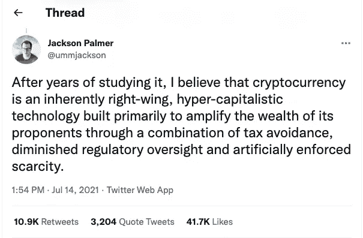

# 二元元宇宙:秘密资本主义还是秘密共产主义？

> 原文：<https://medium.com/coinmonks/the-binary-metaverse-crypto-capitalism-or-crypto-communism-c81551ed4123?source=collection_archive---------54----------------------->

## 当像区块链这样的技术能够如此分化观点，将它们作为绝对真理带到社会经济和政治光谱的两个极端时，有必要予以关注

Photo by [Alice Yamamura](https://unsplash.com/@aakemiy?utm_source=medium&utm_medium=referral) on [Unsplash](https://unsplash.com?utm_source=medium&utm_medium=referral)

意识形态的新战场不是有形的，而是虚拟的。不会发生在地理战壕里，不会被一堵柏林墙或者几堵墙分割。正如托马斯·L·弗里德曼所说，世界是平的。流动性，异质性，速度，不服从和自私盛行于其中。在表面之下是存在的地下墓穴，居住着怀旧的、具体的和顺从的人，他们更相信卓越而不是速度。在那里，像濒临灭绝的恐龙一样，仍然是利他主义者。

地表世界为区块链是否会成为新马克思主义的种子(马克·阿里萨特，秘密共产主义)或天生右翼的超资本主义技术(杰克逊·帕尔默，秘密资本主义)而争论。

## **为什么是比特币？**

因为 2008 年美国房地产泡沫破灭后，发生了当代资本主义史上最重大的危机。或者，至少，这是中本聪在 2008 年 10 月 31 日上传他的帖子的明显原因:[比特币:一个用户对用户的电子现金系统](https://bitcoin.org/bitcoin.pdf)。

> 美国政府为了避免其国家的衰落和随后的金融崩溃，决定将私人银行的损失社会化，用公共资金吸收其债务，并造成经济和社会危机的局面……+

加密货币的创立是为了保护私人储蓄免受联邦政府动用公共资金救助私人银行的新威胁。

## **根据马克·艾丽莎的说法，秘密共产主义**

*   区块链扁平化民主和市场。国家不再有权力发行货币，现在人民有权力打开通往共产主义的大门。
*   当各州开始开采比特币时，他们将从那里为基础设施、医疗和教育任务“征税”，这引发了活动家亚伦·巴斯塔尼(Aaron Bastani)所说的:全自动奢侈品共产主义(Fully Automated Luxury communication s)
*   比特币的价值取决于链条中每个区块的创造价值。因为资本的价值取决于工人的劳动价值。
*   共产主义是国家主义、中央集权、计划和极权主义，与比特币所代表的完全相反:自由、分散、社群和解放。
*   在中本聪、安·兰德和弗雷德里克·哈耶克之前，马克思是第一个提出无政府主义的人。

[Cryptocommunisn](https://www.amazon.com/-/es/Mark-Alizart/dp/1509538585)

## 根据不同作者的观点，秘密资本主义(Vv。Aa。)

*   区块链技术进一步分配财富，让世界上任何一个有电、能上网的人都富裕起来。
*   加密货币可以被世界上任何地方的任何人快速、广泛地使用，使他们摆脱地缘政治、社会或文化联系。
*   区块链从资本主义的内部诞生，以纠正它，并将其带到一个更自由、更安全、更透明的新时代，消除裙带资本主义。
*   由于互联网最民主和最共享的表达方式 Web3 的出现，区块链让人们回到了他们的数据，这是 21 世纪最受欢迎的原材料。
*   区块链模糊了监管国家的角色，监管国家没有其他选择，只能通过监督规则得到遵守来让经济(*自由放任*)。

DOGE Coin Co-Founder tweet

*   + [比特币意识形态脚本](https://www.laizquierdadiario.com/Criptocomunismo-o-la-ideologia-bitcoin) ( **哈维尔·奥奇齐**，2021)

> 加入 Coinmonks [电报频道](https://t.me/coincodecap)和 [Youtube 频道](https://www.youtube.com/c/coinmonks/videos)了解加密交易和投资

# 另外，阅读

*   [阿联酋 5 大最佳加密交易所](https://coincodecap.com/best-crypto-exchanges-in-uae) | [SimpleSwap 评论](https://coincodecap.com/simpleswap-review)
*   购买 Dogecoin 的 7 种最佳方式
*   [最佳期货交易信号](https://coincodecap.com/futures-trading-signals) | [流动性交易所评论](https://coincodecap.com/liquid-exchange-review)
*   [用于 Huobi 的加密交易信号](https://coincodecap.com/huobi-crypto-trading-signals) | [Swapzone 审查](/coinmonks/swapzone-review-crypto-exchange-data-aggregator-e0ad78e55ed7)
*   最佳[密码交易机器人](https://coincodecap.com/best-crypto-trading-bots) | [购买索拉纳](https://coincodecap.com/buy-solana) | [矩阵导出评论](https://coincodecap.com/matrixport-review)