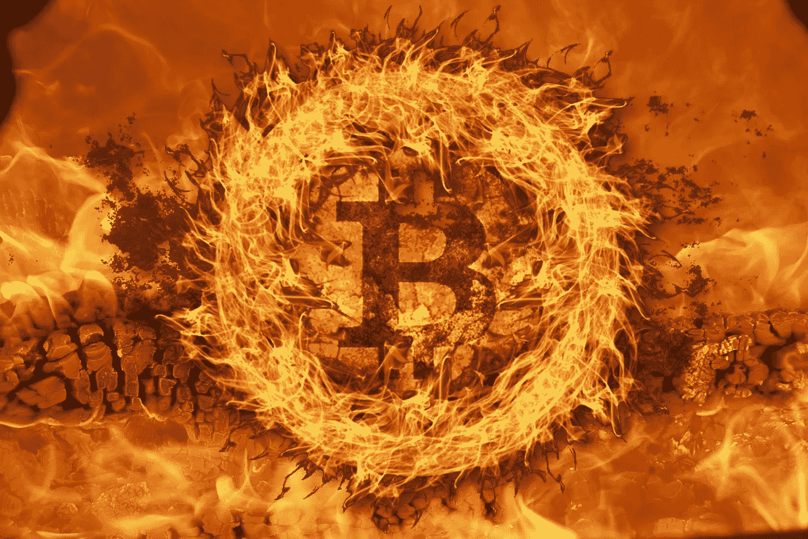

# 比特币死亡螺旋理论:比特币(BTC)如何归零

> 原文：<https://medium.com/coinmonks/the-bitcoin-death-spiral-theory-how-bitcoin-btc-can-go-to-zero-a3d08404f7a3?source=collection_archive---------1----------------------->

*Cover Photo by “ kummod “, on* [*Pixabay*](https://pixabay.com/photos/fire-wood-fire-flame-burn-brand-171229/) *(modified)*

在牛市周期中，加密货币的价格会突然上涨，而随着矿商扩大业务和提高 hashrate，电力网络采矿业务的盈利能力也会大幅提高。新的采矿场出现，新的 ASIC 型号立即销售一空。

然而，在隐密体中，事情并不总是美好的。